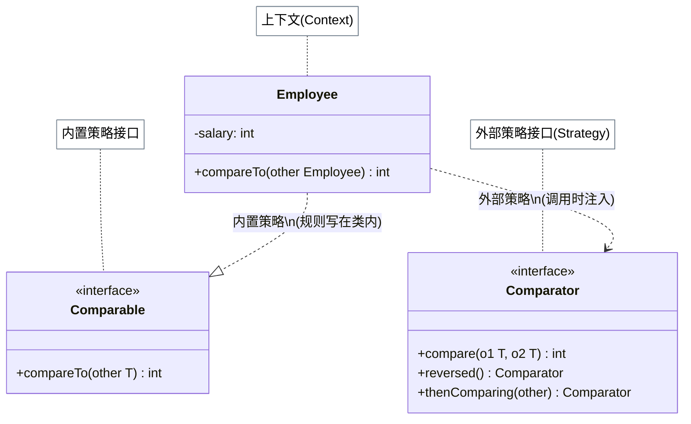
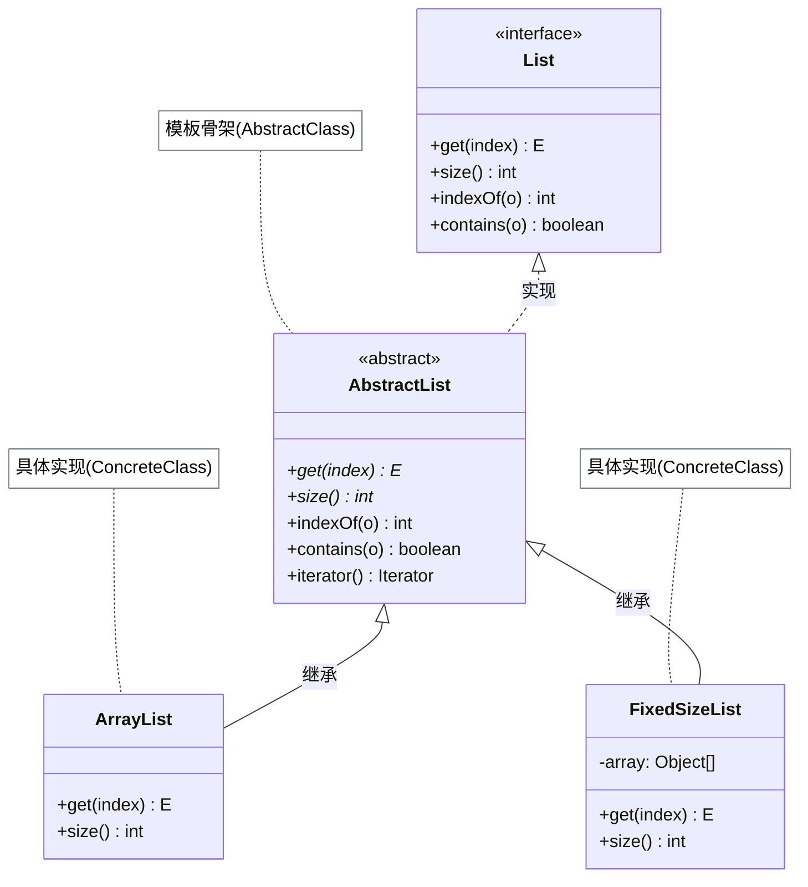
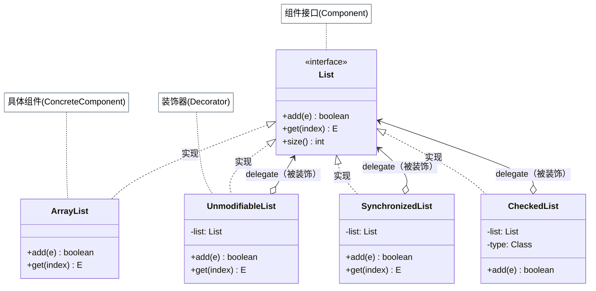
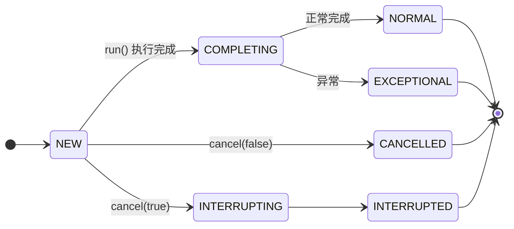
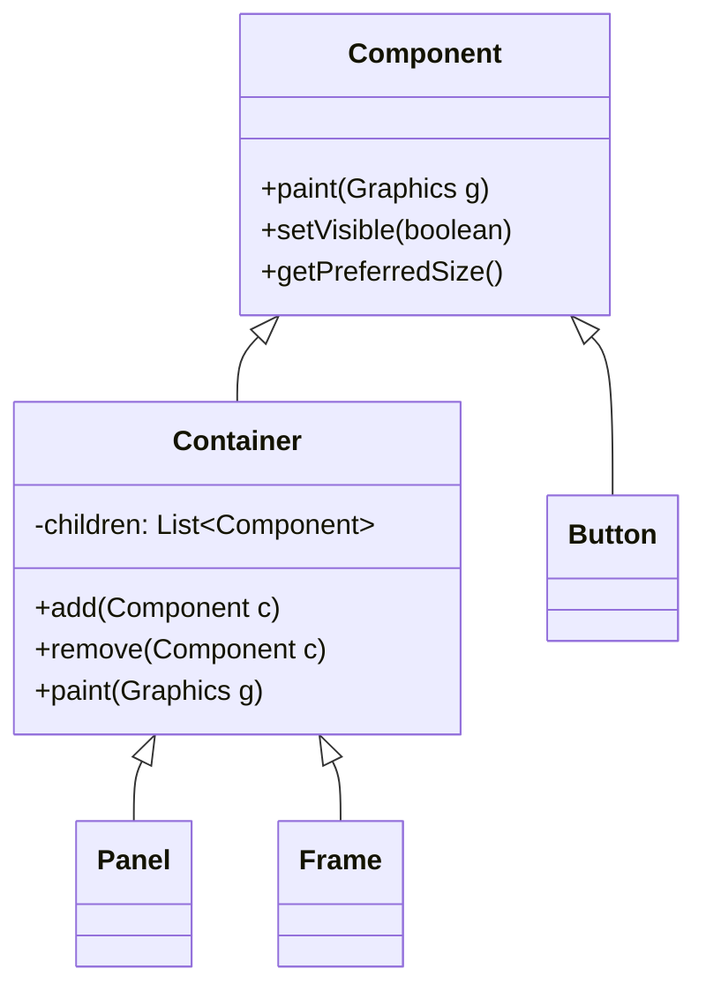

# JDK 源码中的设计模式

JDK 是 Java 生态中设计模式应用密度最高的代码库，但它与框架源码有一个本质区别：JDK 里的模式经过数十年演化，许多已经**内化为语言惯用法**——你每天写的 `list.sort(Comparator.comparing(User::getAge))` 就是策略模式，只是不需要显式地声明策略接口和实现类。

本文的重点不是罗列"JDK 哪里用了什么模式"（这些在各模式笔记的工业视角中已单独讲过），而是聚焦两个独特视角：

1. **同一 API 体系中多个模式的协同**（以 `java.io` 和 `java.util.Collections` 为例）
2. **Java 8 函数式接口如何将行为型模式"语言化"**，把"定义接口 + 实现类"压缩为一行 lambda

## 策略模式的三种实现层次

JDK 中的策略模式以三种密度递增的形式出现，清晰地展示了语言演化如何改变模式的实现方式。

### Comparable vs Comparator：内置策略 vs 外部策略

``` java title="内置策略：排序规则写在实体类内部"
// Comparable：实体自带"默认排序规则"
public class Employee implements Comparable<Employee> {
    private int salary;
    @Override
    public int compareTo(Employee other) {
        return Integer.compare(this.salary, other.salary); // 按薪资升序
    }
}
// 只能按一种方式排序，规则写死在类里，无法替换
Collections.sort(employees);
```

``` java title="外部策略：排序规则在调用时注入"
// Comparator：排序策略与实体分离，可按需替换
employees.sort(Comparator.comparing(Employee::getSalary));           // 按薪资
employees.sort(Comparator.comparing(Employee::getName));             // 按姓名
employees.sort(Comparator.comparing(Employee::getDept)
    .thenComparing(Employee::getSalary).reversed());                 // 按部门+薪资倒序
```

`Comparable` 适合"有唯一自然顺序"的值对象（如 `Integer`、`String`）；`Comparator` 适合"排序规则需要在调用时决定"的领域对象。这是策略模式的**内部化**与**外部化**两种取舍。



### 函数式接口：策略的"语言级"实现

Java 8 的 `java.util.function` 包将常见策略接口标准化，并通过 `@FunctionalInterface` 标注使 lambda 可以直接赋值：

| 接口 | 策略意图 | 示例 |
|------|---------|------|
| `Predicate<T>` | 过滤策略 | `list.stream().filter(u -> u.getAge() > 18)` |
| `Function<T,R>` | 转换策略 | `list.stream().map(User::getName)` |
| `Consumer<T>` | 消费策略 | `list.forEach(System.out::println)` |
| `Supplier<T>` | 创建策略 | `Optional.orElseGet(() -> new User())` |
| `Comparator<T>` | 排序策略 | `list.sort(Comparator.comparing(User::getId))` |
| `UnaryOperator<T>` | 原地转换策略 | `list.replaceAll(String::toUpperCase)` |

**核心洞察**：这些接口的出现，让行为型模式（策略、命令、模板）的"定义策略接口 + 编写实现类"两步合并为"一行 lambda"。模式的**意图**没变，**仪式感**降低了。

``` java title="策略模式：经典写法 vs Lambda 写法"
// 经典写法（Java 7 及之前）
Comparator<User> byAge = new Comparator<User>() {
    @Override
    public int compare(User a, User b) { return a.getAge() - b.getAge(); }
};
users.sort(byAge);

// Lambda 写法（Java 8+）：意图完全一致，语法简化为一行
users.sort((a, b) -> a.getAge() - b.getAge());
users.sort(Comparator.comparingInt(User::getAge));  // 更语义化
```

## 模板方法：AbstractList 的骨架实现哲学

`java.util.AbstractList` 是 JDK 中模板方法的教科书级应用——它解决了一个真实工程问题：如何让开发者实现自定义 List 而不重复所有方法？

设计方案是「骨架实现（Skeletal Implementation）」：只声明 `get(index)` 和 `size()` 两个抽象方法（`primitive operations`），其余方法（`indexOf`、`contains`、`toArray`、`subList`、`iterator()`...）全部基于这两个方法提供默认实现：

``` java title="AbstractList 只需子类实现两个方法"
public abstract class AbstractList<E> extends AbstractCollection<E> {
    // 唯二的抽象方法（primitive operations）
    abstract public E get(int index);
    abstract public int size();

    // 基于 get() 和 size() 的默认模板方法（部分）
    public int indexOf(Object o) {
        ListIterator<E> it = listIterator();  // iterator() 基于 get()
        // ... 遍历查找
    }
    public boolean contains(Object o) { return indexOf(o) >= 0; }
}
```

``` java title="只实现两个方法即可获得完整的 List 行为"
// 实现一个基于固定数组的只读 List（来自 Arrays.asList()）
class FixedSizeList<E> extends AbstractList<E> {
    private final Object[] array;
    public FixedSizeList(Object[] array) { this.array = array; }

    @Override public int size() { return array.length; }
    @Override public E get(int index) { return (E) array[index]; } // ✅ 只需实现两个方法
}
// 自动继承 contains/indexOf/toArray/subList/iterator 等十余个方法
```

`InputStream.read(byte[], int, int)` 也是同一思想：循环读取的"骨架"由父类实现，子类只需覆写单字节版 `abstract int read()`。

!!! tip "Effective Java 推荐：Interface + Abstract Skeletal Implementation"

    定义接口（`List`），同时提供抽象骨架类（`AbstractList`）。使用者：要完全自定义实现就直接实现接口；要省力就继承骨架类，只覆写少数关键方法。两者互不干涉——这是组合接口和继承优势的最佳实践。



## 装饰器：Collections 的「能力包装家族」

`java.io` 的装饰链在「装饰器模式」笔记中已详细分析（`FilterInputStream` 解决委托传递问题）。这里关注另一个同样经典的装饰器集群：`java.util.Collections` 的包装方法族：

``` java title="Collections 装饰器包装家族"
List<String> list = new ArrayList<>(Arrays.asList("a", "b", "c"));

List<String> unmodifiable = Collections.unmodifiableList(list); // 🔒 不可变装饰器
List<String> synced       = Collections.synchronizedList(list); // 🔒 线程安全装饰器
List<String> checked      = Collections.checkedList(list, String.class); // ✅ 类型检查装饰器

unmodifiable.add("d"); // ❌ 抛出 UnsupportedOperationException
```

每个包装方法返回的都是委托目标 `List` 实现类的「装饰器包装类」（如 `UnmodifiableList`），它持有原始 List，写操作直接拒绝，读操作委托给内部的真实 List。

**与 java.io 装饰链的对比**：

| 维度 | java.io 装饰链 | Collections.unmodifiable |
|------|--------------|------------------------|
| 叠加方式 | 多层嵌套（可叠加多个） | 通常单层包装 |
| 增强类型 | 功能增强（缓冲、类型读写） | 能力约束（限制修改/线程安全） |
| 使用场景 | 读写性能优化 | API 防御性编程 |

!!! tip "防御性编程最佳实践"

    将集合暴露给外部时，用 `Collections.unmodifiableList()` 包装后再返回——调用方无法意外修改内部状态，同时没有创建新集合的内存开销。这是装饰器在"安全边界"场景的常见用法。



## 命令模式：从 Runnable 到 FutureTask 的状态演化

`Runnable` 是命令模式的最简形式：把"要执行的动作"封装成一个对象，传递给执行者（线程池），异步执行：

``` java title="Runnable = 最简命令，Callable = 可返回结果的命令"
// Runnable：fire-and-forget，无返回值
ExecutorService pool = Executors.newFixedThreadPool(4);
pool.execute(() -> System.out.println("任务执行"));

// Callable：命令带返回值（泛型化 Supplier）
Future<Integer> future = pool.submit(() -> {
    // ... 计算
    return 42;
});
int result = future.get(); // 等待并获取结果
```

`FutureTask` 是命令模式的完整形态——它同时是 `Runnable`（可被线程执行）和 `Future`（可查询状态、可取消），内部维护一个精密的状态机：



`FutureTask` 的设计展示了命令模式的核心价值：**把"发出请求"和"执行请求"解耦**——调用者在 `submit()` 时只拿到 `Future` 凭证，不感知执行细节；执行者（线程池）在合适的时机调用 `run()`。`future.cancel()` 可以撤销尚未执行的命令，这是"纸质命令"比"直接调用"多出的核心能力。

## 组合模式：java.awt 的 Component 树

`java.awt` 是 JDK 中组合模式的原始应用。`Component` 是统一的抽象节点，`Container` 既是 `Component`（可被嵌套）又可以包含子 `Component`：



``` java title="组合树构建：Frame 包含 Panel，Panel 包含 Button"
Frame frame = new Frame("应用窗口");
Panel panel = new Panel();
Button btn1 = new Button("确定");
Button btn2 = new Button("取消");

panel.add(btn1);  // Panel（容器）包含 Button（叶子）
panel.add(btn2);
frame.add(panel); // Frame（容器）包含 Panel（容器/叶子均可）

frame.paint(g);   // 递归触发：frame → panel → btn1, btn2 各自渲染
```

Swing 完整继承了这一设计，`JComponent`/`JPanel`/`JFrame` 是等价的现代版本。组合模式让 GUI 框架可以把整个窗口或单个按钮统一处理（比如批量设置可见性、统一触发渲染），而不需要判断"是容器还是叶子"。

## JDK 设计模式速查

| 模式 | JDK 典型实现 | 详细分析位置 |
|------|------------|------------|
| 策略 | `Comparator<T>`、`java.util.function.*` | 本页 + 「策略模式」§工业视角 |
| 模板方法 | `AbstractList`/`InputStream.read(byte[])` | 本页 + 「模板方法模式」§工业视角 |
| 装饰器 | `java.io`（FilterInputStream 链）+ `Collections.unmodifiableXxx` | 本页 + 「装饰器模式」§工业视角 |
| 命令 | `Runnable`/`Callable`/`FutureTask` | 本页 + 「命令模式」§工业视角 |
| 组合 | `java.awt.Component` 树 | 本页 |
| 适配器 | `InputStreamReader`（字节流→字符流）`Arrays.asList()` | 「适配器模式」§工业视角 |
| 享元 | `Integer.valueOf(-128~127)` + `String.intern()` | 「享元模式」§工业视角 |
| 迭代器 | `ArrayList.Itr`（fail-fast，modCount 机制） | 「迭代器模式」§工业视角 |
| 代理 | `java.lang.reflect.Proxy` + `InvocationHandler` | 「代理模式」§工业视角 |
| 单例 | `Runtime.getRuntime()` | 「单例模式」§工业视角 |
