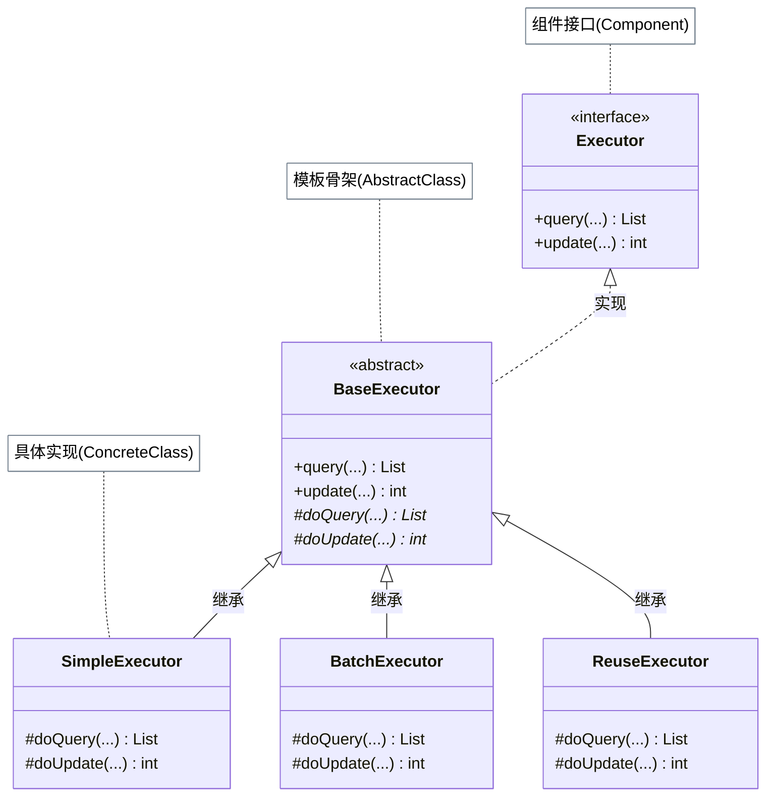
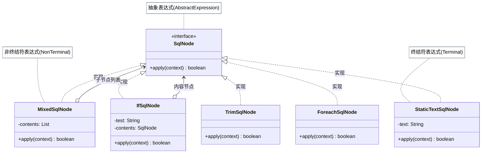
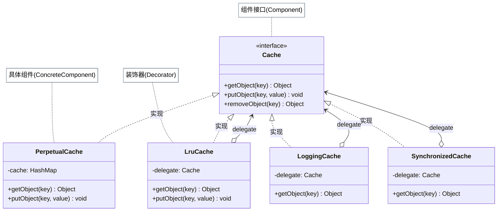
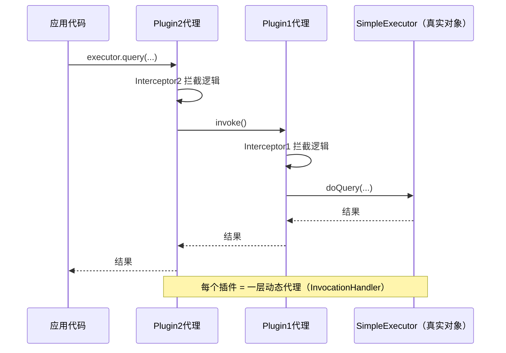

# MyBatis 框架

MyBatis 是一个"半自动" ORM 框架，它让 SQL 与 Java 代码保持适度距离——开发者写 SQL，MyBatis 负责参数映射、结果集转换、Session 管理、缓存等基础设施。这些基础设施的实现代码里密集地应用了设计模式，而且有不少是「非教科书式」的灵活应用，更值得深入分析。

本文梳理 MyBatis 中的 10 种设计模式，重点辨析哪些是「标准实现」、哪些做了有意识的改造以及改造的原因。

## 建造者模式：SqlSessionFactoryBuilder 的取舍

从 XML 配置文件创建 `SqlSessionFactory` 的标准写法：

``` java title="SqlSessionFactory 的创建方式"
// 读取配置文件
InputStream inputStream = Resources.getResourceAsStream("mybatis-config.xml");
// 用 Builder 创建工厂
SqlSessionFactory factory = new SqlSessionFactoryBuilder().build(inputStream);
```

`SqlSessionFactoryBuilder` 实现了建造者模式——但与 GOF 定义相比，它刻意省去了 `setter` 链调用：

| 维度 | 标准建造者 | SqlSessionFactoryBuilder |
|------|---------|------------------------|
| 参数传递方式 | `builder.setA(a).setB(b).build()` | 直接传给 `build(InputStream, ...)` |
| 对象状态 | Builder 对象持有配置状态 | 无状态（用完即丢） |
| 适用场景 | 需要多次组合参数 | 一次性从配置文件构建 |

这个选择是有意为之：`SqlSessionFactoryBuilder` 的生命周期只覆盖"从配置文件创建工厂"这一时刻，之后就应该被销毁；将配置状态保存在 Builder 对象中没有意义。去掉 `setter` 链反而更简洁、不易误用。

## 工厂模式：SqlSessionFactory 更像建造者

有趣的是，命名为"工厂"的 `SqlSessionFactory` 反而更符合建造者的气质：

``` java title="SqlSessionFactory 通过重载参数组合创建 SqlSession"
// 多个重载方法，每种组合产生同一类对象（SqlSession）
SqlSession session = factory.openSession();
SqlSession session = factory.openSession(true);           // autoCommit
SqlSession session = factory.openSession(ExecutorType.BATCH); // 批量执行器
SqlSession session = factory.openSession(ExecutorType.BATCH, true);
```

工厂模式的核心特征是「创建不同类型的对象」，而 `SqlSessionFactory` 的所有重载都返回 `SqlSession`，只是参数组合不同——这更像 Builder 的变体。

这个"错位命名"来自框架早期设计，在实践中也工作良好。重点是：`SqlSessionFactory` 的生命周期应该与整个应用一样长（通常配置为 Spring 单例 Bean）；`SqlSession` 是线程不安全的，应该在请求粒度内创建使用后关闭。

## 模板方法模式：BaseExecutor 的"do 前缀"约定

`Executor` 是 MyBatis 执行 SQL 的核心接口，`BaseExecutor` 提供了抽象骨架，`SimpleExecutor`、`BatchExecutor`、`ReuseExecutor` 继承并覆写具体的执行逻辑：

``` java title="BaseExecutor 模板方法与抽象方法对应关系"
// BaseExecutor（抽象骨架）
public abstract class BaseExecutor implements Executor {
    // 模板方法：定义骨架（连接获取 + 缓存查找 + 真正执行 + 缓存填充）
    @Override
    public <E> List<E> query(MappedStatement ms, Object parameter, ...) {
        // 1. 检查一级缓存
        // 2. 如果未命中，调用 doQuery（留给子类实现）
        return queryFromDatabase(ms, parameter, ...);
    }

    // 抽象方法：子类实现真正的 SQL 执行逻辑
    protected abstract <E> List<E> doQuery(
        MappedStatement ms, Object parameter, ...) throws SQLException;

    protected abstract int doUpdate(MappedStatement ms, Object parameter)
        throws SQLException;
}
```

**MyBatis 的命名约定**：模板方法与其对应抽象方法之间，加 `do` 前缀区分。`query()` 对应 `doQuery()`、`update()` 对应 `doUpdate()`，让方法的主从关系一目了然——这是值得借鉴的命名实践。



## 解释器模式：动态 SQL 的树形解析

MyBatis 的动态 SQL（`<if>`、`<trim>`、`<where>`、`<foreach>` 等标签）通过解释器模式实现。每种标签对应一个 `SqlNode` 实现类：

``` java title="SqlNode 接口和各实现类"
public interface SqlNode {
    boolean apply(DynamicContext context); // 将本节点的内容写入动态上下文
}

// 每种动态 SQL 标签对应一个解释器实现
class IfSqlNode    implements SqlNode { ... }  // <if test="...">
class TrimSqlNode  implements SqlNode { ... }  // <trim prefix="WHERE" ...>
class ForeachSqlNode implements SqlNode { ... } // <foreach ...>
class TextSqlNode  implements SqlNode { ... }  // 含 ${} 的文本片段
class StaticTextSqlNode implements SqlNode { ... } // 纯静态文本
```

解析入口是 `DynamicSqlSource.getBoundSql()`——它将 `rootSqlNode.apply(context)` 触发整棵解析树的递归执行，最终把参数值拼进 SQL 片段，生成完整的 `BoundSql`。

!!! note "#{} vs ${}"

    `#{}` 是 `PreparedStatement` 占位符，MyBatis 用 `ParameterMapping` 处理，防止 SQL 注入；`${}` 是字符串直接替换，属于解释器的 `TextSqlNode` 处理路径，使用不当会引入 SQL 注入风险。



## 单例变形：ErrorContext 的线程唯一单例

`ErrorContext` 是 MyBatis 中记录 SQL 执行上下文的错误信息载体（当前执行的 mapper、resource、SQL、参数等）。它需要对每个线程唯一，而非进程唯一，因此不能用传统的 static 单例：

``` java title="ErrorContext ThreadLocal 实现线程唯一单例"
public class ErrorContext {
    // 不是 static instance，而是 ThreadLocal —— 每个线程持有独立实例
    private static final ThreadLocal<ErrorContext> LOCAL =
        ThreadLocal.withInitial(ErrorContext::new);

    private ErrorContext() {}  // 禁止外部直接构造

    // 获取当前线程的 ErrorContext 实例
    public static ErrorContext instance() {
        return LOCAL.get();
    }
}
```

这是单例模式的有意扩展：将"进程唯一"放宽为"线程唯一"。在多线程服务端环境下，全局单例的 `ErrorContext` 会导致线程间互相覆盖错误信息；`ThreadLocal` 让每个线程在自己的上下文中记录，既保持了"唯一"语义，又天然线程安全。

## 装饰器模式：9 种 Cache 增强叠加

MyBatis 的 `Cache` 接口是最能体现装饰器价值的设计之一。`PerpetualCache` 是基础实现（底层是 `HashMap`），其余 9 个实现类都是装饰器，每个只负责一个正交功能：

| 装饰器 | 功能 |
|--------|------|
| `LruCache` | LRU 淘汰策略（内部用 `LinkedHashMap`） |
| `FifoCache` | FIFO 淘汰策略 |
| `SoftCache` | 软引用，内存不足时允许被 GC 回收 |
| `WeakCache` | 弱引用，GC 时必然回收 |
| `ScheduledCache` | 按时间间隔自动清空（定时失效） |
| `LoggingCache` | 命中率统计和日志记录 |
| `SynchronizedCache` | `synchronized` 方法保证线程安全 |
| `SerializedCache` | 序列化/反序列化支持缓存深拷贝 |
| `BlockingCache` | 同一 Key 的请求在 Cache miss 时互斥，防止缓存击穿 |

``` java title="MyBatis Cache 装饰链示例"
// MyBatis 默认的二级缓存配置会叠加多个装饰器
Cache cache = new PerpetualCache("myCache");
cache = new LruCache(cache);           // 外包 LRU 淘汰
cache = new LoggingCache(cache);       // 外包日志记录
cache = new SynchronizedCache(cache);  // 外包线程安全

// 每个装饰器调用时先执行自己的逻辑，再委托给内层
// SynchronizedCache.getObject(key) {
//     synchronized(this) { return delegate.getObject(key); }
// }
```

与继承相比，装饰器组合避免了类数量的组合爆炸（9 个功能两两组合需要 2⁹ = 512 个子类），任意功能的增减只需在装饰链中增删一层。



## 迭代器模式：PropertyTokenizer 的惰性属性解析

MyBatis 在做结果集映射时，经常需要解析多级属性路径，如 `person[0].birthdate.year`。`PropertyTokenizer` 实现了 `Iterator` 接口，用**惰性解析**逐段分解属性路径：

``` java title="PropertyTokenizer 惰性解析属性路径"
PropertyTokenizer pt = new PropertyTokenizer("person[0].birthdate.year");

System.out.println(pt.getName());      // "person"
System.out.println(pt.getIndex());     // "0"
System.out.println(pt.getChildren()); // "birthdate.year"（尚未解析的剩余部分）

// 调用 next() 才继续解析下一段
PropertyTokenizer next = pt.next();
System.out.println(next.getName());   // "birthdate"
```

与传统迭代器的区别：`PropertyTokenizer` 同时承担解析器和迭代器两个职责——它不持有完整的元素列表，而是每次调用 `hasNext()` / `next()` 时才对剩余字符串进行下一步分析。这种"用迭代器接口包装惰性计算"的手法在 JDK Streams 中也随处可见。

## 适配器模式：统一日志框架接口

MyBatis 自身不绑定任何具体日志框架，而是定义了自己的 `Log` 接口（仅 `debug()`、`error()` 等几个方法），再为 Log4j、SLF4J、JDK Logging、Log4j2 等主流框架各写一个适配器：

``` java title="Log 接口与适配器实现"
// MyBatis 自定义日志接口
public interface Log {
    boolean isDebugEnabled();
    void debug(String s);
    void error(String s, Throwable e);
}

// SLF4J 适配器：将 MyBatis 的 Log 接口映射到 SLF4J
public class Slf4jImpl implements Log {
    private final Logger log; // SLF4J Logger

    public Slf4jImpl(String clazz) {
        this.log = LoggerFactory.getLogger(clazz); // 获取被适配对象
    }

    @Override
    public void debug(String s) {
        log.debug(s); // 转发到 SLF4J
    }
}
```

!!! note "构造时传入 Class 而非被适配对象"

    标准适配器在构造时传入被适配的对象（`Adaptee`），但 `Slf4jImpl` 传入的是 `clazz`（String），在构造函数内部自行创建 SLF4J Logger。这是一种简化变体，适合日志框架这种"适配器即创建点"的场景。

## 职责链 + 动态代理：MyBatis Plugin

MyBatis 的插件机制（`@Intercepts` + `Plugin`）是职责链和动态代理协同工作的典型案例。

每个 `Interceptor` 实现类对应一个插件，`InterceptorChain` 将多个插件组织成链。`Plugin` 类实现 `InvocationHandler`，对目标对象（`Executor`、`StatementHandler` 等）做动态代理：

``` java title="MyBatis Plugin 执行流程"
// 插件链的包装过程（从外到内）
Executor executor = new SimpleExecutor(...);
// 每个插件依次包一层动态代理
executor = (Executor) plugin1.plugin(executor); // Plugin.wrap()
executor = (Executor) plugin2.plugin(executor); // Plugin.wrap()

// 调用时：plugin2代理 → plugin1代理 → 真正的 SimpleExecutor
executor.query(...);
```

!!! warning "插件的使用边界"

    MyBatis 插件可拦截 `Executor`、`ParameterHandler`、`ResultSetHandler`、`StatementHandler` 四个接口的所有方法。但插件对整个执行链路的侵入性很强，**只在必须的场景下使用**（如分页、数据权限），避免把通用工具类包装成插件增加理解成本。



## MyBatis 10 种模式速查

| 模式 | 典型应用 | 标准/非标准 |
|------|---------|-----------|
| 建造者 | SqlSessionFactoryBuilder.build() | 非标准（无 setter 链） |
| 工厂 | SqlSessionFactory.openSession() | 非标准（更像 Builder） |
| 模板方法 | BaseExecutor（update→doUpdate） | 标准 |
| 解释器 | SqlNode 动态 SQL 树 | 标准 |
| 单例变形 | ErrorContext（ThreadLocal） | 扩展（线程唯一） |
| 装饰器 | PerpetualCache + 9 种装饰器 | 标准 |
| 迭代器 | PropertyTokenizer 惰性解析 | 非标准（兼做解析器） |
| 适配器 | Log 接口统一日志框架 | 非标准（构造时创建 Adaptee） |
| 职责链 | InterceptorChain 插件链 | 标准 |
| 动态代理 | Plugin（InvocationHandler） | 标准 |
