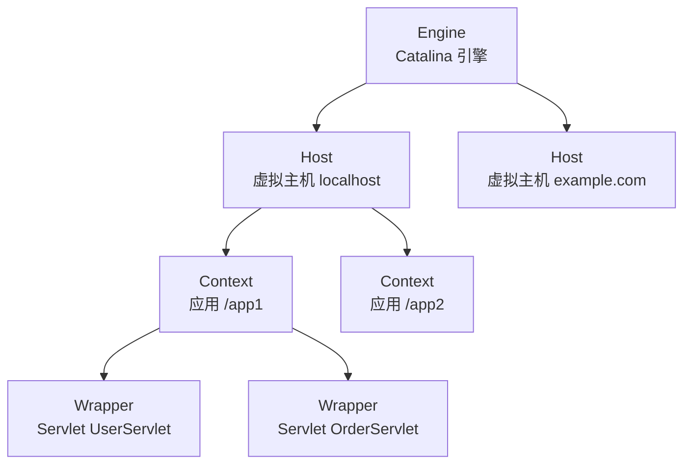
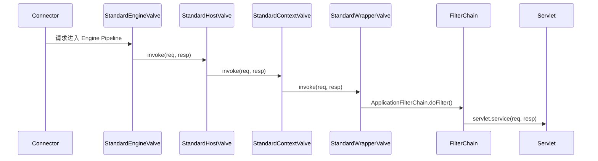

# Servlet/Tomcat 中的设计模式

Tomcat 是 Java Web 应用最主流的 Servlet 容器，负责从接收 TCP 连接到最终调用你写的 `doGet()` 方法之间的一切工作。这个复杂的运行时被设计得高度可扩展：可以在不修改容器代码的前提下部署任意 Servlet、定制拦截逻辑、托管多个独立应用——这些能力全部由设计模式支撑。

本文重点分析三个在其他笔记中尚未深入讲解的 Tomcat 特有设计：`RequestFacade` 安全门面、`Container` 四层组合树、`Pipeline/Valve` 内部责任链。

## 外观模式：RequestFacade 安全隔离

这是 Tomcat 设计中最容易被忽略但极具工程价值的细节。

Tomcat 内部有一个 `Request` 类，它在实现 `HttpServletRequest` 接口的同时，还暴露了大量内部方法（如 `setRequestURI()`、`setRemoteAddr()`、注册 Recycler 的方法等）。这些方法是 Tomcat 内部流程所需的，**不应该被用户的 Servlet 代码调用**。

如果 Tomcat 直接把 `Request` 对象传给 Servlet，代码上是：

``` java title="潜在的安全问题：用户代码可以强转拿到内部方法"
// Tomcat 如果直接传 request（Request 类型），用户可以这样写
HttpServletRequest req = ...; // 实际是 Request 类型
Request internalReq = (Request) req; // ✅ 强转成功
internalReq.setRemoteAddr("1.2.3.4"); // ❌ 篡改了 Tomcat 内部状态！
```

Tomcat 的解决方案是在调用 Servlet 前，把 `Request` 包装在 `RequestFacade` 里：

``` java title="RequestFacade 外观：只暴露 HttpServletRequest，隐藏内部方法"
// RequestFacade 仅实现 HttpServletRequest 接口
public class RequestFacade implements HttpServletRequest {
    protected Request request;   // 持有真实的 Tomcat Request

    @Override
    public String getMethod() {
        return request.getMethod();  // 委托给内部 Request
    }

    @Override
    public String getHeader(String name) {
        return request.getHeader(name);
    }
    // 仅实现 HttpServletRequest 定义的方法，Tomcat 内部方法完全不可见
}
```

传给 Servlet 的是 `RequestFacade` 对象：

``` java title="Tomcat 传给 Servlet 的是 Facade，不是真实 Request"
// StandardWrapper（调用 Servlet 的地方）
servlet.service(
    new RequestFacade(tomcatRequest),   // 只有 HttpServletRequest 接口
    new ResponseFacade(tomcatResponse)  // 只有 HttpServletResponse 接口
);
```

用户代码即使强转也只能转到 `HttpServletRequest`，而 `RequestFacade` 类并不在用户可见的 classpath 中，无法强转为 `RequestFacade` 调用内部方法。

!!! tip "外观模式的安全防御用途"

    外观模式通常被介绍为"简化接口"，但 `RequestFacade` 展示了它的另一个价值：**接口权限控制**——通过只暴露必要的接口，防止调用方越权访问内部实现细节。这在 SDK 设计、模块化架构中是值得借鉴的安全边界手段。

## 组合模式：Container 四层嵌套

Tomcat 用组合模式实现了多应用托管的层级结构。四种 `Container` 实现从外到内依次嵌套：



| 层级 | 实现类 | 对应概念 |
|------|--------|---------|
| `Engine` | `StandardEngine` | Tomcat 实例（一个 JVM 进程一个 Engine） |
| `Host` | `StandardHost` | 虚拟主机（不同域名可托管在同一 Tomcat） |
| `Context` | `StandardContext` | 一个 Web 应用（对应一个 WAR 包） |
| `Wrapper` | `StandardWrapper` | 一个 Servlet 定义 |

四者都实现 `Container` 接口：

``` java title="Container 接口：组合模式的统一节点"
public interface Container {
    void addChild(Container child);
    Container findChild(String name);
    Container[] findChildren();
    Pipeline getPipeline();
    // ...
}
```

请求到达时，处理逻辑从 Engine 开始递归向下传递：Engine 找到匹配的 Host → Host 找到匹配的 Context → Context 找到匹配的 Wrapper → Wrapper 调用对应 Servlet。

组合模式使 Tomcat 可以用**同一套 `Container` API** 操作整个层级，无论是注册生命周期监听、统计运行状态，还是热重载某个应用，都不需要区分"是哪一层 Container"。

## 责任链模式：Pipeline/Valve 内部链

每个 `Container` 内部都有一条 `Pipeline`（责任链），`Pipeline` 中包含若干个 `Valve`（处理节点）。这是 Tomcat 内部的请求处理链，独立于用户代码中的 Servlet `Filter` 链：



每个 Container 的最后一个 Valve（`BasicValve`）负责把请求传给下一层 Container 的 Pipeline。`StandardWrapperValve` 是整个 Tomcat 内部链的末端，它负责创建 `ApplicationFilterChain`（Servlet Filter 链），并最终调用 `servlet.service()`。

### Tomcat Pipeline/Valve vs Servlet FilterChain 的关键区别

| 维度 | Tomcat Pipeline/Valve | Servlet FilterChain |
|------|----------------------|-------------------|
| 扩展方式 | Tomcat 配置（server.xml）| web.xml / `@WebFilter` |
| 适用范围 | 所有应用、全局（Tomcat 层面） | 单个 Web 应用 |
| 可见性 | 用户代码通常不直接接触 | 用户代码直接编写 |
| 链结构 | 每层 Container 独立的链 | 单条平铺的链 |
| 目的 | Tomcat 内部架构扩展点 | Web 应用逻辑扩展点 |

!!! tip "三套责任链的选型参考"

    一个请求从到达 Tomcat 到 Controller 返回，会经过三套责任链：

    1. **Tomcat Pipeline/Valve**：容器级，Tomcat 内部处理（SSL 解密、Host 匹配、Context 切换）
    2. **Servlet FilterChain**：Web 应用级，在 DispatcherServlet 之前（跨域、编解码、全局限流）
    3. **Spring HandlerInterceptor**：Spring MVC 级，在 Controller 之前（登录校验、操作日志）

    用户代码只需关注后两套，Tomcat Pipeline 属于容器内部，通常无需干预。

## 模板方法：HttpServlet 的 HTTP 方法分发

`HttpServlet.service()` 是一个完整的模板方法——它解析 HTTP 请求方法，分发到对应的处理方法：

``` java title="HttpServlet.service() 模板方法全貌（简化）"
protected void service(HttpServletRequest req, HttpServletResponse resp)
        throws ServletException, IOException {
    String method = req.getMethod(); // 获取 HTTP Method

    // 模板骨架：根据请求方法分发到对应的抽象方法
    switch (method) {
        case "GET"     -> doGet(req, resp);      // 子类覆写
        case "POST"    -> doPost(req, resp);     // 子类覆写
        case "PUT"     -> doPut(req, resp);      // 子类覆写
        case "DELETE"  -> doDelete(req, resp);   // 子类覆写
        case "HEAD"    -> doHead(req, resp);     // 默认：调用 doGet 忽略 body
        case "OPTIONS" -> doOptions(req, resp);  // 默认：自动返回支持的方法列表
        case "TRACE"   -> doTrace(req, resp);    // 默认：回显请求头
        default        -> resp.sendError(SC_NOT_IMPLEMENTED, "Method not supported");
    }
}
```

开发者只需覆写 `doGet()` 和 `doPost()`，HTTP 解析、分发、默认响应（HEAD、OPTIONS、TRACE）全部由父类模板处理。这是"框架调用你，你不调用框架"（好莱坞原则）的最直观体现。

## 观察者模式：Servlet 生命周期监听

Servlet 规范定义了三级事件监听器，以观察者模式实现容器生命周期和请求生命周期的感知：

``` java title="三种 Servlet 生命周期监听器"
// 监听 ServletContext（Web 应用）的创建和销毁
@WebListener
public class AppStartupListener implements ServletContextListener {
    @Override
    public void contextInitialized(ServletContextEvent sce) {
        // Web 应用启动时：初始化数据库连接池、加载配置
    }
    @Override
    public void contextDestroyed(ServletContextEvent sce) {
        // Web 应用关闭时：释放资源
    }
}

// 监听 HttpSession 的创建、销毁、属性变化
public class SessionTracker implements HttpSessionListener {
    @Override
    public void sessionCreated(HttpSessionEvent se) { /* 在线人数 +1 */ }
    @Override
    public void sessionDestroyed(HttpSessionEvent se) { /* 在线人数 -1 */ }
}

// 监听请求的初始化和销毁（每次请求）
public class RequestLogger implements ServletRequestListener {
    @Override
    public void requestInitialized(ServletRequestEvent sre) { /* 记录请求开始时间 */ }
}
```

Tomcat 在相应事件发生时遍历已注册的监听器列表并逐一触发，开发者不感知触发时机，只需关注事件处理逻辑——这正是观察者模式"发布者与订阅者解耦"的核心价值。

## Servlet/Tomcat 设计模式速查

| 模式 | 应用场景 | 关键类 |
|------|---------|--------|
| 外观 | 安全隔离内部 API | `RequestFacade` / `ResponseFacade` |
| 组合 | 多应用多主机的层级管理 | `Engine/Host/Context/Wrapper`（Container 树） |
| 责任链 | 容器内部请求处理扩展点 | `Pipeline` + `Valve`（每层 Container 独立） |
| 责任链 | Web 应用级请求拦截 | `ApplicationFilterChain` + `Filter` |
| 模板方法 | HTTP 方法自动分发 | `HttpServlet.service()` → `doGet/doPost` |
| 观察者 | 容器/Session/请求生命周期感知 | `ServletContextListener` / `HttpSessionListener` |
