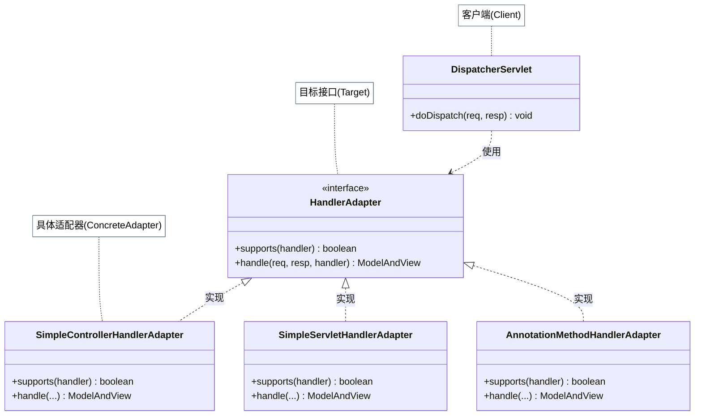
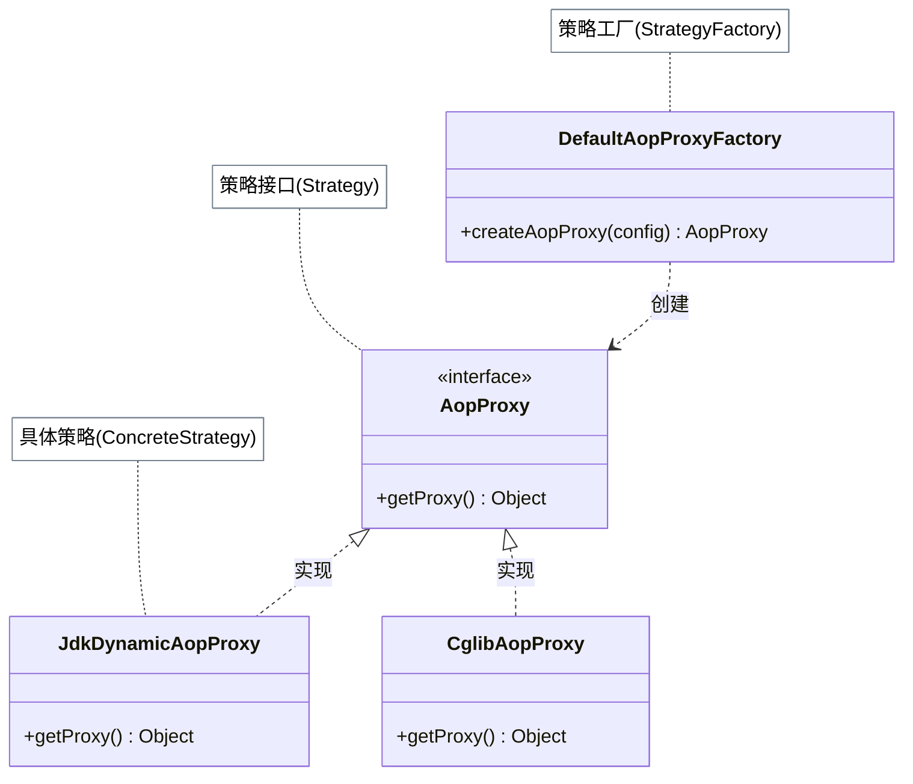
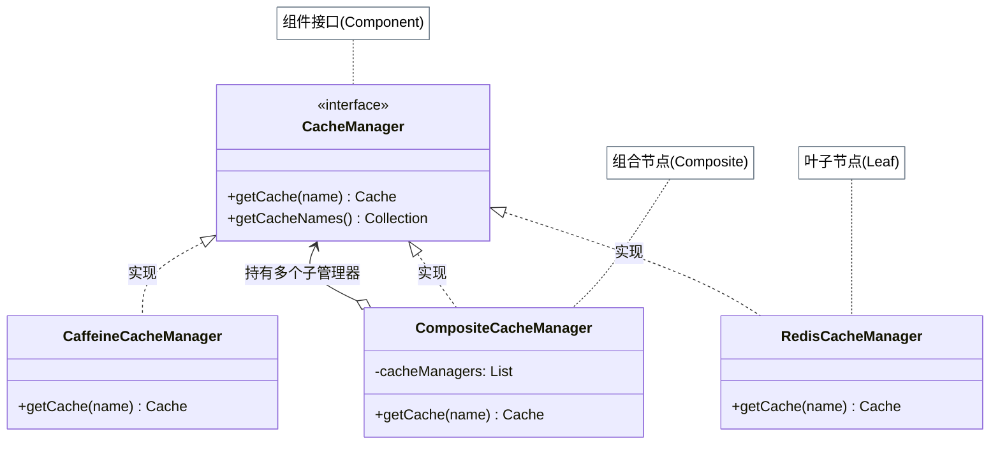
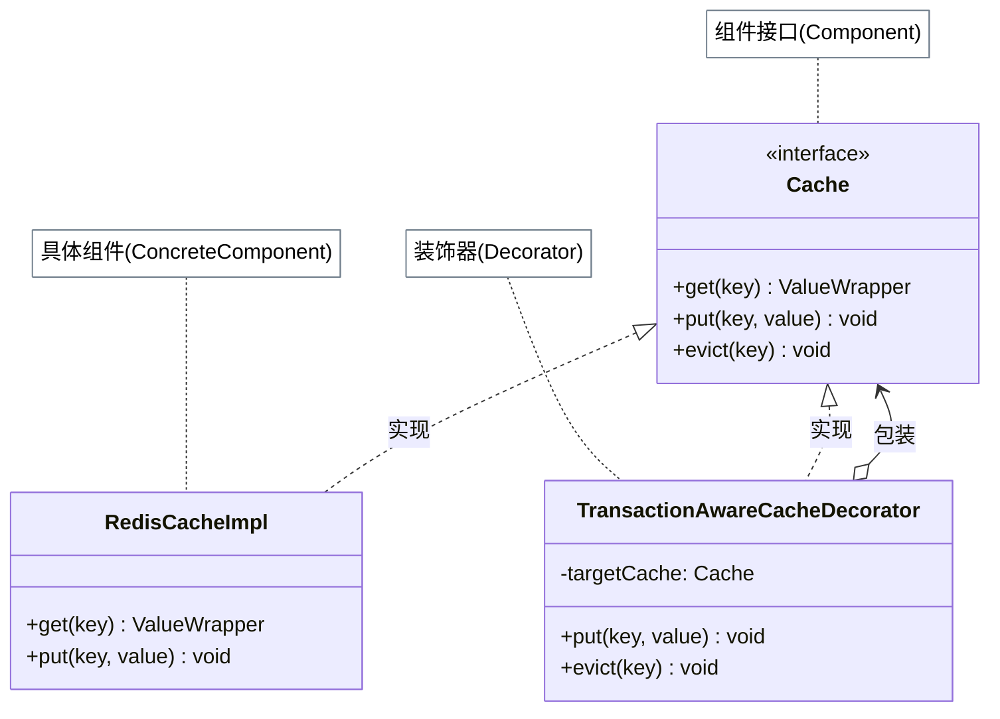
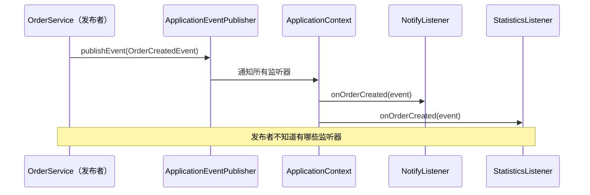
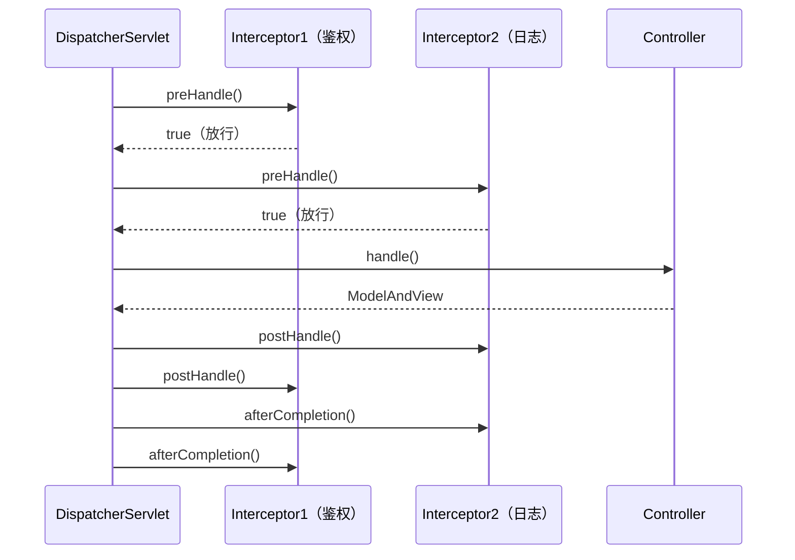

# Spring 框架中的设计模式

Spring 是 Java 生态中设计模式应用密度最高的框架之一。它的核心模块——IoC 容器、AOP、Spring MVC、Spring Cache——几乎每个都能找到多种经典模式的影子。这些模式不是刻意堆砌，而是在解决「多实现统一接口」「扩展点设计」「功能增强」等具体工程问题时自然涌现的。

本文梳理 Spring 框架中最典型的 11 种设计模式，重点聚焦**为什么选择这个模式**，而不只是「在哪里用了」。

## 适配器模式：统一三种 Controller 接口

Spring MVC 中定义 Controller 有三种方式：`@Controller` 注解、实现 `Controller` 接口、实现 `Servlet` 接口。这三种方式暴露的函数签名完全不同——分别对应无固定签名的反射调用、`handleRequest()`、`service()`。

`DispatcherServlet` 如果直接判断类型调用，代码就会变成：

``` java title="未用适配器时的 if-else 分发"
if (handler instanceof Controller) {
    ((Controller) handler).handleRequest(req, resp);
} else if (handler instanceof Servlet) {
    ((Servlet) handler).service(req, resp);
} else {
    // 反射调用注解方法...
}
```

每新增一种 Controller 定义方式，就要修改 `DispatcherServlet`，违反开闭原则。

Spring 的解法是引入 `HandlerAdapter` 接口，为每种 Controller 定义对应的适配器类（`SimpleControllerHandlerAdapter`、`SimpleServletHandlerAdapter`、`AnnotationMethodHandlerAdapter`）：

``` java title="HandlerAdapter 适配统一接口"
public interface HandlerAdapter {
    boolean supports(Object handler);
    ModelAndView handle(HttpServletRequest req, HttpServletResponse resp,
                        Object handler) throws Exception;
}

// DispatcherServlet 只需调用统一接口，不感知具体 Controller 类型
HandlerAdapter adapter = handlerMapping.getHandlerAdapter(handler);
adapter.handle(request, response, handler);
```

新增 Controller 类型时，只需新写一个 `HandlerAdapter` 实现类，`DispatcherServlet` 代码不变。



## 策略模式：动态选择 AOP 代理方式

Spring AOP 支持两种动态代理实现：JDK 动态代理（要求目标类有接口）和 CGLIB 代理（不需要接口，直接子类化）。运行时根据目标类是否有接口来决定使用哪种——这是策略模式的典型应用场景。

``` java title="DefaultAopProxyFactory 动态选择代理策略"
public class DefaultAopProxyFactory implements AopProxyFactory {
    @Override
    public AopProxy createAopProxy(AdvisedSupport config) {
        if (!config.isProxyTargetClass()
                && config.getTargetClass().isInterface()) {
            return new JdkDynamicAopProxy(config); // 有接口 → JDK 代理
        }
        return new CglibAopProxy(config);           // 无接口 → CGLIB 代理
    }
}
```

`AopProxy` 是策略接口，`JdkDynamicAopProxy` 和 `CglibAopProxy` 是两个策略实现，`DefaultAopProxyFactory` 是封装选择逻辑的工厂（策略的创建方）。

!!! tip "三部分缺一不可"

    完整的策略模式由三部分组成：策略定义（`AopProxy` 接口）、策略创建（`DefaultAopProxyFactory`）、策略使用（调用 `getProxy()`）。Spring AOP 的实现三者职责清晰分离。



## 组合模式：多级缓存的统一管理

Spring Cache 提供了 `CacheManager` 接口统一管理缓存。实际项目中往往同时使用多种缓存（Redis + Caffeine），`CompositeCacheManager` 用组合模式把多个 `CacheManager` 组织成树形结构：

``` java title="CompositeCacheManager 递归遍历"
public class CompositeCacheManager implements CacheManager {
    private final List<CacheManager> cacheManagers = new ArrayList<>();

    @Override
    public Cache getCache(String name) {
        for (CacheManager cm : cacheManagers) {
            Cache cache = cm.getCache(name); // 递归委托给子节点
            if (cache != null) return cache;
        }
        return null;
    }
}
```

叶子节点是具体实现（`RedisCacheManager`、`CaffeineCacheManager`），中间节点是 `CompositeCacheManager`。`getCache()` 和 `getCacheNames()` 均用递归遍历——这正是组合模式树形结构的核心特征。



## 装饰器模式：事务感知的缓存写入

缓存配合数据库使用时，有一个经典问题：写缓存成功但数据库事务回滚，缓存就产生了脏数据。

Spring 用 `TransactionAwareCacheDecorator` 装饰现有 Cache，将写操作（`put`、`evict`、`clear`）延迟到**事务提交后**执行：

``` java title="TransactionAwareCacheDecorator 延迟写入"
public class TransactionAwareCacheDecorator implements Cache {
    private final Cache targetCache;  // 被装饰的原始缓存

    @Override
    public void put(Object key, Object value) {
        if (TransactionSynchronizationManager.isSynchronizationActive()) {
            // 注册事务同步回调，提交后才真正写入
            TransactionSynchronizationManager.registerSynchronization(
                new TransactionSynchronizationAdapter() {
                    @Override
                    public void afterCommit() {
                        targetCache.put(key, value);
                    }
                });
        } else {
            targetCache.put(key, value);  // 无事务时直接写
        }
    }
    // 读操作直接委托给 targetCache，不需要事务感知
}
```

装饰器与继承的本质区别：装饰器通过**组合**持有目标对象，可以在不修改原类的前提下叠加任意功能；继承则会导致类数量组合爆炸。



## 工厂模式：IoC 容器即工厂

Spring 的 `BeanFactory`（以及 `ApplicationContext`）本质上就是一个工厂，负责**根据配置创建 Bean 对象**并管理其生命周期。调用方通过 `getBean()` 获取对象，不感知具体的创建细节（是构造函数、工厂方法还是反射）：

``` java title="BeanFactory 工厂方法使用示例"
// 工厂创建：Spring 读取 XML/注解，解析依赖，调用构造函数或工厂方法
ApplicationContext ctx = new ClassPathXmlApplicationContext("beans.xml");

// 工厂使用：调用方只知道接口，不知道实现类
UserService userService = ctx.getBean("userService", UserService.class);
```

Spring 还支持通过 `factory-method` 配置，让 XML 配置中直接引用静态工厂方法创建 Bean，这是工厂模式与 Spring 配置能力的深度结合。

## 单例模式：IoC 容器管理的单例更优雅

Spring Bean 默认是单例作用域（`@Scope("singleton")`），但这与手写单例有本质区别：

| 维度 | 手写单例 | Spring 管理的单例 |
|------|---------|----------------|
| 类本身是否感知 | 是（持有静态 `instance`） | 否（普通 POJO） |
| 依赖是否可见 | 否（`getInstance()` 隐式获取） | 是（构造函数 / `@Autowired` 注入） |
| 单元测试 | 全局状态污染，难以 mock | `@MockBean` 轻松替换实现 |
| 唯一性边界 | JVM 进程（实际是 ClassLoader） | IoC 容器内 |

!!! tip "推荐实践"

    在 Spring 体系中，让容器管理对象的唯一性，而不是在类内部手写 `getInstance()`。需要"全局唯一"的对象，`@Component` + 注入即可，单例的语义由容器保证。

## 观察者模式：事件驱动的业务解耦

Spring 的 `ApplicationEvent` + `ApplicationListener` / `@EventListener` 是进程内观察者模式的标准实现：

``` java title="Spring 事件驱动解耦业务流程"
// 事件定义
public class OrderCreatedEvent extends ApplicationEvent {
    private final Order order;
    public OrderCreatedEvent(Object source, Order order) {
        super(source);
        this.order = order;
    }
}

// 发布事件（被观察者）
@Service
public class OrderService {
    @Autowired private ApplicationEventPublisher publisher;

    public void createOrder(Order order) {
        // 核心业务：创建订单
        orderRepository.save(order);
        // 发布事件，不感知谁来处理
        publisher.publishEvent(new OrderCreatedEvent(this, order));
    }
}

// 监听事件（观察者）
@EventListener
public void onOrderCreated(OrderCreatedEvent event) {
    // 发送通知、更新统计、触发促销...
}
```

!!! tip "@TransactionalEventListener"

    `@TransactionalEventListener(phase = AFTER_COMMIT)` 可以保证监听器在事务提交后才执行，避免事务回滚但消息已发出的问题——这是观察者模式与装饰器思想的组合应用。



## 模板方法模式：xxxTemplate 的回调设计

Spring 中凡是以 `Template` 结尾的类——`JdbcTemplate`、`RedisTemplate`、`RestTemplate`——都体现了模板思想：固化"重复流程"，将"变化的业务逻辑"开放给调用方。

但 Spring 的这些 `Template` 类实际上用的是**回调（Callback）而非继承**——调用方通过传入 lambda / 匿名类注入业务逻辑，而非继承后覆写抽象方法：

``` java title="JdbcTemplate 回调注入业务逻辑"
// 调用方：只写 SQL 和结果映射，连接管理全由 JdbcTemplate 负责
List<User> users = jdbcTemplate.query(
    "SELECT * FROM user WHERE age > ?",
    (rs, rowNum) -> {           // RowMapper 就是回调
        User u = new User();
        u.setId(rs.getLong("id"));
        u.setAge(rs.getInt("age"));
        return u;
    },
    18
);
```

`JdbcTemplate.query()` 内部封装了"获取连接 → 创建 Statement → 执行 → 遍历 ResultSet → 关闭连接"的固定流程，只在遍历时调用传入的 `RowMapper` 回调——这正是「好莱坞原则」：框架调用你的代码，而不是你调用框架。

## 职责链模式：拦截器链

Spring MVC 的 `HandlerExecutionChain` 将多个 `HandlerInterceptor` 组织成拦截器链，在请求到达 Controller 前后依次执行：

- `preHandle()`：请求进入前（鉴权、日志）
- `postHandle()`：Controller 执行后、视图渲染前
- `afterCompletion()`：视图渲染完成后（资源清理）

!!! tip "Spring Interceptor vs Servlet Filter"

    Spring Interceptor 将前置/后置/完成三个阶段拆成独立方法，逻辑清晰但三段代码不在同一调用栈中；Servlet Filter 在同一 `doFilter()` 中通过递归调用实现双向拦截，可以用单个 try-catch 覆盖整个请求生命周期。两者各有适用场景，详见「责任链模式」。



## 代理模式：Spring AOP 的实现基础

Spring AOP 通过动态代理在目标方法执行前后织入横切逻辑（事务、日志、权限检查），调用方感知不到代理的存在：

``` java title="Spring AOP 代理透明性"
@Service
public class UserService {
    @Transactional   // 由 AOP 代理在方法前后织入事务逻辑
    public void createUser(User user) {
        userRepository.save(user);
    }
}

// 注入的 userService 实际是代理对象，调用方不感知
@Autowired UserService userService;
userService.createUser(user); // 透明地经过事务 AOP 代理
```

Spring AOP 代理对象的创建使用了上文提到的策略模式（JDK vs CGLIB），代理的执行使用了职责链模式（多个 Advisor 按优先级排列）——这是多种模式协同解决问题的典型案例。

## 解释器模式：SpEL 表达式

Spring Expression Language（SpEL）允许在配置和注解中书写表达式，如 `@PreAuthorize("hasRole('ADMIN')")`、`@Cacheable(key = "#userId")`。Spring 解析这些表达式时，把语法规则分解为一个个小单元（`LiteralExpression`、`MethodReference`、`PropertyOrFieldReference` 等），每种单元对应一个解析类——这是解释器模式的标准应用方式。

!!! warning "Spring 11 种模式速查"

    | 模式 | 典型应用 |
    |------|---------|
    | 适配器 | HandlerAdapter 统一 Controller 接口 |
    | 策略 | DefaultAopProxyFactory 选 JDK/CGLIB 代理 |
    | 组合 | CompositeCacheManager 多级缓存 |
    | 装饰器 | TransactionAwareCacheDecorator 事务缓存 |
    | 工厂 | BeanFactory / ApplicationContext |
    | 单例 | Bean 默认单例（IoC 管理） |
    | 观察者 | ApplicationEvent + @EventListener |
    | 模板方法 | JdbcTemplate / RedisTemplate（回调实现） |
    | 职责链 | HandlerExecutionChain 拦截器 |
    | 代理 | Spring AOP |
    | 解释器 | SpEL 表达式语言 |
