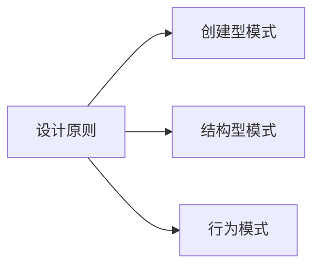

# 设计模式

设计模式（Design Patterns）是软件工程领域经过反复验证的通用解决方案——不是可直接运行的代码，而是解决特定类型问题的"套路模板"。由 Erich Gamma、Richard Helm、Ralph Johnson、John Vlissides 四位"GoF"（Gang of Four）在 1994 年的经典著作《Design Patterns: Elements of Reusable Object-Oriented Software》中系统整理，至今仍是面向对象设计的基础词汇表。

**打个比方**：设计模式就像建筑学中的"立柱"和"拱顶"——每位建筑师都不会从零发明它们，而是按照经过千年验证的结构规则构建新建筑。程序员之间也可以用同样的方式沟通："这里用策略模式"，双方立刻明白对方的意图。

## 为什么学设计模式？

- **提效**：遇到一类问题时，快速识别"套路"，直接应用成熟方案，无需重新推导
- **沟通**：在代码审查和团队协作中，用模式名称精确沟通，减少歧义
- **读懂框架**：Spring、JDK、Netty 等大量使用设计模式，理解它们是读懂框架源码的前提
- **平衡设计**：避免"过度设计"和"设计不足"两个极端——用对模式，可扩展性和可维护性都会提升

## 三大分类

GoF 将 23 种经典设计模式分为三类：

| 分类 | 关注点 | 模式 |
|------|--------|------|
| 🏗️ **创建型模式**（5 种） | 如何创建对象 | 单例、工厂方法、抽象工厂、建造者、原型 |
| 🔗 **结构型模式**（7 种） | 如何组织对象关系 | 适配器、桥接、组合、装饰器、外观、享元、代理 |
| 🔄 **行为模式**（11 种） | 对象如何交互与分配职责 | 策略、观察者、模板方法、命令、迭代器、中介者、备忘录、状态、责任链、访问者、解释器 |

## 学习路径

**推荐顺序**：先读「设计原则」打牢思想根基，再按创建型 → 结构型 → 行为模式的顺序深入。每个模式都对应着一类真实的设计困境，带着问题去学效率更高。每个模式页面遵循「问题 → 是什么 → 怎么用 → 注意点」的结构，配有 UML 类图和 Java 代码示例。
