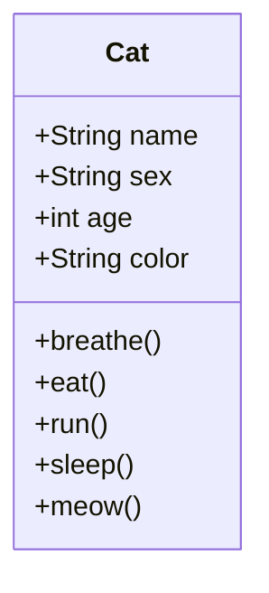
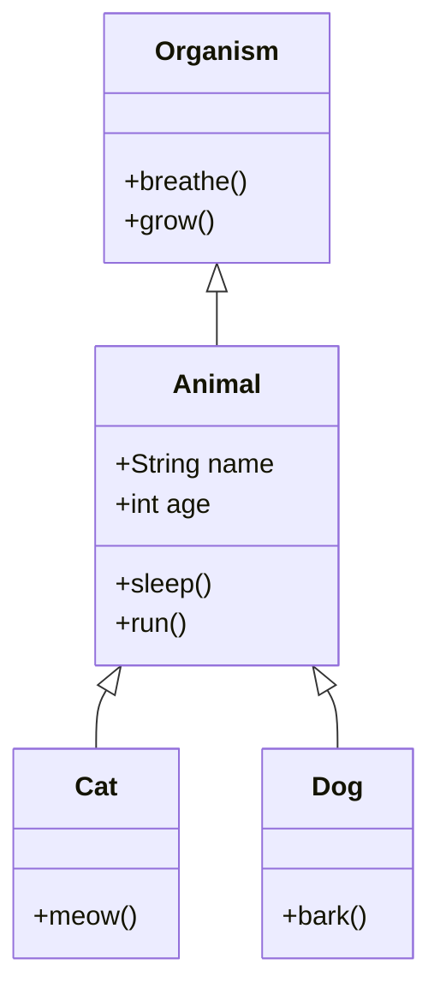
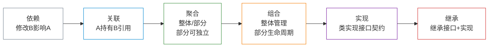

# 面向对象程序设计基础

设计模式是在面向对象范式上生长出来的。要真正理解模式，首先得搞清楚 OOP 的基石——对象、类、四大特性，以及类之间各种关系的精确含义。

**本文你会学到**：

- OOP 四大特性：抽象、封装、继承、多态
- 对象之间的六种关系：依赖、关联、聚合、组合、实现、继承
- 如何用 UML 类图读懂类之间的结构关系

## 🐱 对象与类

面向对象的核心理念是：把数据和操作数据的行为打包在一起，称为**对象**；用来描述对象结构的"蓝图"称为**类**。

以猫为例：



- **属性（成员变量）**：name、sex、age、color——描述对象的状态
- **方法**：breathe、eat、run——描述对象的行为
- **对象**：`Cat kaka = new Cat("卡卡")` 就是 `Cat` 类的一个具体实例

## 🧬 类层次结构

真实程序不只有一个类。当多个类有共同属性和行为时，可以抽取共同部分到父类：



- **超类（父类）**：提供共同属性和行为，如 `Animal` 提供 `name`、`run()`
- **子类**：继承父类所有内容，只需定义**差异**部分（猫会喵，狗会汪）
- 子类可以**重写**父类方法：可以完全替换，也可以扩展（`super.method()` + 额外逻辑）

## ⚙️ OOP 四大特性

### 抽象

不同业务场景对同一真实对象的关注点不同——这种"只建模当前场景所需部分，忽略其他"的能力就是**抽象**。

| 场景 | 飞行模拟器中的「飞机」 | 航班预订系统中的「飞机」 |
|------|----------------------|----------------------|
| 关注属性 | 速度、升力、燃油、俯仰角 | 机型、座位数、座位图 |
| 忽略属性 | 座位分布 | 气动参数 |

同一个"飞机"，两个系统各建了一个完全不同的 `Airplane` 类——两者都是"对的"，因为它们针对各自场景做了恰当的抽象。

!!! tip "抽象的实践意义"

    OOP 的抽象体现在：定义类时只包含当前系统关心的属性和方法。类图中的每个字段都应该有它存在的理由——没有用到的属性是噪音，会让类越来越难以维护。

### 封装

发动一辆车，你只需转动钥匙——不需要知道汽油如何燃烧、曲轴如何转动。这就是封装：**对外暴露必要的接口，隐藏内部实现细节**。

``` java title="封装：只暴露必要接口，隐藏内部状态"
public class Car {
    // 内部细节：外部代码无法直接访问和修改
    private int engineTemperature;
    private boolean isRunning;
    private double fuelLevel;

    // 公开接口：外部只能通过这些方法与汽车交互
    public void start() {
        if (fuelLevel > 0) {
            isRunning = true;
            // 内部复杂逻辑...
        }
    }

    public double getFuelLevel() {
        return fuelLevel; // 只读，外部不能随意修改
    }
}
```

封装的访问控制关键字：

| 关键字 | 可访问范围 |
|--------|---------|
| `private` | 仅当前类 |
| `protected` | 当前类 + 所有子类 |
| （无修饰符）| 同包 |
| `public` | 所有代码 |

!!! tip "接口与封装的关系"

    Java 的 `interface` 是封装思想的极致体现——它只描述"能做什么"，完全隐藏"如何做"。调用方依赖接口，不依赖实现类，就不会受实现细节变化的影响。

### 继承

继承让子类能复用父类的代码，同时只关注自己的差异部分。

``` java title="继承：子类复用父类代码，只写差异"
// 父类：动物共有的行为
public abstract class Animal {
    private String name;
    private int age;

    public Animal(String name, int age) {
        this.name = name;
        this.age = age;
    }

    public void sleep() {
        System.out.println(name + " 在睡觉");
    }

    // 抽象方法：每种动物叫声不同，强制子类实现
    public abstract void makeSound();
}

// 子类：只写差异部分
public class Cat extends Animal {
    public Cat(String name, int age) {
        super(name, age); // 复用父类构造逻辑
    }

    @Override
    public void makeSound() {
        System.out.println("喵喵！"); // 只有这里是猫独有的
    }
}

public class Dog extends Animal {
    @Override
    public void makeSound() {
        System.out.println("汪汪！");
    }
}
```

!!! warning "继承的局限性"

    继承只允许一个父类（Java 单继承）；子类无法"减少"父类接口，所有父类方法都必须面对。当类层次结构在多个维度上扩展时，继承会导致类的数量爆炸——这时应该考虑「组合优于继承」原则（见「设计原则」）。

### 多态

把猫和狗放进同一个袋子，闭上眼睛逐个取出——每次取出时你叫它"动物"，但它会根据自身类型发出正确的叫声。这就是**多态**：程序在运行时根据对象的实际类型调用正确的方法。

``` java title="多态：统一接口，运行时分派"
public class Main {
    public static void main(String[] args) {
        // 声明为 Animal 类型，但运行时是 Cat 和 Dog 对象
        Animal[] animals = {new Cat("卡卡", 3), new Dog("福福", 2)};

        for (Animal a : animals) {
            a.makeSound(); // 运行时根据实际类型分派：喵喵！汪汪！
        }
    }
}
// 输出：
// 喵喵！
// 汪汪！
```

多态的核心价值：**调用方代码不需要知道对象的具体类型**，只需知道接口——这让添加新类型（如 `Parrot`）时，调用方代码完全不需要修改。

## 🔗 对象之间的关系

除了继承（IS-A）之外，对象之间还有五种常见关系，从弱到强排列：

### 依赖

**修改类 B 可能影响类 A，但 A 不持有 B 的引用**——这是最弱的关系。

常见形式：方法参数类型、局部变量类型、返回值类型中用到了另一个类。

``` java title="依赖：Course 出现在 Professor 的方法参数中"
public class Professor {
    // Professor 依赖 Course，因为方法参数里用到了它
    // 但 Professor 没有 Course 类型的成员变量
    public void teach(Course course) {
        // 如果 Course.getKnowledge() 被改名，这里会编译报错
        this.student.remember(course.getKnowledge());
    }
}
```

UML 表示：虚线箭头（A → B 表示 A 依赖 B）

### 关联

**对象 A 持有对象 B 的引用**（通常是成员变量），两者之间有长期联系——这是比依赖更强的关系。

``` java title="关联：Professor 持有 Student 成员变量"
public class Professor {
    private Student student;   // ← 成员变量，长期关联

    public void teach(Course course) {
        // 因为持有引用，Professor 可以在任何方法中使用 student
        this.student.remember(course.getKnowledge());
    }
}
```

UML 表示：实线箭头（A → B 表示 A 关联 B）

!!! tip "关联 vs 依赖"

    关键区别：关联通过**成员变量**建立持久联系；依赖只在方法执行期间临时使用另一个类。`Professor` 有 `student` 成员变量 → 关联；`teach()` 方法接收 `course` 参数 → 依赖。

### 聚合

**一个对象由多个其他对象构成（"整体/部分"关系），但部分可以独立于整体存在**。

经典例子：院系（Department）和教授（Professor）——院系由教授组成，但教授可以属于多个院系，也可以离职后独立存在。

``` java title="聚合：Department 包含多个 Professor，但 Professor 可独立存在"
public class Department {
    private List<Professor> professors = new ArrayList<>();

    public void addProfessor(Professor p) {
        professors.add(p); // Professor 是从外部传入的，不是这里创建的
    }

    public void removeProfessor(Professor p) {
        professors.remove(p); // 移除后 Professor 对象仍然存在
    }
}
```

UML 表示：空心菱形 ◇── 指向组件（整体这端是菱形）

### 组合

**聚合的特殊形式——部分不能离开整体单独存在，整体负责部分的生命周期**。

经典例子：大学（University）和院系（Department）——没有大学，院系就无法存在；大学被撤销时，院系随之消亡。

``` java title="组合：University 创建并管理 Department 的生命周期"
public class University {
    // Department 在 University 构造时创建，生命周期完全由 University 管理
    private final List<Department> departments;

    public University() {
        this.departments = new ArrayList<>();
        departments.add(new Department("计算机学院")); // ← University 内部创建
        departments.add(new Department("数学学院"));
    }
    // University 销毁时，departments 列表随之销毁
}
```

UML 表示：实心菱形 ◆── 指向组件（与聚合相同，但菱形是实心的）

!!! tip "聚合 vs 组合"

    核心区别在于**生命周期**：
    - 聚合：部分可以独立存在，由外部创建和传入
    - 组合：部分由整体创建，随整体消亡

### 实现与继承

| 关系 | UML 符号 | 含义 |
|------|---------|------|
| **实现**（`implements`） | 空心三角 + 虚线 | 类 A 承诺实现接口 B 的所有方法 |
| **继承**（`extends`） | 空心三角 + 实线 | 类 A 继承类 B 的接口和实现，可扩展 |

这两种是最强的关系：子类/实现类必须兼容父类/接口的所有方法契约。

## 📊 关系强弱总览



| 关系 | A 知道 B？ | A 由 B 构成？ | A 管理 B 生命周期？ | A 可被视为 B？ |
|------|-----------|------------|-----------------|-------------|
| 依赖 | 临时 | ❌ | ❌ | ❌ |
| 关联 | ✅ | ❌ | ❌ | ❌ |
| 聚合 | ✅ | ✅ | ❌ | ❌ |
| 组合 | ✅ | ✅ | ✅ | ❌ |
| 实现 | ✅（接口）| ❌ | ❌ | ✅ |
| 继承 | ✅ | ❌ | ❌ | ✅ |

理解这六种关系，是读懂 UML 类图（设计模式图示的通用语言）的关键前提。
