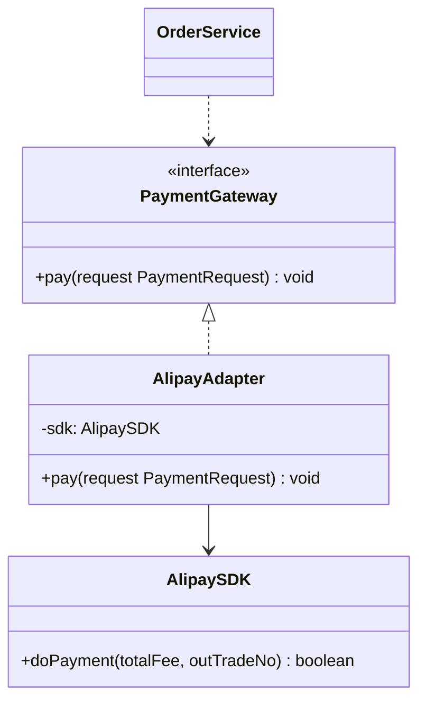

# 适配器模式

## 🔍 定义

适配器模式（Adapter）将一个类的接口转换成客户端期望的另一个接口，使原本因接口不兼容而不能在一起工作的类可以协同工作。

## ⚠️ 不使用适配器存在的问题

你新接入了一家第三方支付 SDK，但它的方法签名与系统内部的统一接口完全不同：

``` java title="AdapterBadExample.java"
--8<-- "code/topic/design-patterns/src/main/java/com/example/structural/adapter/AdapterBadExample.java"
```

## 🏗️ 设计模式结构说明



适配器（`AlipayAdapter`）实现目标接口（`PaymentGateway`），内部持有被适配类（`AlipaySDK`），在 `pay()` 方法中完成参数转换后调用 SDK。

## 💻 设计模式举例说明

``` java title="AdapterExample.java"
--8<-- "code/topic/design-patterns/src/main/java/com/example/structural/adapter/AdapterExample.java"
```

## ⚖️ 优缺点

**优点：**

- 符合**单一职责原则**：接口转换逻辑集中在适配器，不污染业务代码
- 符合**开闭原则**：新增 SDK 只需新增适配器类，不修改已有代码
- 解耦客户端与被适配者

**缺点：**

- 增加一个中间层，代码复杂度略有上升
- Java 单继承限制，类适配器（通过继承）受限，通常只能用对象适配器（组合）

## 🔗 与其它模式的关系

**相似模式防混淆：**

| 模式 | 接口变化？ | 主要意图 |
|------|----------|---------|
| 适配器（Adapter） | ✅ 改变接口 | 兼容不兼容的接口 |
| 装饰器（Decorator） | ❌ 接口不变 | 动态增强功能 |
| 代理（Proxy） | ❌ 接口不变 | 控制/延迟访问 |
| 外观（Facade） | ✅ 提供新接口 | 简化复杂子系统，不强制复用旧接口 |

> 关键区分：适配器是**改变已有接口**；装饰器和代理是在**接口不变**的前提下增强或控制。

## 🗂️ 应用场景

- 接入第三方库或遗留系统，其接口与现有代码不兼容
- 需要复用多个已有类，但它们缺少共同接口
- JDK：`Arrays.asList()` 将数组适配为 `List`；`InputStreamReader` 将字节流适配为字符流
- Spring：`HandlerAdapter` 将不同类型的 Controller 适配为统一的处理接口
