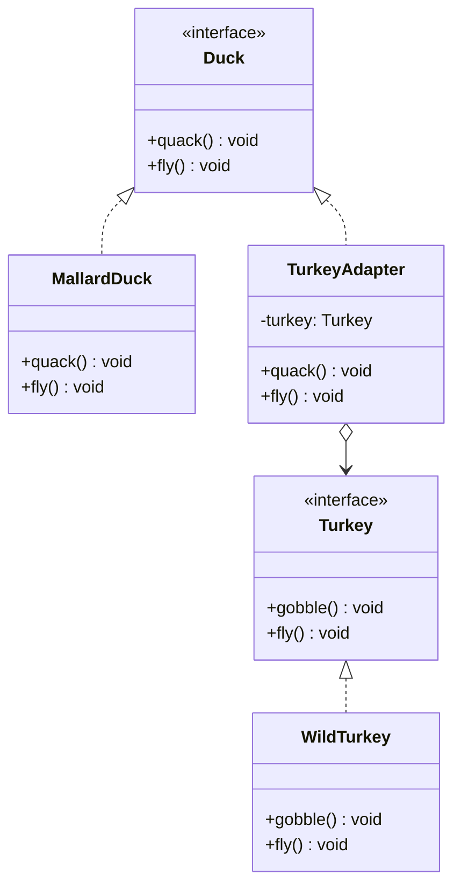

# 适配器模式

## 从鸭子和火鸡说起

你有一个鸭子模拟器（`DuckSimulator`），只接受 `Duck` 接口。但你只有一只火鸡（`Turkey`），它有 `gobble()`（咕噜叫）和短距离 `fly()`——和 `Duck` 的 `quack()` + 长距离 `fly()` 完全不同。

能不能让火鸡"假扮"成鸭子？当然可以，但你不可能修改 `Turkey` 类（它来自第三方库），也不应该修改 `DuckSimulator`。解决方案就是创建一个**适配器**：`TurkeyAdapter` 实现 `Duck` 接口，内部持有 `Turkey`，把 `quack()` 转发给 `gobble()`。

这就是适配器模式——一个"转换插头"，让不兼容的接口能一起工作。

## 🔍 定义

适配器模式（Adapter）将一个类的接口转换成客户端期望的另一个接口，使原本因接口不兼容而不能在一起工作的类可以协同工作。

## ⚠️ 不使用适配器存在的问题

``` java title="AdapterBadExample.java"
--8<-- "code/topic/design-patterns/src/main/java/com/example/structural/adapter/AdapterBadExample.java"
```

## 🏗️ 设计模式结构（鸭子/火鸡适配器）



核心角色：

| 角色 | 说明 |
|------|------|
| `Duck`（目标接口 Target） | 客户端期望的接口 |
| `Turkey`（被适配者 Adaptee） | 需要被包装的接口 |
| `TurkeyAdapter`（适配器） | 实现 Target，内部委托 Adaptee（对象适配器） |

## 💻 设计模式举例说明

``` java title="AdapterExample.java"
--8<-- "code/topic/design-patterns/src/main/java/com/example/structural/adapter/AdapterExample.java"
```

!!! tip "对象适配器 vs 类适配器"

    - **对象适配器**（本例采用）：适配器持有被适配者的引用（组合）。Java 推荐此方式，因为 Java 不支持多重继承。
    - **类适配器**：适配器同时继承 Target 和 Adaptee（多重继承）。C++ 可用，Java 无法实现。

## ⚖️ 优缺点

**优点：**

- 符合**单一职责**：接口转换逻辑集中在适配器
- 符合**开闭原则**：新增适配器不修改已有代码
- 解耦客户端与被适配者

**缺点：**

- 增加一个中间层，稍微提升了复杂度
- Java 不支持多重继承，只能用对象适配器（组合）

## 🔗 与其它模式的关系

| 模式 | 接口变化？ | 主要意图 |
|------|----------|---------|
| 适配器（Adapter） | ✅ 改变接口 | 兼容不兼容的接口 |
| 装饰器（Decorator） | ❌ 接口不变 | 动态增强功能 |
| 代理（Proxy） | ❌ 接口不变 | 控制/延迟访问 |
| 外观（Facade） | ✅ 提供新接口 | 简化复杂子系统 |

## 🗂️ 应用场景

- 接入第三方库或遗留系统，其接口与现有代码不兼容
- JDK：`Arrays.asList()` 将数组适配为 `List`；`InputStreamReader` 将字节流适配为字符流
- Spring：`HandlerAdapter` 将不同类型的 Controller 适配为统一处理接口

## 工业视角

### 类适配器 vs 对象适配器：优先选组合

王争清晰地给出了两种实现的选择标准：

``` java title="类适配器（继承）vs 对象适配器（组合）"
// 类适配器：继承 Adaptee，实现 ITarget
// 优点：不需要重复委托 Adaptee 中已有的方法
// 缺点：与 Adaptee 强耦合，Java 单继承限制
public class CDAdaptor extends Adaptee implements ITarget {
    public void f1() { super.fa(); }
    public void f2() { /* 重新实现 */ }
    // fc() 直接继承自 Adaptee，无需委托
}

// 对象适配器：组合持有 Adaptee
// 优点：松耦合，支持多个 Adaptee，Java 首选
// 缺点：Adaptee 和 ITarget 重合的方法仍需逐一委托
public class CDAdaptor implements ITarget {
    private Adaptee adaptee;
    public CDAdaptor(Adaptee adaptee) { this.adaptee = adaptee; }
    public void f1() { adaptee.fa(); }
    public void f2() { /* 重新实现 */ }
    public void fc() { adaptee.fc(); }
}
```

!!! tip "如何选择？"

    Adaptee 接口少，两种都可以。Adaptee 接口多且与 ITarget **大部分相同**，用类适配器（减少委托代码量）。Adaptee 接口多且与 ITarget **大部分不同**，用对象适配器（组合比继承更灵活）。Java 不支持多继承，实践中优先考虑对象适配器。

### 适配器是"补偿模式"，它的最大价值在统一接口

王争将适配器定性为**补偿模式**——设计之初就能规避接口不兼容的话，适配器根本用不上。它的最典型工业应用是**统一多个第三方系统的接口**，以敏感词过滤为例：

``` java title="统一多个外部过滤系统的接口，实现多态复用"
// 各第三方系统接口各异，无法统一调用
// A 系统：filterSexyWords() + filterPoliticalWords()
// B 系统：filter(text)
// C 系统：filter(text, mask)

// 用适配器统一为同一接口
public interface ISensitiveWordsFilter {
    String filter(String text);
}

public class ASensitiveWordsFilterAdaptor implements ISensitiveWordsFilter {
    private ASensitiveWordsFilter aFilter = new ASensitiveWordsFilter();
    public String filter(String text) {
        String result = aFilter.filterSexyWords(text);
        return aFilter.filterPoliticalWords(result);
    }
}
// B、C 同理，各自实现一个 Adaptor

// 调用方只依赖统一接口，新增第三方系统只需新增 Adaptor，调用方零修改
public class RiskManagement {
    private List<ISensitiveWordsFilter> filters = new ArrayList<>();
    public String filterSensitiveWords(String text) {
        for (ISensitiveWordsFilter filter : filters) {
            text = filter.filter(text);
        }
        return text;
    }
}
```

SLF4J 正是这种思路的工业落地：它定义统一的日志门面接口，底层通过适配器对接 Log4j、Logback、`java.util.logging` 等各种实现，应用代码只依赖 SLF4J API，切换日志框架时零修改业务代码。

!!! warning "适配器 vs 代理 vs 装饰器的核心区分"

    **适配器**用于接口**不兼容**的场景（接口发生转变），是事后补救手段。**代理**用于接口**相同**但需要控制访问或附加横切逻辑的场景。**装饰器**用于接口**相同**且需要动态增强功能的场景。三者代码结构相似，但一旦看清"接口是否变化"和"意图是什么"，就能准确区分。
