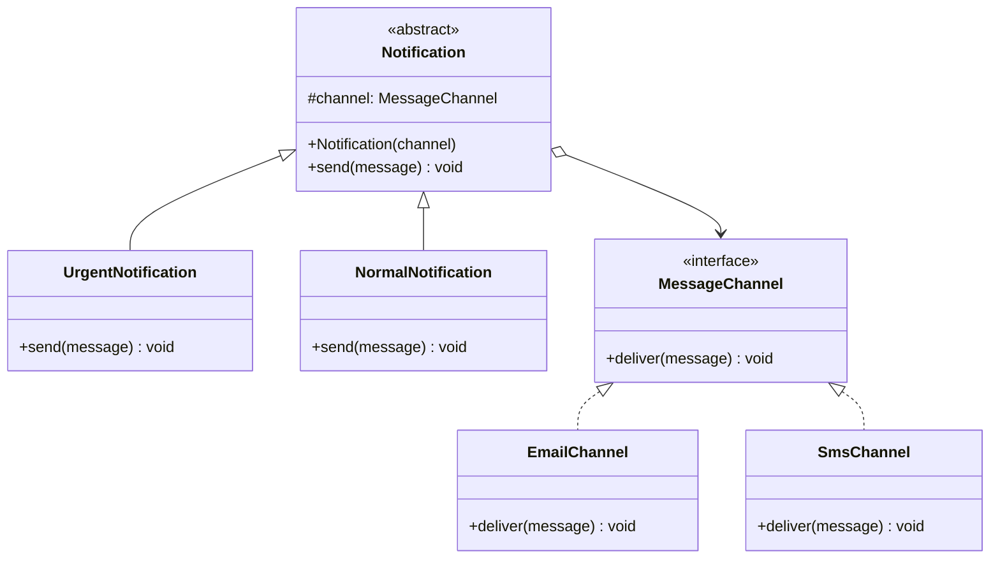

# 桥接模式

## 🔍 定义

桥接模式（Bridge）将抽象部分与其实现部分分离，使两者可以独立变化。通过**组合代替继承**，避免多维度扩展时的类爆炸。

## ⚠️ 不使用桥接存在的问题

假设消息通知系统有两个维度的变化：**消息类型**（紧急、普通）和**发送渠道**（邮件、短信）。

用继承实现所有组合：

``` java title="BridgeBadExample.java"
--8<-- "code/topic/design-patterns/src/main/java/com/example/structural/bridge/BridgeBadExample.java"
```

两个维度各自增长，类数量按乘法膨胀——这正是桥接模式要解决的问题。

## 🏗️ 设计模式结构说明



抽象层（`Notification` 及子类）通过组合持有实现层（`MessageChannel`），两个维度各自独立扩展。

## 💻 设计模式举例说明

``` java title="BridgeExample.java"
--8<-- "code/topic/design-patterns/src/main/java/com/example/structural/bridge/BridgeExample.java"
```

## ⚖️ 优缺点

**优点：**

- 消除多维度继承导致的类爆炸
- 符合**开闭原则**：两个维度可以独立扩展
- 符合**单一职责原则**：抽象和实现各自只负责自己的变化

**缺点：**

- 需要预先识别出两个独立变化的维度，对系统设计要求较高
- 增加代码复杂度，对简单场景可能过度设计

## 🔗 与其它模式的关系

**相似模式防混淆：**

| 模式 | 关注点 | 时机 |
|------|--------|------|
| 桥接（Bridge） | 分离两个变化维度的结构层次 | 设计阶段预先规划 |
| 适配器（Adapter） | 兼容不兼容的接口 | 事后弥补已有接口不匹配 |
| 策略（Strategy） | 替换算法/行为 | 关注行为，不涉及结构分离 |

**组合使用：**

桥接可与抽象工厂配合——由工厂负责创建特定组合的实现层对象（如生产适配当前平台的 `MessageChannel`）。

## 🗂️ 应用场景

- 需要在两个独立维度上扩展的系统（如"类型 × 平台"、"形状 × 颜色"）
- 希望在运行时切换实现（如动态切换通知渠道）
- JDK：`JDBC` 驱动设计——`Connection`/`Statement` 是抽象，不同数据库驱动是实现
