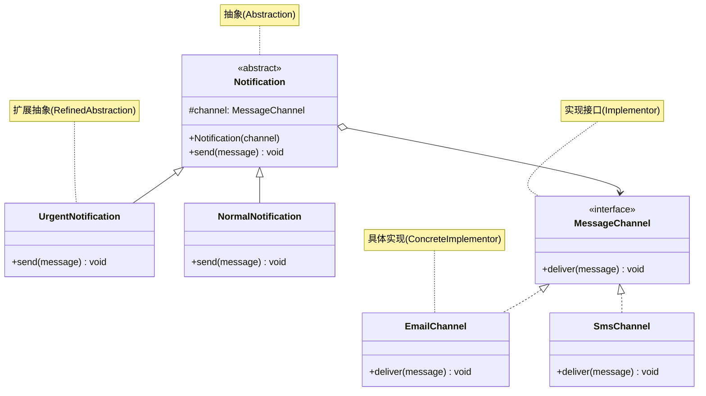

# 桥接模式

## 从消息通知维度爆炸说起

告警通知系统需要支持两个维度的组合：**消息紧急程度**（普通、紧急、严重）× **发送渠道**（短信、邮件、微信）。用继承来实现所有组合，就需要 `UrgencySmsSender`、`UrgencyEmailSender`、`SevereSmsSender`……3×3=9 个类。再加一种渠道，就要多写 3 个类——类数量按**乘法**增长，稍有扩展就爆炸。

桥接模式的解法是：把两个维度**各自独立成体系**，再用**对象组合**桥接起来。新增渠道只需新增一个渠道类，不碰任何紧急程度类；新增紧急程度同理，扩展从"乘法"变成"加法"。

## 🔍 定义

桥接模式（Bridge）将抽象部分与其实现部分分离，使两者可以独立变化。通过**组合代替继承**，避免多维度扩展时的类爆炸。

## ⚠️ 不使用桥接存在的问题

假设消息通知系统有两个维度的变化：**消息类型**（紧急、普通）和**发送渠道**（邮件、短信）。

用继承实现所有组合：

``` java title="BridgeBadExample.java"
--8<-- "code/topic/design-patterns/src/main/java/com/example/structural/bridge/BridgeBadExample.java"
```

两个维度各自增长，类数量按乘法膨胀——这正是桥接模式要解决的问题。

## 🏗️ 设计模式结构说明



抽象层（`Notification` 及子类）通过组合持有实现层（`MessageChannel`），两个维度各自独立扩展。

## 💻 设计模式举例说明

``` java title="BridgeExample.java"
--8<-- "code/topic/design-patterns/src/main/java/com/example/structural/bridge/BridgeExample.java"
```

## ⚖️ 优缺点

**优点：**

- 消除多维度继承导致的类爆炸
- 符合**开闭原则**：两个维度可以独立扩展
- 符合**单一职责原则**：抽象和实现各自只负责自己的变化

**缺点：**

- 需要预先识别出两个独立变化的维度，对系统设计要求较高
- 增加代码复杂度，对简单场景可能过度设计

## 🔗 与其它模式的关系

**相似模式防混淆：**

| 模式 | 关注点 | 时机 |
|------|--------|------|
| 桥接（Bridge） | 分离两个变化维度的结构层次 | 设计阶段预先规划 |
| 适配器（Adapter） | 兼容不兼容的接口 | 事后弥补已有接口不匹配 |
| 策略（Strategy） | 替换算法/行为 | 关注行为，不涉及结构分离 |

**组合使用：**

桥接可与抽象工厂配合——由工厂负责创建特定组合的实现层对象（如生产适配当前平台的 `MessageChannel`）。

## 🗂️ 应用场景

- 需要在两个独立维度上扩展的系统（如"类型 × 平台"、"形状 × 颜色"）
- 希望在运行时切换实现（如动态切换通知渠道）
- JDK：`JDBC` 驱动设计——`Connection`/`Statement` 是抽象，不同数据库驱动是实现

## 🏭 工业视角

### JDBC 是桥接模式最权威的工业案例

GoF 对桥接模式的定义——"将抽象和实现解耦，让它们可以独立变化"——读起来令人困惑，因为这里的"抽象"和"实现"**不是**抽象类与实现类的意思。JDBC 是最好的诠释：

``` java title="JDBC 切换数据库只需换一行"
// 切换到 MySQL：只改这一行（或改配置文件）
Class.forName("com.mysql.cj.jdbc.Driver"); // MySQL Connector/J 8.x 推荐（旧名 com.mysql.jdbc.Driver 在 8.x 中已弃用）
// 切换到 Oracle：
// Class.forName("oracle.jdbc.driver.OracleDriver");

String url = "jdbc:mysql://localhost:3306/mydb";
Connection con = DriverManager.getConnection(url);
Statement stmt = con.createStatement();
ResultSet rs = stmt.executeQuery("SELECT * FROM users");
```

在这里，`DriverManager` / `Connection` / `Statement` 是"抽象"（与具体数据库无关的操作骨架），`com.mysql.cj.jdbc.Driver` 等是"实现"（真正与数据库通信的类库）。两者通过 `DriverManager.registerDriver()` 组合在一起，独立演化，互不侵入。

!!! tip "桥接模式的两种理解方式"

    第一种（GoF 原版）：将抽象类库与实现类库解耦，通过**对象组合**桥接，JDBC 是典型。第二种（更通用）：当一个类存在两个或多个**独立变化的维度**时，用组合代替继承，避免类数量指数级增长。两种理解的代码结构相同，后者更容易在日常设计中识别和应用。

### 消息通知系统：识别"两个独立维度"的实战示范

王争用告警通知系统演示了桥接模式的第二种理解方式。原始设计把"消息紧急程度"和"发送渠道"混在一个 `Notification` 类里，导致大量 `if-else`。重构思路是**识别两个独立维度，将其拆分为独立的继承体系，再通过组合桥接**：

``` java title="桥接模式重构后：抽象层与实现层独立扩展"
// 实现层：发送渠道（独立变化的维度 1）
public interface MsgSender {
    void send(String message);
}
public class TelephoneMsgSender implements MsgSender { /*...*/ }
public class EmailMsgSender    implements MsgSender { /*...*/ }
public class WechatMsgSender   implements MsgSender { /*...*/ }

// 抽象层：消息紧急程度（独立变化的维度 2）
public abstract class Notification {
    protected MsgSender msgSender; // ← 桥接点
    public Notification(MsgSender msgSender) {
        this.msgSender = msgSender;
    }
    public abstract void notify(String message);
}
public class SevereNotification extends Notification {
    public void notify(String message) { msgSender.send("[严重] " + message); }
}
public class UrgencyNotification extends Notification { /*...*/ }
```

新增一种渠道只需新增 `MsgSender` 实现；新增一种紧急级别只需新增 `Notification` 子类。两个维度**互不影响**，符合开闭原则。

!!! warning "桥接模式在工程中并不常见"

    桥接模式要求**设计阶段**就能预判出两个独立变化的维度，门槛较高。实际项目中如果维度只有一个，或两个维度耦合紧密，强行套用反而增加复杂度。相比之下，第二种理解方式（"组合代替继承"）在日常重构中更频繁出现，你可以把它视为"组合优于继承"原则的一种具体落地结构。
