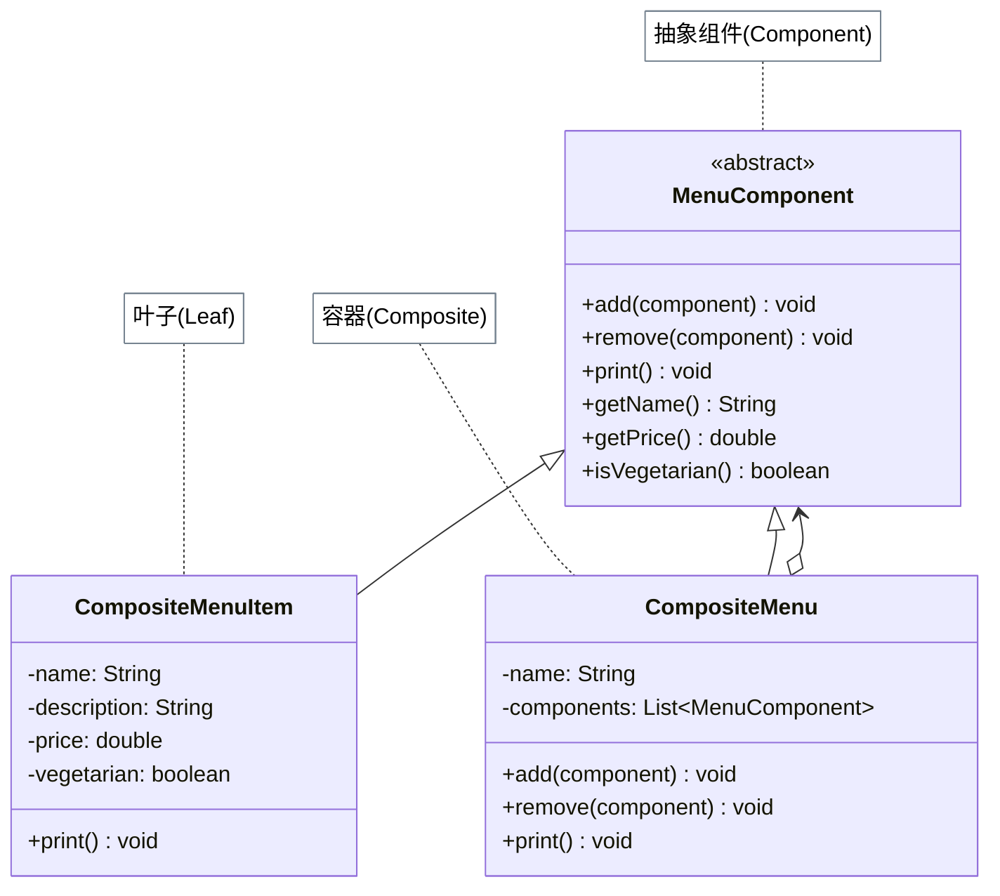

# 组合模式

## 从菜单树说起

迭代器模式解决了"统一遍历不同集合"的问题，但还留下了另一个难题：女服务员打印菜单时，如果午餐菜单下还有一个**甜点子菜单**，怎么办？

如果用 `instanceof` 判断——"如果是菜单项就打印，如果是菜单就递归进去"——新增任何节点类型（比如特供菜单）都要修改打印逻辑，违反开闭原则。

解决方案：让菜单（`Menu`）和菜单项（`MenuItem`）都实现同一个抽象类 `MenuComponent`，都有 `print()` 方法。女服务员只调用 `print()`，不区分类型——菜单项打印自己，子菜单则递归打印所有子节点。

## 🔍 定义

组合模式（Composite）将对象组合成树形结构以表示"部分-整体"的层次结构，让客户端对**单个对象（叶子）**和**组合对象（容器）**的使用具有一致性。

## ⚠️ 不使用组合存在的问题

``` java title="CompositeBadExample.java"
--8<-- "code/topic/design-patterns/src/main/java/com/example/structural/composite/CompositeBadExample.java"
```

## 🏗️ 设计模式结构（菜单树）



| 角色 | 说明 |
|------|------|
| `MenuComponent`（抽象组件） | 定义叶子和容器的公共操作；容器方法默认抛异常 |
| `CompositeMenuItem`（叶子） | 只实现有意义的操作：`print()` 打印自身 |
| `CompositeMenu`（容器） | 持有子 `MenuComponent` 列表，`print()` 递归委托子节点 |

## 💻 设计模式举例说明

``` java title="CompositeExample.java"
--8<-- "code/topic/design-patterns/src/main/java/com/example/structural/composite/CompositeExample.java"
```

!!! tip "透明性 vs 安全性的权衡"

    本例将 `add()`/`remove()` 放在抽象类 `MenuComponent` 中（叶子默认抛异常），优点是客户端无需区分叶子和容器，代码更透明；缺点是叶子节点暴露了无意义的方法。这种取舍在 Head First 中被称为"为透明性牺牲安全性"——两种选择都合理，需根据场景权衡。

## ⚖️ 优缺点

**优点：**

- 客户端对叶子和容器操作完全一致，无需 `instanceof`
- 符合**开闭原则**：新增节点类型只需实现 `MenuComponent`
- 递归结构天然支持任意深度的树形数据

**缺点：**

- 叶子节点中 `add()`/`remove()` 无意义（需抛异常或留空）
- 树很深时，递归遍历可能有性能问题

## 🔗 与其它模式的关系

| 模式 | 都用递归组合？ | 主要目的 |
|------|-------------|---------|
| 组合（Composite） | ✅ | 统一表示整体-部分层次，客户端无差别对待 |
| 装饰器（Decorator） | ✅ | 动态增强单个对象的功能，不构建树形结构 |

组合结构常与迭代器（遍历树节点）和访问者（对树节点执行操作）配合使用。

## 🗂️ 应用场景

- 餐厅菜单树（菜单项 + 子菜单）
- 文件系统（文件 + 目录）
- 组织架构（员工 + 部门）
- UI 组件（按钮 + 容器面板）
- JDK：`java.awt.Container`（包含 `Component`，`Component` 是公共接口）

## 🏭 工业视角

### 数据结构视角：组合模式是树形结构的模式化

《设计模式之美》中有一个精辟的总结：**组合模式与其说是一种设计模式，不如说是对"树形数据结构 + 递归遍历算法"的业务抽象**。判断是否该用组合模式，核心问题只有一个：**业务数据能否天然表示成树形结构？** 能，就用；不能，强行套用只会增加复杂度。

典型场景：文件系统（文件 + 目录）、OA 部门树（员工 + 部门）、权限菜单树（菜单项 + 菜单组）、电商类目树（商品 + 分类）。

### 消除 instanceof：统一接口是组合模式的核心价值

没有组合模式时，遍历树形结构需要不断判断节点类型，每新增一种节点类型都需要修改遍历逻辑：

``` java title="反例：充斥 instanceof 的遍历代码"
void print(Object node) {
    if (node instanceof MenuItem) {               // 叶子节点
        System.out.println(((MenuItem) node).getName());
    } else if (node instanceof Menu) {            // 容器节点
        for (Object child : ((Menu) node).getChildren()) {
            print(child);  // 每次新增节点类型都要改这里，违反开闭原则
        }
    }
}
```

组合模式通过统一的抽象组件接口彻底消除 `instanceof`，新增节点类型只需实现公共接口，遍历代码零修改——这是开闭原则在树形结构上的真正落地。

### 工业级示例：OA 部门薪资汇总

`HumanResource` 作为公共抽象，`Employee`（叶子）和 `Department`（容器）均实现 `calculateSalary()`，递归汇总整个公司薪资成本，无需在任何地方区分节点类型：

``` java title="组合模式：统一叶子与容器的递归调用"
public abstract class HumanResource {
    protected long id;
    // 统一接口：叶子返回自身薪资，容器递归汇总子节点
    public abstract double calculateSalary();
}

public class Employee extends HumanResource {
    private double salary;
    @Override
    public double calculateSalary() { return salary; }
}

public class Department extends HumanResource {
    private List<HumanResource> subNodes = new ArrayList<>();
    @Override
    public double calculateSalary() {
        // 无需区分子节点是 Employee 还是 Department，统一调用接口
        return subNodes.stream().mapToDouble(HumanResource::calculateSalary).sum();
    }
    public void addSubNode(HumanResource node) { subNodes.add(node); }
}
```

!!! tip "何时不适合使用组合模式"

    组合模式强依赖树形结构。若数据是网状结构（有向无环图）、或者叶子与容器差异过大导致公共接口非常勉强（大量方法在叶子中抛 `UnsupportedOperationException`），就不必强行套用。普通的递归方法往往已经足够清晰，引入组合模式反而增加不必要的抽象层。
