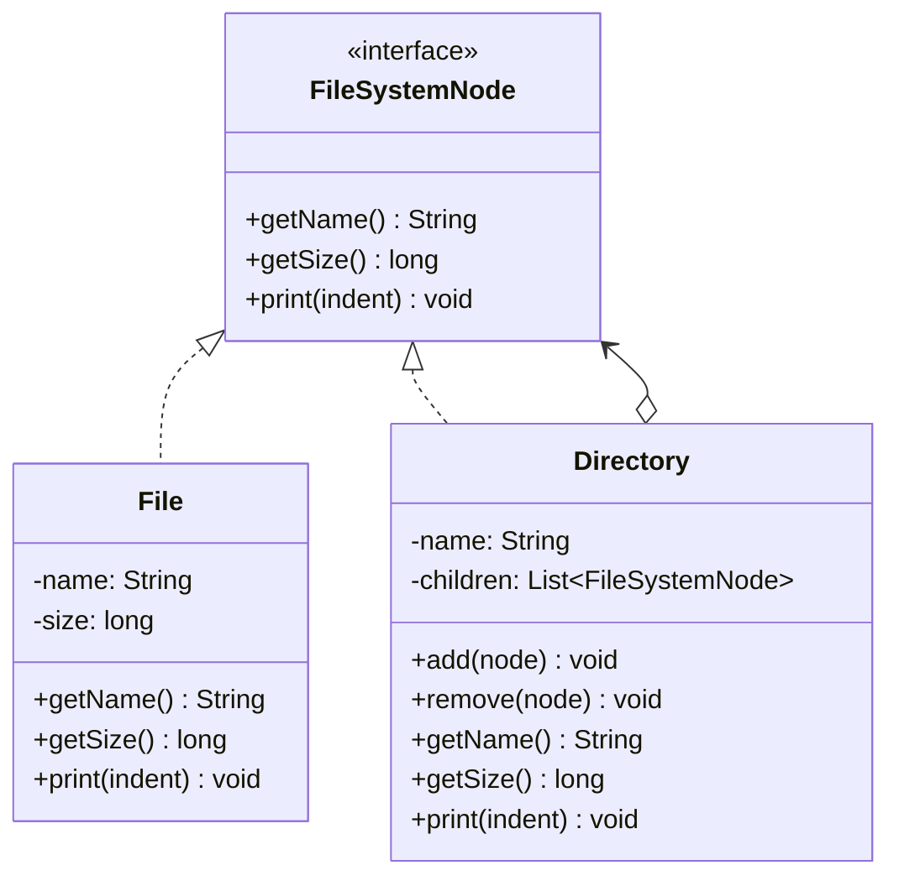

# 组合模式

## 🔍 定义

组合模式（Composite）将对象组合成树形结构以表示"部分-整体"的层次结构，让客户端对单个对象和组合对象的使用具有一致性。

## ⚠️ 不使用组合存在的问题

文件系统中，文件和文件夹需要支持"计算总大小"操作。如果不用组合模式，调用方必须用 `instanceof` 区分两种类型：

``` java title="CompositeBadExample.java"
--8<-- "code/topic/design-patterns/src/main/java/com/example/structural/composite/CompositeBadExample.java"
```

增加新类型（如符号链接）就要修改所有遍历逻辑——违反 OCP。

## 🏗️ 设计模式结构说明



叶子（`File`）和容器（`Directory`）都实现同一个接口（`FileSystemNode`），客户端无需区分类型。

## 💻 设计模式举例说明

``` java title="CompositeExample.java"
--8<-- "code/topic/design-patterns/src/main/java/com/example/structural/composite/CompositeExample.java"
```

## ⚖️ 优缺点

**优点：**

- 客户端对叶子和容器的操作完全一致，无需 `instanceof` 判断
- 符合**开闭原则**：新增节点类型只需实现接口，已有代码不变
- 递归结构天然支持树形数据

**缺点：**

- 叶子和容器实现同一接口，叶子节点中 `add()`/`remove()` 等方法无意义（需要抛异常或留空）
- 如果树很深，递归遍历可能有性能问题

## 🔗 与其它模式的关系

**相似模式防混淆：**

| 模式 | 都用递归组合？ | 主要目的 |
|------|-------------|---------|
| 组合（Composite） | ✅ | 统一表示整体-部分层次，客户端无差别对待 |
| 装饰器（Decorator） | ✅ | 动态增强单个对象的功能，不构建树形结构 |

**组合使用：**

组合结构的节点上可以叠加装饰器（如给每个文件节点加上权限检查装饰器），也常与访问者模式配合对树进行各种操作。

## 🗂️ 应用场景

- 文件系统（文件和目录）
- 菜单树（菜单项和子菜单）
- 组织架构（员工和部门）
- 表达式树（操作数和运算符）
- JDK：`java.awt.Container` 包含 `Component`，`Component` 是公共接口
