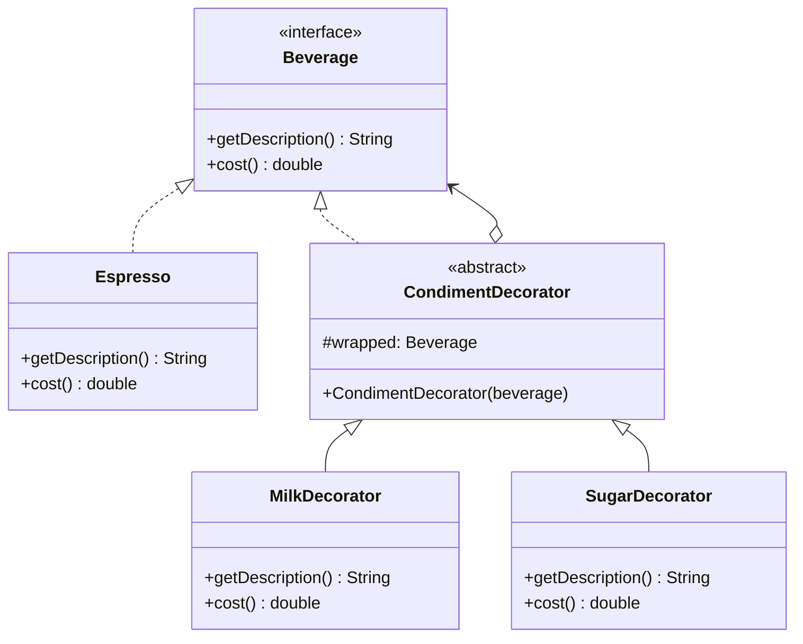

# 装饰器模式

## 定义

装饰器模式（Decorator）动态地为对象添加额外功能，比继承更灵活——通过包装对象而不是修改类，在运行时叠加任意组合的功能。

## 不使用装饰器存在的问题

咖啡店系统中，基础饮品（Espresso、Americano）可以加各种配料（牛奶、糖、奶泡）。用继承实现每种组合：

``` java title="DecoratorBadExample.java"
--8<-- "code/topic/design-patterns/src/main/java/com/example/structural/decorator/DecoratorBadExample.java"
```

## 设计模式结构说明



装饰器（`CondimentDecorator`）既实现 `Beverage` 接口，又持有一个 `Beverage` 对象，从而可以链式叠加。

## 设计模式举例说明

``` java title="DecoratorExample.java"
--8<-- "code/topic/design-patterns/src/main/java/com/example/structural/decorator/DecoratorExample.java"
```

## 优缺点

**优点：**

- 无需创建子类即可扩展功能，避免继承爆炸
- 可在运行时动态选择和叠加功能
- 符合**单一职责原则**：每个装饰器只做一件事
- 符合**开闭原则**：新增功能只需新增装饰器类

**缺点：**

- 多层装饰器叠套后，调试时调用链较长
- 如果装饰顺序很重要，需要额外说明

## 与其它模式的关系

**相似模式防混淆：**

| 模式 | 接口变化？ | 对象来源 | 主要意图 |
|------|----------|---------|---------|
| 装饰器（Decorator） | ❌ 不变 | 由调用方传入 | 动态增强功能 |
| 代理（Proxy） | ❌ 不变 | 代理自己创建/管理 | 控制访问 |
| 适配器（Adapter） | ✅ 改变 | — | 兼容接口 |

**组合使用：**

装饰器可与组合模式结合：对树形结构中的每个叶子节点套上装饰器，添加权限检查或日志记录功能。

## 应用场景

- 需要给对象动态添加功能，且功能组合多变
- 不能通过继承扩展（如 `final` 类）
- JDK：`InputStream → FileInputStream → BufferedInputStream → DataInputStream`
- Spring：`HttpServletRequestWrapper`、`BeanDefinitionRegistryPostProcessor`
