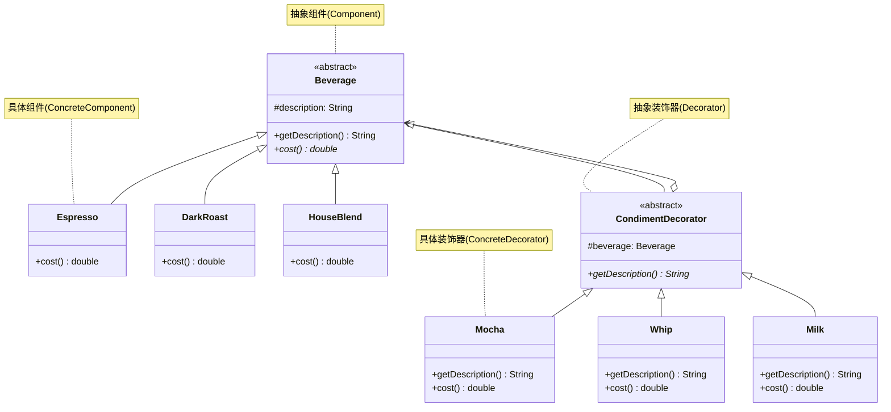

# 装饰器模式

## 从 Starbuzz Coffee 说起

Starbuzz 是增长最快的咖啡连锁店。他们的菜单系统有一个 `Beverage` 抽象类，每种咖啡是一个子类。问题是，咖啡可以加各种配料：牛奶、豆浆、摩卡、奶泡……每种组合都建一个子类，就会出现"类爆炸"——`HouseBlendWithSoyMilkAndMocha`、`DarkRoastWithWhipAndMocha` 等几十上百个子类。

这违反了**开闭原则**：类应该对扩展开放，对修改关闭。继承是静态的，运行时无法改变一杯咖啡里有什么配料。

## 🔍 定义

装饰器模式（Decorator）动态地将责任附加到对象上。装饰器提供了比继承更灵活的功能扩展方式。

> **设计原则：类应该对扩展开放，对修改关闭。（开闭原则）**

## ⚠️ 不使用装饰器存在的问题

用继承实现每种组合，子类数量爆炸式增长：

``` java title="DecoratorBadExample.java"
--8<-- "code/topic/design-patterns/src/main/java/com/example/structural/decorator/DecoratorBadExample.java"
```

## 🏗️ 设计模式结构（Starbuzz 咖啡）



装饰器（`CondimentDecorator`）继承 `Beverage`，并**持有一个 `Beverage` 对象**。这里的继承不是为了复用代码，而是为了保持相同的类型，让装饰器可以无缝替换被装饰的对象。

## 💻 设计模式举例说明

``` java title="DecoratorExample.java"
--8<-- "code/topic/design-patterns/src/main/java/com/example/structural/decorator/DecoratorExample.java"
```

!!! tip "双倍摩卡的实现"

    想要双倍摩卡？直接包两层：`new Mocha(new Mocha(darkRoast))`。这是装饰器模式的精妙之处——同一个装饰器可以叠加多次，且每层都叠加自己的 `cost()`。

## ⚖️ 优缺点

**优点：**

- 避免继承爆炸，类数量大幅减少
- 运行时动态叠加任意功能组合
- 符合**单一职责原则**：每个装饰器只负责一种配料
- 符合**开闭原则**：新增配料只需新建一个装饰器类

**缺点：**

- 多层装饰器叠套后，调试时调用链较长
- 如果某层装饰器持有状态，顺序不同会影响结果
- 代码中会出现很多小类

## 🔗 与其它模式的关系

| 模式 | 接口变化？ | 对象来源 | 主要意图 |
|------|----------|---------|---------|
| 装饰器（Decorator） | ❌ 不变 | 由调用方传入 | 动态增强功能 |
| 代理（Proxy） | ❌ 不变 | 代理自己创建/管理 | 控制访问 |
| 适配器（Adapter） | ✅ 改变 | — | 兼容接口 |

## 🗂️ 应用场景

- 需要动态给对象添加功能，且功能组合多变
- 不能通过继承扩展（如 `final` 类）
- JDK：`InputStream → FileInputStream → BufferedInputStream → DataInputStream` 就是经典装饰器链
- Spring：`HttpServletRequestWrapper`

## 🏭 工业视角

### Java IO 是教科书级装饰器实现，但藏着一个设计细节

王争对 Java IO 源码的剖析揭示了一个常被忽略的问题：`BufferedInputStream` 和 `DataInputStream` 并不直接继承 `InputStream`，而是继承 `FilterInputStream`。这个中间类并非多余——它解决了**委托传递**的代码重复问题：

``` java title="FilterInputStream：装饰器父类，默认委托所有方法"
public class FilterInputStream extends InputStream {
    protected volatile InputStream in; // 持有被装饰对象

    // 对每个方法默认委托，子类只需覆写需要增强的方法
    public int read() throws IOException { return in.read(); }
    public int read(byte b[], int off, int len) throws IOException {
        return in.read(b, off, len);
    }
    public long skip(long n) throws IOException { return in.skip(n); }
    public void close() throws IOException { in.close(); }
    // ...
}

// BufferedInputStream 只需覆写需要缓存增强的方法，其余继承 FilterInputStream
public class BufferedInputStream extends FilterInputStream {
    protected BufferedInputStream(InputStream in) { super(in); }
    // 只覆写 read()、mark()、reset() 等需要缓冲逻辑的方法
}
```

!!! tip "为什么不能让 BufferedInputStream 直接继承 InputStream？"

    `InputStream` 是抽象类，有默认实现。若 `BufferedInputStream` 直接继承并不覆写某个方法，调用时走的是 `InputStream` 的默认逻辑，而**不会**委托给构造函数传入的 `FileInputStream`，导致功能错乱。`FilterInputStream` 的价值正在于此：它统一做了一层默认委托，让子类只需关注真正需要增强的方法。

### 装饰器 vs 继承：运行时组合 vs 编译时固定

装饰器模式本质上是用**对象组合**替代**类继承**来实现功能扩展，两者的对比在 Java IO 上最直观：

| 方式 | 扩展时机 | 组合方式 | 类数量 |
|------|---------|---------|-------|
| 继承 | 编译期，固定 | 每种组合一个子类 | 指数级增长（`BufferedDataFileInputStream` 等） |
| 装饰器 | 运行时，动态 | 按需嵌套包装 | 线性增长，每种能力一个装饰器类 |

``` java title="装饰器链：运行时按需叠加能力"
// 既要缓冲读取，又要按基本类型读取 —— 运行时嵌套，无需新建子类
InputStream in   = new FileInputStream("/data/file.bin");
InputStream bin  = new BufferedInputStream(in);   // 第一层增强：缓冲
DataInputStream din = new DataInputStream(bin);    // 第二层增强：基本类型读取
int value = din.readInt();
```

!!! warning "装饰器的缺点：调试时难以看清调用链"

    层层包装之后，一个对象实际上被套了几层装饰器，运行时不容易直观感知。出现 bug 时需要逐层确认当前对象的真实类型（可用 `getClass()` 或断点查看）。另外，如果多个装饰器持有独立状态，叠加顺序不同可能产生不同结果，使用时需注意文档说明。
