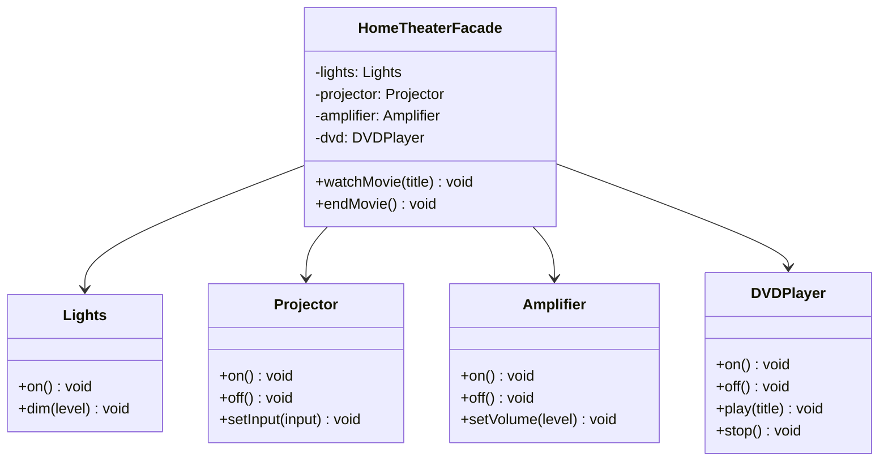

# 外观模式

## 定义

外观模式（Facade）为复杂的子系统提供一个简单的高层接口，让客户端只需通过这个接口就能完成常见操作，而无需了解子系统内部细节。

## 不使用外观存在的问题

"观看电影"需要依次操作多个设备：

``` java title="FacadeBadExample.java"
--8<-- "code/topic/design-patterns/src/main/java/com/example/structural/facade/FacadeBadExample.java"
```

客户端与多个子系统强耦合，任何子系统变化都要修改客户端。

## 设计模式结构说明



外观类聚合所有子系统，暴露 `watchMovie()` / `endMovie()` 两个简单操作，客户端只与外观交互。

## 设计模式举例说明

``` java title="FacadeExample.java"
--8<-- "code/topic/design-patterns/src/main/java/com/example/structural/facade/FacadeExample.java"
```

## 优缺点

**优点：**

- 大幅简化客户端代码，降低客户端与子系统的耦合
- 客户端不需要了解子系统内部细节
- 子系统内部可以自由重构，客户端不受影响

**缺点：**

- 外观类容易成为"上帝类"——如果把所有操作都堆进去，它自身会变得庞大
- 不符合**开闭原则**：新增子系统功能时，外观类也需要修改

## 与其它模式的关系

**相似模式防混淆：**

| 模式 | 意图 | 方向 |
|------|------|------|
| 外观（Facade） | 简化子系统的访问接口 | 客户端 → 子系统（单向） |
| 中介者（Mediator） | 协调多个对象之间的通信 | 双向：各组件 ↔ 中介者 |
| 适配器（Adapter） | 改变接口使其兼容 | 包装一个接口 |

## 应用场景

- 为复杂子系统提供简单入口（如 SDK 门面类）
- 对遗留系统进行封装，向外提供清晰的接口
- Spring：`JdbcTemplate` 封装了 `DataSource`/`Connection`/`Statement`/`ResultSet` 的操作细节
- Spring Boot 的自动配置本质上也是外观思想：`@SpringBootApplication` 一键启动
