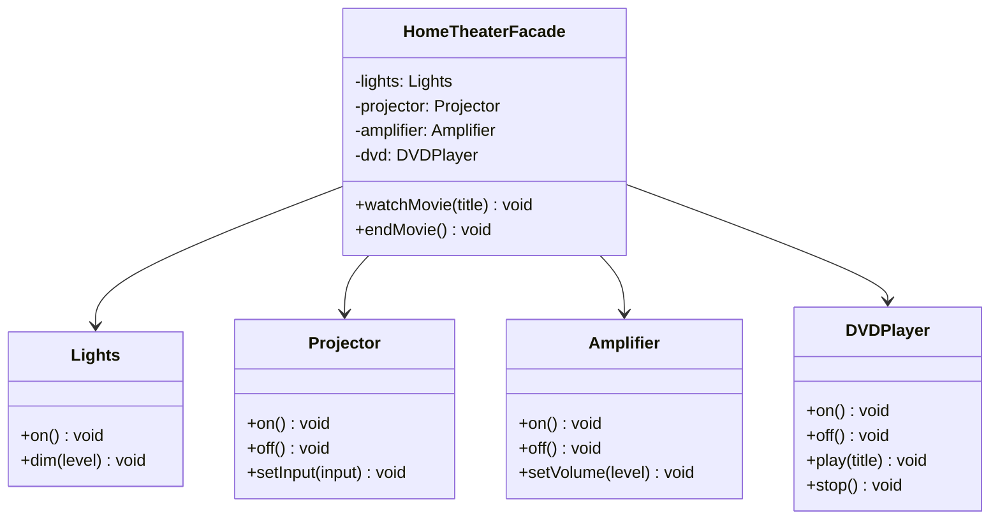

# 外观模式

## 从家庭影院说起

你买了一套家庭影院，有功放、调谐器、DVD 机、投影仪、屏幕、爆米花机……看个电影要做 15 件事：调暗灯光→放下屏幕→打开投影仪→选 DVD 输入→打开功放→设音量→打开 DVD→放片……每次都要按这一串顺序，漏一步就出问题。

这正是复杂子系统暴露太多细节的典型问题。解决方案是创建一个 `HomeTheaterFacade`（外观），把所有步骤封装进 `watchMovie()` 和 `endMovie()` 两个方法。你只需要一行调用，不需要了解任何子系统细节。

## 🔍 定义

外观模式（Facade）为复杂的子系统提供一个简单的高层接口，让客户端只需通过这个接口就能完成常见操作，无需了解子系统内部细节。

> **设计原则：最少知识原则（迪米特法则）—— 只和你的密友交流。**
> 客户端只认识 `HomeTheaterFacade`，不直接接触 `Amplifier`/`DVDPlayer`/`Projector`。

## ⚠️ 不使用外观存在的问题

``` java title="FacadeBadExample.java"
--8<-- "code/topic/design-patterns/src/main/java/com/example/structural/facade/FacadeBadExample.java"
```

## 🏗️ 设计模式结构（家庭影院）



外观类聚合所有子系统，暴露 `watchMovie()` / `endMovie()` 两个简单操作。子系统依然存在，高级用户也可以绕过外观直接使用——外观不锁住任何功能。

## 💻 设计模式举例说明

``` java title="FacadeExample.java"
--8<-- "code/topic/design-patterns/src/main/java/com/example/structural/facade/FacadeExample.java"
```

## ⚖️ 优缺点

**优点：**

- 大幅简化客户端代码，降低与子系统的耦合
- 子系统内部可以自由重构，客户端不受影响

**缺点：**

- 外观类容易成为"上帝类"，所有操作都堆在里面
- 新增子系统功能时，外观类也需要修改

## 🔗 与其它模式的关系

| 模式 | 意图 | 方向 |
|------|------|------|
| 外观（Facade） | 简化子系统访问接口 | 客户端 → 子系统（单向包装） |
| 中介者（Mediator） | 协调多个对象之间的通信 | 双向：各组件 ↔ 中介者 |
| 适配器（Adapter） | 改变接口使其兼容 | 包装一个不兼容的接口 |

## 🗂️ 应用场景

- 为复杂子系统提供简单入口（如 SDK 门面类）
- 对遗留系统封装，向外提供清晰的接口
- Spring：`JdbcTemplate` 封装了 `DataSource`/`Connection`/`Statement`/`ResultSet` 的操作细节

## 工业视角

### 接口粒度困境：细粒度与粗粒度的博弈

在微服务架构中，接口粒度设计面临两难：细粒度接口职责单一、可复用性强，但调用方需要多次调用才能完成一个业务；粗粒度接口使用方便，但定制性强、复用性差，接口数量随调用方需求增多而爆炸式膨胀。

《设计模式之美》给出的基本原则是：**尽量保持接口可复用性（细粒度），同时允许为特定调用方提供冗余的门面接口（粗粒度）**。两者并不冲突——门面层是对细粒度接口的聚合，而非替代。

!!! tip "粒度分层原则"

    - 底层服务：细粒度、职责单一，利于复用
    - 门面层：粗粒度、面向特定场景，利于易用
    - 两层可以同时存在，调用方按需选择

### BFF 模式：门面模式的微服务落地

微服务架构中，前端（App/Web/小程序）往往需要同时聚合多个后端服务的数据，导致网络请求次数过多、响应慢。**BFF（Backend for Frontend）层**正是门面模式的工业级实现：

- 每类客户端对应一个 BFF 服务
- BFF 对内调用多个微服务的细粒度接口，对外暴露面向页面需求的粗粒度接口
- 前端只发起 1 次请求，由 BFF 在内网并行或串行调用多个下游服务

``` java title="BFF 门面聚合示例"
// BFF 层：聚合用户、订单、推荐三个微服务，一次返回首页所需全部数据
public class HomepageFacade {
    private UserService      userService;
    private OrderService     orderService;
    private RecommendService recommendService;

    public HomepageVO getHomepageData(long userId) {
        UserDTO        user    = userService.getUser(userId);          // 细粒度接口 1
        List<OrderDTO> orders  = orderService.getRecentOrders(userId); // 细粒度接口 2
        List<ItemDTO>  items   = recommendService.recommend(userId);   // 细粒度接口 3
        return HomepageVO.assemble(user, orders, items);               // 聚合为单次响应
    }
}
```

### 门面 vs 适配器：意图截然不同

两者都做"封装"，容易混淆，但解决的问题根本不同：

| 模式 | 核心问题 | 接口变化 | 典型场景 |
|------|---------|---------|---------|
| 门面（Facade） | 接口太多、调用繁琐 | 新增高层聚合接口，原接口保留 | BFF、SDK 入口类 |
| 适配器（Adapter） | 接口不兼容、无法直接使用 | 转换旧接口以匹配目标接口 | 对接第三方 SDK、旧系统改造 |

!!! warning "常见设计误区"

    门面不做接口格式转换，只做接口聚合。如果你的"门面"还需要做数据格式转换或协议映射，它实际上同时承担了适配器的职责，应当明确拆分或清晰命名（如 `XxxAdapter`），避免职责混淆。

### 用门面接口替代分布式事务

跨服务操作（如"创建用户 + 创建钱包"）若分别调用两个接口，在分布式环境下很难保证原子性，引入分布式事务框架代价较高。更简单的方案是：**设计一个门面接口将两个 SQL 操作合并到同一个服务方法中**，借助 Spring 的 `@Transactional` 在单次数据库事务中完成。门面接口把两次网络调用变成了一次本地事务，以更低的复杂度解决了一致性问题。
