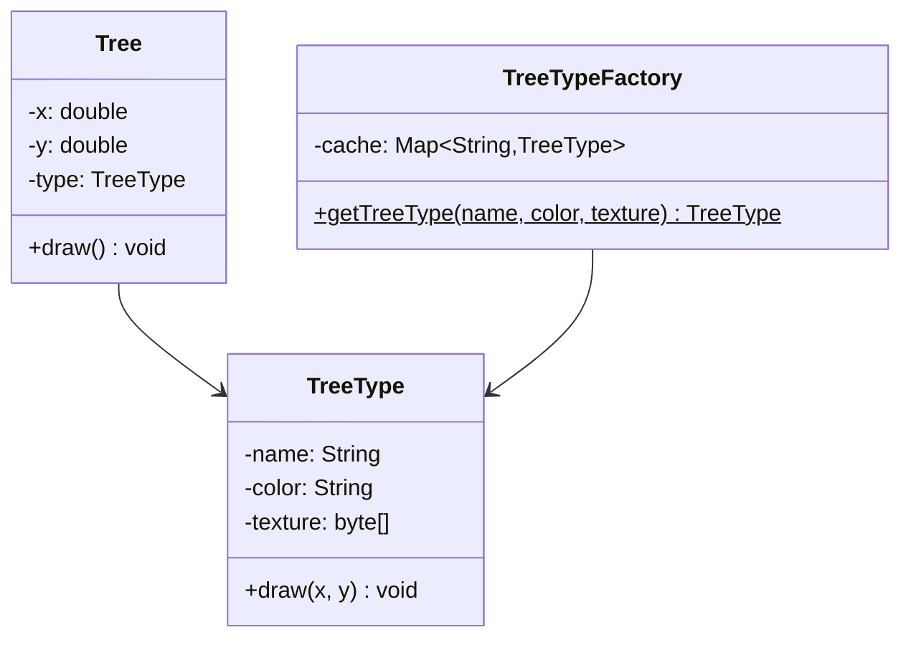

# 享元模式

## 🔍 定义

享元模式（Flyweight）通过共享相同的细粒度对象来减少内存占用。将对象状态分为**内部状态**（可共享、不变）和**外部状态**（每次使用时传入），大量对象共用同一份内部状态对象。

## ⚠️ 不使用享元存在的问题

森林模拟游戏需要渲染 100,000 棵树，每棵树都存储完整数据：

``` java title="FlyweightBadExample.java"
--8<-- "code/topic/design-patterns/src/main/java/com/example/structural/flyweight/FlyweightBadExample.java"
```

## 🏗️ 设计模式结构说明



`TreeType` 存储可共享的内部状态（名称、颜色、纹理），`Tree` 只存储不可共享的外部状态（坐标），通过工厂缓存保证相同类型的 `TreeType` 对象只创建一次。

## 💻 设计模式举例说明

``` java title="FlyweightExample.java"
--8<-- "code/topic/design-patterns/src/main/java/com/example/structural/flyweight/FlyweightExample.java"
```

## ⚖️ 优缺点

**优点：**

- 大幅减少大量相似对象的内存占用
- 如果外部状态合理管理，可以显著提升程序性能

**缺点：**

- 将状态分为内部/外部，增加了代码复杂度
- 外部状态需要由客户端传入，接口稍显繁琐
- 享元对象不能存储外部状态，多线程环境下要注意线程安全

## 🔗 与其它模式的关系

**相似模式防混淆：**

| 模式 | 意图 | 实例数量 |
|------|------|---------|
| 享元（Flyweight） | 共享细粒度对象节省内存 | 多个（按类型缓存） |
| 单例（Singleton） | 保证全局唯一实例 | 恰好 1 个 |

**组合使用：**

享元工厂本身通常用单例管理，享元对象可以是组合树中的叶子节点（如渲染引擎中的字符对象）。

## 🗂️ 应用场景

- 系统中存在大量相似对象，导致内存占用过高
- 对象大部分状态可以外部化（分离为内/外部状态）
- JDK：`Integer.valueOf(-128~127)` 整数缓存池；`String.intern()` 字符串常量池
- 游戏引擎：子弹、粒子、棋子等大量重复对象
