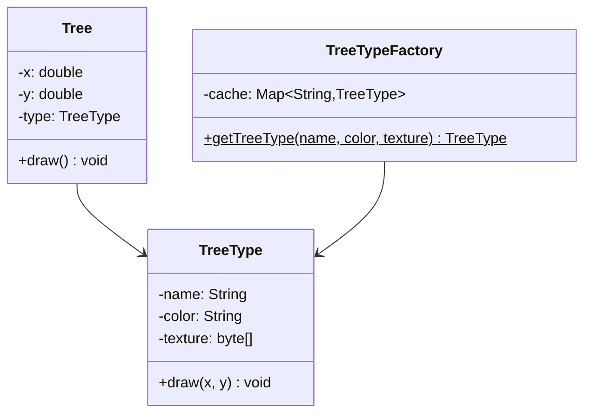

# 享元模式

## 从森林渲染说起

游戏中的森林有 100,000 棵树，每棵树都有自己的位置和生长阶段，但同一树种的 3D 模型、纹理贴图、粒子效果完全相同。如果每棵树都存一份完整数据，100,000 × 10KB ≈ 1GB 内存——帧率直接崩溃。

关键发现：100,000 棵树背后可能只有 10 种树型。享元模式将对象状态拆分为"**内部状态**"（多树共享的模型数据，只存一份）和"**外部状态**"（每棵树独有的坐标和生长阶段，调用时传入）。10 种共享对象 + 100,000 个只含坐标的轻量引用，内存降到可接受范围。

## 🔍 定义

享元模式（Flyweight）通过共享相同的细粒度对象来减少内存占用。将对象状态分为**内部状态**（可共享、不变）和**外部状态**（每次使用时传入），大量对象共用同一份内部状态对象。

## ⚠️ 不使用享元存在的问题

森林模拟游戏需要渲染 100,000 棵树，每棵树都存储完整数据：

``` java title="FlyweightBadExample.java"
--8<-- "code/topic/design-patterns/src/main/java/com/example/structural/flyweight/FlyweightBadExample.java"
```

## 🏗️ 设计模式结构说明



`TreeType` 存储可共享的内部状态（名称、颜色、纹理），`Tree` 只存储不可共享的外部状态（坐标），通过工厂缓存保证相同类型的 `TreeType` 对象只创建一次。

## 💻 设计模式举例说明

``` java title="FlyweightExample.java"
--8<-- "code/topic/design-patterns/src/main/java/com/example/structural/flyweight/FlyweightExample.java"
```

## ⚖️ 优缺点

**优点：**

- 大幅减少大量相似对象的内存占用
- 如果外部状态合理管理，可以显著提升程序性能

**缺点：**

- 将状态分为内部/外部，增加了代码复杂度
- 外部状态需要由客户端传入，接口稍显繁琐
- 享元对象不能存储外部状态，多线程环境下要注意线程安全

## 🔗 与其它模式的关系

**相似模式防混淆：**

| 模式 | 意图 | 实例数量 |
|------|------|---------|
| 享元（Flyweight） | 共享细粒度对象节省内存 | 多个（按类型缓存） |
| 单例（Singleton） | 保证全局唯一实例 | 恰好 1 个 |

**组合使用：**

享元工厂本身通常用单例管理，享元对象可以是组合树中的叶子节点（如渲染引擎中的字符对象）。

## 🗂️ 应用场景

- 系统中存在大量相似对象，导致内存占用过高
- 对象大部分状态可以外部化（分离为内/外部状态）
- JDK：`Integer.valueOf(-128~127)` 整数缓存池；`String.intern()` 字符串常量池
- 游戏引擎：子弹、粒子、棋子等大量重复对象

## 🏭 工业视角

### 内部状态 vs 外部状态：享元模式的核心设计决策

享元模式的难点不在于实现，而在于**如何正确拆分内部状态与外部状态**：

| 维度 | 内部状态（Intrinsic State） | 外部状态（Extrinsic State） |
|------|--------------------------|--------------------------|
| 变化性 | 不变，创建后固定 | 随使用上下文变化 |
| 共享性 | 可被多处同时共享 | 不能共享，由调用方持有或传参 |
| 典型例子 | 棋子类型/颜色、字符格式 | 棋子坐标、字符在文档中的位置 |

!!! warning "拆分不当的严重后果"

    若把会变化的字段（如坐标）放入享元对象内部，共享的对象就会被某一调用方修改，影响所有使用它的地方——这是典型的共享状态污染 Bug，在多线程环境下尤为危险。享元对象应设计为**不可变对象**（不暴露任何 setter 方法）。

### Java 标准库中的享元：Integer Cache 与 String 常量池

JDK 内置了两个经典的享元实现，理解它们有助于避免日常开发中的对比陷阱：

``` java title="Integer.valueOf 的享元缓存（-128 ~ 127）"
// Integer.valueOf 源码（简化）
public static Integer valueOf(int i) {
    if (i >= IntegerCache.low && i <= IntegerCache.high) {
        return IntegerCache.cache[i + (-IntegerCache.low)]; // 命中缓存，返回共享对象
    }
    return new Integer(i); // 超出范围，创建新对象
}

Integer i1 = 56;   // 自动装箱 → valueOf(56)  → 命中缓存
Integer i2 = 56;
System.out.println(i1 == i2);  // true  ← 同一个缓存对象（享元效果）

Integer i3 = 129;  // valueOf(129) → 超出范围 → new Integer(129)
Integer i4 = 129;
System.out.println(i3 == i4);  // false ← 两个不同对象
```

!!! tip "实际开发注意事项"

    - `Integer` 比较**永远用 `.equals()`**，不要用 `==`，`-128~127` 的 `==` 看似正确只是享元的副作用
    - `Long`、`Short`、`Byte` 同样有对应范围的缓存；`Double`、`Float` 没有缓存
    - `String.intern()` 将字符串放入常量池并返回池中引用；与 `IntegerCache` 的区别是**按需缓存**（用到才加入），而非启动时预先全量创建

### 享元 vs 单例 vs 对象池：三种"复用"的本质区别

三者代码形态相似，但设计意图截然不同：

| 模式 | 解决的问题 | 实例数量 | 使用方式 |
|------|---------|---------|---------|
| 享元（Flyweight） | 节省**内存空间** | 多个（按 key 缓存） | 所有调用方**同时共享**同一对象（对象不可变） |
| 单例（Singleton） | 全局唯一实例 | 恰好 1 个 | 全局共享 |
| 对象池（Pool） | 节省**对象创建时间** | 动态扩缩 | **独占使用**，用完归还后才可被他人取走 |

享元与对象池的关键区别：享元对象在整个生命周期内被所有使用者**同时**共享（因此必须不可变）；对象池中的对象同一时刻只被**一个**使用者独占，使用完毕归还后才能被下一个使用者取走。
