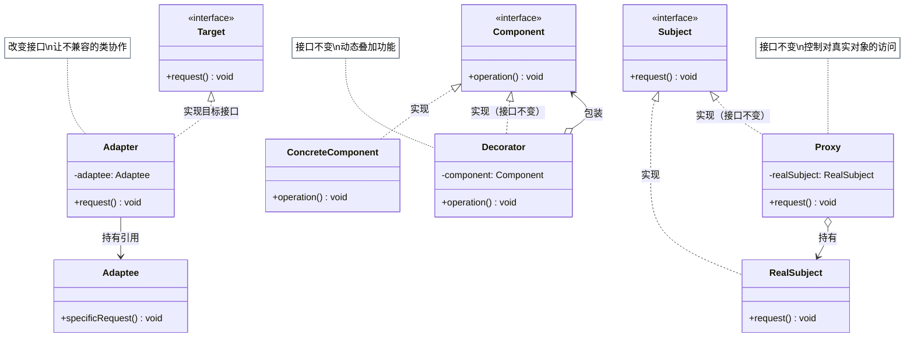
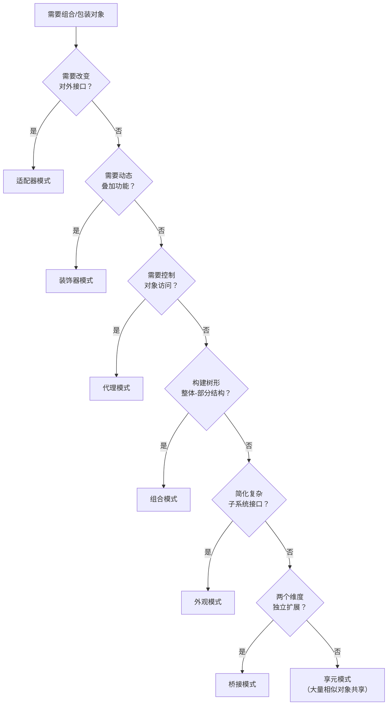

# 结构型模式

结构型模式关注**如何将类和对象组合成更大的结构**，同时保持结构的灵活性和高效性。

GoF 定义了 7 种结构型模式，每种模式都有独立的详细笔记：

| 模式 | 一句话总结 | 核心手段 |
|------|-----------|---------|
| [外观（Facade）](facade/index.md) | 为复杂子系统提供简单接口 | 聚合子系统，暴露高层接口 |
| [适配器（Adapter）](adapter/index.md) | 让不兼容的接口协同工作 | 包装不兼容类，实现目标接口 |
| [代理（Proxy）](proxy/index.md) | 控制对目标对象的访问 | 实现相同接口 + 持有真实对象 |
| [装饰器（Decorator）](decorator/index.md) | 运行时动态添加功能 | 实现相同接口 + 持有被装饰对象 |
| [桥接（Bridge）](bridge/index.md) | 抽象与实现分离，独立扩展 | 组合代替继承，两维度各自扩展 |
| [组合（Composite）](composite/index.md) | 用树形结构表示整体-部分关系 | 叶子和容器统一接口 |
| [享元（Flyweight）](flyweight/index.md) | 共享细粒度对象减少内存占用 | 分离内/外部状态，工厂缓存共享对象 |

## 易混淆模式快速区分

适配器、装饰器、代理三者都是"包装"对象，区别在意图：

| 模式 | 接口变化？ | 主要意图 |
|------|----------|---------|
| 适配器 | ✅ 改变接口 | 兼容不兼容的接口 |
| 装饰器 | ❌ 接口不变 | 动态增强功能 |
| 代理 | ❌ 接口不变 | 控制/延迟访问 |

三者的结构差异一图对比：

## 模式选型参考

