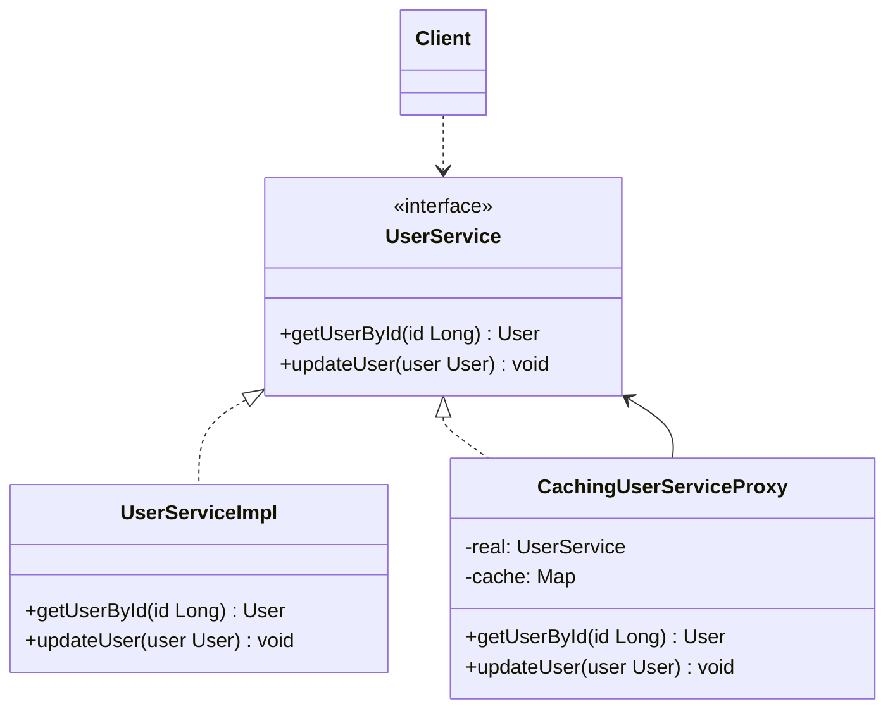

# 代理模式

## 从糖果机远程监控说起

公司在全国各地部署了上千台糖果机（`GumballMachine`），CEO 想在办公室的监视器上看到每台机器当前状态——剩余糖果数量、所在位置、当前状态。

问题是：`GumballMachine` 运行在不同的 JVM 进程（远程机器）上，你不能直接调用它的方法。

解决方案是创建一个**远程代理**：本地的 `GumballMachineProxy` 实现和 `GumballMachine` 相同的接口，当你调用 `proxy.getCount()` 时，它透明地通过网络转发给真正的机器，拿回结果。监视器（客户端）完全感知不到这个调用穿越了网络。

这是代理模式的第一个经典变体——**远程代理**。书中还介绍了**虚拟代理**（延迟创建开销大的对象）和**保护代理**（控制访问权限），三者结构相同，意图不同。

## 🔍 定义

代理模式（Proxy）为其他对象提供一种代理，以控制对这个对象的访问。代理与真实对象实现相同接口，对调用方完全透明。

| 代理类型 | 意图 | 典型场景 |
|---------|------|---------|
| 远程代理（Remote Proxy） | 控制对远程对象的访问 | RPC、RMI、REST 客户端包装 |
| 虚拟代理（Virtual Proxy） | 延迟创建开销大的对象 | 图片懒加载、Hibernate 懒加载 |
| 保护代理（Protection Proxy） | 控制访问权限 | Spring Security、权限拦截 |
| 缓存代理（Cache Proxy） | 缓存远程/开销大的结果 | Spring `@Cacheable` |

## ⚠️ 不使用代理存在的问题

直接使用 `UserService` 时，每次都需要手动处理访问控制、日志记录和缓存：

``` java title="ProxyBadExample.java"
--8<-- "code/topic/design-patterns/src/main/java/com/example/structural/proxy/ProxyBadExample.java"
```

## 🏗️ 设计模式结构说明



代理（`CachingUserServiceProxy`）与真实对象实现相同接口，客户端只依赖接口，无感知地通过代理访问真实对象。

## 💻 设计模式举例说明

``` java title="ProxyExample.java"
--8<-- "code/topic/design-patterns/src/main/java/com/example/structural/proxy/ProxyExample.java"
```

## 🔄 三种常见代理类型

| 类型 | 创建时机 | 是否需要接口 | 核心 API |
|------|---------|------------|---------|
| 静态代理 | 编译期手动编写 | ✅ 需要 | 手动实现接口 |
| JDK 动态代理 | 运行时自动生成 | ✅ 需要 | `Proxy.newProxyInstance()` + `InvocationHandler` |
| CGLIB 动态代理 | 运行时通过字节码生成子类 | ❌ 不需要 | `Enhancer` + `MethodInterceptor` |

### 静态代理

代理类在**编译期**就已手动编写完成。优点是实现简单、直观；缺点是每新增一个接口方法，代理类也要同步修改，接口越多代理类越多。

``` java title="StaticProxyExample.java"
--8<-- "code/topic/design-patterns/src/main/java/com/example/structural/proxy/static_proxy/StaticProxyExample.java"
```

### JDK 动态代理

利用 `java.lang.reflect.Proxy` 在**运行时**自动生成代理类，无需为每个接口单独编写代理。所有方法调用都汇聚到 `InvocationHandler.invoke()` 统一拦截处理，一个 `InvocationHandler` 可复用于任意接口。

**限制**：被代理对象必须实现接口（代理类是接口的实现类，不是目标类的子类）。

``` java title="JdkDynamicProxyExample.java"
--8<-- "code/topic/design-patterns/src/main/java/com/example/structural/proxy/jdk_proxy/JdkDynamicProxyExample.java"
```

### CGLIB 动态代理

CGLIB 通过字节码工具在**运行时**生成目标类的**子类**作为代理，无需目标类实现接口。Spring AOP 在目标类没有接口时默认使用此方式（`@Transactional`、`@Cacheable` 等本质上都是 CGLIB 代理）。

**限制**：无法代理 `final` 类或 `final` 方法（子类无法覆写）。Java 17+ 运行需要 `--add-opens` JVM 参数；Spring Boot 项目无需手动配置，框架已处理。

``` java title="CglibProxyExample.java"
--8<-- "code/topic/design-patterns/src/main/java/com/example/structural/proxy/cglib_proxy/CglibProxyExample.java"
```

## ⚖️ 优缺点

**优点：**

- 在不修改真实对象的前提下，透明地添加访问控制、缓存、日志等横切逻辑
- 符合**开闭原则**：新增横切逻辑只需新增代理类
- 支持延迟初始化（虚拟代理）

**缺点：**

- 每个接口需要一个代理类（静态代理），代码量增多
- 动态代理增加了一定的反射开销

## 🔗 与其它模式的关系

**相似模式防混淆：**

| 模式 | 接口变化？ | 对象生命周期 | 主要意图 |
|------|----------|------------|---------|
| 代理（Proxy） | ❌ 不变 | 代理通常自行创建/管理真实对象 | 控制访问 |
| 装饰器（Decorator） | ❌ 不变 | 被装饰对象由客户端传入 | 动态增强功能 |
| 适配器（Adapter） | ✅ 改变 | — | 兼容接口 |

## 🗂️ 应用场景

- 访问控制（保护代理）：调用前检查权限
- 延迟加载（虚拟代理）：大对象只在首次访问时才真正创建
- 缓存（缓存代理）：对频繁访问的结果进行缓存
- Spring AOP：`@Transactional`、`@Cacheable`、`@Async` 底层都是动态代理
- MyBatis：Mapper 接口没有实现类，调用时是 JDK 动态代理执行 SQL

## 🏭 工业视角

### 从"业务代码被污染"到动态代理的演进

王争在《设计模式之美》中用一个性能计数器（`MetricsCollector`）的例子清晰地展现了代理模式的动机：当监控、日志等非业务代码直接写在 `UserController` 里时，业务类的职责就被污染了，替换框架的成本也极高。

静态代理虽然能解耦，但有一个致命缺陷——**接口有多少方法，代理类就要重写多少方法**，50 个原始类就要写 50 个代理类。动态代理正是为消除这种模板式重复而生的：

``` java title="JDK 动态代理：一个 Handler 代理所有接口"
public class MetricsCollectorProxy {
    private MetricsCollector metricsCollector = new MetricsCollector();

    public Object createProxy(Object proxiedObject) {
        Class<?>[] interfaces = proxiedObject.getClass().getInterfaces();
        return Proxy.newProxyInstance(
            proxiedObject.getClass().getClassLoader(),
            interfaces,
            (proxy, method, args) -> {
                long start = System.currentTimeMillis();
                Object result = method.invoke(proxiedObject, args);
                long cost = System.currentTimeMillis() - start;
                metricsCollector.recordRequest(
                    new RequestInfo(method.getName(), cost, start));
                return result;
            });
    }
}
```

!!! tip "JDK 代理 vs CGLIB 代理的选择依据"

    JDK 动态代理要求目标类实现接口，代理对象是接口的实现类。CGLIB 通过字节码生成目标类的子类，无需接口，但无法代理 `final` 类/方法。Spring AOP 的默认策略是：有接口用 JDK 代理，无接口用 CGLIB。Spring Boot 2.x 起默认对所有 Bean 使用 CGLIB，可通过 `spring.aop.proxy-target-class=false` 切回 JDK 代理。

### 代理的本质：附加"与业务无关"的横切逻辑

理解代理模式的关键在于区分它和装饰器模式的**意图差异**：

| 模式 | 附加的逻辑与原始类的关系 | 典型场景 |
|------|----------------------|---------|
| 代理（Proxy） | **无关**——监控、鉴权、限流、事务，这些与业务逻辑本身无关 | Spring AOP、RPC stub |
| 装饰器（Decorator） | **相关**——对原有功能的增强，如 `BufferedInputStream` 增强 `read()` | Java IO、功能叠加 |

!!! warning "代理 ≠ 装饰器，虽然结构几乎相同"

    两者代码结构高度相似（都持有同接口的对象引用），但**意图截然不同**。代理关注"访问控制"，被代理对象通常由代理自己创建/管理；装饰器关注"功能增强"，被装饰对象由调用方传入。Spring AOP 的 `@Transactional` 是代理（事务与业务无关）；Java IO 的 `BufferedInputStream` 是装饰器（缓冲是对读取功能的增强）。
