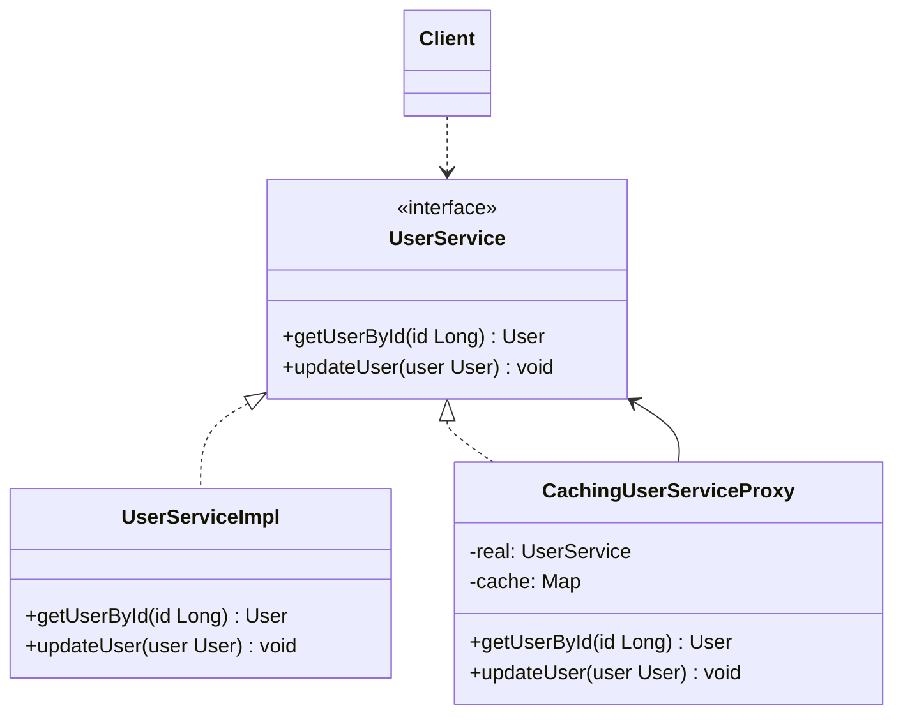

# 代理模式

## 🔍 定义

代理模式（Proxy）为其他对象提供一种代理，以控制对这个对象的访问。代理与真实对象实现相同接口，对调用方完全透明。

## ⚠️ 不使用代理存在的问题

直接使用 `UserService` 时，每次都需要手动处理访问控制、日志记录和缓存：

``` java title="ProxyBadExample.java"
--8<-- "code/topic/design-patterns/src/main/java/com/example/structural/proxy/ProxyBadExample.java"
```

## 🏗️ 设计模式结构说明



代理（`CachingUserServiceProxy`）与真实对象实现相同接口，客户端只依赖接口，无感知地通过代理访问真实对象。

## 💻 设计模式举例说明

``` java title="ProxyExample.java"
--8<-- "code/topic/design-patterns/src/main/java/com/example/structural/proxy/ProxyExample.java"
```

## 🔄 三种常见代理类型

| 类型 | 创建时机 | 是否需要接口 | 核心 API |
|------|---------|------------|---------|
| 静态代理 | 编译期手动编写 | ✅ 需要 | 手动实现接口 |
| JDK 动态代理 | 运行时自动生成 | ✅ 需要 | `Proxy.newProxyInstance()` + `InvocationHandler` |
| CGLIB 动态代理 | 运行时通过字节码生成子类 | ❌ 不需要 | `Enhancer` + `MethodInterceptor` |

### 静态代理

代理类在**编译期**就已手动编写完成。优点是实现简单、直观；缺点是每新增一个接口方法，代理类也要同步修改，接口越多代理类越多。

``` java title="StaticProxyExample.java"
--8<-- "code/topic/design-patterns/src/main/java/com/example/structural/proxy/static_proxy/StaticProxyExample.java"
```

### JDK 动态代理

利用 `java.lang.reflect.Proxy` 在**运行时**自动生成代理类，无需为每个接口单独编写代理。所有方法调用都汇聚到 `InvocationHandler.invoke()` 统一拦截处理，一个 `InvocationHandler` 可复用于任意接口。

**限制**：被代理对象必须实现接口（代理类是接口的实现类，不是目标类的子类）。

``` java title="JdkDynamicProxyExample.java"
--8<-- "code/topic/design-patterns/src/main/java/com/example/structural/proxy/jdk_proxy/JdkDynamicProxyExample.java"
```

### CGLIB 动态代理

CGLIB 通过字节码工具在**运行时**生成目标类的**子类**作为代理，无需目标类实现接口。Spring AOP 在目标类没有接口时默认使用此方式（`@Transactional`、`@Cacheable` 等本质上都是 CGLIB 代理）。

**限制**：无法代理 `final` 类或 `final` 方法（子类无法覆写）。Java 17+ 运行需要 `--add-opens` JVM 参数；Spring Boot 项目无需手动配置，框架已处理。

``` java title="CglibProxyExample.java"
--8<-- "code/topic/design-patterns/src/main/java/com/example/structural/proxy/cglib_proxy/CglibProxyExample.java"
```

## ⚖️ 优缺点

**优点：**

- 在不修改真实对象的前提下，透明地添加访问控制、缓存、日志等横切逻辑
- 符合**开闭原则**：新增横切逻辑只需新增代理类
- 支持延迟初始化（虚拟代理）

**缺点：**

- 每个接口需要一个代理类（静态代理），代码量增多
- 动态代理增加了一定的反射开销

## 🔗 与其它模式的关系

**相似模式防混淆：**

| 模式 | 接口变化？ | 对象生命周期 | 主要意图 |
|------|----------|------------|---------|
| 代理（Proxy） | ❌ 不变 | 代理通常自行创建/管理真实对象 | 控制访问 |
| 装饰器（Decorator） | ❌ 不变 | 被装饰对象由客户端传入 | 动态增强功能 |
| 适配器（Adapter） | ✅ 改变 | — | 兼容接口 |

## 🗂️ 应用场景

- 访问控制（保护代理）：调用前检查权限
- 延迟加载（虚拟代理）：大对象只在首次访问时才真正创建
- 缓存（缓存代理）：对频繁访问的结果进行缓存
- Spring AOP：`@Transactional`、`@Cacheable`、`@Async` 底层都是动态代理
- MyBatis：Mapper 接口没有实现类，调用时是 JDK 动态代理执行 SQL
