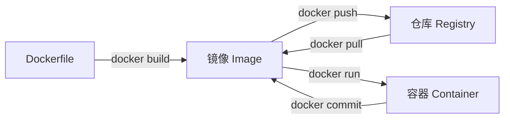

# Docker 基础

## 核心概念

Docker 的核心概念围绕三个对象展开：**镜像（Image）**、**容器（Container）**、**仓库（Registry）**。



### 镜像（Image）

镜像是一个**只读**的模板，包含运行应用所需的代码、运行时、库、环境变量和配置文件。镜像采用**分层存储**结构，每一层只记录相对于上一层的差异，多个镜像可共享相同的底层。

### 容器（Container）

容器是镜像的**运行实例**。可以把镜像看作类，容器看作对象。容器在镜像的只读层之上增加一个**可写层**，容器内的所有写操作都发生在这一层。容器停止后，写层的数据会保留；容器删除后，写层数据随之消失（除非使用 Volume）。

### 仓库（Registry）

仓库用于**存储和分发镜像**。官方公共仓库为 [Docker Hub](https://hub.docker.com)，企业可自建私有仓库（如 Harbor）。

---

## 安装与配置

=== "Windows"

    1. 下载并安装 [Docker Desktop for Windows](https://www.docker.com/products/docker-desktop/)
    2. 确保已开启 WSL 2 或 Hyper-V
    3. 安装完成后在终端验证：

    ``` powershell
    docker version
    docker info
    ```

=== "Linux (Ubuntu)"

    ``` bash title="安装 Docker Engine"
    # 卸载旧版本
    sudo apt-get remove docker docker-engine docker.io containerd runc

    # 安装依赖
    sudo apt-get update
    sudo apt-get install -y ca-certificates curl gnupg lsb-release

    # 添加 GPG 密钥
    sudo mkdir -p /etc/apt/keyrings
    curl -fsSL https://download.docker.com/linux/ubuntu/gpg | \
      sudo gpg --dearmor -o /etc/apt/keyrings/docker.gpg

    # 添加软件源
    echo "deb [arch=$(dpkg --print-architecture) signed-by=/etc/apt/keyrings/docker.gpg] \
      https://download.docker.com/linux/ubuntu $(lsb_release -cs) stable" | \
      sudo tee /etc/apt/sources.list.d/docker.list > /dev/null

    # 安装 Docker Engine
    sudo apt-get update
    sudo apt-get install -y docker-ce docker-ce-cli containerd.io docker-compose-plugin

    # 将当前用户加入 docker 组（免 sudo）
    sudo usermod -aG docker $USER
    ```

### 配置镜像加速

在 Docker Desktop（Windows/Mac）的 Settings → Docker Engine 中，或在 Linux 的 `/etc/docker/daemon.json` 中添加：

``` json title="/etc/docker/daemon.json"
{
  "registry-mirrors": [
    "https://mirror.ccs.tencentyun.com",
    "https://registry.docker-cn.com"
  ]
}
```

修改后重启 Docker 服务：

``` bash
sudo systemctl daemon-reload
sudo systemctl restart docker
```

---

## 镜像操作

### 搜索与拉取

``` bash
# 搜索镜像
docker search nginx

# 拉取最新版本
docker pull nginx

# 拉取指定标签版本
docker pull nginx:1.25-alpine

# 拉取后查看本地镜像列表
docker images
# 或
docker image ls
```

### 查看与删除

``` bash
# 查看镜像详情
docker image inspect nginx

# 查看镜像分层历史
docker history nginx

# 删除镜像
docker rmi nginx:latest
# 或
docker image rm nginx:latest

# 删除所有未使用的镜像（悬空镜像）
docker image prune

# 删除所有未被容器引用的镜像
docker image prune -a
```

### 导入与导出

``` bash
# 将镜像导出为 tar 文件（用于离线传输）
docker save -o myapp.tar myapp:1.0

# 从 tar 文件载入镜像
docker load -i myapp.tar
```

---

## 容器操作

### 运行容器

`docker run` 是最核心的命令，常用参数如下：

| 参数 | 说明 | 示例 |
|------|------|------|
| `-d` | 后台运行（detached 模式） | `docker run -d nginx` |
| `-p 宿主:容器` | 端口映射 | `-p 8080:80` |
| `-v 宿主:容器` | 挂载目录/卷 | `-v /data:/app/data` |
| `--name` | 指定容器名称 | `--name myapp` |
| `-e KEY=VAL` | 设置环境变量 | `-e SPRING_PROFILES_ACTIVE=prod` |
| `--rm` | 容器退出后自动删除 | `docker run --rm alpine echo hi` |
| `-it` | 交互式终端 | `docker run -it ubuntu bash` |
| `--network` | 指定网络 | `--network mynet` |
| `--restart` | 重启策略 | `--restart=always` |

``` bash
# 示例：后台运行 Nginx，将宿主 8080 映射到容器 80
docker run -d --name nginx-demo -p 8080:80 nginx

# 示例：交互式进入 Ubuntu
docker run -it --rm ubuntu bash

# 示例：运行 MySQL，挂载数据目录
docker run -d \
  --name mysql-demo \
  -e MYSQL_ROOT_PASSWORD=secret \
  -e MYSQL_DATABASE=mydb \
  -v mysql-data:/var/lib/mysql \
  -p 3306:3306 \
  mysql:8.0
```

### 生命周期管理

``` bash
# 查看运行中的容器
docker ps

# 查看所有容器（含已停止）
docker ps -a

# 启动 / 停止 / 重启
docker start   myapp
docker stop    myapp
docker restart myapp

# 强制杀死容器进程
docker kill myapp

# 删除已停止的容器
docker rm myapp

# 删除所有已停止的容器
docker container prune
```

### 进入与调试

``` bash
# 进入运行中的容器（推荐）
docker exec -it myapp bash
# 若容器内无 bash，改用 sh
docker exec -it myapp sh

# 查看容器日志
docker logs myapp

# 实时跟踪日志
docker logs -f myapp

# 查看容器资源占用
docker stats myapp

# 查看容器详情（IP、挂载、环境变量等）
docker inspect myapp

# 从宿主机复制文件到容器
docker cp ./config.yml myapp:/app/config.yml

# 从容器复制文件到宿主机
docker cp myapp:/app/logs ./logs
```

---

## 数据持久化

容器内的文件在容器删除后会丢失，Docker 提供两种持久化机制：

### Volume（推荐）

Volume 由 Docker 管理，默认存储在 `/var/lib/docker/volumes/` 下。

``` bash
# 创建具名卷
docker volume create mydata

# 使用具名卷
docker run -d -v mydata:/app/data myapp

# 查看所有卷
docker volume ls

# 查看卷详情
docker volume inspect mydata

# 删除未使用的卷
docker volume prune
```

### Bind Mount（绑定挂载）

将宿主机的指定目录挂载到容器中，适合开发时热更新。

``` bash
# 挂载宿主机当前目录到容器的 /app
docker run -d -v "$(pwd)":/app myapp

# Windows PowerShell 下
docker run -d -v "${PWD}:/app" myapp
```

???+ warning "bind mount 注意事项"
    - 宿主机路径必须使用**绝对路径**
    - 挂载后容器内该路径的原有文件会被宿主机内容**覆盖**
    - 生产环境推荐使用 Volume，开发环境可使用 bind mount

---

## 网络

### 网络模式

| 模式 | 说明 |
|------|------|
| `bridge`（默认） | 每个容器分配独立 IP，通过虚拟网桥通信 |
| `host` | 容器直接使用宿主机网络，无端口隔离 |
| `none` | 禁用网络 |
| 自定义 bridge | 同网络内容器可通过容器名互访（推荐） |

``` bash
# 创建自定义网络
docker network create mynet

# 查看网络列表
docker network ls

# 将容器加入网络
docker run -d --name app1 --network mynet myapp
docker run -d --name db   --network mynet mysql:8.0

# 同网络容器可通过容器名通信，如 app1 可访问 db:3306
docker exec -it app1 ping db
```

---

## Dockerfile

Dockerfile 是构建镜像的脚本文件，每条指令创建一个镜像层。

### 常用指令

| 指令 | 说明 |
|------|------|
| `FROM` | 指定基础镜像（必须是第一条指令） |
| `LABEL` | 为镜像添加元数据 |
| `RUN` | 在构建时执行命令，结果提交为新层 |
| `COPY` | 从构建上下文复制文件/目录到镜像 |
| `ADD` | 类似 COPY，额外支持 URL 和解压 tar |
| `WORKDIR` | 设置工作目录（后续指令的相对路径基准） |
| `ENV` | 设置环境变量 |
| `ARG` | 定义构建参数（仅构建时可见） |
| `EXPOSE` | 声明容器监听的端口（仅文档作用） |
| `VOLUME` | 声明匿名卷挂载点 |
| `USER` | 切换运行用户 |
| `ENTRYPOINT` | 设置容器启动时执行的命令（不易被覆盖） |
| `CMD` | 容器默认执行命令（可被 `docker run` 覆盖） |
| `HEALTHCHECK` | 定义容器健康检查 |

### Spring Boot 应用示例

``` dockerfile title="Dockerfile"
# 第一阶段：构建
FROM eclipse-temurin:17-jdk-alpine AS builder
WORKDIR /app
COPY pom.xml .
COPY src ./src
# 安装 Maven 并打包（跳过测试）
RUN apk add --no-cache maven && mvn clean package -DskipTests

# 第二阶段：运行（多阶段构建，减小最终镜像体积）
FROM eclipse-temurin:17-jre-alpine
LABEL maintainer="luguosong"
WORKDIR /app

# 创建非 root 用户，提升安全性
RUN addgroup -S appgroup && adduser -S appuser -G appgroup
USER appuser

# 只复制 jar 包
COPY --from=builder /app/target/*.jar app.jar

# 声明端口（仅文档作用，需配合 -p 使用）
EXPOSE 8080

# 健康检查
HEALTHCHECK --interval=30s --timeout=5s --start-period=60s --retries=3 \
  CMD wget -qO- http://localhost:8080/actuator/health || exit 1

ENTRYPOINT ["java", "-jar", "app.jar"]
```

### 构建与推送

``` bash
# 在 Dockerfile 所在目录构建，指定镜像名和标签
docker build -t myapp:1.0 .

# 构建时传入 ARG 参数
docker build --build-arg APP_ENV=prod -t myapp:1.0 .

# 给已有镜像打新标签
docker tag myapp:1.0 registry.example.com/myorg/myapp:1.0

# 登录私有仓库
docker login registry.example.com

# 推送到仓库
docker push registry.example.com/myorg/myapp:1.0
```

### .dockerignore

类似 `.gitignore`，排除构建上下文中不需要的文件，减少构建时的传输量：

``` text title=".dockerignore"
# 排除构建产物
target/
*.class

# 排除版本控制
.git/
.gitignore

# 排除 IDE 配置
.idea/
*.iml

# 排除日志
*.log
logs/
```

---

## 常用实践

### 清理系统

``` bash
# 一键清理：停止的容器、悬空镜像、未使用的网络
docker system prune

# 同时清理未使用的卷（谨慎使用）
docker system prune --volumes

# 查看 Docker 磁盘占用
docker system df
```

### 查看资源占用

``` bash
# 实时查看所有容器资源占用
docker stats

# 查看指定容器
docker stats myapp
```
