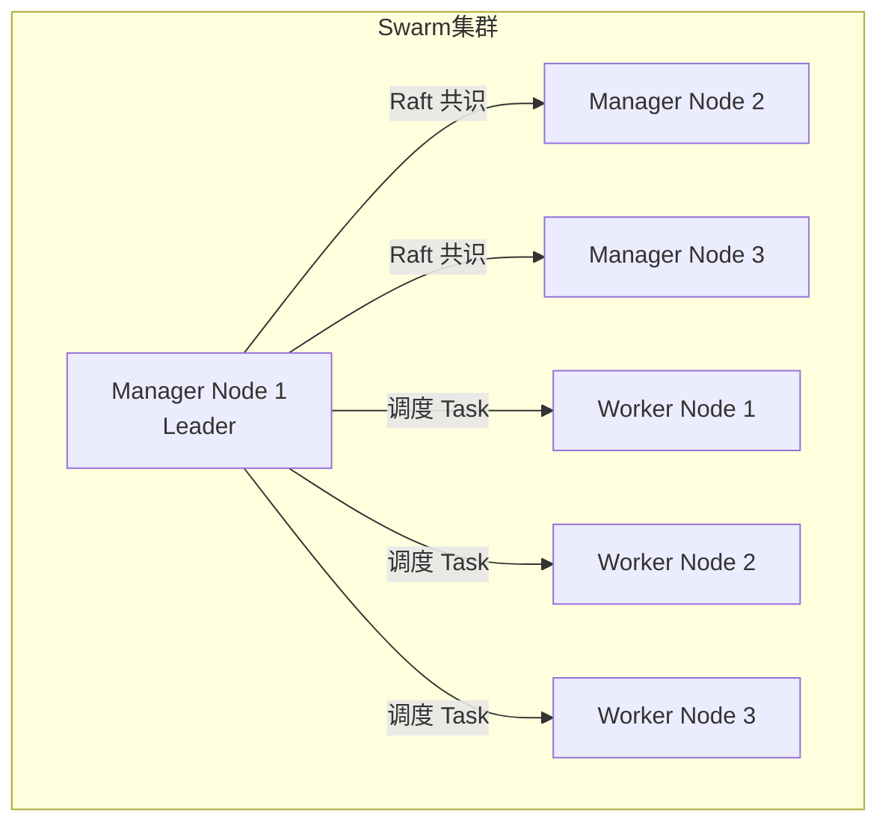

# Docker Swarm

## 📖 概述

Docker Swarm 是 Docker 官方内置的容器编排工具，将多台 Docker 主机组成一个`集群（Swarm）`，以`服务（Service）`为单位统一管理和调度容器，提供高可用、负载均衡与滚动更新能力。

???+ tip "Swarm vs Kubernetes"
    Swarm 配置简单、与 Docker 原生集成；Kubernetes 功能更全、生态更大。小规模项目或已有 Docker Compose 经验的团队可优先考虑 Swarm。

---

## 🧩 核心概念

| 概念 | 说明 |
|------|------|
| `Node（节点）` | 集群中的一台 Docker 主机，分为 Manager 和 Worker |
| `Manager Node` | 负责集群管理、调度和 Raft 共识，可同时运行工作负载 |
| `Worker Node` | 只负责运行容器，不参与调度决策 |
| `Service（服务）` | 定义要运行的镜像、副本数、端口映射等，是 Swarm 的部署单位 |
| `Task（任务）` | Service 的最小调度单元，对应一个容器实例 |
| `Stack（栈）` | 多个 Service 的组合，通过 `docker stack deploy` 部署 Compose 文件 |
| `Overlay Network` | 跨节点的虚拟网络，Service 间通信的基础 |



---

## 🚀 初始化集群

### 创建 Swarm

在第一台主机（将成为 Manager Leader）上执行：

``` bash
# 初始化 Swarm，指定本机 IP（用于跨主机通信）
docker swarm init --advertise-addr 192.168.1.10

# 输出示例：
# Swarm initialized: current node (xxx) is now a manager.
# To add a worker to this swarm, run the following command:
#     docker swarm join --token SWMTKN-1-xxx... 192.168.1.10:2377
```

### 添加节点

``` bash
# 在 Manager 上获取 Worker 加入令牌
docker swarm join-token worker

# 在 Manager 上获取 Manager 加入令牌
docker swarm join-token manager

# 在 Worker 主机上执行加入命令
docker swarm join --token SWMTKN-1-xxx... 192.168.1.10:2377
```

### 查看集群状态

``` bash
# 查看所有节点
docker node ls

# 查看节点详情
docker node inspect --pretty node-id

# 将节点提升为 Manager
docker node promote worker-node

# 将节点降级为 Worker
docker node demote manager-node

# 从集群中移除节点（先在该节点上执行 leave）
docker swarm leave          # 在要离开的节点上执行
docker node rm node-id      # 在 Manager 上清理节点记录
```

---

## 📋 Service 管理

### 创建服务

``` bash
# 创建一个 Nginx 服务，3 个副本，映射 80 端口
docker service create \
  --name web \
  --replicas 3 \
  --publish published=80,target=80 \
  nginx:1.25-alpine

# 创建服务时绑定到 overlay 网络
docker service create \
  --name api \
  --replicas 2 \
  --network my-overlay \
  --env SPRING_PROFILES_ACTIVE=prod \
  myapp:1.0
```

### 查看与更新

``` bash
# 查看所有服务
docker service ls

# 查看服务详情（副本状态）
docker service ps web

# 查看服务日志（所有副本聚合）
docker service logs web
docker service logs -f web   # 实时跟踪

# 扩缩容
docker service scale web=5

# 滚动更新镜像（默认逐个替换）
docker service update --image nginx:1.26-alpine web

# 回滚到上一个版本
docker service rollback web

# 删除服务
docker service rm web
```

### 滚动更新策略

``` bash
# 配置滚动更新参数
docker service update \
  --update-parallelism 2 \       # 每批同时更新 2 个副本
  --update-delay 10s \           # 每批之间等待 10 秒
  --update-failure-action rollback \  # 失败自动回滚
  --image myapp:2.0 \
  api
```

---

## 📦 Stack 部署

Stack 允许用 Docker Compose 文件描述多服务应用，并一次性部署到 Swarm。

``` yaml title="docker-stack.yml"
version: "3.9"

services:
  web:
    image: nginx:1.25-alpine
    ports:
      - "80:80"
    deploy:
      replicas: 3
      update_config:
        parallelism: 1
        delay: 10s
        failure_action: rollback
      restart_policy:
        condition: on-failure
        max_attempts: 3
    networks:
      - frontend

  app:
    image: myapp:1.0
    deploy:
      replicas: 2
      resources:
        limits:
          cpus: "0.5"
          memory: 512M
      placement:
        constraints:
          - node.role == worker   # 只调度到 Worker 节点
    environment:
      SPRING_PROFILES_ACTIVE: prod
    networks:
      - frontend
      - backend

  db:
    image: mysql:8.0
    environment:
      MYSQL_ROOT_PASSWORD: secret
    volumes:
      - db-data:/var/lib/mysql
    deploy:
      placement:
        constraints:
          - node.labels.db == true   # 只调度到打了 db 标签的节点
      replicas: 1
    networks:
      - backend

volumes:
  db-data:

networks:
  frontend:
    driver: overlay
  backend:
    driver: overlay
    attachable: true    # 允许独立容器连接此网络（调试用）
```

``` bash
# 部署 Stack（文件名即 Stack 名称前缀）
docker stack deploy -c docker-stack.yml myapp

# 查看 Stack 中的服务
docker stack services myapp

# 查看 Stack 中的所有任务
docker stack ps myapp

# 删除 Stack（不会删除 Volume）
docker stack rm myapp
```

---

## 🏷️ 节点标签与调度约束

``` bash
# 为节点添加标签（用于定向调度）
docker node update --label-add db=true worker-node-1
docker node update --label-add region=us-east worker-node-2

# 查看节点标签
docker node inspect --pretty worker-node-1
```

在 Stack 文件中使用约束：

``` yaml
deploy:
  placement:
    constraints:
      - node.role == worker
      - node.labels.region == us-east
    preferences:
      - spread: node.labels.zone   # 尽量分散到不同 zone
```

---

## 🔑 Secret 与 Config

### Secret（敏感数据）

``` bash
# 创建 Secret（内容不可修改，只能删除重建）
echo "mysecretpassword" | docker secret create db_password -
# 或从文件创建
docker secret create ssl_cert ./cert.pem

# 查看 Secret 列表（值不可读取）
docker secret ls

# 在 Service 中使用 Secret
docker service create \
  --name db \
  --secret db_password \
  -e MYSQL_ROOT_PASSWORD_FILE=/run/secrets/db_password \
  mysql:8.0
```

在 Stack 文件中：

``` yaml
services:
  db:
    image: mysql:8.0
    secrets:
      - db_password
    environment:
      MYSQL_ROOT_PASSWORD_FILE: /run/secrets/db_password

secrets:
  db_password:
    external: true   # 引用已存在的 secret
```

### Config（非敏感配置）

``` bash
# 创建 Config
docker config create nginx_conf ./nginx.conf

# 在 Service 中挂载 Config
docker service create \
  --name web \
  --config source=nginx_conf,target=/etc/nginx/nginx.conf \
  nginx
```

---

## 🛡️ 高可用建议

- `Manager 节点数量`：推荐 3 或 5 个（奇数保证 Raft 多数派）
- `容错能力`：3 个 Manager 可容忍 1 个故障，5 个可容忍 2 个
- `不要在生产环境只有 1 个 Manager`
- `Worker 节点`：按业务负载水平扩展，不参与共识，扩展无上限

``` bash
# 查看 Raft 共识状态
docker node ls   # MANAGER STATUS 列：Leader / Reachable / Unreachable
```
