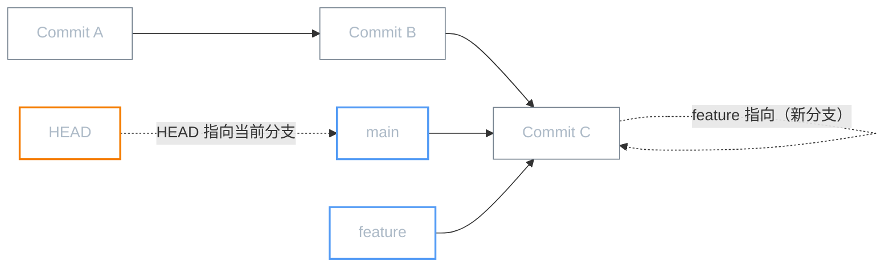
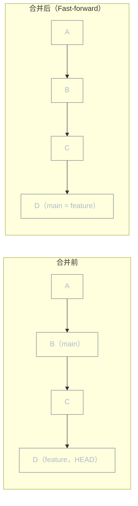
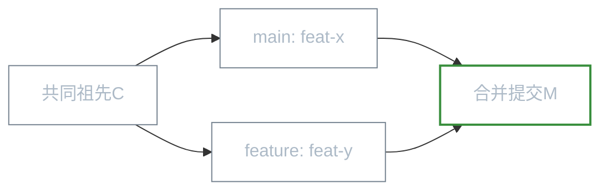
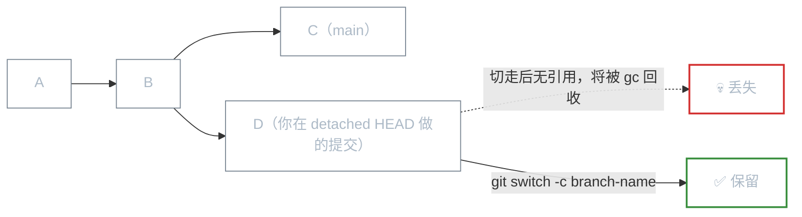

# 分支机制：创建、合并与冲突

**本文你会学到：**

- 分支的本质：一个可移动的指针
- 创建、切换、查看分支（`git branch` / `git switch`）
- 两种合并策略：Fast-forward vs 三方合并
- 冲突的产生原因与解决方法
- 常见分支工作流（Git Flow / GitHub Flow）

## 🌿 分支的本质：轻量指针

很多人觉得"创建分支"是个重量级操作，因为在 SVN 里需要复制整个目录。但在 Git 里，**分支只是一个指向某个提交的指针**（本质上是一个 40 字节的 SHA 文件），创建分支的代价几乎为零。



**HEAD** 是一个特殊指针，始终指向"你当前所在的分支"。切换分支 = 移动 HEAD。

## ✂️ 创建与切换分支

```bash title="分支基本操作"
# 查看所有分支（* 号表示当前分支）
git branch
# * main
#   feature/login
#   bugfix/null-pointer

# 查看所有分支（含远程）
git branch -a

# 创建新分支（不切换）
git branch feature/login

# 创建并立刻切换到新分支
git switch -c feature/login      # 推荐（Git 2.23+）
git checkout -b feature/login    # 旧写法，效果相同

# 切换到已有分支
git switch main
git checkout main                # 旧写法

# 删除分支（需要先切走）
git branch -d feature/login      # 安全删除（有未合并提交会提示）
git branch -D feature/login      # 强制删除

# 重命名分支
git branch -m old-name new-name
```

!!! tip "git switch vs git checkout"

    Git 2.23 引入了 `git switch`（切换分支）和 `git restore`（还原文件），把 `git checkout` 的两大功能拆开了，语义更清晰。新项目推荐用 `switch`。

## 🔀 分支合并

### Fast-forward 合并（快进合并）

当目标分支没有新提交（可以"顺着走过去"），Git 直接把指针快进：



```bash title="Fast-forward 合并示例"
git switch main
git merge feature/login    # 如果可以快进，直接快进

# 禁止快进（强制产生合并提交，保留分支历史）
git merge --no-ff feature/login
```

### 三方合并（3-way merge）

当两个分支都有新提交，Git 找到它们的**共同祖先**，用三个快照（祖先、A、B）计算出合并结果：



```bash title="三方合并示例"
git switch main
git merge feature/cart     # 自动产生合并提交
```

## ⚔️ 冲突：两个人改了同一行

当两个分支都修改了同一个文件的同一区域，Git 无法自动决定用哪个版本——这就是**冲突**：

```bash title="冲突处理流程"
git merge feature/login
# Auto-merging app.py
# CONFLICT (content): Merge conflict in app.py
# Automatic merge failed; fix conflicts and then commit the result.

git status
# Unmerged paths:
#   both modified: app.py

# 打开 app.py，你会看到冲突标记：
```

```python title="冲突文件示意（app.py）"
def get_user():
<<<<<<< HEAD                          # ← 当前分支（main）的内容
    return db.query("SELECT * FROM users")
=======                               # ← 分隔符
    return cache.get_all_users()      # ← 要合并进来的分支（feature/login）的内容
>>>>>>> feature/login
```

```bash title="解决冲突的步骤"
# 第一步：手动编辑文件，删除冲突标记，保留正确内容
# （你可以选其中一个，也可以两者结合）

# 第二步：标记已解决
git add app.py

# 第三步：完成合并提交
git commit
# Git 会自动填充合并提交信息

# 如果不想继续合并，可以放弃
git merge --abort
```

**VS Code / IDEA 等 IDE 提供图形化冲突解决界面**，推荐使用：
- VS Code：点击"Accept Current Change / Accept Incoming Change / Accept Both"
- IntelliJ IDEA：双击冲突文件 → 三栏对比视图

## 🌊 分支工作流推荐

### GitHub Flow（简单，适合持续部署）

```
main（始终可部署）
  └── feature/xxx ──→ PR ──→ Code Review ──→ merge to main ──→ deploy
```

```bash title="GitHub Flow 操作流"
# 1. 从 main 创建功能分支
git switch main && git pull
git switch -c feature/user-auth

# 2. 开发 + 提交
git add . && git commit -m "feat: 实现用户认证"

# 3. Push 并创建 Pull Request
git push -u origin feature/user-auth
# 在 GitHub/GitLab 上创建 PR，等 Code Review

# 4. 合并后删除分支
git switch main && git pull
git branch -d feature/user-auth
```

### Git Flow（结构化，适合版本发布）

```
main（生产版本）
develop（开发主线）
  ├── feature/xxx（新功能）
  ├── release/1.0（发布准备）
  └── hotfix/urgent（紧急修复）
```

## 🔀 squash merge：把功能分支压成一个提交

`git merge --squash` 是 GitHub/GitLab "Squash and merge" 按钮的命令行等价操作——把整个功能分支的所有提交压缩成一个干净的提交合并到主线：

```bash
git switch main
git merge --squash feature/payment
# 不会立刻提交，而是把所有改动放入暂存区
git commit -m "feat: 完整支付功能（含退款、优惠券、账单）"
# 功能分支的 10 个杂乱 WIP 提交 → 主线的 1 个清晰提交
```

| 合并方式 | 历史形状 | 何时使用 |
|---------|---------|---------|
| `merge` | 保留分支历史 + 合并提交 | 大型功能，想保留开发过程 |
| `merge --no-ff` | 保留分支历史（强制合并提交）| 所有 PR 合并 |
| `merge --squash` | 一个干净的新提交，无分支痕迹 | 功能小且历史杂乱 |
| `rebase` 后 merge | 线性历史，无合并提交 | 个人工作流 |

## ⚠️ detached HEAD：游离状态

切换到某个具体的提交（而不是分支）时，就进入了 **detached HEAD** 状态：

```bash
git checkout abc1234      # 进入 detached HEAD
# HEAD detached at abc1234

# 此时可以查看、编译、测试，但提交的内容"无人保护"
git commit -m "实验：测试旧版本的行为"
# 产生了新提交，但没有分支指向它！
# 切走后，这个提交就会"悬空"，最终被 gc 清理

# 如果想保留，立刻创建分支
git switch -c experiment/from-old-version
```



## 🏢 主干开发（Trunk-Based Development）

除了 Git Flow 和 GitHub Flow，还有一种越来越流行的模式：**主干开发**。

```
main（主干，唯一长期分支）
  ├── short-lived/feature-x  （存活 < 1天）
  ├── short-lived/feature-y  （存活 < 1天）
  └── 直接小提交              （频繁直接提交到 main）
```

核心思想：
- **功能分支极短命**（理想情况是当天合并）
- 未完成的功能用**功能开关（Feature Flag）**隐藏
- **CI/CD 保证主干随时可发布**

| 工作流 | 适合团队 | 分支复杂度 |
|--------|---------|-----------|
| Git Flow | 版本发布节奏固定（如 APP 每季度发版）| 高 |
| GitHub Flow | 持续交付，随时部署 | 低 |
| Trunk-Based | 高频发布，DevOps 成熟 | 极低 |

## 小结

| 操作 | 命令 |
|------|------|
| 创建并切换分支 | `git switch -c <name>` |
| 切换分支 | `git switch <name>` |
| 普通合并 | `git merge <name>` |
| squash 合并 | `git merge --squash <name>` |
| 查看所有分支 | `git branch -a` |
| 删除分支 | `git branch -d <name>` |
| 中止合并 | `git merge --abort` |

下一篇「变基详解」将讲解 `git rebase`——一种更"干净"但需要谨慎使用的整合方式。
