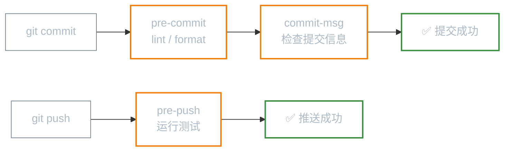
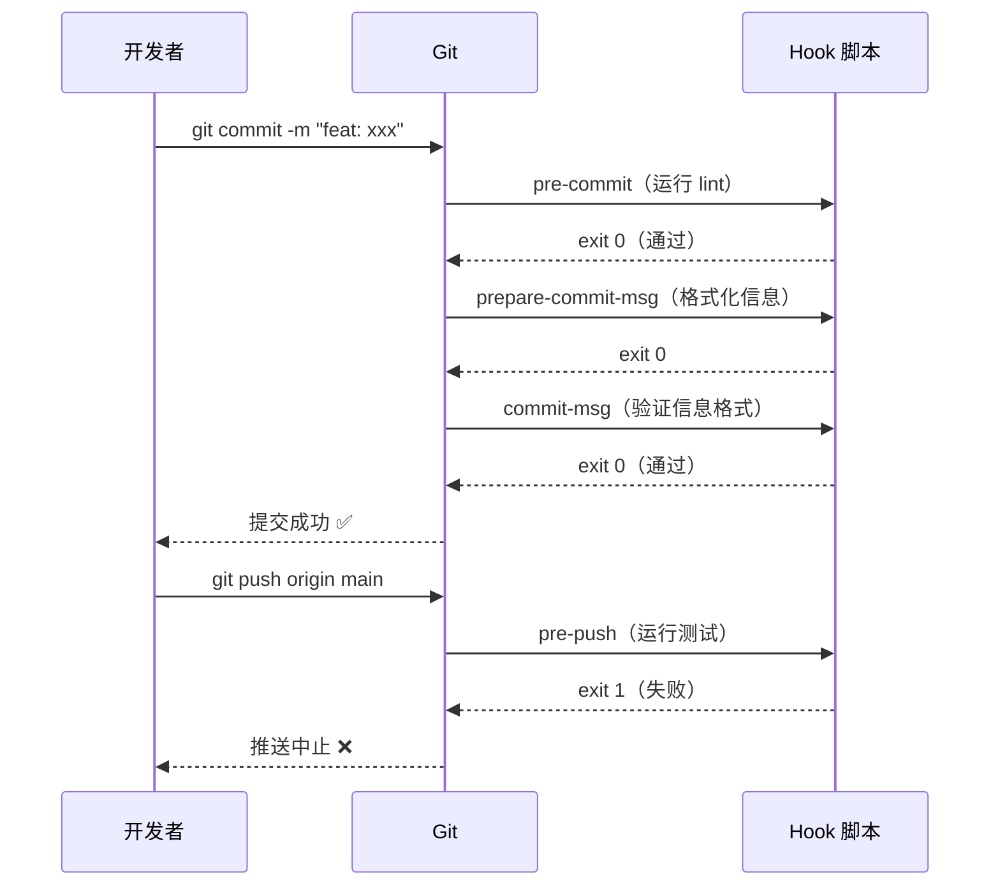

# Git 钩子：自动化守卫

**本文你会学到：**

- 什么是 Git 钩子及其触发时机
- 常用客户端钩子（`pre-commit`、`commit-msg`、`pre-push`）
- 服务端钩子（`pre-receive`、`update`）简介
- 用 Husky 在团队中共享钩子配置

## 🚦 什么是 Git 钩子？

Git 钩子（Hooks）是在特定 Git 操作发生时**自动触发的脚本**，就像设置的"关卡"：

- 提交前自动运行 lint，代码不合格就阻止提交
- 推送前自动跑测试，测试失败就阻止推送
- 提交信息格式不对就立刻报错



所有钩子脚本存放在 `.git/hooks/` 目录中。Git 默认提供了以 `.sample` 结尾的示例文件，去掉后缀并赋予执行权限即可激活：

```bash
ls .git/hooks/
# applypatch-msg.sample   pre-applypatch.sample  pre-push.sample
# commit-msg.sample       pre-commit.sample      update.sample
# post-update.sample      prepare-commit-msg.sample ...

# 激活一个钩子（去掉 .sample 后缀）
cp .git/hooks/pre-commit.sample .git/hooks/pre-commit
chmod +x .git/hooks/pre-commit    # Linux/macOS
```

!!! info "钩子脚本的退出码决定是否继续"

    钩子脚本退出码 `0` = 通过，继续执行；非 `0` = 失败，**中止** Git 操作。这是所有客户端钩子的统一约定。

## 🔍 常用客户端钩子

### pre-commit：提交前的质量守门员

在 `git commit` 执行之前触发（早于打开编辑器），适合运行 lint 和格式检查。

```bash title=".git/hooks/pre-commit 示例：ESLint + Prettier"
#!/bin/bash
# 只检查本次 staged 的文件（不影响未修改的文件）
STAGED_FILES=$(git diff --cached --name-only --diff-filter=ACM | grep -E '\.(js|ts|jsx|tsx)$')

if [ -z "$STAGED_FILES" ]; then
    exit 0  # 没有 JS/TS 文件，跳过
fi

echo "🔍 运行 ESLint..."
npx eslint $STAGED_FILES
if [ $? -ne 0 ]; then
    echo "❌ ESLint 检查失败，请修复后再提交"
    exit 1
fi

echo "✅ ESLint 通过"
exit 0
```

```bash
# 测试钩子是否工作
git add src/broken.js
git commit -m "test"
# 🔍 运行 ESLint...
# src/broken.js: 3:5 error 'foo' is not defined  no-undef
# ❌ ESLint 检查失败，请修复后再提交
```

### commit-msg：提交信息格式守卫

```bash title=".git/hooks/commit-msg 示例：Conventional Commits 格式验证"
#!/bin/bash
# $1 是包含提交信息的临时文件路径
COMMIT_MSG=$(cat "$1")

# 匹配 Conventional Commits 格式
# 例如：feat: 添加用户登录, fix(auth): 修复 token 过期问题
PATTERN="^(feat|fix|docs|style|refactor|test|chore|ci|perf)(\(.+\))?: .{1,100}"

if ! echo "$COMMIT_MSG" | grep -Eq "$PATTERN"; then
    echo "❌ 提交信息格式不正确！"
    echo "   正确格式：<type>(<scope>): <subject>"
    echo "   示例：feat(auth): 添加 JWT 登录功能"
    echo "   可用类型：feat fix docs style refactor test chore ci perf"
    exit 1
fi

echo "✅ 提交信息格式正确"
exit 0
```

### pre-push：推送前的最后防线

```bash title=".git/hooks/pre-push 示例：推送前跑单测"
#!/bin/bash
REMOTE="$1"
URL="$2"

echo "🧪 推送前运行单元测试..."
npm test -- --watchAll=false

if [ $? -ne 0 ]; then
    echo "❌ 测试失败，推送已中止！"
    echo "   请先修复测试再 push"
    exit 1
fi

echo "✅ 测试全部通过，开始推送"
exit 0
```

### prepare-commit-msg：自动生成提交信息模板

```bash title=".git/hooks/prepare-commit-msg 示例：自动填入分支名"
#!/bin/bash
# 自动在提交信息开头加上分支名（如 feature/login 分支 → "[login] "）
BRANCH=$(git symbolic-ref --short HEAD)
JIRA_TICKET=$(echo "$BRANCH" | grep -oE '[A-Z]+-[0-9]+')

if [ -n "$JIRA_TICKET" ]; then
    # 在提交信息开头插入 Jira 票号
    sed -i.bak "1s/^/[$JIRA_TICKET] /" "$1"
fi
```

## ⚡ 钩子触发时机总览



## 🌐 服务端钩子（了解）

服务端钩子在 Git 服务器上运行，可以对**所有推送**执行强制检查：

| 钩子 | 触发时机 | 典型用途 |
|------|---------|---------|
| `pre-receive` | 接收 push 时，处理所有引用之前 | 全局权限检查 |
| `update` | 每个分支更新时分别触发 | 分支级权限、拒绝非 fast-forward |
| `post-receive` | push 完成后 | 触发 CI/CD、发送通知 |

服务端钩子的优势：无法被开发者绕过（客户端钩子可以用 `--no-verify` 跳过）。

## 📦 用 Husky 共享团队钩子

`.git/hooks/` 不在版本控制中，每个人 clone 后都需要手动配置钩子。[Husky](https://typicode.github.io/husky) 解决了这个问题：

```bash title="在 Node.js 项目中配置 Husky"
# 安装 husky 和 lint-staged
npm install --save-dev husky lint-staged

# 初始化 husky（会在项目根创建 .husky/ 目录）
npx husky init

# 创建 pre-commit 钩子（只对 staged 文件运行 lint）
echo "npx lint-staged" > .husky/pre-commit

# 创建 commit-msg 钩子（验证格式）
echo "npx --no -- commitlint --edit \$1" > .husky/commit-msg
```

```json title="package.json 中配置 lint-staged"
{
  "lint-staged": {
    "*.{js,ts,jsx,tsx}": ["eslint --fix", "prettier --write"],
    "*.{css,scss}": ["prettier --write"],
    "*.md": ["prettier --write"]
  },
  "scripts": {
    "prepare": "husky"
  }
}
```

现在团队成员 `npm install` 后，钩子会自动安装，无需手动配置。

## 跳过钩子（特殊情况）

```bash
# 跳过 pre-commit 和 commit-msg（紧急情况使用）
git commit --no-verify -m "hotfix: 紧急修复"
git push --no-verify
```

!!! warning "慎用 `--no-verify`"

    `--no-verify` 会完全跳过所有客户端钩子，相当于绕过所有本地质量守卫。团队应在代码评审规范中明确何时允许使用。

## 🐍 非 Node.js 项目的钩子方案

Git 钩子是 Shell 脚本，与语言无关。但不同语言生态有更便捷的钩子管理工具：

### Python 项目：pre-commit 框架

```bash title="Python/多语言项目推荐：pre-commit 框架"
# 安装
pip install pre-commit

# 在项目根创建 .pre-commit-config.yaml
```

```yaml title=".pre-commit-config.yaml"
repos:
  # Python 格式化
  - repo: https://github.com/psf/black
    rev: 23.3.0
    hooks:
      - id: black

  # Python import 排序
  - repo: https://github.com/pycqa/isort
    rev: 5.12.0
    hooks:
      - id: isort

  # 通用检查（尾随空格、大文件等）
  - repo: https://github.com/pre-commit/pre-commit-hooks
    rev: v4.4.0
    hooks:
      - id: trailing-whitespace
      - id: end-of-file-fixer
      - id: check-large-files
        args: ['--maxkb=1024']   # 限制文件 < 1MB
      - id: detect-private-key   # 检测私钥泄露
```

```bash
# 安装到 .git/hooks/
pre-commit install

# 手动对所有文件运行（首次初始化）
pre-commit run --all-files
```

### Java/Maven 项目：Maven 插件钩子

```bash title="Java 项目用 shell 脚本调用 Maven"
#!/bin/bash
# .git/hooks/pre-commit

echo "🔍 运行 Checkstyle..."
mvn checkstyle:check -q
if [ $? -ne 0 ]; then
    echo "❌ Checkstyle 检查失败，请修复代码风格"
    exit 1
fi

echo "🧪 运行单元测试..."
mvn test -q
if [ $? -ne 0 ]; then
    echo "❌ 单元测试失败"
    exit 1
fi

exit 0
```

## 📮 post-commit / post-checkout 钩子

这些是"通知型"钩子，在操作**成功之后**触发，退出码无法影响操作结果：

```bash title=".git/hooks/post-commit：提交后通知"
#!/bin/bash
# 提交成功后，输出提交信息摘要
COMMIT_MSG=$(git log -1 --format="%s")
BRANCH=$(git symbolic-ref --short HEAD)
echo "✅ 已提交到 [$BRANCH]：$COMMIT_MSG"

# 示例：提交后自动运行一次构建（异步，不阻塞）
# nohup make build > /dev/null 2>&1 &
```

```bash title=".git/hooks/post-checkout：切换分支后"
#!/bin/bash
# $1 = 切换前的 HEAD SHA
# $2 = 切换后的 HEAD SHA  
# $3 = 1（切换分支）或 0（checkout 文件）

PREV_HEAD=$1
NEW_HEAD=$2
IS_BRANCH_CHECKOUT=$3

if [ "$IS_BRANCH_CHECKOUT" = "1" ]; then
    BRANCH=$(git symbolic-ref --short HEAD)
    echo "📍 已切换到分支：$BRANCH"
    
    # 如果 package.json 发生了变化，提示重新安装依赖
    if git diff --name-only "$PREV_HEAD" "$NEW_HEAD" | grep -q "package.json"; then
        echo "⚠️  package.json 已变化，建议运行 npm install"
    fi
fi
```

## 小结

| 钩子 | 触发时机 | 退出码 0=通过 |
|------|---------|-------------|
| `pre-commit` | commit 前 | ✅ 继续提交 |
| `commit-msg` | 写入提交信息后 | ✅ 继续提交 |
| `prepare-commit-msg` | 打开编辑器前 | ✅ 继续 |
| `post-commit` | commit 成功后 | 无影响（通知型） |
| `pre-push` | push 前 | ✅ 继续推送 |
| `post-checkout` | checkout 成功后 | 无影响（通知型） |
| `pre-receive` | 服务端接收 push | ✅ 接受 push |

下一篇「内部原理」将揭开 Git 的底层实现：对象模型、引用和 packfile。
