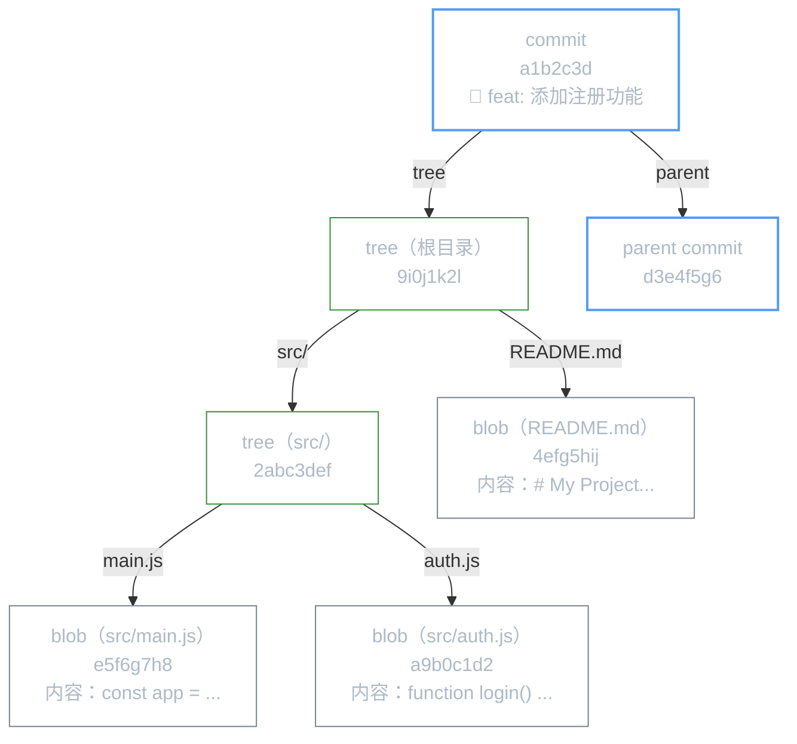
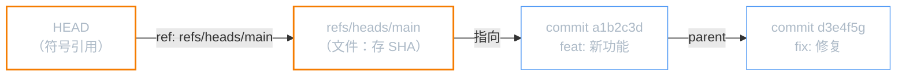

# Git 内部原理：对象、引用与 packfile

**本文你会学到：**

- Git 的四种对象：blob、tree、commit、tag
- 引用（branch / HEAD / tag）的本质
- packfile 如何压缩存储
- 用底层命令亲自动手"解剖" Git

## 🔬 Git 是个内容寻址文件系统

Git 的核心设计思想是：**以内容的 SHA-1 哈希作为地址存储数据**。

你可以把 `.git/objects/` 目录想象成一个键值数据库：
- **键**（key）：内容的 SHA-1 哈希（40 位十六进制字符串）
- **值**（value）：压缩后的文件内容

```bash title="亲手向 Git 对象库写入数据"
# hash-object：把内容写入对象库，返回 SHA-1
echo "hello git" | git hash-object --stdin -w
# 8c9f8349a26e3e2e58b24fd5abf9e7c8e5a29d5b（示例哈希）

# 对象被存储在 .git/objects/ 中
ls .git/objects/8c/
# 9f8349a26e3e2e58b24fd5abf9e7c8e5a29d5b

# cat-file：读取对象内容
git cat-file -t 8c9f8349  # 查看类型：blob
git cat-file -p 8c9f8349  # 查看内容：hello git
```

## 📦 四种 Git 对象

Git 只有四种对象类型，整个版本控制体系都建立在这四种对象之上：

### blob：文件内容

`blob`（Binary Large OBject）只存储**文件内容**，不含文件名和权限信息。

```bash
# 查看某个文件对应的 blob
git ls-tree HEAD
# 100644 blob a1b2c3d4... README.md
# 100644 blob e5f6g7h8... src/main.js
# 040000 tree 9i0j1k2l... src/

# 查看 blob 内容
git cat-file -p a1b2c3d4
# # My Project
# This is the README...
```

### tree：目录结构

`tree` 对象记录一个目录的结构——哪些文件（blob）和子目录（tree）：

```bash
# 查看 tree 对象
git cat-file -p HEAD^{tree}
# 040000 tree 2abc3def  src              ← 子目录是 tree
# 100644 blob 4efg5hij  .gitignore       ← 文件是 blob
# 100644 blob 6klm7nop  README.md
# 100755 blob 8qrs9tuv  run.sh           ← 可执行文件（100755）
```

### commit：快照 + 元数据

`commit` 对象是最终被我们感知的"版本"，它包含：
- 指向根 `tree` 的指针（完整目录快照）
- 父提交的指针（`parent`，初始提交没有 parent）
- 作者、提交者信息和时间戳
- 提交信息

```bash
# 查看 commit 对象
git cat-file -p HEAD
# tree   9i0j1k2l...          ← 指向根 tree
# parent d3e4f5g6...          ← 父提交（可以有多个，merge 时）
# author  Zhang San <z@x.com> 1700000000 +0800
# committer Zhang San <z@x.com> 1700000000 +0800
#
# feat: 添加用户注册功能
```

### 对象关系图



### tag：附注标签对象

附注标签（`git tag -a`）也是一种对象，包含打标签人信息和签名：

```bash
git cat-file -p v1.0.0
# object a1b2c3d4...        ← 指向某个 commit
# type commit
# tag v1.0.0
# tagger Zhang San <z@x.com> 1700000000 +0800
# 
# 正式发布 1.0.0 版本
```

## 🏷️ 引用：人类可读的指针

SHA-1 哈希难以记忆，**引用**（ref）就是给这些哈希起的别名：

```bash
# 所有引用存在 .git/refs/ 目录
ls .git/refs/
# heads/     ← 本地分支
# remotes/   ← 远程跟踪分支
# tags/      ← 标签

# 分支本质上只是一个包含 commit SHA 的文本文件！
cat .git/refs/heads/main
# a1b2c3d4e5f6g7h8i9j0k1l2m3n4o5p6q7r8s9t0

# HEAD：指向当前分支的特殊引用
cat .git/HEAD
# ref: refs/heads/main    ← 指向 main 分支（正常状态）
# 或 a1b2c3d4...          ← detached HEAD 状态
```



## 📁 .git 目录解剖

```bash
.git/
├── HEAD           # 当前分支引用（或 detached 时的 SHA）
├── config         # 仓库级配置（remote URL、用户信息等）
├── description    # 裸仓库描述（通常忽略）
├── index          # 暂存区（二进制格式）
├── objects/       # 对象库
│   ├── info/
│   ├── pack/      # packfile（压缩后的对象）
│   └── ab/        # loose 对象（前2位为目录名）
│       └── cdef...
└── refs/
    ├── heads/     # 本地分支
    ├── remotes/   # 远程跟踪分支
    └── tags/      # 标签
```

## 📦 packfile：对象的压缩存储

随着提交增多，`.git/objects/` 中的 loose 对象会越来越多。Git 会自动（或手动）将它们打包成 **packfile**，同时使用 delta 压缩（只存储文件版本间的差异）：

```bash
# 手动触发打包（一般不需要手动执行，git gc 会自动做）
git gc

# 查看 packfile
ls .git/objects/pack/
# pack-a1b2c3....idx    ← 索引文件（快速查找）
# pack-a1b2c3....pack   ← 打包数据

# 查看 packfile 内容
git verify-pack -v .git/objects/pack/pack-a1b2c3....idx
# SHA-1 type size size-in-packfile offset-in-packfile
# a1b2c3 commit 250 150 12
# e4f5g6 blob   5000 200 162    ← 5000 字节压缩到 200 字节
# ...
```

**delta 压缩的效果**：一个文件的 100 个历史版本，Git 只存最新的完整版本 + 每次版本间的 diff（delta），节省大量空间。

## 🔧 底层命令速查

| 命令 | 用途 |
|------|------|
| `git hash-object -w <file>` | 将文件写入对象库，返回 SHA |
| `git cat-file -t <sha>` | 查看对象类型（blob/tree/commit/tag） |
| `git cat-file -p <sha>` | 查看对象内容 |
| `git ls-tree <ref>` | 查看 tree 对象的目录列表 |
| `git ls-files --stage` | 查看暂存区（index）内容 |
| `git gc` | 手动触发垃圾回收和打包 |
| `git verify-pack -v <idx>` | 查看 packfile 内容 |
| `git count-objects -v` | 统计对象数量和大小 |

## 🧪 动手实验：从零构建一个提交

不依赖 `git add`/`git commit`，只用底层命令，手动创建完整的 commit 对象，彻底理解 Git 的工作原理：

```bash title="纯底层命令创建提交（完整演示）"
# 前提：一个空的 git 仓库
git init demo-internals && cd demo-internals

# 第一步：创建一个 blob 对象（文件内容）
echo "Hello, Git!" | git hash-object --stdin -w
# 8ab686eafeb1f44702738c8b0f24f2567c36da6d
BLOB_SHA="8ab686e"

# 第二步：创建一个 tree 对象（目录结构）
# 格式：<mode> <type> <sha>\t<name>
printf "100644 blob 8ab686eafeb1f44702738c8b0f24f2567c36da6d\tREADME.md\n" \
  | git mktree
# 7f2d6b83...（tree 的 SHA）
TREE_SHA="7f2d6b83"

# 第三步：创建一个 commit 对象
COMMIT_SHA=$(git commit-tree $TREE_SHA \
  -m "init: 第一次提交（纯底层命令）")
echo $COMMIT_SHA
# a3f9b2c1...

# 第四步：让 main 分支指向这个 commit
git update-ref refs/heads/main $COMMIT_SHA

# 验证：现在 git log 能看到这次提交了！
git log --oneline
# a3f9b2c init: 第一次提交（纯底层命令）
```

这就是 `git add` + `git commit` 背后发生的完整流程！

## 🔗 特殊引用：ORIG_HEAD / MERGE_HEAD

除了 `HEAD`，Git 还维护了几个"临时引用"用于辅助操作：

```bash
# ORIG_HEAD：危险操作（reset/merge/rebase）之前的 HEAD 位置
git merge feature/big-change   # 合并前，ORIG_HEAD 记录了 main 的旧位置
# 如果合并结果不满意：
git reset --hard ORIG_HEAD     # 快速回到合并前的状态

cat .git/ORIG_HEAD             # 查看内容（就是一个 SHA）

# MERGE_HEAD：合并进行中时，被合并分支的 commit SHA
git merge feature/login
# 如果有冲突，MERGE_HEAD 保存着 feature/login 的 SHA
cat .git/MERGE_HEAD

# CHERRY_PICK_HEAD：cherry-pick 进行中时保存源提交 SHA
# REVERT_HEAD：revert 进行中时保存被撤销的提交 SHA
```

| 特殊引用 | 何时存在 | 用途 |
|---------|---------|------|
| `ORIG_HEAD` | merge/reset/rebase 之后 | 快速回退 `git reset --hard ORIG_HEAD` |
| `MERGE_HEAD` | merge 冲突解决中 | 查看被合并分支的 SHA |
| `CHERRY_PICK_HEAD` | cherry-pick 冲突中 | 查看源提交 |
| `FETCH_HEAD` | `git fetch` 之后 | 记录上次 fetch 的结果 |

```bash
# 实用技巧：fetch 后快速查看远程带来了什么
git fetch origin
git log FETCH_HEAD --oneline   # 查看远程新提交
git diff FETCH_HEAD            # 与远程比较差异
```

## 为什么理解原理很重要？

理解了 Git 内部原理，你会发现：
- **分支** 只是个 40 字节的文件，创建/删除极快
- **提交** 是快照而不是差异，所以 checkout 是 O(1) 操作
- **合并冲突** 发生在 tree 层面，理解 tree 结构有助于解决冲突
- **大文件** 为什么不适合放进 Git（每个版本都是完整 blob）
- **`git reset`** 只是在移动 `.git/refs/heads/main` 文件里的 SHA

恭喜！你已完成 Git 全部 14 篇笔记的学习。🎉
