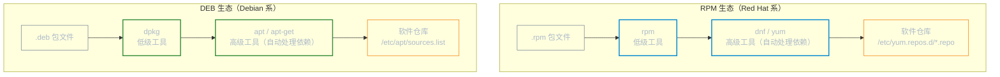

# 软件包管理

**本文你会学到**：

- Linux 两大包管理生态（RPM / DEB）的整体架构
- `rpm` / `dnf` 命令：安装、查询、仓库管理、历史回滚
- `dpkg` / `apt` 命令：安装、查询、仓库配置、版本锁定
- Snap / Flatpak 跨发行版通用包简介
- 两大生态的操作对比速查表

## 包管理体系概览

在 Linux 中，软件包管理分为两个层次：**低级工具**（直接操作 `.rpm` / `.deb` 文件，不处理依赖）和**高级工具**（连接在线仓库，自动解决依赖关系）。



## RPM 包管理（Red Hat 系）

### 包命名规则

RPM 包文件名遵循固定格式：

```
name-version-release.arch.rpm
```

以 `nginx-1.26.0-1.el9.x86_64.rpm` 为例：

- `nginx`：包名
- `1.26.0`：软件版本
- `1`：打包发布版本号
- `el9`：适用平台（Enterprise Linux 9，即 RHEL/AlmaLinux/Rocky Linux）
- `x86_64`：CPU 架构（`aarch64` 为 ARM，`noarch` 为架构无关）

### rpm 命令操作

`rpm` 是低级工具，直接操作本地 `.rpm` 文件。安装时若依赖不满足，`rpm` **不会**自动下载，只会报错——这正是高级工具 `dnf` 存在的原因。

```bash title="安装与卸载"
rpm -ivh package.rpm          # 安装（-i 安装，-v 详细输出，-h 显示进度条）
rpm -Uvh package.rpm          # 升级（包不存在则安装）
rpm -Fvh package.rpm          # 仅升级（包不存在则跳过，不安装）
rpm -e package-name           # 卸载（使用包名，不含版本号）
rpm -e --nodeps package-name  # 强制卸载（忽略依赖，危险！）
```

```bash title="查询已安装包"
rpm -qa                       # 列出所有已安装包
rpm -qa | grep nginx          # 搜索已安装包
rpm -qi nginx                 # 包的详细信息（版本、描述、安装时间）
rpm -ql nginx                 # 包安装的所有文件列表
rpm -qc nginx                 # 包的配置文件（configuration files）
rpm -qd nginx                 # 包的文档文件（doc files）
rpm -qf /usr/bin/nginx        # 查询某个文件属于哪个包
rpm -qR nginx                 # 包的依赖列表（Requires）
```

```bash title="查询未安装的 .rpm 文件"
rpm -qpi package.rpm          # 查看包信息（未安装）
rpm -qpl package.rpm          # 查看包内文件列表（未安装）
```

```bash title="验证"
rpm -V nginx                  # 验证已安装包的文件是否被修改
rpm --checksig package.rpm    # 验证包的 GPG 签名
```

!!! tip "`rpm -V` 输出含义"

    `rpm -V` 的输出中，每列字符代表不同检查项：`S`=文件大小、`M`=权限、`5`=MD5、`T`=修改时间。若文件未被修改则无输出；若有输出则说明文件已变动。

## DNF 包管理（RHEL 8+ 推荐）

从 RHEL 8 起，`dnf` 取代了 `yum`，但系统保留 `yum` 作为 `dnf` 的别名以向后兼容。`dnf` 相比 `yum` 性能更好，依赖解析更准确，并支持模块流（Module Streams）。

### 安装与卸载

```bash title="基本安装与卸载"
dnf install nginx              # 安装最新版
dnf install nginx-1.26.0       # 安装指定版本
dnf reinstall nginx            # 重新安装（修复损坏的包）
dnf remove nginx               # 卸载
dnf autoremove                 # 删除不再被任何包依赖的孤立包
```

```bash title="软件组安装"
dnf grouplist                          # 列出可用软件组
dnf groupinstall "Development Tools"   # 安装软件组（包含 gcc、make 等开发工具）
dnf groupremove "Development Tools"    # 卸载软件组
```

### 查询与搜索

```bash title="查询"
dnf list installed             # 列出所有已安装包
dnf list available             # 列出仓库中可安装的包
dnf list updates               # 列出有更新可用的包
dnf search nginx               # 按名称和描述搜索包
dnf provides /usr/bin/nginx    # 查询某个文件由哪个包提供
dnf info nginx                 # 查看包的详细信息
```

### 更新系统

```bash title="系统更新"
dnf check-update               # 检查可用更新（只查看，不安装）
dnf update nginx               # 更新指定包
dnf update                     # 更新所有包
dnf upgrade --security         # 仅安装安全相关更新
```

### 仓库管理

```bash title="查看仓库"
dnf repolist                   # 列出已启用的仓库
dnf repolist all               # 列出所有仓库（含已禁用）
dnf repoinfo baseos            # 查看指定仓库的详细信息
```

```bash title="启用 EPEL 仓库"
# EPEL（Extra Packages for Enterprise Linux）提供 RHEL 官方仓库之外的大量软件
dnf install epel-release                       # 在 RHEL/AlmaLinux/Rocky Linux 上添加 EPEL
dnf install --enablerepo=epel nginx            # 临时启用某仓库安装包（不永久启用）
```

```bash title="手动添加自定义仓库"
cat > /etc/yum.repos.d/myrepo.repo << 'EOF'
[myrepo]
name=My Custom Repository
baseurl=https://repo.example.com/rhel9/
enabled=1
gpgcheck=1
gpgkey=https://repo.example.com/RPM-GPG-KEY
EOF
```

### 缓存与历史管理

```bash title="缓存管理"
dnf clean all                  # 清理所有缓存（包元数据 + 已下载包）
dnf makecache                  # 重新拉取仓库元数据并建立缓存
```

`dnf history` 是 `dnf` 相比 `yum` 的重要增强功能，可以查看并**回滚**任意一次操作：

```bash title="操作历史与回滚"
dnf history                    # 查看所有操作历史（编号从新到旧）
dnf history info 10            # 查看第 10 次操作的详细信息
dnf history undo 10            # 回滚第 10 次操作（卸载当时安装的包）
dnf history redo 10            # 重新执行第 10 次操作
```

## dpkg 包管理（Debian 系低级工具）

`dpkg` 是 Debian 系的低级包管理工具，直接操作 `.deb` 文件。与 `rpm` 相同，它**不会**自动下载或解决依赖，遇到依赖缺失时需要用 `apt -f install` 来修复。

### dpkg 基本操作

```bash title="安装与卸载"
dpkg -i package.deb            # 安装（依赖不满足会报错）
apt -f install                 # 修复依赖问题（在 dpkg -i 报错后运行）
dpkg --configure -a            # 配置所有已解压但未完成配置的包
dpkg -r package-name           # 卸载包（保留配置文件）
dpkg -P package-name           # 完全清除（含配置文件）
```

```bash title="查询"
dpkg -l                        # 列出所有已安装包（含状态标志）
dpkg -l | grep nginx           # 搜索已安装包
dpkg -L nginx                  # 包安装的所有文件列表
dpkg -S /usr/sbin/nginx        # 文件属于哪个包
dpkg -s nginx                  # 包的状态与详细信息
dpkg -I package.deb            # 查看未安装 .deb 文件的信息
```

```bash title="验证"
dpkg --verify nginx            # 验证包文件完整性
```

### dpkg -l 状态标志

`dpkg -l` 输出的第一列是三个字符的状态码，常见组合如下：

| 标志 | 含义 |
|------|------|
| `ii` | 正常已安装 |
| `rc` | 已卸载，但配置文件仍然残留 |
| `hi` | 已安装并被锁定（hold），不会自动更新 |

## APT 包管理（Debian/Ubuntu 推荐）

`apt` 是 Debian/Ubuntu 上的高级包管理工具，会自动连接仓库、解决依赖。日常使用推荐 `apt`，脚本中推荐 `apt-get`（输出更稳定，不会因终端提示变化而影响解析）。

### 基本操作

!!! warning "安装前先更新包列表"

    `apt install` 前必须先执行 `apt update` 更新本地包列表缓存，否则可能安装旧版本甚至找不到包。

```bash title="更新与安装"
apt update                     # 更新本地包列表（不安装任何包）
apt install nginx              # 安装最新版
apt install nginx=1.26.0-1     # 安装指定版本
apt install -y nginx           # 非交互安装（自动答 yes）
apt reinstall nginx            # 重新安装
```

```bash title="卸载"
apt remove nginx               # 卸载（保留配置文件）
apt purge nginx                # 完全卸载（含配置文件，等同于 dpkg -P）
apt autoremove                 # 删除不再需要的孤立依赖包
apt autoremove --purge         # 同上，并同时清除配置文件
```

```bash title="系统更新"
apt upgrade                    # 更新已安装包（不删除任何包）
apt full-upgrade               # 完整升级（可能删除冲突包以满足新依赖）
```

```bash title="搜索与信息"
apt search nginx               # 按名称和描述搜索包
apt show nginx                 # 查看包的详细信息
apt list --installed           # 列出所有已安装包
apt list --upgradable          # 列出有更新可用的包
```

```bash title="下载包"
apt download nginx             # 下载 .deb 文件到当前目录（不安装）
apt-get source nginx           # 下载源码包（需要 deb-src 仓库条目）
```

### 仓库管理

```bash title="查看仓库配置"
cat /etc/apt/sources.list              # 主仓库配置文件
ls /etc/apt/sources.list.d/            # 第三方仓库（每个源一个文件）
```

```bash title="添加 Ubuntu PPA"
add-apt-repository ppa:nginx/stable   # 添加 PPA 仓库
apt update                             # 刷新包列表
apt install nginx
```

```bash title="手动添加第三方仓库（推荐方式）"
# 导入 GPG 密钥（存放到 /etc/apt/keyrings/，而非已弃用的 apt-key）
curl -fsSL https://repo.example.com/gpg.key \
  | gpg --dearmor -o /etc/apt/keyrings/myrepo.gpg

# 添加仓库条目
echo "deb [signed-by=/etc/apt/keyrings/myrepo.gpg] https://repo.example.com/ jammy main" \
  | tee /etc/apt/sources.list.d/myrepo.list

apt update
```

### 包版本锁定

当你需要固定某个包不随 `apt upgrade` 更新时，可以使用 `apt-mark hold`：

```bash title="版本锁定"
apt-mark hold nginx            # 锁定包（不自动更新）
apt-mark unhold nginx          # 解除锁定
apt-mark showhold              # 查看所有被锁定的包
```

## Snap 与 Flatpak（跨发行版通用包）

Snap 和 Flatpak 是与发行版无关的包格式，将应用及其依赖打包在一起，可以跨发行版安装。

```bash title="Snap（Ubuntu 默认，其他发行版可安装 snapd）"
snap install code --classic    # 安装（--classic 允许访问系统文件，类似传统应用）
snap list                      # 列出已安装的 snap 包
snap refresh                   # 更新所有 snap 包
snap refresh code              # 更新指定包
snap remove code               # 卸载
```

```bash title="Flatpak（Fedora 内置，其他发行版需安装 flatpak）"
flatpak install flathub org.mozilla.firefox   # 从 Flathub 仓库安装
flatpak list                                   # 列出已安装应用
flatpak update                                 # 更新所有应用
flatpak remove org.mozilla.firefox             # 卸载
```

!!! note "Snap vs Flatpak"

    Snap 由 Canonical 主导，在 Ubuntu 系生态中更成熟；Flatpak 由社区主导，在 Fedora/GNOME 生态中更常见。两者都通过沙箱隔离运行，适合安装桌面应用，但不适合系统工具（权限受限）。

## 两大生态对比速查表

| 操作 | DNF（RHEL 8+） | APT（Debian/Ubuntu） |
|------|---------------|---------------------|
| 更新包列表 | `dnf check-update` | `apt update` |
| 安装 | `dnf install pkg` | `apt install pkg` |
| 卸载 | `dnf remove pkg` | `apt remove pkg` |
| 完全卸载（含配置） | `dnf remove pkg`（自动清除） | `apt purge pkg` |
| 更新所有包 | `dnf upgrade` | `apt upgrade` |
| 搜索 | `dnf search keyword` | `apt search keyword` |
| 包详细信息 | `dnf info pkg` | `apt show pkg` |
| 文件归属查询 | `dnf provides /path` | `dpkg -S /path` |
| 包文件列表 | `rpm -ql pkg` | `dpkg -L pkg` |
| 清理缓存 | `dnf clean all` | `apt clean` |
| 自动删除孤立依赖 | `dnf autoremove` | `apt autoremove` |
| 操作历史 | `dnf history` | `cat /var/log/apt/history.log` |
| 锁定版本 | `dnf versionlock pkg` | `apt-mark hold pkg` |

## 发行版差异详解

=== "Debian / Ubuntu"

    - **低级工具**：`dpkg`
    - **高级工具**：`apt`（交互推荐）/ `apt-get`（脚本推荐）/ `aptitude`（交互式 TUI）
    - **包格式**：`.deb`
    - **仓库配置**：`/etc/apt/sources.list` + `/etc/apt/sources.list.d/`
    - **仓库组件**：
        - `main`：完全自由软件
        - `contrib`：自由软件但依赖非自由组件
        - `non-free`：非自由软件
        - `non-free-firmware`：非自由固件（Debian 12 新增独立组件）
    - **安全更新仓库**：`deb https://security.debian.org/debian-security bookworm-security main`

=== "Red Hat / RHEL 系"

    - **低级工具**：`rpm`
    - **高级工具**：`dnf`（RHEL 8+，推荐）/ `yum`（别名，向后兼容）
    - **包格式**：`.rpm`
    - **仓库配置**：`/etc/yum.repos.d/*.repo`
    - **重要仓库**：
        - `BaseOS`：核心系统包（rpm 格式）
        - `AppStream`：应用与运行时（支持模块流）
        - `EPEL`：额外包（Extra Packages for Enterprise Linux）
        - `CodeReady Linux Builder`：开发工具与库（需订阅启用）
    - **DNF 模块流**（同一软件多版本并存）：

        ```bash
        dnf module list                      # 列出所有可用模块
        dnf module list nodejs               # 查看 nodejs 可用版本流
        dnf module enable nodejs:20          # 启用 Node.js 20 版本流
        dnf install nodejs                   # 安装对应版本
        ```

