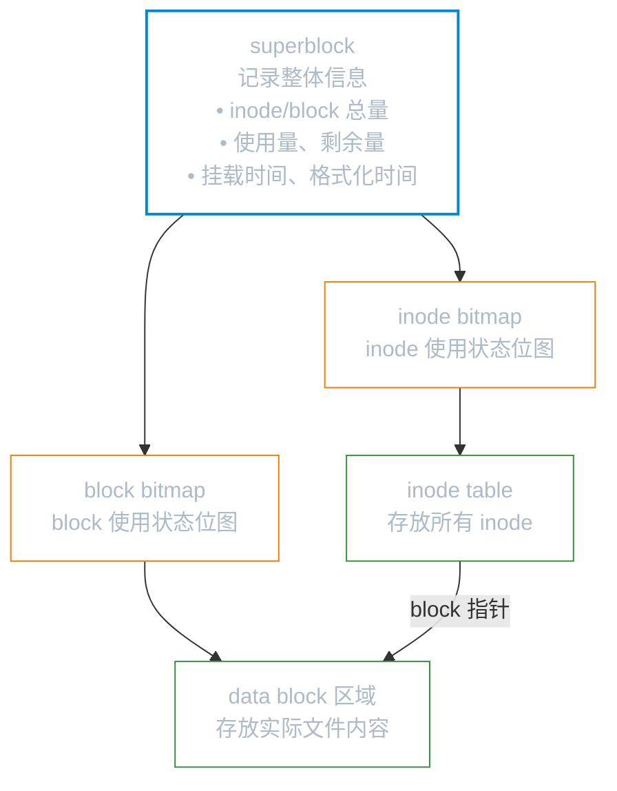
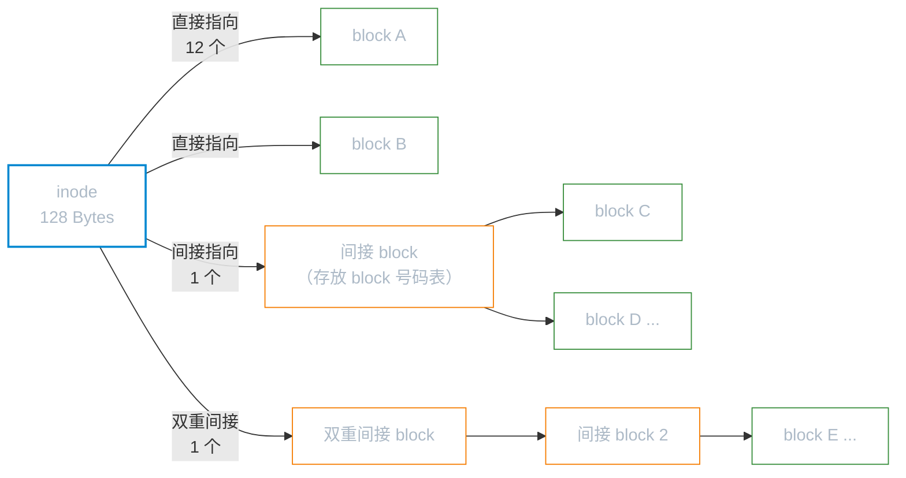
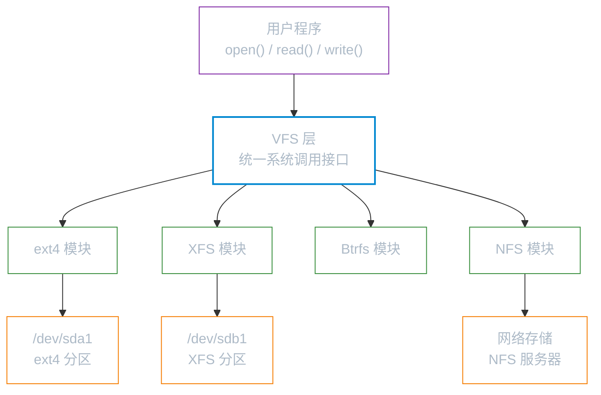
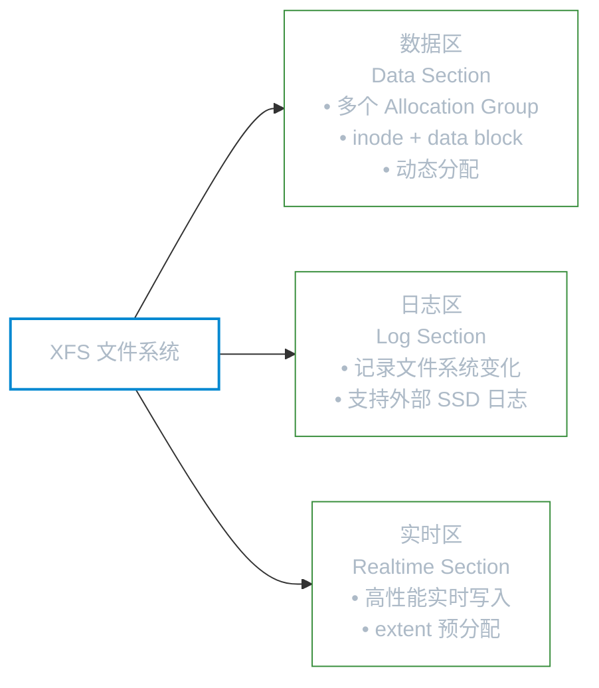

# 文件系统原理

**本文你会学到**：

- Linux 文件系统的三大核心结构：superblock、inode、data block
- 为什么文件名不存在 inode 里，而在目录的 block 中
- 间接 block 如何突破 inode 大小限制存储大文件
- 目录的本质：文件名到 inode 号的映射表
- 硬链接与软链接的底层差异
- VFS 如何让内核统一管理不同文件系统
- ext4、XFS、Btrfs 各自的设计亮点与适用场景

## 传统文件系统的三个组成部分

### 为什么需要结构化存储？

想象你有一本 1000 页的书，随手堆放的话，想找"第 300 页第 5 行"就要从头翻。但如果有一个目录（索引），告诉你"章节 X 从第 Y 页开始"，查找就快多了。

Linux 文件系统的 `inode + block` 设计，本质上就是"为磁盘数据建索引"。

### superblock、inode、data block 三者关系



**superblock**：相当于整个文件系统的"户籍登记册"，记录 `block`/`inode` 的总量、使用量、剩余量、文件系统格式等全局信息。没有 superblock，文件系统就无法被识别。`superblock` 大小通常为 1024 Bytes，每个 `block group` 都可能保有一份备份。

**inode**：每个文件（含目录）都拥有且仅拥有一个 `inode`。`inode` 记录文件的属性，但**不记录文件名**。

**data block**：存放文件的实际内容。目录文件的 `data block` 存的是"文件名 → inode 号"的映射表。

### inode 记录了什么

一个 inode 的大小固定为 128 Bytes（ext4 和 XFS 可扩展到 256 Bytes），记录以下信息：

- 文件存取权限（`rwx`）
- 文件拥有者（owner）与所属群组（group）
- 文件大小
- 创建时间（ctime）、最近读取时间（atime）、最近修改时间（mtime）
- 文件特殊属性标志（SetUID、SetGID 等）
- **指向 data block 的指针**

!!! note "inode 不存文件名"

    文件名保存在**目录**的 data block 中（目录项），而不在 inode 里。这是一个常见误解。

    正因如此，对文件重命名（`mv`）只需修改目录的 block 内容，不需要动 inode，速度极快。

### data block 大小的权衡

格式化时可以选择 block 大小：1 KB、2 KB 或 4 KB，格式化后不可更改。

| block 大小 | 最大单一文件 | 最大文件系统容量 | 适用场景 |
|-----------|------------|----------------|---------|
| 1 KB | 16 GB | 2 TB | 海量小文件（如邮件系统） |
| 2 KB | 256 GB | 8 TB | 通用 |
| 4 KB | 2 TB | 16 TB | 大文件、通用（现代默认） |

**block 越大**：大文件占用 block 数量少，读写效率高，但小文件浪费空间（每个 block 只能存一个文件的数据）。

**block 越小**：适合大量小文件，但大文件需要记录更多 block 编号，inode 压力增大。

### 用间接 block 支撑大文件

一个 inode 只有 128 Bytes，其中能直接存储的 block 号码只有 **12 个**（直接指向）。如果文件很大，12 个 block 不够用，怎么办？



以 1 KB block 为例，inode 的寻址能力：

- 12 个直接指向：`12 × 1 KB = 12 KB`
- 1 个间接 `block`（可存 256 个编号）：`256 × 1 KB = 256 KB`
- 1 个双重间接：`256 × 256 × 1 KB = 64 MB`
- 1 个三重间接：`256³ × 1 KB ≈ 16 GB`

合计最大约 16 GB，与上表 1 KB block 对应的单文件限制一致。

!!! tip "ext4 的 extent 替代方案"

    ext4 引入了 `extent` 结构来替代间接 `block` 映射。`extent` 用一个"起始 block + 连续长度"的方式描述连续空间，大幅减少元数据开销，提升大文件性能。

## 目录的本质：文件名到 inode 的映射表

在 Linux 中，目录也是一种文件，它的 data block 存放的是**目录项（directory entry）**：

```
文件名        inode 号
.             128
..            96
passwd        36628004
shadow        36628005
hosts         33596001
```

当你读取 `/etc/passwd`，内核的路径解析流程为：


这就是为什么目录的 `w` 权限控制的是**能否在目录下新增/删除/重命名文件**，而不是能否修改文件内容——因为文件名本身就写在目录的 block 里。

## 硬链接与软链接

### 硬链接：共享同一个 inode

硬链接（Hard Link）的本质：在某个目录的 data block 里新增一条 `文件名 → inode 号` 的记录，指向**已有的 inode**。

```bash title="创建硬链接"
ln /etc/crontab ~/crontab-hard
```

```bash title="查看 inode 号（两者相同）"
ls -li /etc/crontab ~/crontab-hard
# 34474855 -rw-r--r--. 2 root root 451 /etc/crontab
# 34474855 -rw-r--r--. 2 root root 451 ~/crontab-hard
```

inode 号相同，说明两个文件名指向同一份数据。删除其中任何一个文件名，只要还有其他名字指向该 inode，数据就不会丢失（inode 的"链接计数"降到 0 才会真正释放 block）。

**硬链接的两个限制**：

- ❌ **不能跨文件系统**：inode 号只在当前文件系统内唯一，跨设备毫无意义
- ❌ **不能链接目录**：若允许目录硬链接，目录树可能形成环状结构，导致路径解析陷入死循环

### 软链接：存储目标路径的独立文件

符号链接（Symbolic Link，也叫软链接）是一个**独立的新文件**，它的 data block 内容就是目标路径字符串。

```bash title="创建软链接"
ln -s /etc/crontab ~/crontab-soft
```

```bash title="查看（inode 号不同）"
ls -li /etc/crontab ~/crontab-soft
# 34474855 -rw-r--r--. 1 root root 451 /etc/crontab
# 53745909 lrwxrwxrwx. 1 root root 12 ~/crontab-soft -> /etc/crontab
```

注意软链接文件大小为 12 Bytes，正好是 `/etc/crontab` 这个字符串的字节数——软链接就是把路径字符串存到 block 里。

### 硬链接 vs 软链接对比

| 比较项目 | 硬链接 | 软链接（符号链接） |
|---------|-------|-----------------|
| 实现机制 | 目录项指向同一 inode | 独立文件，存储目标路径 |
| inode 数量 | 不增加（共用） | 新增 1 个 inode |
| 跨文件系统 | ❌ 不支持 | ✅ 支持 |
| 链接目录 | ❌ 不支持 | ✅ 支持 |
| 源文件删除后 | 仍可正常访问 | 链接失效（悬空链接） |
| 文件大小 | 与原文件相同 | 路径字符串的字节数 |
| 类比 | 同一本书的两个书签 | 书里写着"参见另一本书第 X 页" |

!!! warning "软链接的陷阱"

    使用相对路径创建软链接时，路径是相对于**链接文件本身所在目录**而言的，不是相对于当前工作目录。建议在软链接中优先使用绝对路径。

    ```bash
    # ❌ 容易出错：路径相对于 /tmp，而不是当前目录
    cd /home/user && ln -s ../etc/hosts /tmp/hosts-link

    # ✅ 推荐：绝对路径始终清晰
    ln -s /etc/hosts /tmp/hosts-link
    ```

## VFS：内核统一管理文件系统的接口层

### 没有 VFS 会发生什么？

如果内核直接和 ext4、XFS、NFS 等每种文件系统打交道，每当内核代码调用"读文件"时，就要判断"这是哪种文件系统？"，代码会变成一团乱麻。

VFS（Virtual File System，虚拟文件系统）就是为了解决这个问题而生的中间层。

### VFS 的角色



用户程序调用 `read()` 时，VFS 会找到文件所在文件系统的具体实现（如 XFS 模块），调用其 `xfs_read()` 函数，返回统一格式的数据。用户程序完全不需要关心底层是什么文件系统。

VFS 定义了四个核心对象：`superblock`（文件系统信息）、`inode`（文件元数据）、`dentry`（目录项缓存）、`file`（已打开文件）。每种文件系统只要实现这套接口，就能被内核统一调度。

## ext4 文件系统

ext4（Fourth Extended Filesystem）是 ext2 的第四代演进版本，也是 Debian/Ubuntu 系发行版的经典默认文件系统。

### 日志（Journal）防止数据不一致

ext2 时代，如果系统在"写 inode"之后、"更新 bitmap"之前突然断电，文件系统就会处于不一致状态，重启时 `e2fsck` 需要扫描整个磁盘修复，耗时极长。

ext3/ext4 引入了**日志机制**：每次修改前先在日志区记录"我要做什么"，做完后再标记完成。崩溃恢复时只需检查日志，无需全盘扫描。

ext4 提供三种日志模式：

| 模式 | 记录内容 | 性能 | 安全性 |
|------|---------|------|-------|
| `journal` | 数据 + 元数据全部写入日志 | 最低 | 最高 |
| `ordered`（默认） | 仅元数据写日志，数据先于元数据写入 | 中等 | 中等 |
| `writeback` | 仅元数据写日志，数据写入顺序不保证 | 最高 | 最低 |

### extent：替代间接 block 映射

传统的间接 block 映射对大文件效率低——一个 1 GB 的连续文件需要记录 256K 个 block 号码。

ext4 的 extent 用一个三元组 `(起始逻辑块, 起始物理块, 长度)` 描述连续的 block 范围，一个 extent 最多可描述 128 MB 的连续空间，大文件的元数据开销大幅降低。

### 延迟分配与多块分配

**延迟分配（Delayed Allocation）**：写数据时先在内存缓冲，不立即分配磁盘 block，等到数据真正落盘时才统一分配。好处是内核可以看到更大范围的数据，选择更优的连续 block 位置，减少碎片。

**多块分配（Multi-block Allocation）**：一次性为文件分配多个连续 block，减少分配次数和碎片。

## XFS 文件系统

### 为什么 Red Hat 选择了 XFS？

ext4 在格式化时需要**预先分配所有 inode**。对于 TB 级磁盘，光是格式化就要花费数十分钟（鸟哥的 70 TB 阵列格式化成 ext4，"去喝了咖啡、吃了便当才回来"）。

XFS 的 inode 和 block 是**动态分配**的——用到时才创建，格式化速度极快。RHEL 7（2014 年）正式将默认文件系统从 ext4 切换到 XFS，RHEL 8/9 延续此默认。

### XFS 的三区结构



**数据区（Data Section）**：分为多个分配组（Allocation Group，AG），类似 ext4 的 block group，但每个 AG 可以并行进行 I/O 操作，多核/多磁盘场景下性能更好。

**日志区（Log Section）**：记录文件系统变化，支持将日志放到**外部 SSD**，进一步提升写入性能。

**实时区（Realtime Section）**：为实时性要求高的写入场景提供专用空间（如视频录制）。

### XFS 的核心优势

- 🔍 **B+ 树索引**：目录项、空闲空间均用 B+ 树管理，大目录下查找文件是 O(log n)，而不是线性遍历
- ⚡ **分配组并行 I/O**：多个 AG 可同时服务不同线程的读写请求，高并发场景吞吐量显著优于 ext4
- 📦 **extent-based 存储**：与 ext4 类似，用 extent 描述连续空间，减少碎片
- 🔧 **快速崩溃恢复**：日志机制让重启后文件系统检查时间从分钟级降到秒级

!!! note "XFS 的注意事项"

    XFS 文件系统**不支持缩小**（只能扩大），规划分区大小时需要留有余量。

    使用 `xfs_repair` 修复 XFS 文件系统前，必须先确保该文件系统已**卸载**，否则可能损坏数据。

## Btrfs：下一代文件系统

Btrfs（B-tree Filesystem）是 Linux 原生的现代文件系统，设计目标是将存储管理能力内置到文件系统层：

- **COW（写时复制）**：修改数据时不覆盖原有 block，而是写到新位置，原有数据完整保留，天然支持快照
- **快照（Snapshot）**：基于 COW，创建快照几乎不消耗时间和空间，常用于备份前保护现有状态
- **子卷（Subvolume）**：文件系统内的独立命名空间，可以单独挂载、单独设置配额
- **在线均衡（Balance）**：在不卸载的情况下重新分布数据，迁移设备或调整 RAID 配置
- **内置校验和**：对数据和元数据都计算校验和，自动检测静默数据损坏（Bit Rot）

!!! info "Btrfs 的发行版现状"

    - **Fedora 33+**（2020 年）：默认文件系统
    - **openSUSE Leap/Tumbleweed**：默认文件系统（`/`），配合 Snapper 实现系统快照
    - **Ubuntu LTS**：支持但不默认
    - **RHEL/AlmaLinux/Rocky**：官方不支持（RHEL 8 起移除 Btrfs 内核模块）

## 发行版默认文件系统对比

=== "Debian/Ubuntu 系"

    | 发行版 | 默认文件系统 | 备注 |
    |--------|------------|------|
    | Debian 12 | ext4 | 长期稳定首选 |
    | Ubuntu 22.04 LTS | ext4 | 安装时可选 Btrfs |
    | Ubuntu 23.10+ | ext4（可选 Btrfs） | 桌面版安装器支持 Btrfs |

=== "Red Hat 系"

    | 发行版 | 默认文件系统 | 备注 |
    |--------|------------|------|
    | RHEL 6 / CentOS 6 | ext4 | |
    | RHEL 7 / CentOS 7 | **XFS** | 首次切换为 XFS |
    | RHEL 8/9 / AlmaLinux / Rocky Linux | **XFS** | Btrfs 不再受支持 |
    | Fedora 33+ | **Btrfs** | 桌面/工作站默认 |

=== "其他主流发行版"

    | 发行版 | 默认文件系统 | 备注 |
    |--------|------------|------|
    | openSUSE Tumbleweed | Btrfs（`/`）+ XFS（`/home`） | 结合快照与大文件性能 |
    | Arch Linux | ext4（安装时自选） | |
    | Alpine Linux | ext4 | |

## 查看文件系统信息的常用命令

### df：查看磁盘挂载点使用情况

```bash title="常用参数"
df -h          # 以易读单位（G/M）显示所有挂载点
df -hT         # 同时显示文件系统类型
df -i          # 显示 inode 使用情况（而非 block）
df -h /etc     # 查看指定目录所在分区的容量
```

`df` 读取的是 superblock 中的汇总数据，速度极快。

### du：统计目录实际占用空间

```bash title="常用参数"
du -sh /var/log       # 汇总显示目录总大小
du -ah /etc           # 列出每个文件和子目录的大小
du -sm /* 2>/dev/null # 查看根下各目录占用（排除报错）
```

`du` 会遍历文件系统内所有文件，大目录时执行较慢。

### lsblk：查看块设备树形结构

```bash title="示例"
lsblk
# NAME        MAJ:MIN RM  SIZE RO TYPE MOUNTPOINTS
# sda           8:0    0   50G  0 disk
# ├─sda1        8:1    0    1G  0 part /boot
# └─sda2        8:2    0   49G  0 part
#   ├─vg-root 253:0    0   20G  0 lvm  /
#   └─vg-home 253:1    0   29G  0 lvm  /home

lsblk -f      # 同时显示文件系统类型和 UUID
```

### blkid：查看设备 UUID 和文件系统类型

```bash title="示例"
blkid
# /dev/sda1: UUID="abc123..." TYPE="xfs" PARTLABEL="EFI"
# /dev/sda2: UUID="def456..." TYPE="ext4"

blkid /dev/sda1    # 只查看指定设备
```

UUID 是配置 `/etc/fstab` 挂载时的推荐标识方式（比设备名稳定）。

### stat：查看文件/目录的 inode 详细信息

```bash title="示例"
stat /etc/passwd
# File: /etc/passwd
# Size: 2345      Blocks: 8       IO Block: 4096  regular file
# Device: fd00h/64768d  Inode: 36628004  Links: 1
# Access: (0644/-rw-r--r--)  Uid: (0/root)  Gid: (0/root)
# Access: 2024-01-10 08:22:11
# Modify: 2024-01-09 15:30:44
# Change: 2024-01-09 15:30:44
```

`stat` 显示的 `Change` 时间（ctime）是 inode 最后一次被修改的时间，包括权限变更、重命名等操作，不仅仅是文件内容修改。

### 文件系统专用工具

```bash title="ext4 专用"
dumpe2fs -h /dev/sda2       # 查看 ext4 superblock 信息
tune2fs -l /dev/sda2        # 查看/修改 ext4 文件系统参数
e2fsck -f /dev/sda2         # 检查并修复 ext4（需先卸载）
```

```bash title="XFS 专用"
xfs_info /boot              # 查看 XFS superblock 信息
xfs_repair /dev/sdb1        # 修复 XFS（需先卸载）
xfs_growfs /                # 在线扩展 XFS（不需要卸载）
```


## VFS 虚拟文件系统

内核提供统一的文件操作接口（`open`/`read`/`write`/`close`），无论底层是 ext4、XFS、tmpfs 还是 NFS，应用程序的代码都一样。VFS（Virtual File System）是一个抽象层，将"具体文件系统的实现"与"用户空间调用"解耦。

### 四大核心对象

VFS 定义了四个核心内核对象，协同完成文件的寻址与访问：

| 对象 | 内核结构 | 说明 |
|------|---------|------|
| 超级块（superblock） | `super_block` | 已挂载文件系统的元数据 |
| 索引节点（inode） | `inode` | 文件/目录的元数据（通用层） |
| 目录项（dentry） | `dentry` | 文件名到 inode 的映射缓存 |
| 文件对象（file） | `file` | 进程打开的文件实例（含偏移量） |

```mermaid
classDiagram
    direction TD
    class super_block {
        +文件系统类型
        +挂载点
        +块大小
        +super_operations
    }
    class inode {
        +inode 编号
        +权限/所有者
        +时间戳
        +inode_operations
    }
    class dentry {
        +文件名
        +指向父 dentry
        +dentry_operations
    }
    class file {
        +当前偏移量 f_pos
        +打开标志 f_flags
        +file_operations
    }

    super_block "1" --> "n" inode : 包含
    inode "1" --> "n" dentry : 被引用
    dentry "1" --> "1" inode : 映射
    file "n" --> "1" dentry : 关联
    file "n" --> "1" inode : 关联

    classDef vfsObj fill:transparent,stroke:#0288d1,color:#adbac7,stroke-width:2px
    class super_block,inode,dentry,file vfsObj
```

### dentry 缓存（dcache）

dentry 缓存的作用是加速路径解析，避免每次都从磁盘读目录。例如访问 `/home/user/file.txt` 时，内核依次解析 `/`、`home`、`user`、`file.txt` 四个 dentry，命中缓存则无需磁盘 I/O。

```bash title="查看 dentry 缓存状态"
cat /proc/sys/fs/dentry-state
# 输出：nr_dentry  nr_unused  age_limit  want_pages  dummy  dummy
```

内存不足时内核会自动回收 dentry 缓存；也可手动触发（生产环境慎用）：

```bash title="释放 dentry + inode 缓存"
echo 2 > /proc/sys/vm/drop_caches
```

### inode 缓存

```bash title="查看 inode 缓存使用情况"
cat /proc/sys/fs/inode-nr
# 输出：已分配 inode 数 / 空闲 inode 数
```

### 挂载命名空间（mount namespace）

每个进程（组）可以拥有独立的挂载视图，互不干扰。这是容器技术实现文件系统隔离的核心机制。

- `mount --bind`：把一个目录绑定挂载到另一个路径（不复制数据，共享同一 inode 树）
- Docker/Kubernetes 大量使用挂载命名空间，容器内的 `/` 与宿主机完全隔离
- `findmnt` 命令：以树状结构查看完整挂载关系

```bash title="常用挂载命令"
# 查看挂载树
findmnt

# 绑定挂载：将 /data 挂载到 /mnt/data
mount --bind /data /mnt/data

# 查看某进程的挂载命名空间
ls -l /proc/<PID>/ns/mnt
```

---

## /proc 文件系统

`/proc` 是 procfs，一个由内核在内存中**动态生成**的虚拟文件系统，挂载在内存中，不占磁盘空间。读写 `/proc` 下的文件会直接触发内核代码执行——`cat /proc/cpuinfo` 并非读磁盘，而是内核实时生成该文本并返回给你。

### 系统级重要路径速查

| 路径 | 内容 |
|------|------|
| `/proc/cpuinfo` | CPU 型号、核数、频率、特性标志（flags） |
| `/proc/meminfo` | 内存使用详情（MemTotal/MemFree/Cached/Buffers/SwapTotal）|
| `/proc/loadavg` | 1/5/15 分钟负载 + 运行中进程数 |
| `/proc/uptime` | 系统运行时间（秒）+ 空闲时间 |
| `/proc/version` | 内核版本字符串 |
| `/proc/mounts` | 当前挂载列表（等同 `mount` 命令输出）|
| `/proc/filesystems` | 内核已支持的文件系统类型 |
| `/proc/net/tcp` | 内核 TCP 连接表（十六进制，`ss` 命令的数据来源）|
| `/proc/net/dev` | 网络接口流量统计 |
| `/proc/diskstats` | 磁盘 I/O 统计（`iostat` 数据来源）|
| `/proc/interrupts` | 各 CPU 中断统计 |
| `/proc/sys/` | 内核可调参数（sysctl 接口）|

### sysctl 与 /proc/sys 的关系

`/proc/sys/` 下的每个文件对应一个 sysctl 内核参数，两者完全等价：

- `/proc/sys/net/ipv4/ip_forward` ↔ `sysctl net.ipv4.ip_forward`（路径中的 `/` 替换为 `.`）

```bash title="修改内核参数"
# 临时修改（重启失效）
echo 1 > /proc/sys/net/ipv4/ip_forward
# 或
sysctl -w net.ipv4.ip_forward=1

# 永久生效：写入配置文件后重载
echo 'net.ipv4.ip_forward = 1' >> /etc/sysctl.d/99-custom.conf
sysctl -p /etc/sysctl.d/99-custom.conf
```

### 常用 /proc/sys 调优项

| 参数 | 默认值 | 说明 |
|------|--------|------|
| `vm.swappiness` | 60 | 内存使用率达到多高时开始 swap，0 = 尽量不换出 |
| `net.ipv4.ip_forward` | 0 | 是否开启 IP 转发（路由器/容器场景必须开启）|
| `net.core.somaxconn` | 128 | `accept` 队列最大长度（高并发服务器需调大，如 65535）|
| `fs.file-max` | 系统决定 | 全系统最大可打开文件数上限 |
| `net.ipv4.tcp_tw_reuse` | 0 | TIME_WAIT 状态的连接是否可被新连接重用 |
| `kernel.pid_max` | 32768 | 进程 PID 最大值（容器密集场景可能需要调大）|

!!! warning "生产环境调参原则"

    修改内核参数前务必在测试环境验证效果。`vm.swappiness=0` 在内存耗尽时会触发 OOM Killer 而非 swap，不适用于所有场景。

### 实用命令示例

```bash title="读取 meminfo 关键字段"
awk '/MemTotal|MemFree|Buffers|Cached|SwapTotal/ {print}' /proc/meminfo
```

```bash title="查看当前系统负载"
cat /proc/loadavg
# 示例输出：0.52 0.38 0.31 2/412 18923
# 含义：1分钟 5分钟 15分钟负载 / 运行中进程/总进程 最近PID
```

```bash title="查看与修改 sysctl 参数"
# 查看所有参数
sysctl -a

# 查看单个参数
sysctl net.core.somaxconn

# 持久化修改（推荐写入 sysctl.d）
echo 'net.core.somaxconn = 65535' >> /etc/sysctl.d/99-custom.conf
sysctl -p /etc/sysctl.d/99-custom.conf
```
