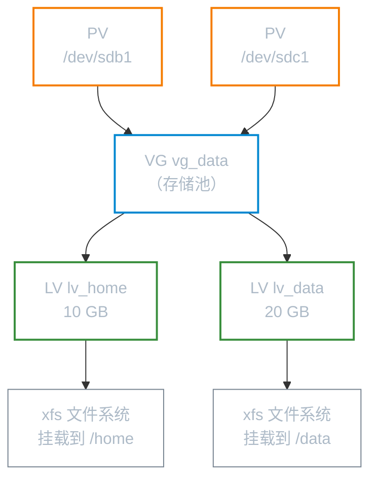
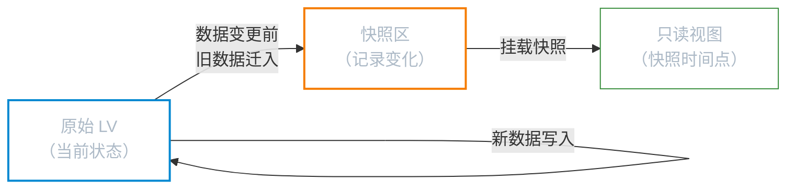

# LVM 逻辑卷管理

**本文你会学到**：

- LVM 的核心组件（PV、VG、LV、PE）及其层次关系
- 从零开始创建 LVM 的完整流程
- 在线扩容 LV 与文件系统的方法
- 利用快照（Snapshot）备份和恢复数据
- 精简配置（Thin Provisioning）的原理与用法
- 删除 LVM 的正确顺序

## 为什么需要 LVM

当初规划服务器时，把 `/home` 分了 50 GB，用着用着用户越来越多，分区撑满了。你只能新加硬盘、重新分区、格式化，然后把数据完整地复制过去，再重新挂载——费时费力。等下次又给多了，一大块空间白白浪费，想缩小又得再来一遍。

有没有一种方法，可以**在系统运行时**自由地调整分区大小，而不影响任何数据？

有，这就是 **LVM（Logical Volume Manager，逻辑卷管理器）**。

LVM 在物理磁盘和文件系统之间加了一层抽象。它的核心价值不是性能，而是**弹性**——可以随时在线扩大或缩小文件系统容量，跨多块物理磁盘整合存储空间，还能创建快照用于备份。

## 核心概念

### LVM 的四个组件



**PV（Physical Volume，物理卷）**：将物理磁盘或分区通过 `pvcreate` 初始化，使其成为 LVM 可以管理的底层单元。GPT 分区类型代码建议设为 `8e00`（Linux LVM）。

**VG（Volume Group，卷组）**：由一个或多个 PV 组成的存储池，是 LVM 的"大磁盘"。可以随时向 VG 中添加新 PV 来扩容。

**LV（Logical Volume，逻辑卷）**：从 VG 中划出的逻辑块设备，路径为 `/dev/VG名/LV名`，像普通磁盘分区一样格式化和挂载。

**PE（Physical Extent，物理区块）**：VG 的最小分配单元，默认 4 MB（`vgcreate -s` 可自定义）。LV 的大小必须是 PE 的整数倍，LV 的大小实际上就是它所占用的 PE 总数乘以 PE 大小。对应的 LE（Logical Extent）是 LV 视角下的叫法，大小与 PE 相同。

### LVM 的核心优势

- 🔧 **在线扩展**：无需卸载文件系统，直接扩大 LV 并同步扩展文件系统
- 📸 **快照（Snapshot）**：瞬间创建一个"时间点副本"，用于备份或测试
- 📦 **跨磁盘整合**：多块物理磁盘统一进入同一个 VG，像一块大磁盘一样使用
- 💡 **精简配置（Thin Provisioning）**：分配超过实际物理空间的逻辑容量，按实际写入占用

## 创建 LVM

整个流程按照 PV → VG → LV → 文件系统的顺序依次进行。

### 准备物理卷（PV）

```bash
# 将分区初始化为 PV（可以一次指定多个）
pvcreate /dev/sdb1 /dev/sdc1

# 搜索系统中所有 PV
pvscan

# 查看 PV 详细信息
pvdisplay /dev/sdb1

# 简洁输出所有 PV
pvs
```

!!! tip "分区类型代码"

    使用 `gdisk` 时，建议将用于 LVM 的分区类型代码改为 `8e00`（Linux LVM）。虽然不改也能工作，但这样管理员一眼就能看出该分区的用途，且部分自动侦测工具依赖此标识。

### 创建卷组（VG）

```bash
# 创建 VG，指定 PE 大小为 16 MB
vgcreate -s 16M vg_data /dev/sdb1 /dev/sdc1

# 不指定 -s 则使用默认 PE 大小（4 MB）
vgcreate vg_data /dev/sdb1 /dev/sdc1

# 查看 VG 详细信息（含可用 PE 数量）
vgdisplay vg_data

# 简洁输出
vgs
```

!!! note "PE 大小的影响"

    PE 越大，VG 能表示的最大容量越大，但分配的最小粒度也越粗。在 64 位系统上（lvm2 格式），默认 4 MB PE 已经够用，无需调整。

### 创建逻辑卷（LV）

```bash
# 按容量创建（-L 后接大小，单位 M/G/T）
lvcreate -L 10G -n lv_home vg_data

# 按 PE 数量创建（-l 后接 PE 个数）
lvcreate -l 128 -n lv_home vg_data

# 使用 VG 内全部剩余空间
lvcreate -l 100%FREE -n lv_data vg_data

# 查看 LV 详细信息（注意使用 LV 全名）
lvdisplay /dev/vg_data/lv_home

# 简洁输出
lvs
```

### 格式化并挂载

```bash
# 格式化为 XFS
mkfs.xfs /dev/vg_data/lv_home

# 格式化为 ext4
mkfs.ext4 /dev/vg_data/lv_home

# 创建挂载点并挂载
mkdir /home
mount /dev/vg_data/lv_home /home

# 验证挂载结果
df -Th /home
```

永久挂载写入 `/etc/fstab`，建议用 UUID（不受设备名变化影响）：

```bash
# 查询 UUID
blkid /dev/vg_data/lv_home
```

```bash title="/etc/fstab 示例"
UUID=xxxxxxxx-xxxx-xxxx-xxxx-xxxxxxxxxxxx  /home  xfs  defaults  0  2
```

## LV 扩容

LVM 最常用的功能就是在线扩容，无需停机。

### ext4 扩容

```bash
# 方法一：分步执行
lvextend -L +5G /dev/vg_data/lv_home   # 扩大 LV
resize2fs /dev/vg_data/lv_home          # 同步扩展 ext4 文件系统

# 方法二：-r 参数自动同步文件系统（推荐）
lvextend -L +5G -r /dev/vg_data/lv_home

# 扩展到指定总大小
lvextend -L 20G -r /dev/vg_data/lv_home
```

### XFS 扩容

XFS 扩容**必须在挂载状态下**进行（`xfs_growfs` 作用于挂载点，不是设备）：

```bash
lvextend -L +5G /dev/vg_data/lv_data
xfs_growfs /data   # 参数是挂载点，不是设备名

# 同样可以用 -r 一步完成
lvextend -L +5G -r /dev/vg_data/lv_data
```

!!! warning "XFS 不支持缩容"

    XFS 文件系统**只能扩大，不能缩小**。如果你的 LV 需要缩容，请使用 ext4 文件系统。如果已经是 XFS，只能用快照+备份的方式迁移数据到新 LV。

## VG 扩容（添加新磁盘）

当 VG 的剩余空间不足以继续扩大 LV 时，需要先向 VG 添加新的 PV：

```bash
# 新磁盘初始化为 PV
pvcreate /dev/sdd1

# 将新 PV 加入 VG
vgextend vg_data /dev/sdd1

# 确认 VG 容量已增加
vgdisplay vg_data
```

之后再按正常流程扩大 LV 即可。

## LV 缩容（仅限 ext4）

!!! danger "高风险操作"

    缩容前必须先卸载文件系统，且必须先缩文件系统再缩 LV，顺序**绝对不能颠倒**！如果先缩 LV，文件系统末尾的数据会丢失，导致文件系统损坏。操作前务必备份数据。

```bash
# 第一步：卸载
umount /dev/vg_data/lv_home

# 第二步：检查文件系统（必须）
e2fsck -f /dev/vg_data/lv_home

# 第三步：缩小文件系统（必须先于 LV 缩减）
resize2fs /dev/vg_data/lv_home 8G

# 第四步：缩小 LV（容量须与上一步一致）
lvreduce -L 8G /dev/vg_data/lv_home

# 第五步：重新挂载
mount /dev/vg_data/lv_home /home
```

## LVM 快照

### 快照的工作原理

快照创建时，LVM 在同一个 VG 内划出一块空间作为"变化日志区"。初始状态下快照与原 LV 共享所有数据（不复制）。之后每当原 LV 的某块数据被修改，**旧数据**会先被移入快照区保存，新数据写入原 LV。



这意味着快照极其节省空间：没有发生变化的数据不占用快照区，只有被修改过的数据块才会占用。

### 创建与使用快照

```bash
# 创建快照（-s 表示 snapshot，-l 指定快照区 PE 数量）
lvcreate -s -l 26 -n snap_home /dev/vg_data/lv_home

# 或用容量指定快照区大小
lvcreate -L 2G -s -n snap_home /dev/vg_data/lv_home

# 查看快照状态（注意 Allocated to snapshot 百分比）
lvdisplay /dev/vg_data/snap_home
```

挂载快照查看数据（XFS 需加 `nouuid`，因快照与原 LV 的 UUID 相同）：

```bash
mkdir /mnt/snap
mount -o ro,nouuid /dev/vg_data/snap_home /mnt/snap
```

### 利用快照备份

快照挂载后，可以对其进行完整备份，此时原 LV 仍正常运行，互不影响：

```bash
# 用 xfsdump 备份快照（XFS 文件系统）
xfsdump -l 0 -L snap1 -M snap1 -f /backup/home.dump /mnt/snap

# 备份完成后卸载并删除快照
umount /mnt/snap
lvremove /dev/vg_data/snap_home
```

### 删除快照

```bash
umount /dev/vg_data/snap_home   # 先卸载（如果已挂载）
lvremove /dev/vg_data/snap_home
```

!!! warning "快照区空间满了会失效"

    如果原 LV 数据变化量超过了快照区的容量，快照会自动失效（`lvdisplay` 中 `Allocated to snapshot` 达到 100%）。创建快照时应根据预期变化量分配足够大的快照区。

## 精简配置（Thin Provisioning）

### 什么是精简配置

传统 LV 在创建时就固定占用 VG 的空间。如果你想给 3 个测试环境各分 10 GB，但实际 VG 只剩 15 GB，就没法创建。

精简配置解决这个问题：先创建一个**精简池（Thin Pool）**，再从池中创建**精简卷**。精简卷在创建时只是"宣告"一个大小，**实际存储空间按写入量动态分配**。

```bash
# 创建 20 GB 的精简池
lvcreate -L 20G -T vg_data/thin_pool

# 从精简池创建一个"宣称" 100 GB 的精简卷
# 实际只占用写入量的空间
lvcreate -V 100G --thin -n lv_thin vg_data/thin_pool

# 查看精简池和精简卷的实际占用
lvs vg_data
```

!!! danger "精简配置的风险"

    精简池一旦实际写入量超过其物理容量，整个 thin pool 会崩溃，所有精简卷的数据都会损坏。使用精简配置时**必须**监控 thin pool 的实际使用率（`lvs` 中的 `Data%` 列），并在接近满额之前扩容或清理。

## 删除 LVM

删除顺序**严格从上到下**：先 LV，再 VG，最后 PV。

```bash
# 第一步：卸载所有相关文件系统
umount /home
umount /data

# 第二步：删除 LV（-f 强制，或交互确认）
lvremove /dev/vg_data/lv_home
lvremove /dev/vg_data/lv_data

# 第三步：删除 VG
vgremove vg_data

# 第四步：清除 PV 属性
pvremove /dev/sdb1 /dev/sdc1
```

## 常用命令速查

| 操作 | PV 命令 | VG 命令 | LV 命令 |
|------|---------|---------|---------|
| 创建 | `pvcreate` | `vgcreate` | `lvcreate` |
| 搜索 | `pvscan` | `vgscan` | `lvscan` |
| 详细查看 | `pvdisplay` | `vgdisplay` | `lvdisplay` |
| 简洁查看 | `pvs` | `vgs` | `lvs` |
| 扩展 | — | `vgextend` | `lvextend` / `lvresize` |
| 缩减 | — | `vgreduce` | `lvreduce` / `lvresize` |
| 删除 | `pvremove` | `vgremove` | `lvremove` |

## 发行版差异

=== "Debian / Ubuntu"

    默认**不安装** lvm2，需要手动安装：

    ```bash
    apt install lvm2
    ```

    安装后 `lvm2` 服务会自动扫描并激活已有 LVM 卷。配置文件位于 `/etc/lvm/lvm.conf`。

    Ubuntu 安装器（Ubiquity / Subiquity）在"高级分区"选项中支持创建 LVM 布局，但默认不启用。

=== "Red Hat / RHEL / CentOS"

    `lvm2` **默认已安装**，无需额外操作。

    RHEL 8+ 的 Anaconda 安装器在选择自动分区时会默认使用 LVM 布局（ESP + `/boot` 使用标准分区，`/`、`/home`、`swap` 等划入 LVM）。

    LVM 卷通过 `systemd-udev` 在启动时自动激活。也可以手动激活：

    ```bash
    vgchange -ay   # 激活所有 VG
    ```

