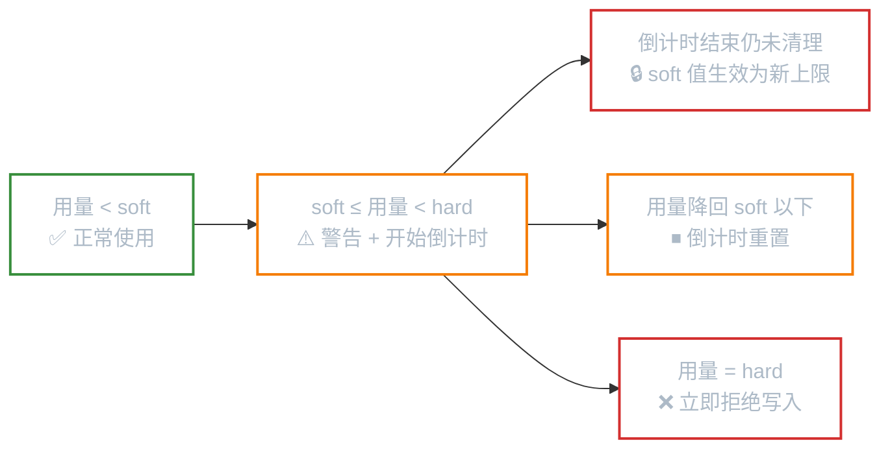

# 磁盘配额

**本文你会学到**：

- 为什么多用户系统必须限制磁盘用量
- 软限制、硬限制、宽限时间三者的关系
- XFS 文件系统的用户/组/项目配额完整操作流程
- ext4 传统 quota 工具的对应用法
- quota 的暂停、恢复与移除管理

## 为什么需要磁盘配额

想象一台共享给 30 人使用的服务器，`/home` 分区共 10 GB，每人平均应该能用 333 MB。结果某个用户把自己的视频文件全塞进来，占了 8 GB，其他 29 个人挤在剩下的 2 GB 里——这就是没有配额管控的后果。

**Quota（磁盘配额）** 就是管理员限制每个用户（或组、目录）能使用多少磁盘空间（block 用量）和创建多少文件（inode 用量）的机制，让存储资源分配保持公平。

常见应用场景：

- Web 服务器限制每个用户的网页空间
- 邮件服务器限制每人的邮箱大小
- 共享文件服务器限制各部门目录容量

### 软限制、硬限制与宽限时间

quota 的限制值分为两档：

**硬限制（hard limit）**：用量的绝对上限，到达后系统直接拒绝写入，不管任何情况都不允许超过。

**软限制（soft limit）**：警告线，通常设得比 hard 低。用量介于 soft 和 hard 之间时，系统不会立刻拒绝，而是给出警告并启动一个倒计时——这就是**宽限时间（grace time）**，默认 7 天。



宽限时间内用户降回 soft 限制以下，倒计时清零；若宽限时间到期仍未清理，soft 值会"升格"为实际上限，用量无法再增加。

### 配额的三个维度

| 维度 | 说明 | 支持文件系统 |
|------|------|------------|
| 用户配额（user quota） | 限制每个用户的总用量 | ext4、XFS |
| 组配额（group quota） | 限制整个组的总用量 | ext4、XFS |
| 项目配额（project quota） | 限制某个**目录**的总用量，不论文件属于谁 | 仅 XFS |

!!! warning "注意"

    `grpquota`（组配额）与 `prjquota`（项目配额）**不能同时启用**。根据需求二选一。

!!! note "quota 的限制范围"

    quota 只对**普通用户**有效，`root` 不受 quota 限制。另外，quota 是基于整个文件系统（挂载点）的，EXT 家族无法跨挂载点合并统计；XFS 的 project 模式才能针对单一目录限额。

## XFS 磁盘配额（推荐方案）

CentOS 7+、RHEL 7+、Rocky Linux 等现代发行版默认使用 XFS 文件系统。XFS 将 quota 原生集成到文件系统中，无需额外的配额记录文件，性能比 EXT 家族的外挂方案更好，且统计速度远快于 `du`。

### 启用配额挂载参数

XFS 的 quota 必须在**挂载时**声明，`mount -o remount` 无法后期追加，必须写入 `/etc/fstab`。

``` bash title="编辑 /etc/fstab，以 /home 分区为例"
# 用户 + 组配额（二者可共存）
/dev/mapper/centos-home  /home  xfs  defaults,usrquota,grpquota  0 0

# 用户 + 项目配额（组和项目不可共存）
/dev/mapper/centos-home  /home  xfs  defaults,usrquota,prjquota  0 0
```

挂载选项说明：

- `uquota` / `usrquota` / `quota`：启用用户配额
- `gquota` / `grpquota`：启用组配额
- `pquota` / `prjquota`：启用项目配额（不能与 grpquota 共存）

修改完成后重新挂载生效：

``` bash
umount /home
mount -a
# 确认挂载选项已生效
mount | grep home
```

### 查看配额状态

`xfs_quota` 是 XFS 配额管理的唯一工具，所有操作都通过它完成。

``` bash
# 列出文件系统和配额挂载参数
xfs_quota -x -c "print"

# 查看 /home 的 quota 启用状态（含 grace time）
xfs_quota -x -c "state" /home

# 查看所有用户的配额使用情况（-b block，-i inode，-h 人性化单位）
xfs_quota -x -c "report -ubih" /home

# 查看组配额报告
xfs_quota -x -c "report -gbih" /home

# 查看项目配额报告
xfs_quota -x -c "report -pbih" /home
```

`report` 输出各列含义：

| 列名 | 说明 |
|------|------|
| Used | 当前已使用量 |
| Soft | 软限制值（0 表示不限制） |
| Hard | 硬限制值（0 表示不限制） |
| Warn/Grace | 已触发警告次数 / 宽限时间倒计时 |

### 设置用户配额

``` bash
# 设置单用户的 block 软/硬限制（支持 K/M/G 单位）
xfs_quota -x -c "limit -u bsoft=250M bhard=300M alice" /home

# 同时限制 block 和 inode（文件数量）
xfs_quota -x -c "limit -u bsoft=250M bhard=300M isoft=1000 ihard=1200 bob" /home

# 批量设置多个用户（重复执行即可）
for user in alice bob charlie; do
    xfs_quota -x -c "limit -u bsoft=250M bhard=300M $user" /home
done
```

### 设置组配额

``` bash
# 限制 devteam 组共用不超过 1 GB（软限制 950M）
xfs_quota -x -c "limit -g bsoft=950M bhard=1G devteam" /home

# 查看组的使用报告
xfs_quota -x -c "report -gbh" /home
```

### 修改宽限时间

``` bash
# 将用户和组的 block 宽限时间设为 14 天
xfs_quota -x -c "timer -ug -b 14days" /home

# 确认修改结果
xfs_quota -x -c "state" /home
```

### 项目配额（按目录限额）

当多个不同用户共同向同一目录写文件时（例如 Web 服务的 `httpd` 用户统一管理的目录），用用户配额无法针对目录整体限额，这时需要 **project quota**。

项目配额通过"项目 ID + 目录路径"的映射来实现，由两个配置文件维护：

- `/etc/projects`：项目 ID → 目录路径的映射
- `/etc/projid`：项目 ID → 项目名称的映射

完整设置流程如下：

**第一步：修改挂载参数为 `prjquota`（并重新挂载）**

``` bash
# /etc/fstab 中将 grpquota 替换为 prjquota
/dev/mapper/centos-home  /home  xfs  defaults,usrquota,prjquota  0 0

umount /home && mount -a
xfs_quota -x -c "state" /home  # 确认 Project quota Accounting: ON
```

**第二步：注册项目 ID 和目录**

``` bash
# 为 /home/myquota 目录分配项目 ID 11，名称 myquotaproject
echo "11:/home/myquota" >> /etc/projects
echo "myquotaproject:11" >> /etc/projid
```

**第三步：初始化项目**

``` bash
xfs_quota -x -c "project -s myquotaproject" /home

# 确认目录已关联到项目
xfs_quota -x -c "print" /home
```

**第四步：设置限额并验证**

``` bash
# soft=450M，hard=500M
xfs_quota -x -c "limit -p bsoft=450M bhard=500M myquotaproject" /home

# 查看项目配额报告
xfs_quota -x -c "report -pbih" /home
```

!!! tip "项目配额不受文件属主影响"

    即使是 `root` 向该目录写文件，也会被项目配额限制住。这是与用户/组配额最大的区别，非常适合 WWW、FTP 等服务场景。

### 配额的暂停与恢复

日常维护中，有时需要临时解除限制（如批量导入数据），完成后再恢复，这时用 `disable/enable`，而不是卸载重挂：

``` bash
# 暂时关闭用户和项目的配额强制执行（计算仍在继续）
xfs_quota -x -c "disable -up" /home

# 恢复强制执行
xfs_quota -x -c "enable -up" /home
```

!!! warning "off 与 remove 的区别"

    - `disable`：暂停强制执行，用 `enable` 可恢复，**推荐日常使用**
    - `off`：完全关闭，无法用 `enable` 恢复，必须卸载重挂载才能重启配额
    - `remove`：在 `off` 状态下才能使用，会**移除所有限制值设置**（不可撤销）

    ``` bash
    # 完全关闭后移除 project 配额所有限制值（谨慎！）
    xfs_quota -x -c "off -up" /home
    xfs_quota -x -c "remove -p" /home
    umount /home && mount -a
    ```

## ext4 传统 quota 工具

如果你使用的是 ext4 文件系统，需要使用传统的 `quota` 软件包提供的工具集。

### 安装与启用

=== "Debian / Ubuntu"

    ``` bash
    apt install quota
    ```

=== "RHEL / CentOS / Rocky"

    ``` bash
    dnf install quota
    ```

修改 `/etc/fstab` 添加挂载选项：

``` bash title="/etc/fstab（ext4 挂载选项）"
/dev/sda2  /home  ext4  defaults,usrquota,grpquota  0 2
```

重新挂载并初始化配额数据库文件：

``` bash
mount -o remount /home

# 生成 aquota.user 和 aquota.group（-m 允许在已挂载状态下运行）
quotacheck -cugm /home

# 启用配额
quotaon /home
```

### 设置与查看配额

``` bash
# 交互式编辑用户配额（打开 $EDITOR）
edquota -u alice

# 设置宽限时间（全局，打开编辑器）
edquota -t

# 从参考用户复制配额设置给其他用户
edquota -p alice bob charlie

# 快速非交互设置（setquota，单位 KB）
setquota -u alice 256000 307200 0 0 /home

# 查看单用户配额
quota -u alice

# 报告所有用户配额（-a 所有文件系统，-s 可读单位）
repquota -as

# 含组配额的报告
repquota -augs

# 关闭配额
quotaoff /home
```

`edquota` 打开的配置格式说明：

```
Filesystem  blocks  soft    hard    inodes  soft  hard
/dev/sda2   50000   250000  300000  0       0     0
```

- `blocks` / `inodes`：当前已使用量（不要手动修改）
- `soft` / `hard`：软/硬限制（单位 KB，0 表示不限制）

## XFS 与 ext4 操作对照

| 操作 | XFS | ext4 |
|------|-----|------|
| fstab 参数 | `usrquota` / `grpquota` / `prjquota` | `usrquota` / `grpquota` |
| 初始化配额文件 | 不需要 | `quotacheck -cugm` |
| 设置用户/组限额 | `xfs_quota -x -c "limit..."` | `edquota` 或 `setquota` |
| 设置宽限时间 | `xfs_quota -x -c "timer..."` | `edquota -t` |
| 目录（project）限额 | `xfs_quota -x -c "limit -p..."` | ❌ 不支持 |
| 查看报告 | `xfs_quota -x -c "report..."` | `repquota` / `quota` |
| 启动/停止配额 | `xfs_quota -x -c "enable/disable..."` | `quotaon` / `quotaoff` |
| 发送警告邮件 | 暂未支持 | `warnquota` |

## 配额管理最佳实践

**限制值的设置原则**：硬限制通常设为软限制的 120%～150%，让宽限时间有实际意义。例如软限制 250 MB、硬限制 300 MB，用户有 50 MB 的缓冲空间和 7 天的整理时间。

**宽限时间建议**：默认 7 天适合大多数场景，生产环境可根据业务周期调整（如按周为单位的工作场景设为 14 天）。

**定期报告**：通过 cron 定期检查配额使用情况，提前发现接近上限的用户：

``` bash
# 每天发送配额报告邮件（crontab 中）
0 8 * * 1 repquota -as /home | mail -s "Weekly Quota Report" admin@example.com
```

**跨文件系统的 quota 技巧**：如果 `/var/spool/mail`（邮件目录）与 `/home` 不在同一分区，无法直接对邮件目录设 quota，可以将邮件目录移入 `/home` 并创建符号链接：

``` bash
mv /var/spool/mail /home/mail
ln -s /home/mail /var/spool/mail
# 然后对 /home 设置 quota 即可统一计算
```

!!! warning "SELinux 注意事项"

    启用 SELinux 的系统中，quota 默认只能针对 `/home` 目录生效。如需对其他目录（如 `/var/spool/mail`）设置配额，需要调整 SELinux 上下文或规则。

