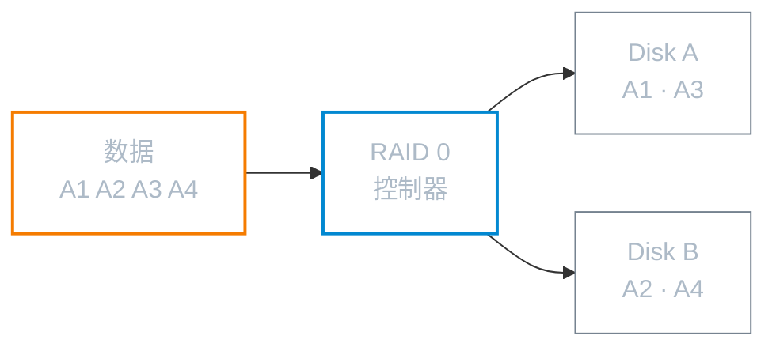
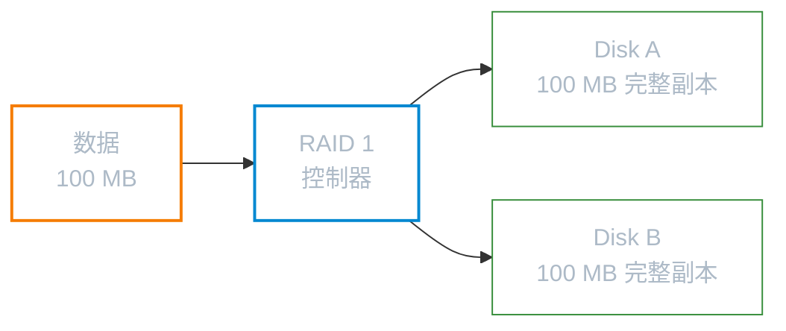
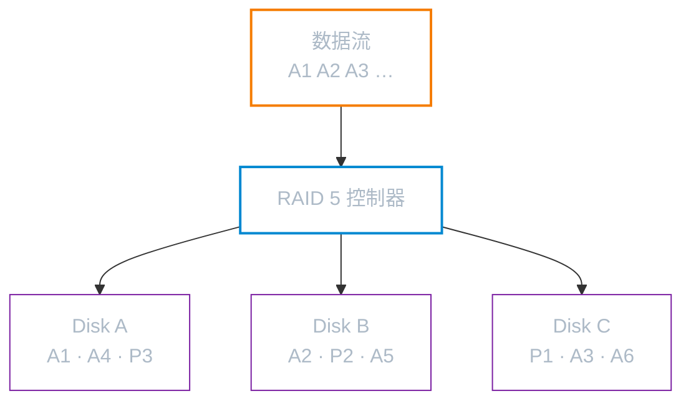
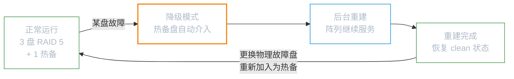
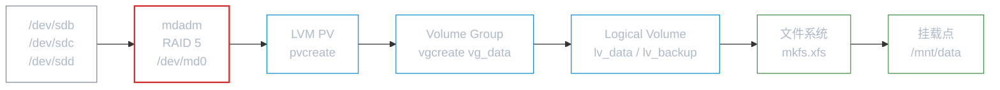

# 软件 RAID

**本文你会学到**：

- RAID 的核心概念与各级别（0/1/5/6/10）的差异
- 如何用 `mdadm` 在 Linux 上创建、管理软件 RAID
- 热备盘机制与磁盘故障恢复流程
- RAID 监控、持久化配置与告警
- 软件 RAID 与硬件 RAID 的选型建议
- RAID + LVM 的推荐组合架构

## 为什么需要 RAID

当你的业务数据只存放在单块磁盘上，任何一次磁盘故障都意味着数据丢失或服务中断。RAID（Redundant Arrays of Inexpensive Disks，容错式廉价磁盘阵列）通过**将多块磁盘整合为一个逻辑设备**，同时解决三个问题：

- ⚡ **读写性能**：多盘并行 I/O，理论吞吐量随磁盘数线性增长
- 🛡️ **数据可靠性**：允许一块或多块磁盘故障而不丢失数据
- 📦 **容量聚合**：将多块小磁盘组合成更大的存储空间

不同的 RAID 级别在这三个维度上的取舍各不相同，需根据场景选择。

## RAID 级别对比

### 各级别核心特性

| 级别 | 最少磁盘 | 容量利用率 | 读性能 | 写性能 | 可容错 | 典型用途 |
|------|---------|-----------|-------|-------|-------|---------|
| RAID 0 | 2 | 100% | ↑↑ | ↑↑ | 无 | 临时数据/性能优先 |
| RAID 1 | 2 | 50% | ↑ | ≈ | 1 块 | 系统盘/重要数据 |
| RAID 5 | 3 | (n-1)/n | ↑ | ↓ | 1 块 | 通用存储 |
| RAID 6 | 4 | (n-2)/n | ↑ | ↓↓ | 2 块 | 大型存储/归档 |
| RAID 10 | 4 | 50% | ↑↑ | ↑ | 每组 1 块 | 数据库/高负载 |

!!! tip "选型速记"

    - 追求**纯性能**、数据无所谓 → RAID 0
    - 追求**高可靠**、容量效率不敏感 → RAID 1 或 RAID 10
    - **均衡**性能与可靠性、容量利用率较高 → RAID 5
    - 需要**双盘容错**、大容量归档 → RAID 6
    - **云/数据库/高负载**生产环境 → RAID 10（性能最优）

### RAID 0：条带化（Stripe）

每块磁盘被切成等大的 chunk（一般 4K~1M），写入时数据**轮流分布**到所有磁盘。n 块磁盘读写吞吐量理论上是单盘的 n 倍，总容量也是所有磁盘之和。

**致命弱点**：任何一块磁盘损坏，阵列内所有数据均不可恢复。不提供任何冗余。



### RAID 1：镜像（Mirror）

同一份数据**完整写入所有磁盘**。读取时可从多盘负载均衡，写入时每盘都得写一遍。总容量只有单盘大小（以最小磁盘为准）。

任意一块磁盘损坏，数据依然完整保留。



### RAID 5：带奇偶校验的条带化

至少 3 块磁盘。数据条带化写入，同时在**每轮循环中轮流在不同磁盘写入奇偶校验块（Parity）**。任意一块磁盘损坏后，可用其余磁盘的数据与校验块重建丢失数据。

总容量为 (n-1) 块磁盘大小。写入性能因需实时计算 Parity 而有所下降（特别是软件 RAID 会消耗 CPU）。



### RAID 10：RAID 1+0

先将磁盘两两组成 RAID 1（镜像组），再将所有镜像组组成 RAID 0（条带化）。同时获得 RAID 1 的可靠性和 RAID 0 的性能。

每组镜像最多允许坏 1 块，整体最多可同时坏 n/2 块（但需分散在不同镜像组）。重建时只需从对应镜像盘复制，**比 RAID 5 重建快得多**。云和数据库生产环境首选。

## mdadm 工具（Linux 软件 RAID）

Linux 内核原生支持软件 RAID，通过 `mdadm` 工具管理。软件 RAID 设备文件名为 `/dev/md0`、`/dev/md1` 等（与硬件 RAID 的 `/dev/sda` 不同）。

### 安装 mdadm

=== "Debian / Ubuntu"

    ```bash
    apt install mdadm
    ```

=== "RHEL / CentOS / Rocky"

    ```bash
    dnf install mdadm
    ```

### 创建 RAID 阵列

```bash
# 创建 RAID 5（3 块数据盘 + 1 块热备）
mdadm --create /dev/md0 --level=5 --raid-devices=3 \
      /dev/sdb /dev/sdc /dev/sdd \
      --spare-devices=1 /dev/sde

# 创建 RAID 1（2 块镜像盘）
mdadm --create /dev/md1 --level=1 --raid-devices=2 /dev/sdf /dev/sdg

# 创建 RAID 10（4 块盘）
mdadm --create /dev/md2 --level=10 --raid-devices=4 \
      /dev/sdh /dev/sdi /dev/sdj /dev/sdk
```

主要参数说明：

| 参数 | 说明 |
|------|------|
| `--create` | 创建新阵列 |
| `--level=N` | RAID 级别，支持 0、1、5、6、10 |
| `--raid-devices=N` | 参与阵列的磁盘数量 |
| `--spare-devices=N` | 热备盘数量 |
| `--chunk=NK` | 条带块大小（如 `256K`），影响读写性能 |

### 查看创建进度

```bash
# 查看所有阵列状态（包括同步进度）
cat /proc/mdstat

# 查看指定阵列详情
mdadm --detail /dev/md0
```

`/proc/mdstat` 输出示例：

```
md0 : active raid5 sdd[3](S) sdc[2] sdb[1] sda[0]
      3142656 blocks super 1.2 level 5, 256k chunk, algorithm 2 [3/3] [UUU]
```

- `(S)` — spare 热备盘
- `[3/3] [UUU]` — 需要 3 块盘，3 块均正常（U=正常，_=故障）

### 格式化并挂载

```bash
# 格式化为 XFS（RAID 5，3 块数据盘，chunk=256K）
# su=单盘条带大小，sw=数据盘数量
mkfs.xfs -f -d su=256k,sw=2 -r extsize=512k /dev/md0

# 或格式化为 ext4
mkfs.ext4 /dev/md0

# 挂载
mkdir -p /mnt/raid
mount /dev/md0 /mnt/raid

# 验证
df -Th /mnt/raid
```

!!! note "XFS 条带优化参数"

    对于 RAID 5（3 盘，chunk=256K）：
    
    - `su=256k` — 单盘条带大小等于 chunk
    - `sw=2` — 数据盘数量（RAID 5 总盘数减 1）
    - `extsize=512k` — 实际宽度 = su × sw = 256K × 2 = 512K

### 持久化配置

创建 RAID 后需保存配置，否则重启可能无法自动组装阵列。

=== "Debian / Ubuntu"

    ```bash
    # 追加到配置文件
    mdadm --detail --scan >> /etc/mdadm/mdadm.conf
    
    # 更新 initramfs（使开机时能识别阵列）
    update-initramfs -u
    
    # 在 /etc/fstab 中添加持久挂载（用 UUID 更稳定）
    blkid /dev/md0
    # 将 UUID 写入 /etc/fstab：
    # UUID=xxxx-xxxx  /mnt/raid  xfs  defaults  0  0
    ```

=== "RHEL / CentOS / Rocky"

    ```bash
    # 追加到配置文件
    mdadm --detail --scan >> /etc/mdadm.conf
    
    # 重新生成 initramfs
    dracut -f
    
    # 同样在 /etc/fstab 中添加持久挂载
    blkid /dev/md0
    ```

## 日常管理操作

### 查看阵列状态

```bash
# 实时查看所有阵列
cat /proc/mdstat

# 详细信息（磁盘状态、UUID、容量等）
mdadm --detail /dev/md0

# 查询某块盘属于哪个阵列
mdadm --examine /dev/sdb
```

`mdadm --detail` 关键字段：

| 字段 | 含义 |
|------|------|
| `State: clean` | 阵列正常 |
| `State: degraded` | 降级模式（有磁盘故障，但仍可用） |
| `State: recovering` | 正在重建 |
| `Failed Devices` | 故障磁盘数 |
| `Spare Devices` | 热备盘数 |

### 模拟故障与恢复

```bash
# 模拟磁盘故障（将某盘标记为 faulty）
mdadm /dev/md0 --fail /dev/sdb

# 从阵列中移除故障盘
mdadm /dev/md0 --remove /dev/sdb

# 加入新磁盘（自动开始重建）
mdadm /dev/md0 --add /dev/sdh
```

!!! warning "重建期间阵列仍可读写"

    热备盘介入后，阵列进入 `recovering`（降级+重建）状态，**数据仍可正常访问**。但此时若再有一块盘损坏（RAID 5），数据将完全丢失。重建期间务必尽快替换故障盘。

### 停止与重新组装

```bash
# 停止 RAID（卸载后才能停止）
umount /mnt/raid
mdadm --stop /dev/md0

# 重新组装（系统通常开机自动执行）
mdadm --assemble /dev/md0

# 扫描并组装所有阵列
mdadm --assemble --scan
```

### 扩容 RAID 5

```bash
# 向阵列添加新磁盘
mdadm --add /dev/md0 /dev/sdi

# 增加阵列成员数（触发扩容重构，耗时较长）
mdadm --grow /dev/md0 --raid-devices=4

# 等待重构完成（观察 /proc/mdstat 中 reshape 进度）
watch cat /proc/mdstat

# 重构完成后扩展文件系统（XFS 只支持扩大不支持缩小）
xfs_growfs /mnt/raid

# 如果是 ext4
resize2fs /dev/md0
```

## 热备盘（Hot Spare）

热备盘**平时不参与读写**，静默待命。当阵列中有磁盘故障时，系统自动将热备盘拉入阵列并开始重建，无需人工干预。

```bash
# 创建阵列时指定热备盘
mdadm --create /dev/md0 --level=5 --raid-devices=3 \
      /dev/sdb /dev/sdc /dev/sdd \
      --spare-devices=1 /dev/sde

# 向已有阵列添加热备盘
mdadm /dev/md0 --add /dev/sdj
# （新加的盘如果不够组成完整阵列，会自动成为热备）
```

热备盘的典型工作流程：



## RAID 监控与告警

磁盘故障往往无声发生，必须配置监控以便及时响应。

```bash
# 启用 mdadm 监控守护进程
systemctl enable mdmonitor
systemctl start mdmonitor

# 查看监控服务状态
systemctl status mdmonitor

# 手动测试告警（发送测试邮件）
mdadm --monitor --test /dev/md0
```

在 `/etc/mdadm/mdadm.conf`（Debian）或 `/etc/mdadm.conf`（RHEL）中配置告警邮件：

```bash title="/etc/mdadm/mdadm.conf"
# 告警邮件接收地址
MAILADDR admin@example.com

# 也可以发给 root（需配置本地 MTA 或邮件转发）
# MAILADDR root@localhost
```

!!! note "没有 MTA 怎么办"

    如果服务器没有配置邮件服务，可以改用 `PROGRAM` 指令调用自定义脚本（如发送钉钉/Slack/微信通知）：
    
    ```bash
    PROGRAM /usr/local/bin/raid-alert.sh
    ```

## 软件 RAID vs 硬件 RAID

| 维度 | 软件 RAID（mdadm） | 硬件 RAID（阵列卡） |
|------|-------------------|-------------------|
| 成本 | 免费 | 阵列卡价格高（数百到数万元） |
| 性能 | 消耗主机 CPU | 专用芯片处理，不占主机 CPU |
| 写缓存 | 无专用缓存 | 通常带 BBU 写缓存，写性能好 |
| 热拔插 | 支持（需 Linux 热插拔机制） | 原生支持，更稳定 |
| 可移植性 | ✅ 磁盘可移到另一台 Linux 直接使用 | ❌ 通常与阵列卡绑定，换卡可能无法读 |
| 管理方式 | 标准 Linux 命令行工具 | 厂商专有工具，各品牌不兼容 |
| CPU 占用 | RAID 5/6 重建时明显（数十%） | 几乎为零 |
| 故障排查 | 开源，日志透明 | 依赖厂商工具，黑盒 |
| 适用场景 | 中小型服务器、虚拟化宿主机 | 对性能要求极高的企业存储 |

!!! tip "现代服务器的实际选择"

    在 NVMe SSD 时代，CPU 计算奇偶校验的开销相对磁盘 I/O 已经微不足道。加上软件 RAID 的可移植性优势（磁盘可在不同主机间迁移），**大多数中小型生产环境使用软件 RAID 已完全够用**。

## 与 LVM 结合

RAID 保障**可靠性**，LVM 提供**灵活性**（动态调整卷大小、快照）。两者结合是企业存储的常见方案：

```
物理磁盘 → RAID（mdadm）→ LVM PV → VG → LV → 文件系统 → 挂载点
```

```bash
# 在 RAID 设备上创建 LVM
pvcreate /dev/md0
vgcreate vg_data /dev/md0
lvcreate -L 100G -n lv_data vg_data
mkfs.xfs /dev/vg_data/lv_data
mount /dev/vg_data/lv_data /mnt/data
```



这种架构的优势：

- RAID 层处理硬件故障，确保数据不丢失
- LVM 层处理容量管理，支持在线扩容、快照备份
- 文件系统层专注读写性能优化

