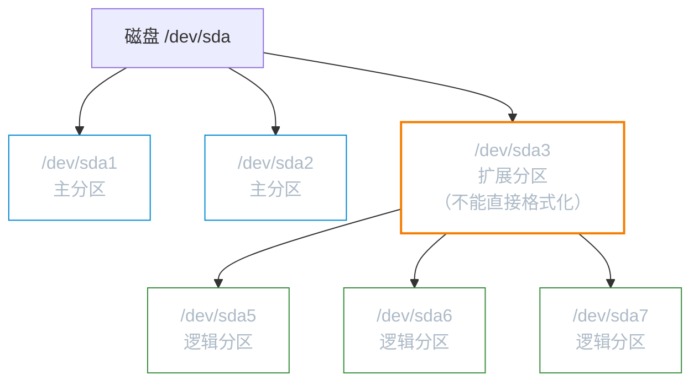
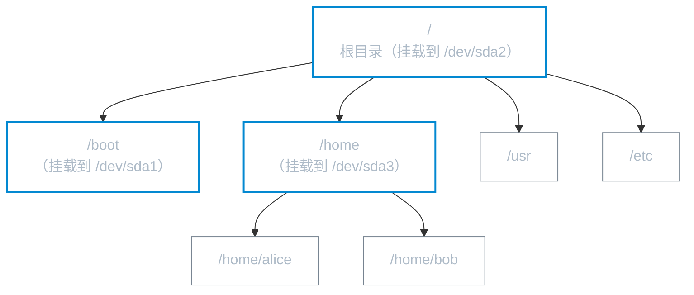

# 磁盘分区规划

**本文你会学到**：

- BIOS 和 UEFI 固件的区别，以及它们如何影响分区方式
- MBR 与 GPT 两种分区表的结构限制和适用场景
- Linux 磁盘设备文件名的命名规律
- 主分区、扩展分区、逻辑分区的概念（MBR 专属）
- 挂载点如何将磁盘分区与目录树关联
- 实用的分区方案推荐

## BIOS 与 UEFI：固件的两个时代

### BIOS：16 位的"老祖宗"

BIOS（Basic Input/Output System）是写入主板芯片的固件，是计算机开机后**第一个被执行的程序**。它用汇编语言编写，运行在 16 位模式下。

BIOS 开机流程：


BIOS 的核心限制：

- 只能识别 `MBR` 分区表（理论上也能引导 `GPT`，但需要兼容模式）
- `MBR` 存放 `Boot Loader` 的空间仅有 **446 Bytes**，能力有限
- 无法直接支持大于 **2.2 TB** 的磁盘分区
- 16 位架构，与现代 64 位系统协作能力弱

### UEFI：现代固件标准

UEFI（Unified Extensible Firmware Interface，统一可扩展固件接口）是 BIOS 的继任者，用 **C 语言**编写，运行在保护模式下。


UEFI 与 BIOS 对比：

| 比较项目 | 传统 BIOS | UEFI |
|----------|-----------|------|
| 编程语言 | 汇编 | C 语言 |
| 处理器模式 | 16 位实模式 | 32/64 位保护模式 |
| 分区表支持 | MBR（GPT 需兼容模式） | 原生 GPT 支持 |
| 启动分区 | MBR（446 Bytes） | ESP 分区（FAT32，推荐 512 MB~1 GB） |
| 图形界面 | 基本文本界面 | 支持完整图形界面 |
| 安全机制 | 无 | Secure Boot |
| 启动速度 | 慢 | 快 |

!!! warning "Secure Boot 与 Linux"

    UEFI 的 Secure Boot 机制要求操作系统必须通过 UEFI 签名验证才能启动。部分较老的 Linux 发行版或自编译内核可能无法通过验证，导致无法启动。

    解决方案：
    - 在 UEFI 设置中关闭 Secure Boot（安装 Linux 时常见操作）
    - 或使用发行版官方签名内核（Ubuntu、Fedora 等主流发行版均已支持）

## MBR 与 GPT：分区表的两个格式

### MBR：512 字节里的历史包袱

MBR（Master Boot Record，主引导记录）位于磁盘**第一个扇区（512 Bytes）**，结构如下：

| 区域 | 大小 | 用途 |
|------|------|------|
| Boot Loader | 446 Bytes | 存放第一阶段引导程序 |
| 分区表 | 64 Bytes | 最多记录 4 条分区信息（每条 16 Bytes） |
| 结束标志 | 2 Bytes | 固定值 `0x55AA` |

MBR 的分区表只有 64 Bytes，**最多只能记录 4 个分区**。这 4 个槽位只能分给**主分区（Primary）** 或 **扩展分区（Extended）**。

**MBR 关键限制**：

- 最大支持 **2.2 TB** 的分区（32 位寻址 × 512 Bytes/扇区）
- 最多 4 个主分区，或 3 主 + 1 扩展的组合
- 只有一份分区表，损坏后难以恢复

### GPT：面向未来的分区表

GPT（GUID Partition Table，GUID 分区表）使用 **LBA（Logical Block Address）** 寻址，整体结构：


GPT 关键特性：

- **128 个分区**：`LBA 2~33` 共 32 个区块，每块可记录 4 条，合计 128 条
- **最大 8 ZB**：64 位 `LBA` 寻址，单分区最大 ≈ 8 × 10²¹ Bytes
- **双备份**：分区表在磁盘头部和尾部各存一份，`CRC32` 校验，可自动修复
- **无主/扩展/逻辑分区之分**：所有 128 个分区地位相同，均可直接格式化

MBR vs GPT 一览对比：

| 比较项目 | MBR | GPT |
|----------|-----|-----|
| 最大磁盘/分区容量 | 2.2 TB | 8 ZB（理论） |
| 最多分区数 | 4 个主分区（可借扩展分区增加逻辑分区） | 128 个（Linux 无上限限制） |
| 冗余保护 | 无 | 磁盘首尾双备份 + CRC32 |
| 固件配套 | BIOS（主流）/ UEFI（兼容） | UEFI（原生）/ BIOS（需兼容） |
| 分区工具 | `fdisk`（老牌） | `gdisk`、`parted`（推荐） |
| 适用场景 | 旧硬件、小容量磁盘 | 现代系统，2 TB 以上磁盘必选 |

### EFI 系统分区（ESP）

使用 `UEFI` + `GPT` 时，必须有一个 `ESP`（EFI System Partition）：

- 文件系统：`FAT32`
- 大小建议：**512 MB ~ 1 GB**
- 挂载点：`/boot/efi`
- 存储内容：`EFI` 引导程序（如 `grubx64.efi`）、内核、`initrd`（部分配置）

!!! note "BIOS boot 分区"

    在 `BIOS` 固件 + `GPT` 分区表的组合中（少见但存在），`GRUB2` 需要一个 `BIOS boot` 分区来存放引导代码：
    
    - 大小：约 **1~2 MB**
    - 无需文件系统（裸分区）
    - 在 `gdisk` 中分区类型代码为 `ef02`

## Linux 磁盘设备文件名

Linux 遵循"**一切皆文件**"哲学，所有磁盘设备都以文件形式出现在 `/dev/` 目录下。

### 命名规律

| 接口类型 | 设备文件名格式 | 典型示例 | 说明 |
|----------|----------------|----------|------|
| SATA / SAS / USB | `/dev/sd[a-z]` | `/dev/sda`、`/dev/sdb` | 按内核侦测顺序，与物理插槽无关 |
| NVMe SSD | `/dev/nvme[0-9]n[1-9]` | `/dev/nvme0n1`、`/dev/nvme1n1` | `n` 后接命名空间编号 |
| VirtIO 虚拟磁盘 | `/dev/vd[a-z]` | `/dev/vda`、`/dev/vdb` | 云主机 / KVM 虚拟机 |
| 老旧 IDE | `/dev/hd[a-d]` | `/dev/hda` | 现代系统已基本消失，多被仿真为 `sd` |
| 光驱 | `/dev/sr[0-9]` | `/dev/sr0` | 也可见 `/dev/cdrom`（软链接） |

### 分区编号规则

分区文件名在磁盘名后追加数字：

=== "SATA / SAS / USB 磁盘"

    格式：`/dev/sda` + 数字

    - `/dev/sda1` — 第一块磁盘第 1 个分区
    - `/dev/sda2` — 第一块磁盘第 2 个分区
    - `/dev/sdb1` — 第二块磁盘第 1 个分区

    MBR 时代特殊规则：数字 1~4 预留给主分区和扩展分区，**逻辑分区从 5 开始**（即使 1~4 没有全部使用）。

=== "NVMe 磁盘"

    格式：`/dev/nvme0n1` + `p` + 数字

    - `/dev/nvme0n1p1` — 第一块 NVMe 盘第 1 个分区
    - `/dev/nvme0n1p2` — 第一块 NVMe 盘第 2 个分区
    - `/dev/nvme1n1p1` — 第二块 NVMe 盘第 1 个分区

    NVMe 命名中 `p` 是分隔符，避免与 `nvme0n10` 这类多位数字产生歧义。

!!! note "磁盘侦测顺序 ≠ 物理插槽顺序"

    `/dev/sda`、`/dev/sdb` 的顺序由**内核侦测顺序**决定，而非主板 SATA 插槽编号。
    
    示例：主板有 6 个 SATA 口，磁盘插在 SATA1 和 SATA5：
    
    - SATA1 → `/dev/sda`（先侦测到）
    - SATA5 → `/dev/sdb`（后侦测到）
    - USB 磁盘（开机后热插）→ `/dev/sdc`
    
    更换 SATA 口可能导致设备名变化，建议在 `/etc/fstab` 中使用 `UUID` 而非设备名引用分区。

## MBR 分区类型：主/扩展/逻辑

这是 MBR 特有的概念。GPT 不存在此限制，可直接跳过。

### 为什么需要扩展分区

MBR 分区表只有 64 Bytes，最多 4 条记录（主分区 + 扩展分区总数 ≤ 4）。如果需要超过 4 个分区，就得用**扩展分区（Extended Partition）** 作为容器，在其中划出多个**逻辑分区（Logical Partition）**。



规则总结：

- **主分区（Primary）**：可直接格式化，最多 4 个（含扩展分区在内）
- **扩展分区（Extended）**：最多 1 个，不能直接格式化，作为逻辑分区的"容器"
- **逻辑分区（Logical）**：从扩展分区中划出，编号**从 5 开始**（1~4 保留给主/扩展）
- 注意：`/dev/sda3`、`/dev/sda4` 不一定存在，但如果逻辑分区用到 5 号，说明 1~4 号中必有扩展分区

**GPT 时代已无此烦恼**：128 个分区均为等价的"主分区"，直接用 `gdisk` 或 `parted` 划分即可。

## 挂载点：Linux 没有盘符

### 目录树与分区的绑定

Windows 把每个分区映射为一个盘符（C:、D:）。Linux 完全不同——**只有一棵目录树，分区通过"挂载"绑定到树上的某个目录**。



判断文件属于哪个分区：**从文件路径向上追溯，找到最近的挂载点**。

示例：`/home/alice/doc.txt`

- 路径依次检查：`doc.txt` → `alice` → `home` → `/`
- `/home` 先被命中，该文件属于挂载到 `/home` 的那个分区

### 挂载的技术本质

"挂载（mount）"就是将一个**磁盘分区的文件系统**关联到目录树中某个**目录（挂载点）**。操作系统通过挂载点找到物理分区，完成读写。

```bash
# 临时挂载一个分区
mount /dev/sdb1 /mnt/data

# 查看当前所有挂载
findmnt
lsblk -f

# 卸载
umount /mnt/data
```

永久挂载写在 `/etc/fstab` 中，推荐使用 `UUID` 而非设备名（`UUID` 不因磁盘顺序变化而改变）：

```bash
# 查看分区 UUID
blkid /dev/sda1
```

```bash title="/etc/fstab 示例"
UUID=1234-abcd  /boot/efi  vfat  defaults  0  2
UUID=5678-efgh  /          ext4  defaults  0  1
UUID=9012-ijkl  /home      ext4  defaults  0  2
UUID=3456-mnop  swap       swap  sw        0  0
```

## Swap 分区

### 为什么需要 Swap

当物理内存不足时，内核会把不活跃的内存页面换出到磁盘的 `swap` 区，腾出物理内存给活跃进程。这个机制防止系统因 `OOM`（Out of Memory）崩溃，代价是磁盘 I/O 比内存慢几个数量级。

Swap 还是**休眠（hibernate）** 功能的存储目标——挂起到磁盘时，内存快照写入 `swap`。

### Swap 大小建议

| 物理内存 | Swap 推荐大小 |
|----------|--------------|
| ≤ 2 GB | RAM × 2 |
| 2 GB ~ 8 GB | 等于 RAM |
| 8 GB ~ 64 GB | 4 GB ~ RAM 的一半 |
| > 64 GB | 按需，通常 8~16 GB 够用 |
| 需要休眠功能 | 至少等于 RAM 大小 |

!!! note "现代服务器可以不用 Swap 分区"

    生产环境的高内存服务器（≥ 64 GB RAM）如果不需要休眠功能，可以不设置 swap，或只配置一个小的 swapfile 作为 OOM 缓冲。
    
    Swap **文件**（swapfile）可随时创建，比分区更灵活：
    
    ```bash
    dd if=/dev/zero of=/swapfile bs=1G count=4
    chmod 600 /swapfile
    mkswap /swapfile
    swapon /swapfile
    ```

## 实用分区方案

根据使用场景，推荐以下几种常见方案：

### 方案一：极简方案（个人学习/虚拟机）

仅划分两个分区，适合初学者或资源有限的场景：

| 分区 | 挂载点 | 大小建议 | 文件系统 |
|------|--------|---------|---------|
| `/dev/sda1` | `/` | 剩余全部空间（≥ 20 GB） | ext4 / xfs |
| `/dev/sda2` | `swap` | 2~4 GB | swap |

优点：简单，无需担心某个分区空间不足。

### 方案二：标准桌面/服务器方案

分离 `/home` 保护用户数据，重装系统时无需格式化 `/home`：

| 分区 | 挂载点 | 大小建议 | 文件系统 |
|------|--------|---------|---------|
| `/dev/sda1` | `/boot/efi` | 512 MB | FAT32（UEFI 必须） |
| `/dev/sda2` | `/boot` | 1 GB | ext4 |
| `/dev/sda3` | `/` | 20~50 GB | ext4 / xfs |
| `/dev/sda4` | `/home` | 剩余空间 | ext4 / xfs |
| `/dev/sda5` | `swap` | 4~8 GB | swap |

### 方案三：企业服务器方案

独立挂载 `/var`（日志）和 `/tmp`（临时文件），防止日志写满根分区：

| 分区 | 挂载点 | 大小建议 | 说明 |
|------|--------|---------|------|
| `/dev/sda1` | `/boot/efi` | 512 MB | EFI 引导（UEFI） |
| `/dev/sda2` | `/boot` | 1 GB | 内核 + initrd |
| `/dev/sda3` | `/` | 20 GB | 系统文件 |
| `/dev/sda4` | `/var` | 20~100 GB | 日志、数据库文件 |
| `/dev/sda5` | `/home` | 按需 | 用户目录 |
| `/dev/sda6` | `/tmp` | 5~10 GB | 临时文件，可加 `noexec` 挂载选项 |
| `/dev/sda7` | `swap` | 按内存大小 | — |

!!! info "发行版安装器默认行为"

    === "Debian/Ubuntu"

        安装器默认会创建一个 ESP 分区（UEFI）、`/boot` 分区和一个根分区。推荐在"手动分区"模式下按需调整，避免自动分区将所有空间分给 `/`。

    === "Red Hat/RHEL"

        Anaconda 安装器默认使用 `LVM`（逻辑卷管理），在物理分区上再建一层抽象，方便后期扩容。
        典型布局：`ESP` + `/boot`（标准分区）+ 一个大 `LVM PV`，在 `LVM` 内再划 `/`、`/home`、`swap` 等逻辑卷。

## 常用分区工具速查

| 工具 | 支持分区表 | 特点 |
|------|-----------|------|
| `fdisk` | MBR（GPT 有限支持） | 老牌交互式工具，简单场景够用 |
| `gdisk` | GPT | `fdisk` 的 GPT 版本，交互式 |
| `parted` | MBR + GPT | 支持脚本化，`parted -s` 非交互模式 |
| `cfdisk` | MBR + GPT | 文本 TUI，操作直观 |

```bash
# 查看磁盘和分区
lsblk
fdisk -l /dev/sda

# 用 gdisk 操作 GPT 磁盘（交互式）
gdisk /dev/sda
# 常用命令：p 打印，n 新建，d 删除，t 改类型，w 写入退出，q 放弃退出

# 用 parted 脚本化操作
parted /dev/sdb -- mklabel gpt
parted /dev/sdb -- mkpart ESP fat32 1MiB 513MiB
parted /dev/sdb -- set 1 esp on
parted /dev/sdb -- mkpart primary ext4 513MiB 100%
```

