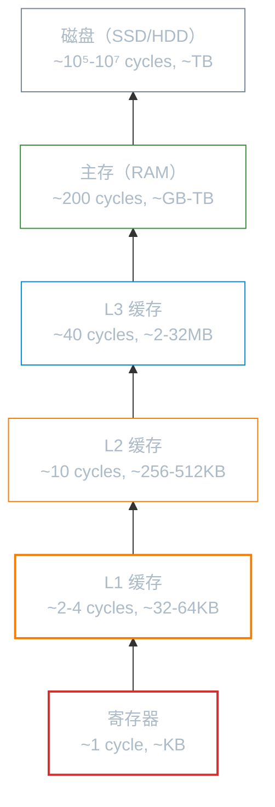

# 计算机硬件基础

**本文你会学到**：

- Linux 与硬件的关系：为什么理解硬件有助于诊断系统问题
- CPU 架构（RISC vs CISC、多核、超线程）及查看方式
- 内存层次结构（寄存器 → 缓存 → 主存 → 磁盘）
- 存储设备类型（HDD、SSD、NVMe）与性能指标
- 主板总线、PCIe、DMA、IRQ 等概念
- 计算机中的数据表示（进制、编码、端序）

## 为什么了解硬件？

Linux 与其他操作系统的一个关键区别是：**Linux 直接管理硬件**。内核中的设备驱动程序直接与硬件通信，没有额外的抽象层。这意味着：

- 硬件故障会直接体现在系统行为上（如 `dmesg` 中的 I/O 错误）
- 理解硬件有助于解释系统性能瓶颈（如 CPU 等待 I/O）
- 排查问题时常需要区分是硬件故障还是软件配置问题

```bash
# 查看硬件信息的关键命令
dmesg | grep -i error   # 查看内核检测到的硬件错误
lscpu                   # CPU 架构信息
lsblk                   # 块设备（磁盘）信息
free -h                 # 内存总量与使用
```

## CPU 架构

### RISC vs CISC

指令集架构（ISA，Instruction Set Architecture）是 CPU 与软件之间的接口规范，主要有两大流派：

| 特性 | CISC（复杂指令集） | RISC（精简指令集） |
|------|-------------------|-------------------|
| 指令长度 | 可变长度 | 固定长度 |
| 指令复杂度 | 单条指令可完成复杂操作 | 复杂操作由多条简单指令组合 |
| 代表 | x86/x86_64（Intel、AMD） | ARM、RISC-V |
| 典型功耗 | 高（数瓦到数百瓦） | 低（毫瓦到数瓦） |
| 应用场景 | 服务器、桌面 PC | 手机、嵌入式、笔记本（M 系列） |

现代 CPU 实际已融合两者优点：x86 核心内部会将 CISC 指令解码为微操作（micro-ops），再以 RISC 风格执行。

### x86_64 vs ARM

- **x86_64**（amd64）：Intel 和 AMD 的 64 位架构，向后兼容 32 位 x86。统治服务器和桌面市场，Linux 生态最完善
- **ARM**（AArch64）：精简指令集，能效比出色。苹果 M 系列、AWS Graviton、树莓派均采用 ARM 架构。近年来服务器份额快速增长

```bash
# 查看本机 CPU 架构
uname -m                # 如 x86_64、aarch64
lscpu                   # 详细 CPU 信息
cat /proc/cpuinfo       # 每个 CPU 核心的详细信息
```

### 多核与超线程

- **多核**：将多个 CPU 核心集成在同一芯片上，每个核心独立执行指令，共享缓存和内存控制器
- **超线程（Hyper-Threading）**：Intel 的技术，一个物理核心模拟两个逻辑核心，提高执行单元利用率

```bash
# 查看核心与线程数
lscpu | grep -E "^CPU\(s\)|^Thread|^Core|^Socket"
# 输出示例：
# CPU(s):              8          （逻辑 CPU 总数）
# Thread(s) per core:  2          （每核心 2 线程 = 启用超线程）
# Core(s) per socket:  4          （每插槽 4 物理核心）
# Socket(s):           1          （1 个 CPU 插槽）
```

## 内存层次

### 为什么要分层？

CPU 执行指令的速度远快于内存的响应速度。如果 CPU 每次访问内存都要等待，大部分时间都会浪费在等待上。因此计算机采用分层存储策略，用不同速度和容量的存储介质平衡成本与性能：



越往上速度越快、容量越小、成本越高；越往下速度越慢、容量越大、成本越低。

### 缓存行与 TLB

- **缓存行（Cache Line）**：CPU 缓存与主存之间数据传输的最小单位，通常 64 字节。即使程序只读 1 字节，CPU 也会加载整行到缓存。这就是"遍历数组比遍历链表快"的底层原因——数组在内存中连续排列，能充分利用缓存行
- **TLB（Translation Lookaside Buffer）**：CPU 内部的虚拟地址到物理地址的转换缓存。程序访问的内存地址是虚拟地址，需要 MMU（内存管理单元）转换为物理地址，TLB 缓存最近使用的转换结果，避免每次都查询页表

### 查看内存信息

```bash
# 内存使用情况
free -h                 # 人性化显示（-h）
#               total   used   free   shared  buff/cache   available
# Mem:          15Gi   4.2Gi  7.8Gi   1.2Gi       3.0Gi       10Gi
# Swap:         2.0Gi     0B  2.0Gi

# 详细硬件信息
dmidecode -t memory     # 物理内存插槽信息（需 root）
dmidecode -t cache      # CPU 缓存信息（需 root）

# 查看页大小
getconf PAGE_SIZE       # 通常 4096（4KB）
```

## 存储设备

### HDD vs SSD

| 特性 | HDD（机械硬盘） | SSD（固态硬盘） |
|------|----------------|----------------|
| 存储介质 | 磁碟片 + 磁头 | NAND Flash 芯片 |
| 寻道时间 | ~5-15 ms | ~0.1 ms |
| 随机读写 | 慢（需磁头移动） | 快（电信号寻址） |
| 顺序读写 | 较快（~200 MB/s） | 极快（~500-7000 MB/s） |
| 抗震性 | 差（磁头易损坏） | 好（无机械部件） |
| 寿命限制 | 无（机械磨损） | 有（擦写次数限制） |

### NVMe vs SATA

SSD 的接口协议决定了其速度上限：

| 接口 | 协议 | 最大带宽 | 典型速度 |
|------|------|---------|---------|
| SATA III | AHCI | 6 Gbps | ~550 MB/s |
| NVMe (PCIe 3.0 x4) | NVMe | ~32 Gbps | ~3500 MB/s |
| NVMe (PCIe 4.0 x4) | NVMe | ~64 Gbps | ~7000 MB/s |
| NVMe (PCIe 5.0 x4) | NVMe | ~128 Gbps | ~10000+ MB/s |

NVMe 的优势不仅在于带宽：NVMe 队列深度（~65536）远超 AHCI（~32），多线程并发读写时性能远优于 SATA。

### IOPS 与吞吐量

- **IOPS**（Input/Output Operations Per Second）：每秒 I/O 操作次数，衡量随机读写性能
- **吞吐量**（Throughput）：每秒传输的数据量，衡量顺序读写性能

```bash
# 查看磁盘设备信息
lsblk                   # 列出所有块设备
# NAME   MAJ:MIN RM  SIZE RO TYPE MOUNTPOINTS
# sda      8:0    0  256G  0 disk
# ├─sda1   8:1    0    1G  0 part /boot
# └─sda2   8:2    0  255G  0 part /

fdisk -l /dev/sda       # 查看分区表（需 root）
```

## 主板与总线

### PCIe

PCIe（Peripheral Component Interconnect Express）是现代计算机连接外设的主流总线标准，采用点对点串行连接。显卡、NVMe SSD、网卡都通过 PCIe 连接 CPU。

不同版本的 PCIe 向下兼容，x16 插槽带宽最高（用于显卡），x1/x4 用于网卡、存储控制器等：

| 版本 | x1 带宽 | x16 带宽 |
|------|---------|----------|
| PCIe 3.0 | ~1 GB/s | ~16 GB/s |
| PCIe 4.0 | ~2 GB/s | ~32 GB/s |
| PCIe 5.0 | ~4 GB/s | ~64 GB/s |

```bash
lspci                   # 列出所有 PCI 设备
lspci -v                # 详细输出
lspci -t                # 树形展示 PCI 设备拓扑
```

### DMA（Direct Memory Access）

DMA 允许外设（磁盘、网卡、显卡）**直接读写内存**，无需 CPU 逐字节搬运。没有 DMA 时，每个磁盘数据块都要 CPU 从磁盘控制器读取再写入内存，CPU 被 I/O 操作占满，无法处理其他任务。

DMA 的工作流程：

1. CPU 告诉 DMA 控制器：数据从磁盘控制器复制到内存地址 X，大小 Y
2. DMA 控制器独立完成数据传输
3. 传输完成后 DMA 控制器发送中断通知 CPU

### IRQ（Interrupt Request）

CPU 需要处理的事件有两类：

| 类型 | 触发方式 | 特点 |
|------|---------|------|
| **硬件中断（Hardware IRQ）** | 外设（键盘、网卡、磁盘）通过中断控制器通知 CPU | 异步，CPU 暂停当前工作处理 |
| **异常（Exception）** | CPU 内部检测到异常情况（除零、页错误） | 同步，由当前指令触发 |
| **软中断（Software IRQ）** | 软件通过 `int` 指令主动触发 | 用于系统调用 |

当外设需要 CPU 处理数据时（如网卡收到数据包），它发送一个中断信号。CPU 暂停当前执行的程序，保存上下文，执行中断处理程序，完成后恢复之前的程序。

```bash
# 查看中断信息
cat /proc/interrupts     # 每个 CPU 核心的中断计数
#           CPU0    CPU1
#   0:       123     45    IO-APIC    timer
#   1:        10      5    IO-APIC    i8042
#   8:         0      0    IO-APIC    rtc0
#  130:    12345   6789    PCI-MSI    nvme0q0
```

## 数据表示

计算机处理的一切信息最终都是二进制数。理解数据表示有助于理解调试器输出、网络协议分析和系统底层行为。

### 进制表示

| 进制 | 基数 | 数字范围 | 前缀/后缀 |
|------|------|---------|----------|
| 二进制 | 2 | 0-1 | 后缀 b（如 `1010b`） |
| 八进制 | 8 | 0-7 | 前缀 0（如 `012`）= 十进制 10 |
| 十进制 | 10 | 0-9 | 无前缀 |
| 十六进制 | 16 | 0-9, A-F | 前缀 0x（如 `0xFF`）= 十进制 255 |

十六进制在计算机领域用得最多——一个十六进制数位恰好表示 4 个二进制位。内存地址、MAC 地址、颜色值、权限位都习惯用十六进制表示。

```bash
# Linux 命令行进制转换（借助 printf）
printf "%x\n" 255        # 十进制 → 十六进制：ff
printf "%d\n" 0xff       # 十六进制 → 十进制：255
printf "%o\n" 255        # 十进制 → 八进制：377
```

### 编码：从 ASCII 到 UTF-8

- **ASCII**：7 位编码，128 个字符，只覆盖英文字母、数字和基本符号
- **Latin-1**（ISO 8859-1）：8 位编码，256 个字符，覆盖西欧语言
- **Unicode**：统一字符集，为世界上几乎所有文字分配唯一编号（码点，Code Point）
- **UTF-8**：Unicode 的可变长度编码方式，向下兼容 ASCII，互联网的事实标准

```bash
# 查看文件编码
file -i filename         # 输出文件的 MIME 类型和编码
# 如：text/plain; charset=utf-8
```

### 端序

多字节数据在内存中的排列方式有两种：

| 端序 | 说明 | 代表架构 |
|------|------|---------|
| **小端（Little-Endian）** | 低位字节存低地址 | x86/x86_64 |
| **大端（Big-Endian）** | 高位字节存低地址 | 网络协议、PowerPC |

例如 `0x12345678`（4 字节整数）在两种端序下的内存布局：

```
地址：    0x00    0x01    0x02    0x03
小端：    0x78    0x56    0x34    0x12
大端：    0x12    0x34    0x56    0x78
```

x86 架构使用小端序，而 IP 头部中的字节序定义为大端（网络字节序）。因此网络编程中需要使用 `htonl`/`htons`/`ntohl`/`ntohs` 函数进行转换。

```bash
# lscpu 可查看本机端序
lscpu | grep "Byte Order"
# Byte Order:            Little Endian
```

## 硬件与系统性能

理解硬件有助于定位性能瓶颈。以下是一些常见关联：

| 现象 | 可能的硬件瓶颈 | 排查工具 |
|------|--------------|---------|
| CPU 使用率 100%，但 I/O 低 | CPU 计算密集型 | `top`、`perf` |
| CPU 等待（`wa`）高 | 磁盘 I/O 瓶颈 | `iostat`、`iotop` |
| 大量内存交换（swap） | 内存不足 | `free`、`vmstat` |
| 网络延迟高 | 网卡带宽或中断处理 | `netstat`、`sar -n DEV` |
| 系统响应慢但各项指标正常 | 缓存命中率低 | `perf stat`、`cachegrind` |

!!! tip "性能分析的黄金法则"

    性能瓶颈通常不在你想当然的位置。在分析工具给出明确结论之前，不要做优化决策——系统某部分空闲（如 CPU）并不意味它没有瓶颈，也可能是它在等待另一部分（如 I/O）。
