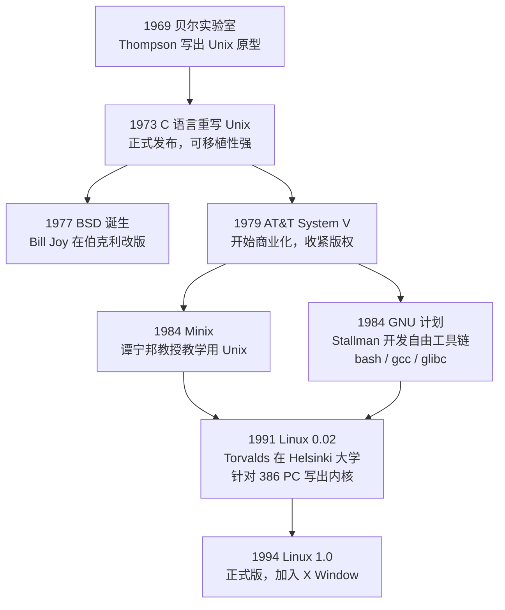
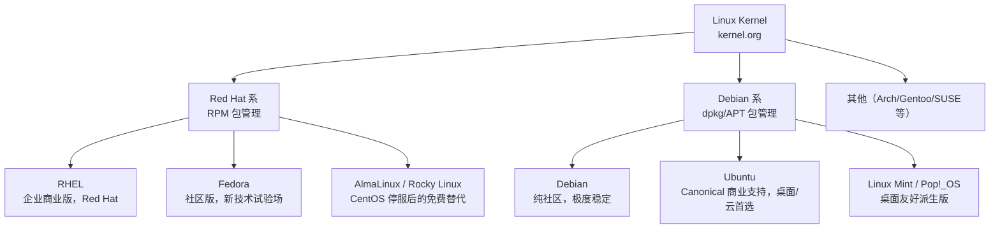

# Linux 简介与发行版

**本文你会学到**：

- Linux 内核与发行版的概念区别，以及 GNU/Linux 的含义
- GPL v2 开源协议的权利与义务
- Unix 从 1969 年到 Linux 1991 年的历史演进脉络
- 内核版本格式与 LTS（长期维护）发布周期
- Red Hat 系和 Debian 系的包管理方式
- 如何根据生产环境、学习场景选择合适的发行版
- Linux 在服务器、云计算、移动设备、HPC 等领域的应用

## 现象：无处不在的 Linux

你可能已经用过 Linux（通过安卓手机、云服务器、树莓派），但未必知道自己在用它。全球 90% 以上的服务器都跑 Linux，包括你访问的每一个网站背后的服务器；云计算平台（AWS、GCP、Azure）的底层都是 Linux；你的安卓手机上也有 Linux 内核。为什么 Linux 这么流行？这需要从它的**本质和历史**出发。

Linux 是一个**操作系统内核**（Kernel），负责控制底层硬件资源、提供系统调用接口。它不是完整的操作系统——我们日常说的"Linux 系统"通常是指 `Linux Kernel` + **GNU 工具链** + 发行版附带的软件包构成的完整系统，严格来说应叫 `GNU/Linux`。

```
用户程序（浏览器、编辑器…）
       ↕
GNU 工具链（bash、glibc、gcc…）
       ↕
Linux Kernel（硬件驱动、内存管理、进程调度…）
       ↕
硬件（CPU、磁盘、网卡…）
```

Linux 特点：

- **开源**（`GPL v2`）：任何人可取得源码、修改、发行，但修改后的版本也必须开源
- **可移植**：从树莓派、Android 手机到超级计算机，都跑 Linux 内核
- **稳定**：继承自 Unix 优良的多用户多任务架构，企业服务器的首选

## 为什么要了解 Unix 历史？

要理解现代 Linux 为什么这样设计，必须回溯 Unix 的演进之路。Unix 奠定的设计理念（模块化、开源精神、POSIX 标准）直到今天仍然影响着 Linux。而且，知道 Linux 从何而来，才能理解它在服务器领域为什么击败了其他竞争对手。

## Unix 到 Linux 的历史脉络



**关键时间节点**：

| 年份 | 事件 |
|------|------|
| 1969 | Ken Thompson 在贝尔实验室写出 Unix 原型（起因是移植"太空旅游"游戏） |
| 1973 | Dennis Ritchie 用 C 语言重写内核，Unix 获得可移植性 |
| 1977 | BSD 诞生，后来发展出 FreeBSD/macOS |
| 1984 | Stallman 创建 GNU 计划，目标是自由版的 Unix；开发出 gcc、bash、glibc |
| 1984 | 谭宁邦教授写出 Minix 供教学，Torvalds 从中学习内核设计 |
| 1991 | Linus Torvalds（22岁）发布 Linux 0.02，发帖称"只是个玩具" |
| 1994 | Linux 1.0 正式版，虚拟团队协作模式成熟，kernel.org 成立 |

## GNU/GPL 与自由软件

`GPL`（GNU General Public License）是 Linux 内核的授权协议，核心权利：

- ✅ 可以自由使用、复制、修改、再发行
- ✅ 可以商业销售（销售的是服务，不是代码本身）
- ❌ 不能将 GPL 软件的修改版本闭源——修改后必须保持 GPL 开源

!!! info "Free 的真义"

    "Free software" is a matter of `liberty`, not price.  
    重点是自由度（freedom），不是免费（free beer）。

这个设计保护了代码库不会被私有化，同时允许 Red Hat、Canonical 等公司以"提供企业服务"的方式合法盈利。

## Linux 内核版本

内核版本格式：`主版本.次版本.发布版本`（如 `6.6.30`）

**历史演变**：

- **2.6.x 之前**：奇数次版本（2.5.x）= 开发版；偶数次版本（2.6.x）= 稳定版
- **3.0 之后**：取消奇偶区分，改为 `Mainline`（主线版本）+ `LTS`（长期维护版本）机制

**当前 LTS 版本**（生产环境应选 LTS）：

| LTS 版本 | 维护截止 |
|----------|---------|
| 6.12 LTS | 2026-12 |
| 6.6 LTS  | 2026-12 |
| 6.1 LTS  | 2027-12 |
| 5.15 LTS | 2026-10 |

主线新版本每 2~3 个月发布一次，LTS 版本获得长达 2~6 年的安全维护。

```bash
uname -r   # 查看当前内核版本，如 6.8.0-45-generic
```

## Linux 主流发行版

发行版（Distribution）= **Linux 内核 + GNU 工具 + 包管理器 + 预装软件** 的完整打包。所有发行版共享同一个 kernel.org 的内核，差异主要在包管理方式和目标场景。



!!! warning "CentOS 已停服"

    CentOS 8 于 2021 年 12 月停止维护，**CentOS Stream 9** 转为上游开发版（比 RHEL 超前，不适合生产）。  
    推荐的免费 RHEL 替代品：

    - **AlmaLinux**：由 CloudLinux 支持，与 RHEL 二进制兼容
    - **Rocky Linux**：由 CentOS 原创始人 Gregory Kurtzer 发起

### Debian/Ubuntu 系

| 发行版 | 特点 | 适用场景 |
|--------|------|---------|
| Debian | 极稳定，测试严格，更新保守 | 服务器、追求极致稳定 |
| Ubuntu LTS | 5 年官方支持，桌面/云均衡 | 个人开发、云实例（AWS AMI 默认） |
| Ubuntu Server | 无 GUI，Snap 生态 | 云服务器 |

包管理：`dpkg`（底层）/ `apt`（高级前端）

### Red Hat/RHEL 系

| 发行版 | 特点 | 适用场景 |
|--------|------|---------|
| RHEL | 商业支持，通过多项认证 | 企业关键业务、金融、电信 |
| Fedora | 最新技术，每 6 个月大版本 | 开发者桌面 |
| AlmaLinux | 与 RHEL 二进制兼容，免费 | CentOS 迁移目标 |
| Rocky Linux | 同上，另一 CentOS 替代 | CentOS 迁移目标 |

包管理：`rpm`（底层）/ `dnf`（高级前端，YUM 的继承者）

### 如何选择

| 场景 | 推荐 |
|------|------|
| 学习/个人开发 | Ubuntu LTS 或 Fedora |
| 企业服务器（需商业支持） | RHEL |
| 企业服务器（免费） | AlmaLinux / Rocky Linux |
| 极度稳定的服务器 | Debian Stable |
| 云实例（AWS/GCP/Azure） | Ubuntu LTS 或 RHEL |

发行版排名参考：[distrowatch.com](https://distrowatch.com/)

## Linux 的应用场景

- 🌐 **服务器**：全球 90%+ 的 Web 服务器、绝大多数云基础设施跑 Linux
- ☁️ **云计算**：AWS/GCP/Azure 的底层都是 Linux；容器（Docker）和 Kubernetes 也依赖 Linux 内核特性
- 📱 **移动设备**：Android 基于 Linux 内核（约 30 亿设备）
- 🤖 **嵌入式/IoT**：路由器、智能电视、树莓派、工控设备
- 🖥️ **桌面**：市占率约 3~4%，但在开发者群体中远高于此
- 🔬 **高性能计算（HPC）**：全球 Top500 超算 100% 运行 Linux

