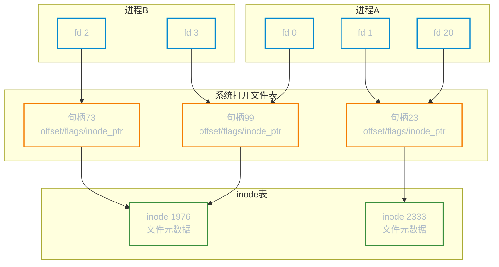
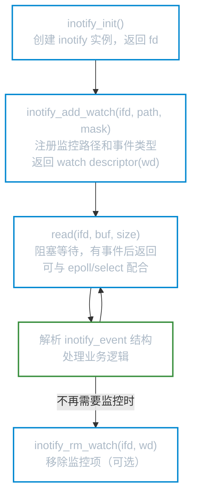
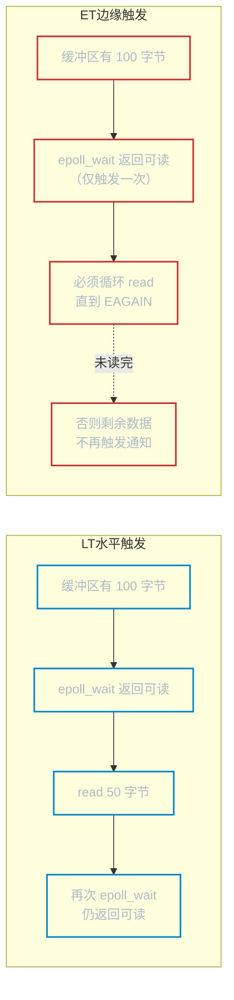

# 高级文件 I/O

**本文你会学到**：

- Linux 三层文件描述符表的结构，以及 `dup`/`fork` 后为何共享偏移量
- `open()` 各类标志（flags）的语义与使用场景
- I/O 缓冲的两层模型，以及如何确保数据真正落盘
- 文件锁的类型与使用惯例
- 用 `inotify` 监控文件系统事件
- `epoll` 如何解决 `select`/`poll` 的扩展性瓶颈
- `sendfile` 零拷贝机制的原理

---

## 三层文件描述符表

### 为什么需要三层结构？

你可能认为一个打开的文件就对应一个文件描述符，但内核实际维护着三个层次的数据结构。这样设计是为了让多个进程、多个描述符能灵活地共享同一文件的打开状态（偏移量、标志）或独立维护各自的偏移量。

### 三层结构详解

**进程文件描述符表**（每进程独立）

内核为每个进程维护一张文件描述符表。每个条目记录：

- 一个整数 fd（文件描述符号）
- 该描述符的标志（目前仅有 `FD_CLOEXEC` 一个标志）
- 一个指向系统级打开文件句柄（open file description）的指针

**系统打开文件表**（全系统共享）

内核维护一张全系统级的打开文件表（open file table）。每个打开文件句柄记录：

- **文件偏移量**（`read`/`write` 时自动更新，`lseek` 可手动修改）
- 打开时使用的状态标志（`O_APPEND`、`O_NONBLOCK` 等）
- 文件访问模式（只读/只写/读写）
- 指向内核 inode 对象的引用

**内核 inode 表**（文件系统级）

每个文件系统为驻留其上的所有文件维护一张 inode 表，记录：

- 文件类型（普通文件、socket、FIFO 等）与访问权限
- 文件大小及各类时间戳（atime、mtime、ctime）
- 该文件上持有的锁列表
- 磁盘数据块指针



### dup 后为何共享偏移量？

调用 `dup(fd)` 或 `dup2(oldfd, newfd)` 后，新旧两个文件描述符指向**同一个打开文件句柄**。偏移量存储在句柄层，不在描述符层，所以：

- 通过 fd1 写入 100 字节后，fd2 的读取位置也向后移了 100 字节

这正是 shell 实现 `2>&1` 重定向的底层机制。

### fork 后父子为何共享偏移量？

`fork()` 时，子进程复制了父进程的**文件描述符表**，但表中的指针仍指向**同一批打开文件句柄**。于是父子进程的对应 fd 共享偏移量——这使得父子进程能安全地轮流向同一文件追加内容而不互相覆盖。

!!! tip "文件描述符标志是独立的"

    `FD_CLOEXEC`（close-on-exec）属于描述符层，不属于句柄层。`dup` 出来的新描述符，其 `FD_CLOEXEC` 始终被清除，需要单独设置。

---

## 文件描述符标志（open 的 flags 参数）

### 三类标志一览

`open()` 的 `flags` 参数由三类位掩码组成，用 `|` 运算符组合：

**访问模式**（必选其一）

| 标志 | 语义 |
|------|------|
| `O_RDONLY` | 只读 |
| `O_WRONLY` | 只写 |
| `O_RDWR` | 读写 |

**文件创建/截断标志**

| 标志 | 语义 |
|------|------|
| `O_CREAT` | 文件不存在则创建（需提供 `mode` 参数） |
| `O_TRUNC` | 文件已存在则截断为 0 字节 |
| `O_EXCL` | 与 `O_CREAT` 联用，若文件已存在则报错 `EEXIST`（原子创建，常用于 lockfile） |

**状态修饰符**（可多选）

| 标志 | 语义 |
|------|------|
| `O_APPEND` | 每次 `write` 前原子地将偏移量移到文件末尾（多进程日志追加的正确做法） |
| `O_NONBLOCK` | 非阻塞模式，I/O 不可用时立即返回 `EAGAIN` 而非阻塞 |
| `O_SYNC` | 同步写：每次 `write` 返回前等待数据和元数据都落盘 |
| `O_DSYNC` | 同步写：只等数据落盘，不等元数据（性能优于 `O_SYNC`） |
| `O_CLOEXEC` | 进程执行 `exec()` 时自动关闭该描述符（避免 fd 泄漏给子程序） |

### O_APPEND 与手动 lseek + write 的根本区别

如果多进程同时追加日志，这样写**有 bug**：

``` c title="竞争写端（错误示范）"
lseek(fd, 0, SEEK_END);   // ❌ 进程A刚移动完偏移量
                           // ❌ 此时进程B也移动了偏移量，且写入了数据
write(fd, buf, len);       // ❌ 进程A覆盖了进程B的数据
```

`O_APPEND` 将"移动到末尾"和"写入"合并为一个**原子系统调用**，内核保证不会交叉：

``` bash title="正确打开方式"
# 程序中：open(path, O_WRONLY | O_APPEND | O_CREAT, 0644)
# shell 中：command >> logfile
```

### 为什么用 O_CLOEXEC 而不是 exec 后手动 close？

在多线程程序中，从"打开 fd"到"调用 `fcntl` 设置 `FD_CLOEXEC`"之间存在竞争窗口：另一个线程可能在此期间 `fork` + `exec`，从而将未关闭的 fd 泄露给子程序。`O_CLOEXEC` 在打开的同时原子地设置标志，彻底消除这个竞争。

---

## 文件操作系统调用速查

### 基本 I/O 系统调用

| 系统调用 | 功能 |
|---------|------|
| `open(path, flags, mode)` | 打开或创建文件，返回 fd |
| `creat(path, mode)` | 等同于 `open(path, O_WRONLY\|O_CREAT\|O_TRUNC, mode)` |
| `close(fd)` | 释放文件描述符及关联内核资源 |
| `read(fd, buf, count)` | 从 fd 读取最多 `count` 字节到 `buf` |
| `write(fd, buf, count)` | 从 `buf` 写入最多 `count` 字节到 fd |
| `lseek(fd, offset, whence)` | 调整文件偏移量（`SEEK_SET`/`SEEK_CUR`/`SEEK_END`） |

### 复制与控制

| 系统调用 | 功能 |
|---------|------|
| `dup(fd)` | 复制 fd，返回最小可用新描述符 |
| `dup2(oldfd, newfd)` | 将 oldfd 复制到指定的 newfd（shell 重定向的底层） |
| `fcntl(fd, cmd, ...)` | 多功能文件控制（获取/修改标志、复制 fd、文件锁等） |
| `ioctl(fd, request, ...)` | 设备/文件特有操作的"万能接口" |

### 原子偏移读写

`pread()` 和 `pwrite()` 在指定偏移量处读写，且**不改变文件的当前偏移量**，相当于原子地执行 `lseek` + `read`/`write`：

``` bash title="适用场景"
# 多线程场景：各线程独立指定偏移量，无需加锁
# 数据库引擎：在固定的磁盘块位置随机读写
pread(fd, buf, count, offset)
pwrite(fd, buf, count, offset)
```

与先 `lseek` 再 `read`/`write` 相比，`pread`/`pwrite` 避免了线程间的偏移量竞争。

---

## I/O 缓冲层次

### 两层缓冲：stdio 与内核页缓存

I/O 数据在到达磁盘之前，要穿越两层缓冲：


- **stdio 缓冲（用户空间）**：`fwrite`、`fprintf` 等标准库函数先将数据写入 libc 维护的缓冲区，满足以下条件才调用 `write()` 系统调用：缓冲区满、遇到换行符（行缓冲模式）、显式调用 `fflush()`
- **内核页缓存（Page Cache）**：`write()` 调用成功后，数据进入内核的页缓存，此时**数据尚未写入磁盘**，只是被内核标记为"脏页"，由内核择时回写

### 调用 write() 成功 ≠ 数据落盘

这是一个常见误区。调用 `write()` 返回成功只意味着数据进入了页缓存，主机崩溃时这些数据可能丢失。

### 数据落盘保障

| 方法 | 行为 | 何时使用 |
|------|------|---------|
| `fsync(fd)` | 等待文件数据**和**元数据（inode）全部写入磁盘 | 数据库 WAL、配置文件安全写入 |
| `fdatasync(fd)` | 只等数据写入磁盘，元数据不强制同步（性能更好） | 大多数只关心数据完整性的场景 |
| `O_SYNC` | 每次 `write` 返回前自动等数据和元数据落盘 | 对每次写都要求持久化的文件 |
| `O_DSYNC` | 每次 `write` 返回前只等数据落盘 | 同 `fdatasync` 但在打开时指定 |

!!! warning "配置文件安全写入的正确做法"

    直接用 `write()` 覆盖配置文件，若此时崩溃会留下半写的文件。正确方式：

    ``` bash title="原子写配置文件"
    # 1. 写入临时文件
    # 2. fsync 临时文件确保落盘
    # 3. rename 原子替换（rename 本身是原子操作）
    write tmp_file
    fsync(tmp_fd)
    rename(tmp_file, config_file)
    ```

### stdio 层缓冲控制

``` c title="setvbuf 与 fflush"
// 设置全缓冲，缓冲区大小 4096
setvbuf(fp, NULL, _IOFBF, 4096);

// 设置行缓冲（遇换行符刷新）
setvbuf(fp, NULL, _IOLBF, 0);

// 无缓冲（每次 fwrite 直接调用 write）
setvbuf(fp, NULL, _IONBF, 0);

// 手动刷新到内核
fflush(fp);
```

---

## 文件锁

### 为什么需要文件锁？

当多个进程并发读写同一文件时（如数据库、配置文件、日志），需要协调访问顺序，避免数据损坏。

### 建议性锁 vs 强制性锁

- **建议性锁（advisory lock）**：锁仅对遵守锁协议的进程有效。若某进程直接绕过锁调用 `read`/`write`，内核不会阻止。Linux 默认使用建议性锁。
- **强制性锁（mandatory lock）**：内核强制执行，任何 `read`/`write` 都会受锁阻塞。Linux 支持但不推荐，配置复杂且有已知问题。

实践中几乎只用建议性锁，关键是所有进程都遵守同一锁协议。

### flock()：整文件锁（BSD）

``` c title="flock 基本用法"
#include <sys/file.h>

// 获取共享锁（读锁），阻塞等待
flock(fd, LOCK_SH);

// 获取排他锁（写锁），阻塞等待
flock(fd, LOCK_EX);

// 非阻塞模式，锁被占用时立即返回 EWOULDBLOCK
flock(fd, LOCK_EX | LOCK_NB);

// 释放锁
flock(fd, LOCK_UN);
```

`flock()` 锁作用于整个文件，且与打开文件句柄绑定。`dup`/`fork` 出来的描述符共享同一把锁；但通过独立 `open()` 打开的描述符持有独立的锁。

### fcntl() POSIX 锁：字节范围锁

`fcntl()` 锁可以精确锁定文件中的某个字节范围，常用于数据库引擎：

``` c title="fcntl 字节范围锁"
struct flock fl = {
    .l_type   = F_WRLCK,   // F_RDLCK 读锁 / F_WRLCK 写锁 / F_UNLCK 解锁
    .l_whence = SEEK_SET,
    .l_start  = 0,          // 锁定起始偏移
    .l_len    = 100,         // 锁定字节数（0 表示到文件末尾）
};

// F_SETLK：非阻塞，锁被占用返回 EAGAIN
fcntl(fd, F_SETLK, &fl);

// F_SETLKW：阻塞等待直到获锁
fcntl(fd, F_SETLKW, &fl);

// 查询锁状态
fl.l_type = F_RDLCK;
fcntl(fd, F_GETLK, &fl);
// 返回后若 fl.l_type == F_UNLCK，表示无冲突
```

!!! note "锁与进程生命周期"

    无论是 `flock()` 还是 `fcntl()` 锁，进程退出时内核**自动释放**该进程持有的所有文件锁。这也意味着锁不能跨进程转移。

### lockfile 惯用法

Unix 程序常用以下方式防止多实例运行：

``` bash title="lockfile 惯用法（shell 版）"
LOCKFILE=/var/run/myapp.pid

# 原子创建锁文件（O_CREAT | O_EXCL 保证原子性）
if ( set -o noclobber; echo $$ > "$LOCKFILE" ) 2>/dev/null; then
    trap "rm -f $LOCKFILE" EXIT
    # ... 业务逻辑 ...
else
    echo "另一个实例正在运行（PID: $(cat $LOCKFILE)）" >&2
    exit 1
fi
```

---

## inotify：文件系统事件监控

### 轮询检查文件变化的代价

如果你的程序需要感知配置文件被修改、新文件被创建，轮询方案（`sleep` + `stat`）浪费 CPU 且有延迟。`inotify` 让内核在事件发生时**主动通知**你的程序。

### inotify 工作流程



### 常用监控事件

| 事件掩码 | 触发时机 |
|---------|---------|
| `IN_CREATE` | 目录内创建了文件或子目录 |
| `IN_DELETE` | 目录内删除了文件或子目录 |
| `IN_MODIFY` | 文件内容被修改 |
| `IN_MOVED_FROM` | 文件从受监控目录移出（重命名的源端） |
| `IN_MOVED_TO` | 文件移入受监控目录（重命名的目标端） |
| `IN_CLOSE_WRITE` | 以写方式打开的文件被关闭 |
| `IN_ATTRIB` | 文件元数据变化（权限、所有者等） |
| `IN_ALL_EVENTS` | 所有事件的组合 |

`IN_MOVED_FROM` 和 `IN_MOVED_TO` 通过 `cookie` 字段关联，可以还原完整的重命名操作。

!!! warning "inotify 是非递归的"

    对目录调用 `inotify_add_watch()` 只监控该目录本身及其直接文件，**不会**递归监控子目录。需要监控整个目录树时，必须对每个子目录分别调用 `inotify_add_watch()`。

### inotifywait 命令行工具

`inotifywait` 是 `inotify-tools` 包提供的命令，无需编程即可监控文件变化：

``` bash title="inotifywait 基本用法"
# 安装工具（Debian/Ubuntu）
apt install inotify-tools

# 监控目录，有事件时打印并退出
inotifywait /etc/nginx/

# 持续监控，-m/--monitor 模式
inotifywait -m /etc/nginx/ -e modify,create,delete

# 监控目录树（-r 递归）
inotifywait -mr /var/www/ --format '%T %w %f %e' --timefmt '%Y-%m-%d %H:%M:%S'
```

``` bash title="配置热重载脚本"
#!/bin/bash
# 监控 nginx 配置目录，有变化就重载
inotifywait -m /etc/nginx/ -e modify,create,delete |
while read dir event file; do
    echo "检测到变化: $file ($event)，正在重载 nginx..."
    nginx -t && nginx -s reload
done
```

### /proc/sys/fs/inotify 调优

``` bash title="查看和调整 inotify 限制"
# 查看当前限制
cat /proc/sys/fs/inotify/max_queued_events   # 事件队列最大长度（默认 16384）
cat /proc/sys/fs/inotify/max_user_instances  # 每用户最大 inotify 实例数（默认 128）
cat /proc/sys/fs/inotify/max_user_watches    # 每用户最大监控项数（默认 8192）

# 临时调整（重启后失效）
echo 524288 > /proc/sys/fs/inotify/max_user_watches

# 永久调整（写入 sysctl.conf）
echo "fs.inotify.max_user_watches=524288" >> /etc/sysctl.conf
sysctl -p
```

---

## epoll：高并发 I/O 多路复用

### select 和 poll 的扩展性瓶颈

假设你要写一个能同时处理 10000 个网络连接的服务器：

- 每次调用 `select()`，必须把所有 fd 集合**从用户空间拷贝到内核空间**
- 内核必须**遍历所有 fd**，检查是否就绪
- `select()` 返回后，程序还要**再次遍历**整个集合找出哪些 fd 就绪了
- `select()` 的 fd 数量硬限制：`FD_SETSIZE = 1024`（Linux 默认）

连接数越多，每次 `select()`/`poll()` 的 O(n) 扫描开销越大，CPU 利用率急剧下降。

### select / poll / epoll 对比

| 特性 | `select` | `poll` | `epoll` |
|------|---------|--------|---------|
| fd 数量限制 | 1024（FD_SETSIZE） | 无硬限制 | 无硬限制 |
| 内核每次扫描 | O(n)，遍历所有 fd | O(n)，遍历所有 fd | O(1)，只处理就绪的 fd |
| 用户态每次传入 | 完整 fd 集合 | 完整 pollfd 数组 | 无需重传（内核维护） |
| 就绪通知模式 | 水平触发 | 水平触发 | 水平触发 + 边缘触发 |
| 可移植性 | POSIX，最广泛 | POSIX | Linux 专有 |
| 适用规模 | 小并发（< 几百） | 小中并发 | 高并发（万级+） |

### 水平触发（LT）vs 边缘触发（ET）

这是 epoll 独有的特性，理解它对正确使用 ET 模式至关重要：

**水平触发（Level Triggered，默认）**

只要文件描述符处于**可读/可写状态**，`epoll_wait` 每次都会通知你。即使你这次没有读完全部数据，下次调用时还会再通知。行为与 `select`/`poll` 一致，容错性更好。

**边缘触发（Edge Triggered）**

只有当文件描述符的**状态发生变化**时才通知一次（从不可读变为可读，或有新数据到达）。若本次没有读尽所有数据，在新数据到达之前不会再收到通知。



使用 ET 模式时必须：

- 将 fd 设为 `O_NONBLOCK` 非阻塞模式
- 每次事件到来后，循环调用 `read`/`write` 直到返回 `EAGAIN`，确保读尽所有数据

### epoll 基本用法框架

``` c title="epoll 服务器框架（C 伪代码）"
#include <sys/epoll.h>

// 创建 epoll 实例（Linux 2.6.27+ 推荐用 epoll_create1）
int epfd = epoll_create1(0);

// 注册感兴趣的 fd
struct epoll_event ev;
ev.events = EPOLLIN;          // 监控可读事件
// ev.events = EPOLLIN | EPOLLET;  // ET 模式
ev.data.fd = listen_fd;
epoll_ctl(epfd, EPOLL_CTL_ADD, listen_fd, &ev);  // 添加
// epoll_ctl(epfd, EPOLL_CTL_MOD, fd, &ev);       // 修改
// epoll_ctl(epfd, EPOLL_CTL_DEL, fd, NULL);       // 删除

// 事件循环
struct epoll_event events[MAX_EVENTS];
while (1) {
    int nfds = epoll_wait(epfd, events, MAX_EVENTS, -1);  // -1 表示永久阻塞
    for (int i = 0; i < nfds; i++) {
        if (events[i].data.fd == listen_fd) {
            // 有新连接到来
            int conn_fd = accept(listen_fd, ...);
            ev.events = EPOLLIN | EPOLLET;
            ev.data.fd = conn_fd;
            epoll_ctl(epfd, EPOLL_CTL_ADD, conn_fd, &ev);
        } else {
            // 已有连接有数据可读
            handle_client(events[i].data.fd);
        }
    }
}
```

### epoll 为什么是 O(1)？

`epoll` 使用红黑树（rbtree）管理监控的 fd，使用双向链表维护就绪的 fd：

- `epoll_ctl` 添加/修改/删除 fd：O(log n)
- `epoll_wait` 返回就绪 fd：O(1)，只遍历就绪链表，与总 fd 数量无关

内核在 fd 就绪时将其加入就绪链表，`epoll_wait` 直接取链表即可，不需要重新扫描所有 fd。

### 适用场景

- 高并发 HTTP 服务器（Nginx 的核心 I/O 模型）
- 网络代理、负载均衡
- 事件驱动框架（libevent、libev、Node.js libuv 底层）

---

## sendfile 与零拷贝

### 传统 read + write 的四次拷贝

当一个 Web 服务器发送静态文件时，传统方式需要：


共 **4 次数据拷贝**（2 次 CPU 拷贝 + 2 次 DMA 拷贝），还有 **2 次系统调用**（`read` + `write`），4 次上下文切换。

### sendfile()：内核内直传

`sendfile()` 让内核**直接**将文件数据从页缓存发送到 socket，跳过用户空间：


只需 **1 次系统调用**，CPU 拷贝降为 0（硬件支持 scatter-gather DMA 时）。

``` bash title="sendfile 系统调用（C）"
#include <sys/sendfile.h>

// in_fd：文件 fd（必须支持 mmap，即普通文件）
// out_fd：目标 socket fd
// offset：从文件哪个位置开始发送（NULL 表示当前偏移）
// count：发送字节数
ssize_t sendfile(int out_fd, int in_fd, off_t *offset, size_t count);
```

``` bash title="Nginx 配置启用 sendfile"
http {
    sendfile on;          # 启用 sendfile 零拷贝
    tcp_nopush on;        # 与 sendfile 配合，积累数据后一次发送
    tcp_nodelay on;       # 对小数据包立即发送（与 tcp_nopush 互补）
}
```

### 零拷贝的意义

零拷贝（Zero-copy）不是字面意义上的"一次拷贝都没有"，而是指**消除了 CPU 参与的内存拷贝**。对静态文件服务器来说：

- CPU 占用率大幅下降（不再需要 `memcpy`）
- 减少了内存带宽占用
- 减少了上下文切换次数

这也是为什么 Nginx 在同等硬件下能比 Apache 处理更多静态文件请求的原因之一。

