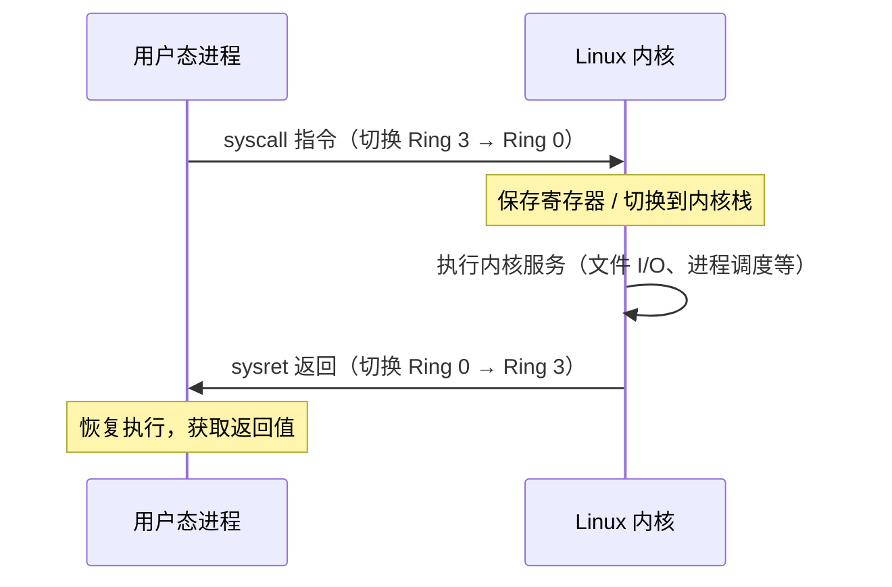
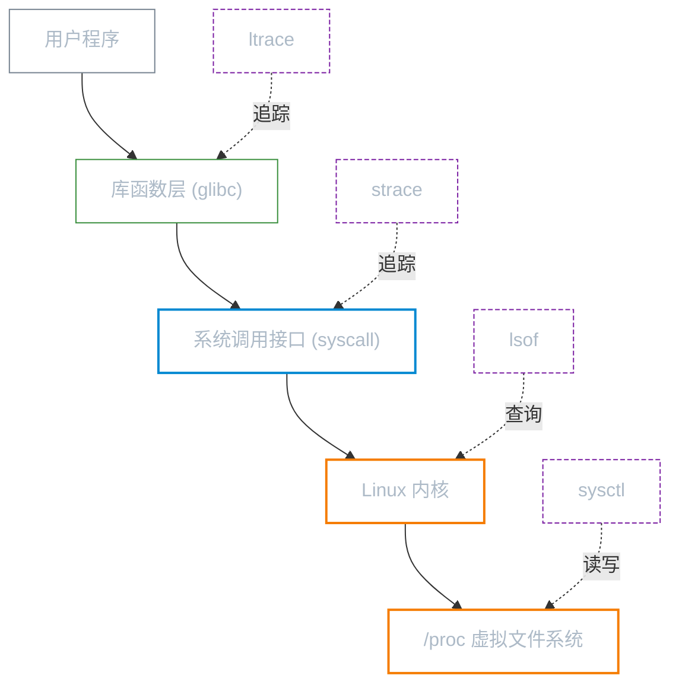

# Linux 编程接口基础

**本文你会学到**：

- 系统调用与库函数的区别，以及它们的对应关系
- 用户态与内核态的概念及特权级隔离的目的
- 系统调用如何跨越用户态/内核态边界
- 文件描述符（FD）的本质与用途
- 文件 I/O 的底层机制（open、read、write、close）
- 缓冲 I/O 与非缓冲 I/O 的区别（stdio vs syscall）
- 标准流（stdin、stdout、stderr）与文件描述符 0、1、2 的对应关系
- 文件权限位与进程的有效权限检查
- `/proc/[pid]/` 下的文件与目录含义
- `strace` 的使用方法与常见系统调用追踪技巧
- 信号的基础概念与常见信号处理

## 系统调用与库函数：两个不同的"层"

### 什么是系统调用？

当一个程序执行 `read()` 读取文件时，它其实在向 **Linux 内核**提出请求。这就是**系统调用（System Call，syscall）**——用户空间程序与内核之间唯一合法的通信渠道。

系统调用直接代表着"我需要内核帮我做某件事"：

- 文件操作：`open`、`read`、`write`、`close`、`stat`
- 进程控制：`fork`、`exec`、`exit`、`wait`
- 信号：`kill`、`signal`、`sigaction`
- 网络：`socket`、`bind`、`connect`、`accept`
- 内存：`mmap`、`brk`

内核将这些调用编了号（syscall number），每次调用时 CPU 会发生一次**特权级切换**，从用户态（Ring 3）跳入内核态（Ring 0），执行完毕后再跳回。这就是"穿越了用户态/内核态边界"的含义。

### 什么是库函数？

**库函数（Library Function）**是对系统调用的高层封装，通常来自 glibc（GNU C Library）。它们运行在用户态，只在必要时才向下调用系统调用。

几个典型的对应关系：

| 库函数 | 底层系统调用 |
|--------|------------|
| `fopen()` | `open()` |
| `printf()` | `write()` |
| `malloc()` | `brk()` / `mmap()` |
| `exit()` | `exit_group()` |
| `fgets()` | `read()` |

!!! tip "关键区别：库函数可能不会立即触发系统调用"

    `printf()` 有内部缓冲区，只有当缓冲区满了或调用 `fflush()` 时，才真正调用 `write()` 写入内核。这就是为什么程序崩溃后最后几行输出有时会"消失"——它们还在 glibc 的缓冲区里，没来得及写入。

### 用户态与内核态的边界

想象一下，如果任何程序都可以直接读写内存、控制硬件，系统将毫无安全性可言。**特权级隔离**解决了这个问题：

- **用户态（User Space）**：普通程序运行的环境，无法直接访问硬件，无法修改内核数据结构，内存地址空间受到保护
- **内核态（Kernel Space）**：内核独占的运行环境，可以执行任意 CPU 指令，直接访问所有硬件和内存

系统调用比普通函数调用慢的原因：

- CPU 需要保存当前所有寄存器状态（context save）
- 切换到内核栈
- 内核执行请求（可能涉及 I/O 等待、调度）
- 恢复用户态上下文，返回
- 整个过程可能花费数百纳秒到数微秒，比普通函数调用慢 10-100 倍



### 用 strace 追踪系统调用

当你不确定一个程序"到底在做什么"时，`strace` 是最直接的答案——它能捕获进程发出的每一个系统调用及其返回值。

``` bash title="strace 基本用法"
# 追踪一个命令的所有系统调用
strace ls /tmp

# 追踪已运行的进程（需要 root 或同用户权限）
strace -p 1234

# 只显示文件相关的系统调用
strace -e trace=file ls /tmp

# 统计每个系统调用的调用次数和总耗时（诊断性能瓶颈）
strace -c ls /tmp

# 追踪进程及其所有子进程（fork 后）
strace -f -p 1234

# 将输出保存到文件（不干扰终端）
strace -o /var/log/strace.log ls /tmp
```

每一行输出的格式为：`系统调用名(参数...) = 返回值`，失败时会附上 errno 名：

``` text title="strace 输出示例（ls /tmp）"
openat(AT_FDCWD, "/etc/ld.so.cache", O_RDONLY|O_CLOEXEC) = 3
read(3, "\177ELF\2\1\1\0...", 832) = 832
close(3)                                = 0
openat(AT_FDCWD, ".", O_RDONLY|O_DIRECTORY) = 3
getdents64(3, /* 12 entries */, 32768)  = 336
write(1, "file1  file2  file3\n", 20)   = 20
# 失败的调用示例：
openat(AT_FDCWD, "/nonexistent", O_RDONLY) = -1 ENOENT (No such file or directory)
```

!!! tip "运维场景：程序挂起、文件找不到、权限报错"

    用 `strace` 几乎都能快速定位：看哪个系统调用返回了 `-1`，以及紧跟的 errno 是什么。`strace -c` 统计模式还能帮你找出性能瓶颈（哪个 syscall 占用了最多时间）。

## errno 错误处理机制

### 为什么需要 errno？

系统调用的返回值只有一个整数，通常用 `-1` 表示失败——但失败原因千变万化：文件不存在、没有权限、磁盘满了……仅凭 `-1` 无法区分。

**errno** 就是那个"补充说明"：每次系统调用或库函数失败时，内核/glibc 会将错误码写入 `errno` 这个特殊变量，调用方可以立即读取它来判断具体原因。

``` bash title="在 Shell 中查看 errno"
# bash 的 $? 存储上一条命令的退出码（非 errno，但通常有对应关系）
ls /nonexistent
echo $?           # 输出 2（对应 ENOENT）

# 用 Python 快速查询 errno 含义
python3 -c "import os; print(os.strerror(13))"
# 输出：Permission denied

# 查看所有 errno 定义（Linux 上）
grep -r "define E" /usr/include/asm-generic/errno*.h | head -30
```

### 将错误码转为可读信息

- **`perror(prefix)`**：将当前 `errno` 值转为人类可读的错误消息打印到 stderr，格式为 `prefix: 错误描述`
- **`strerror(n)`**：返回错误码 n 对应的字符串，常用于写日志

``` bash title="用 strace 直接读取 errno"
# strace 已经帮你把 errno 名称显示出来了
openat(AT_FDCWD, "/etc/shadow", O_RDONLY) = -1 EACCES (Permission denied)
connect(3, ...) = -1 ECONNREFUSED (Connection refused)
```

!!! warning "重要：成功的调用不会清零 errno"

    `errno` **不会**在成功调用后被置为 0。因此，只有在调用返回 `-1` 之后才有意义去检查 `errno`；不要在成功返回后读取它——那里保留的是上次失败的残留值。

### 常见 errno 值速查

| errno 名 | 数值 | 含义 | 常见场景 |
|----------|------|------|---------|
| `ENOENT` | 2 | No such file or directory | 路径不存在 |
| `EPERM` | 1 | Operation not permitted | 非 root 尝试特权操作 |
| `EACCES` | 13 | Permission denied | 文件权限不足（rwx） |
| `EINVAL` | 22 | Invalid argument | 传入了非法参数值 |
| `ENOMEM` | 12 | Out of memory | 内存不足，分配失败 |
| `EAGAIN` | 11 | Resource temporarily unavailable | 非阻塞 I/O 暂时无数据 |
| `EEXIST` | 17 | File exists | 创建已存在的文件/目录 |
| `EBADF` | 9 | Bad file descriptor | 操作已关闭的 fd |
| `ENOTEMPTY` | 39 | Directory not empty | 删除非空目录 |
| `ECONNREFUSED` | 111 | Connection refused | 目标端口未监听 |
| `ETIMEDOUT` | 110 | Connection timed out | 网络超时 |
| `ENOSPC` | 28 | No space left on device | 磁盘空间不足 |

!!! tip "errno 是线程本地的"

    在多线程程序中，每个线程有自己独立的 `errno` 副本（Thread Local Storage）。一个线程的系统调用失败不会影响其他线程的 `errno` 值，不必担心竞争条件。

## /proc 虚拟文件系统深度解析

### /proc 的本质：内核向外"开的窗口"

`/proc` 不是真实的磁盘文件系统，它是内核在内存中维护的**虚拟文件系统（Virtual File System）**。你 `cat /proc/meminfo` 读到的内容，是内核**实时生成**的——关闭再读，数字就可能不同了。

``` bash title="验证 /proc 不占用磁盘空间"
df -h /proc
# Filesystem      Size  Used Avail Use% Mounted on
# proc               0     0     0    -  /proc
# 大小为 0！内容完全在内存中动态生成
```

`/proc` 有两大功能：

- **读**：暴露内核运行时状态（进程、内存、网络、硬件等）
- **写**：调整内核运行参数（通过 `/proc/sys/` 子树）

### /proc/PID/ 进程目录速查

每个运行中的进程在 `/proc/` 下都有一个以其 PID 命名的目录。此外，`/proc/self` 始终指向当前进程自己的目录，非常方便。

``` bash title="查看进程信息"
# 以 sshd 为例，找到其 PID
SSHD_PID=$(pgrep -x sshd | head -1)
ls /proc/$SSHD_PID/
```

常用子路径速查：

| 路径 | 内容 | 典型用途 |
|------|------|---------|
| `fd/` | 进程打开的所有文件描述符（符号链接） | 查看打开的文件/socket |
| `status` | 进程状态、内存用量、UID/GID 凭证 | 快速诊断内存、权限问题 |
| `maps` | 进程虚拟内存地址空间映射 | 调试内存、了解加载的共享库 |
| `limits` | 进程的各项资源限制（ulimit 值） | 排查 "too many open files" |
| `environ` | 进程启动时的环境变量（`\0` 分隔） | 查看启动时传入的环境 |
| `exe` | 符号链接，指向可执行文件路径 | 找到进程对应的二进制文件 |
| `cmdline` | 启动命令行参数（`\0` 分隔） | 等同于 `ps aux` 的 COMMAND 列 |
| `cwd` | 进程的当前工作目录 | 找到进程工作目录 |
| `net/` | 进程网络命名空间的套接字状态 | 调试网络连接 |
| `io` | 进程的 I/O 读写字节数统计 | 监控磁盘 I/O 使用情况 |

``` bash title="实用命令示例"
PID=$(pgrep -x sshd | head -1)

# 查看进程内存使用和凭证信息
cat /proc/$PID/status

# 查看进程打开了哪些文件描述符
ls -la /proc/$PID/fd/

# 读取环境变量（\0 分隔，用 tr 替换为换行）
cat /proc/$PID/environ | tr '\0' '\n'

# 查看进程可执行文件路径
readlink /proc/$PID/exe

# 查看进程资源限制（Max open files 等）
cat /proc/$PID/limits

# 读取命令行参数（空字节替换为空格）
cat /proc/$PID/cmdline | tr '\0' ' '; echo
```

`/proc/PID/status` 的典型输出片段：

``` text title="/proc/PID/status 示例"
Name:   sshd
State:  S (sleeping)
Pid:    1234
PPid:   1
Uid:    0  0  0  0     # Real/Effective/Saved/Filesystem UID
Gid:    0  0  0  0     # Real/Effective/Saved/Filesystem GID
VmRSS:  5432 kB        # 实际使用的物理内存（Resident Set Size）
VmSize: 14620 kB       # 虚拟内存总大小
VmSwap: 0 kB           # 被交换到 swap 的大小
Threads: 1
voluntary_ctxt_switches: 1234
nonvoluntary_ctxt_switches: 56
```

!!! tip "无需 ps 也能查进程信息"

    `cat /proc/PID/status` 和 `cat /proc/PID/cmdline | tr '\0' ' '` 能获取 `ps aux` 同等信息。在容器内没有 `ps` 命令的受限环境中，这是重要的替代手段。

### 系统级关键路径

除了进程目录，`/proc` 根目录下还有大量系统级信息：

| 路径 | 内容 |
|------|------|
| `/proc/meminfo` | 内存使用详情（总量、可用、缓存、swap 等） |
| `/proc/cpuinfo` | CPU 型号、核心数、特性标志（flags 字段） |
| `/proc/loadavg` | 系统负载（1/5/15 分钟均值）和当前进程数 |
| `/proc/uptime` | 系统运行时间（秒）和空闲时间 |
| `/proc/version` | 内核版本字符串 |
| `/proc/mounts` | 当前挂载的文件系统（等同 `mount` 命令输出） |
| `/proc/net/tcp` | IPv4 TCP 连接状态（原始十六进制格式） |
| `/proc/net/tcp6` | IPv6 TCP 连接状态 |
| `/proc/sys/` | 内核可调参数（可读可写） |
| `/proc/interrupts` | 硬件中断计数 |
| `/proc/diskstats` | 磁盘 I/O 统计（iostat 的数据来源） |
| `/proc/buddyinfo` | 内存伙伴系统（buddy system）碎片信息 |

``` bash title="常用系统信息速查"
# 内存概况（提取关键行）
grep -E "MemTotal|MemFree|MemAvailable|Cached|SwapTotal|SwapFree" /proc/meminfo

# 系统负载（含进程数和最新 PID）
cat /proc/loadavg
# 0.15 0.10 0.08 1/423 5678
# 1min  5min 15min  运行/总进程   最新创建的PID

# CPU 核心数
grep -c "^processor" /proc/cpuinfo

# CPU 是否支持虚拟化（vmx=Intel VT-x, svm=AMD-V）
grep -o "vmx\|svm" /proc/cpuinfo | head -1

# 系统运行时间（秒）
awk '{printf "运行 %.0f 小时 %.0f 分钟\n", $1/3600, ($1%3600)/60}' /proc/uptime
```

### /proc/sys 与 sysctl 的关系

`/proc/sys/` 是内核可调参数的文件系统入口，`sysctl` 命令本质上是对这个目录的读写封装。两者**完全等价**：

| sysctl 方式 | /proc/sys 方式 |
|------------|--------------|
| `sysctl net.ipv4.ip_forward` | `cat /proc/sys/net/ipv4/ip_forward` |
| `sysctl -w net.ipv4.ip_forward=1` | `echo 1 > /proc/sys/net/ipv4/ip_forward` |
| `sysctl -a` | `find /proc/sys -type f \| xargs grep -l .` |

``` bash title="sysctl 常用示例"
# 查询特定参数
sysctl net.core.somaxconn
sysctl vm.swappiness

# 临时修改（重启失效）
sysctl -w net.ipv4.ip_forward=1
sysctl -w vm.swappiness=10

# 永久生效：写入配置文件后重新加载
echo "vm.swappiness=10" | tee -a /etc/sysctl.d/99-custom.conf
sysctl -p /etc/sysctl.d/99-custom.conf

# 查看所有内核参数
sysctl -a 2>/dev/null | grep -i "net.core"
```

!!! warning "临时修改 vs 永久修改"

    直接写 `/proc/sys/` 或 `sysctl -w` 的修改**重启后失效**。要永久生效，需要写入 `/etc/sysctl.conf` 或 `/etc/sysctl.d/*.conf`，然后运行 `sysctl -p`。推荐使用 `/etc/sysctl.d/` 下的独立文件，便于管理和版本控制。

## man 手册页的正确用法

### man 的分区体系

你是否遇到过 `man printf` 给你看的是 C 库函数文档，而不是 Shell 命令的用法？这是因为 man 手册分成了多个**分区（Section）**，同一个名字可能在多个分区都有对应的手册页：

| 分区号 | 内容 | 示例 |
|--------|------|------|
| 1 | 用户命令（Shell 可直接运行的程序） | `man 1 ls`、`man 1 chmod`、`man 1 find` |
| 2 | 系统调用（Linux 内核接口） | `man 2 open`、`man 2 fork`、`man 2 mmap` |
| 3 | 库函数（glibc 等用户态库） | `man 3 printf`、`man 3 fopen`、`man 3 malloc` |
| 4 | 设备文件（/dev/ 下的特殊文件） | `man 4 null`、`man 4 random` |
| 5 | 文件格式和配置文件语法 | `man 5 passwd`、`man 5 crontab`、`man 5 fstab` |
| 6 | 游戏（历史遗留，现代发行版极少） | — |
| 7 | 概念、协议、杂项 | `man 7 signal`、`man 7 tcp`、`man 7 inode` |
| 8 | 系统管理命令（通常需要 root） | `man 8 iptables`、`man 8 mount`、`man 8 useradd` |

``` bash title="man 分区使用"
# 明确指定分区号
man 2 open       # 系统调用 open()（内核接口）
man 3 fopen      # 库函数 fopen()（glibc 封装）
man 5 crontab    # crontab 文件格式说明
man 7 signal     # 信号机制的概念说明

# 搜索包含关键词的手册页名称
man -k socket
apropos "file system"

# 查看某个名字在哪些分区有手册页
man -f open      # 等价于 whatis open
# 输出：open (1) - open a file; open (2) - open and possibly create a file

# 列出所有手册页分区
man -a open      # 依次查看所有分区的 open
```

### 为什么同一个名字有多个手册页？

以 `open` 为例：

- `man 2 open`：系统调用，描述内核接口，包含 C 函数签名 `int open(const char *pathname, int flags, ...)`、返回值、可能的 errno 等
- `man 1 open`：某些发行版提供的 Shell 命令（macOS 上会打开文件/URL）

对系统管理员来说，这几个分区最常用：

- **man 2**：理解系统调用行为（`open`、`fork`、`kill`、`mmap`）
- **man 5**：查看配置文件格式（`/etc/fstab`、`/etc/crontab`、`/etc/passwd`）
- **man 7**：理解概念（`signal(7)` 讲所有信号的含义，`tcp(7)` 讲 TCP socket 选项）
- **man 8**：系统管理命令（`mount`、`iptables`、`systemctl`）

### man 页面结构解读

标准 man 页面包含以下固定节：

| 节名 | 内容 |
|------|------|
| `NAME` | 命令/函数名称和一行简介 |
| `SYNOPSIS` | 使用格式（命令行语法或函数签名） |
| `DESCRIPTION` | 详细描述 |
| `OPTIONS` | 可用选项（命令类） |
| `RETURN VALUE` | 返回值说明（系统调用/库函数） |
| `ERRORS` | 可能的 errno 值及含义（非常重要！） |
| `NOTES` | 补充说明、移植性注意事项 |
| `EXAMPLES` | 使用示例 |
| `SEE ALSO` | 相关手册页 |
| `CONFORMING TO` | 符合哪些标准（POSIX/SUSv3/Linux 特有） |

``` bash title="快速查阅技巧"
# 在 man 中搜索（进入后按 / 再输入关键词）
man sysctl     # 进入后按 /swappiness 定位参数

# 输出为纯文本，方便用 grep 过滤
man -P cat open | grep -A 5 "RETURN VALUE"

# 查看特定节的内容（如 ERRORS）
man 2 open | grep -A 20 "^ERRORS"
```

### info pages vs man pages

GNU 项目的工具通常提供更详细的 `info` 格式文档：

- **man pages**：简洁参考手册，适合快速查参数和函数签名
- **info pages**：超链接树状结构，内容更丰富，有完整的教程和示例，适合深度学习

``` bash title="info 命令示例"
info ls           # 查看 ls 的详细 info 文档
info coreutils    # 查看整个 GNU coreutils 的 info 树
info find         # find 的 info 比 man 详细得多
```

!!! tip "日常建议"

    对于系统调用和库函数，`man 2/3` 是最权威的参考，尤其是 `ERRORS` 节（告诉你哪些 errno 可能出现）。对于 GNU 工具（`grep`、`sed`、`find`、`awk`），`info` 页面往往比 `man` 内容更详细。

## POSIX 标准与可移植性

### POSIX 解决了什么问题？

1980 年代，Unix 系统因商业竞争分裂出众多互不兼容的版本（System V、BSD、HP-UX、AIX、SunOS……）。同一个程序要在不同 Unix 上编译运行，开发者需要大量条件编译和平台判断。

**POSIX（Portable Operating System Interface，IEEE 1003.1）** 就是为了解决这个问题而诞生的标准——它定义了操作系统必须提供哪些 API、命令和行为，让遵从 POSIX 的系统上编写的程序可以互相移植。

Linux 高度兼容 POSIX，但并非官方认证的 POSIX 系统（认证成本高昂）。macOS 是官方认证的 POSIX 系统。

### Linux/GNU 扩展 vs POSIX 标准

Linux 和 glibc 在 POSIX 的基础上提供了大量扩展，性能更好或功能更丰富，但牺牲了可移植性：

| 类别 | POSIX 标准接口 | Linux/GNU 扩展 |
|------|--------------|--------------|
| 文件操作 | `open()` / `read()` | `openat()` / `pread()` / `splice()` |
| 目录遍历 | `readdir()` | `getdents64()`（更高效） |
| 进程创建 | `fork()` / `exec()` | `clone()`（细粒度控制，容器的基础） |
| 文件元数据 | `stat()` | `statx()`（更多信息，原子性更强） |
| 信号 | `kill()` / `sigaction()` | `signalfd()` / `pidfd_send_signal()` |
| 定时器 | `alarm()` / `setitimer()` | `timerfd_create()`（可 epoll 监听） |
| I/O 多路复用 | `select()` / `poll()` | `epoll`（高性能，Linux 专有） |

这些 Linux 扩展只能在 Linux 上使用，如果你的代码需要在 macOS/FreeBSD 等平台运行，需要谨慎使用。

### 功能测试宏

在 C 程序中，通过定义特定的**功能测试宏（Feature Test Macros）**来控制 glibc 暴露哪些 API：

| 宏 | 效果 |
|----|------|
| `_POSIX_C_SOURCE=200809L` | 启用 POSIX.1-2008 规范的 API |
| `_XOPEN_SOURCE=700` | 启用 X/Open（SUSv4）API，包含 POSIX |
| `_GNU_SOURCE` | 启用所有 GNU/Linux 扩展（最宽松，最常用） |
| `_DEFAULT_SOURCE` | glibc 2.20+ 默认值，包含常用 POSIX 和 BSD 扩展 |

``` bash title="查看功能测试宏完整文档"
man 7 feature_test_macros
```

对管理员的实际意义：当你看到编译错误 `implicit declaration of function 'strdup'` 之类的报错时，很可能是功能测试宏的问题——源代码需要定义 `_GNU_SOURCE` 或 `_POSIX_C_SOURCE` 才能使用对应的 API。

## 系统管理员常用诊断工具

### strace：追踪系统调用

前面已经介绍了基础用法，这里补充几个高级运维场景：

``` bash title="strace 进阶用法"
# 查看程序启动时读取了哪些配置文件（过滤失败的 open）
strace -e trace=openat nginx 2>&1 | grep -v "= -1"

# 诊断"程序为什么慢"：统计每个 syscall 的总耗时
strace -c -p $(pgrep mysqld | head -1)
# 输出示例：
#   % time     seconds  usecs/call  calls  syscall
#   45.32    0.023451         123    191  futex
#   23.11    0.011954          47    254  read

# 追踪网络相关 syscall
strace -e trace=network curl http://example.com 2>&1 | head -20

# 将进程及子进程的 syscall 按 PID 分类写入文件
strace -ff -o /var/log/strace nginx
```

!!! warning "strace 有显著性能开销"

    `strace` 通过 `ptrace` 系统调用拦截所有 syscall，会使目标进程速度下降 **5-10 倍**甚至更多。在生产环境请谨慎使用，诊断完毕立即移除。

### ltrace：追踪库函数调用

与 `strace` 追踪系统调用不同，`ltrace` 追踪的是**动态库函数调用**（glibc 和其他 `.so` 中的函数）。

``` bash title="ltrace 用法"
# 追踪 ls 的库函数调用
ltrace ls /tmp 2>&1 | head -20

# 只追踪特定函数
ltrace -e malloc,free,fopen ls /tmp

# 同时追踪 syscall 和库函数（-S 开启 syscall 追踪）
ltrace -S ls /tmp
```

``` text title="ltrace 输出示例"
malloc(1024)                    = 0x5616abc12340
fopen("/etc/ld.so.cache", "r")  = 0x5616abc45670
fgets(...)                      = "..."
fclose(0x5616abc45670)          = 0
free(0x5616abc12340)            = <void>
```

!!! tip "strace vs ltrace 如何选择"

    - 怀疑是**内核层面**的问题（权限、文件找不到、网络、进程创建）→ 用 `strace`
    - 怀疑是**库函数层面**的问题（解析逻辑、内存分配、加密库行为）→ 用 `ltrace`

### lsof：查看进程打开的文件

`lsof`（List Open Files）让你看清哪些进程打开了哪些文件描述符，包括普通文件、目录、套接字、管道、设备等。在 Linux 上"一切皆文件"，`lsof` 的适用场景极广。

``` bash title="lsof 常用命令"
# 查看某进程打开的所有文件描述符
lsof -p 1234

# 查看谁打开了某个文件
lsof /var/log/syslog

# 查看某用户打开的所有文件
lsof -u www-data

# 查看网络连接（类似 netstat -anp）
lsof -i
lsof -i :80          # 谁在监听 80 端口？
lsof -i tcp:443      # 443 端口的 TCP 连接

# 查找被删除但仍被进程持有的文件（"幽灵文件"）
lsof | grep deleted

# 列出某目录下被进程打开的所有文件
lsof +D /var/log/
```

`lsof` 输出格式说明：

``` text title="lsof 输出字段含义"
COMMAND   PID   USER   FD   TYPE DEVICE SIZE/OFF   NODE NAME
nginx    1234   root  cwd    DIR    8,1     4096   1234 /
nginx    1234   root    3u  IPv4  12345      0t0    TCP *:80 (LISTEN)
nginx    1234   root    4r   REG    8,1    10240  56789 /etc/nginx/nginx.conf

# FD 列：cwd=当前目录 txt=程序文本段 mem=内存映射
#         数字+u=读写  数字+r=只读  数字+w=只写
# TYPE：REG=普通文件 DIR=目录 IPv4/IPv6=套接字 FIFO=管道 CHR=字符设备
```

!!! tip "磁盘空间消失但找不到大文件？"

    当 `df -h` 显示磁盘接近满，但 `du -sh /*` 却找不到对应大文件时，很可能是**幽灵文件**问题：某个文件已被 `unlink`（从目录删除），但仍有进程持有其文件描述符，磁盘空间因此无法释放。用 `lsof | grep deleted` 找到对应进程，重启它或关闭 fd 即可释放空间。

### sysctl：内核参数调优

`sysctl` 是读写 `/proc/sys/` 的标准工具，常用于系统调优：

``` bash title="常用 sysctl 调优参数"
# === 网络优化 ===
# TCP accept 队列大小（高并发 Web 服务建议 >= 1024，默认 128）
sysctl -w net.core.somaxconn=1024

# SYN 半连接队列大小（防 SYN flood 或高并发场景）
sysctl -w net.ipv4.tcp_max_syn_backlog=2048

# 开启 IP 转发（路由器/NAT/容器网络必须开启）
sysctl -w net.ipv4.ip_forward=1

# === 内存管理 ===
# 降低 swap 倾向（0=尽量不用 swap，100=积极使用）
sysctl -w vm.swappiness=10

# 脏页写回触发阈值（百分比，默认 20%）
sysctl -w vm.dirty_ratio=15

# === 文件系统 ===
# 系统级最大打开文件数
sysctl -w fs.file-max=1000000

# inotify 监听文件数上限（Docker / IDE 经常超出默认值 8192）
sysctl -w fs.inotify.max_user_watches=524288
```

``` bash title="一键查看关键参数"
sysctl net.core.somaxconn net.ipv4.ip_forward vm.swappiness fs.file-max
```

工具与系统层次的关系总览：



!!! tip "工具选择速查表"

    | 问题场景 | 首选工具 |
    |---------|---------|
    | 程序调用了哪些系统调用？ | `strace` |
    | 程序调用了哪些库函数？ | `ltrace` |
    | 进程打开了哪些文件/网络连接？ | `lsof` |
    | 内核参数当前值是多少？如何调整？ | `sysctl` |
    | 进程的内存用量、UID/GID 凭证？ | `cat /proc/PID/status` |
    | 进程启动时的环境变量？ | `cat /proc/PID/environ \| tr '\0' '\n'` |
    | 磁盘空间被幽灵文件占用？ | `lsof \| grep deleted` |
    | 某个系统调用/库函数的行为和 errno？ | `man 2 syscall` / `man 3 func` |

### 内存分配概览

动态内存分配是 C 程序最基础的操作之一。Linux 提供从 `malloc` 到 `mmap` 的多层分配机制，涵盖堆内存、内存映射、共享内存等不同场景：

→ [内存管理](memory/index.md)

### 定时器概览

Linux 提供从秒级 `sleep` 到纳秒级 `timerfd` 的多种定时机制，满足不同精度和场景的需求，包括间隔定时器、POSIX 定时器、基于文件描述符的 timerfd 等：

→ [定时器与休眠](timers/index.md)

