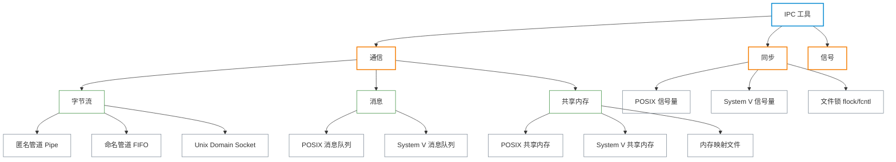

# 进程间通信

**本文你会学到**：

- IPC 的三大分类：通信、同步、信号
- 匿名管道、命名管道与 Unix Domain Socket 的对比
- POSIX 消息队列与 System V 消息队列的区别
- 共享内存的工作原理与使用场景
- 文件锁与信号量的同步机制
- 信号的基础概念与常见信号种类
- 各类 IPC 工具的性能对比与选型指南
- IPC 对象的权限管理与清理
- 实战：用管道、消息队列解决进程通信问题

## 为什么进程之间需要通信

每个进程都拥有**独立的虚拟地址空间**（Virtual Address Space）。操作系统通过内存管理单元（MMU）隔离各进程的内存页，进程 A 无法直接读写进程 B 的内存——这是安全性的基础，但也意味着进程之间若要协作，必须借助内核提供的特殊机制。

这些机制统称为**进程间通信（Inter-Process Communication，IPC）**。Linux 继承自 UNIX，提供了丰富的 IPC 工具，按功能可以分成三大类：

- **通信**：进程之间交换数据（管道、消息队列、共享内存、socket 等）
- **同步**：协调多个进程对共享资源的访问顺序（信号量、文件锁）
- **信号**：轻量级异步通知（`SIGUSR1`/`SIGUSR2` 等可用于简单信号传递）



## IPC 六大机制全景

| 机制 | 数据形式 | 通信方向 | 亲缘关系要求 | 持久性 | 同步需求 | 典型场景 |
|------|---------|---------|------------|--------|---------|---------|
| 匿名管道 (Pipe) | 字节流 | 单向 | 必须有（父子/兄弟进程） | 进程生命期 | 内核自动阻塞 | `ls \| wc`、父子通信 |
| 命名管道 (FIFO) | 字节流 | 单向 | 无需 | 进程生命期 | 内核自动阻塞 | 日志收集、任务队列 |
| POSIX 共享内存 | 原始内存 | 双向 | 无需 | 内核持久 | **需要手动同步** | 大数据量高速通信 |
| POSIX 消息队列 | 带边界消息 | 单向 | 无需 | 内核持久 | 内核自动阻塞 | 需要优先级的任务分发 |
| POSIX 信号量 | 计数器 | — | 无需 | 内核/进程持久 | — | 保护共享资源 |
| Unix Domain Socket | 字节流/数据报 | 双向 | 无需 | 进程生命期 | 内核自动阻塞 | 本机 C/S 通信、传递 fd |

## 选型指南

选择 IPC 机制时，核心问题只有四个：

**数据量大不大？**

- 大量数据 → 共享内存（零拷贝，无需内核中转）
- 少量数据 → 管道、消息队列、socket 均可

**进程之间有没有亲缘关系？**

- 父子/兄弟进程 → 匿名管道最简单
- 无亲缘关系 → FIFO、消息队列、共享内存、socket

**需不需要消息边界和优先级？**

- 需要 → POSIX 消息队列（天然有消息边界和优先级队列）
- 不需要 → 管道（字节流更简单）

**要不要跨机器通信？**

- 仅同机 → 上述任何机制
- 跨网络 → TCP/UDP socket（Unix Domain Socket 不能跨机）

## 管道（Pipe）

### 管道的本质

管道并不是一个文件——它是**内核在内存中维护的一块环形缓冲区**。写入管道的数据先进入内核缓冲，读取时再从内核缓冲复制到用户空间。这一来一回需要两次数据拷贝，但内核会自动处理读写同步，使用起来非常方便。

Linux 2.6.11 以后，管道默认容量为 **65,536 字节**（64KB），可通过 `/proc/sys/fs/pipe-max-size` 查看上限（默认 1MB）。

!!! note "PIPE_BUF 原子写"

    `PIPE_BUF` 在 Linux 上为 **4096 字节**。写入数据不超过此值时，内核保证写操作是原子的——多个写者不会互相交叉数据。超过 `PIPE_BUF` 的写入则可能被拆分，与其他写者的数据混杂。

### 匿名管道的使用方式

`pipe()` 系统调用返回两个文件描述符：`fd[0]`（读端）和 `fd[1]`（写端）。管道只能在有亲缘关系的进程间使用，因为创建管道后必须通过 `fork()` 让子进程继承这两个描述符。

``` bash title="查看管道容量上限"
cat /proc/sys/fs/pipe-max-size
```

``` bash title="匿名管道典型用法（父进程写，子进程读）"
# 伪代码流程：
# 1. pipe(fd) 创建管道
# 2. fork() 创建子进程（子进程继承 fd[0] 和 fd[1]）
# 3. 父进程关闭 fd[0]（读端），只负责写
# 4. 子进程关闭 fd[1]（写端），只负责读
# 5. 父进程 write(fd[1], ...)，子进程 read(fd[0], ...)
# 6. 父进程关闭 fd[1] → 子进程 read() 返回 EOF
```

!!! warning "未关闭未使用端会导致死锁"

    读进程如果不关闭自己持有的写端描述符，即使所有写者都关闭了写端，读进程的 `read()` 仍会永远阻塞——因为内核看到写端还有"存活"的描述符。**必须关闭每端不用的描述符**。

### shell 管道 `|` 的底层实现

当你在 shell 中执行 `ls | wc -l` 时，shell 在幕后做了以下工作：

``` bash title="shell 管道底层实现（概念演示）"
# shell 执行 ls | wc 的等价步骤：
# 1. pipe(fd)
# 2. fork() → 子进程 A（执行 ls）
#    - close(fd[0])          # 关闭读端
#    - dup2(fd[1], STDOUT)   # 将标准输出重定向到管道写端
#    - close(fd[1])
#    - exec("ls")
# 3. fork() → 子进程 B（执行 wc）
#    - close(fd[1])          # 关闭写端
#    - dup2(fd[0], STDIN)    # 将标准输入重定向到管道读端
#    - close(fd[0])
#    - exec("wc")
# 子进程 A 和 B 并不知道管道的存在，只是读写标准描述符
```

### 管道满/空的阻塞行为

- **管道为空**：`read()` 阻塞，直到有数据写入（或所有写端关闭后返回 0）
- **管道已满**：`write()` 阻塞，直到读者取走了部分数据

这种自动背压（back-pressure）机制是管道的核心优雅之处——不需要应用程序手动管理流控。

### SIGPIPE：写端的"断管"信号

当读端全部关闭后，写者再往管道写数据时，内核会向写进程发送 **`SIGPIPE`** 信号。`SIGPIPE` 的默认动作是**终止进程**。

``` bash title="忽略 SIGPIPE 并捕获错误码（shell 脚本）"
# 在 shell 脚本中忽略 SIGPIPE，避免管道断裂时脚本被杀死
trap '' PIPE
# 程序层面会收到 EPIPE 错误（errno = 32），自行处理
```

!!! note "典型场景"

    `head -5` 在读取完 5 行后会关闭读端，这时上游 `cat large_file` 就会收到 SIGPIPE 并终止——这正是 `head` 的工作原理。

### `popen()` / `pclose()`：便捷管道

`popen()` 在内部自动完成 `pipe()` + `fork()` + `exec()` + `dup2()` 的一系列操作，返回一个 `FILE*` 流，可以直接用 `fgets()`/`fprintf()` 读写。

``` bash title="popen() 用法等价演示"
# C 语言：FILE *fp = popen("ls -la", "r");
# 逐行读取 ls 的输出，pclose(fp) 关闭并等待子进程结束

# 等价于 shell 中：
output=$(ls -la)
```

!!! warning "安全警告"

    `popen()` 内部调用 shell 解析命令字符串。**永远不要**将用户输入直接拼入 `popen()` 的命令字符串——这是命令注入漏洞的高发点。

## 命名管道（FIFO）

### FIFO 与匿名管道的核心区别

匿名管道只能在有亲缘关系的进程间使用，因为它没有文件系统路径，无法被陌生进程找到。FIFO（First In, First Out）在文件系统中创建了一个**特殊文件**，任何拥有该文件访问权限的进程都能打开它——无需亲缘关系。

``` bash title="创建和使用 FIFO"
# 创建命名管道
mkfifo /tmp/my_fifo

# 查看文件类型（p 表示 pipe）
ls -la /tmp/my_fifo
# prw-r--r-- 1 user user 0 Jan 1 12:00 /tmp/my_fifo

# 终端 A：读取端（open() 会阻塞，直到有写者）
cat /tmp/my_fifo

# 终端 B：写入端（此时两端都就绪，open() 立即返回）
echo "hello from writer" > /tmp/my_fifo
```

### 阻塞语义：open() 的同步点

FIFO 有一个重要特性：`open()` 会**阻塞，直到两端都就绪**（一个读者 + 一个写者）。这是 FIFO 自带的同步机制——打开 FIFO 本身就是一次握手。

如果想非阻塞打开，可以使用 `O_NONBLOCK` 标志，此时若另一端尚未打开，`open()` 会立即返回 `ENXIO` 错误。

### 典型用途

FIFO 在系统运维和简单服务设计中非常常见：

- **日志收集**：多个进程将日志写入同一个 FIFO，一个专用进程负责读取并持久化
- **简单任务队列**：生产者将任务写入 FIFO，消费者按 FIFO 顺序处理
- **`tee` + FIFO 创建分叉管道**：将一个命令的输出同时发送给两个下游命令

``` bash title="FIFO 用作简单日志管道"
mkfifo /run/app_log.pipe
# 后台启动日志消费者
cat /run/app_log.pipe >> /var/log/app.log &
# 各工作进程写入日志
echo "worker started" > /run/app_log.pipe
```

## POSIX 共享内存

### 零拷贝：最快的 IPC 机制

管道和消息队列传输数据时，数据必须经历两次复制：写者 → 内核缓冲区 → 读者。**共享内存直接跳过这两次拷贝**：内核将同一块物理内存页映射到多个进程的虚拟地址空间，进程直接读写内存地址，速度等同于访问本地内存。

但这也是共享内存的代价：**没有内置的同步机制**，多个进程同时写同一块内存会导致竞争条件（Race Condition），必须配合信号量使用。

### 使用流程

!!! note "POSIX 共享内存 API 流程"

    典型的使用流程（C 语言伪代码）：

    1. `shm_open("/my_shm", O_CREAT|O_RDWR, 0600)` — 创建或打开，返回文件描述符
    2. `ftruncate(fd, size)` — 设置大小
    3. `mmap(NULL, size, PROT_READ|PROT_WRITE, MAP_SHARED, fd, 0)` — 映射到地址空间
    4. 直接读写返回的指针（如同访问本地数组）
    5. `munmap(ptr, size)` — 解除映射
    6. `shm_unlink("/my_shm")` — 删除对象（类似 `unlink()` 文件）

``` bash title="查看 POSIX 共享内存对象"
# 查看当前所有 POSIX 共享内存对象（挂载在 tmpfs 上）
ls -la /dev/shm/

# 查看 /dev/shm 的容量（默认为物理 RAM 的一半）
df -h /dev/shm
```

### tmpfs 挂载点

`/dev/shm` 是一个 tmpfs 文件系统，其内容**完全在 RAM 中**，重启后消失。默认大小为物理内存的一半。

``` bash title="查看和修改 /dev/shm 大小"
# 查看当前大小
df -h /dev/shm

# 临时修改（重启后失效）
mount -o remount,size=4G /dev/shm

# 永久修改（写入 /etc/fstab）
# tmpfs  /dev/shm  tmpfs  defaults,size=4G  0 0
```

### System V vs POSIX 共享内存

``` bash title="查看两种共享内存对象"
# System V 共享内存（老接口，整数键标识）
ipcs -m

# POSIX 共享内存（新接口，文件路径标识）
ls /dev/shm/
```

两者的根本区别：System V 使用整数键（`key_t`），对象**不随进程退出自动清理**，必须手动 `ipcrm`；POSIX 使用路径名（如 `/my_shm`），管理方式更接近文件系统语义。

## POSIX 消息队列

### 消息边界：管道做不到的事

管道是字节流——你写入 10 字节，对方可能分两次读到 3 字节和 7 字节。消息队列是**面向消息**的：写者发送的每条消息作为整体被接收，读者一次 `mq_receive()` 恰好读取一整条消息，不多不少。

此外，POSIX 消息队列支持**消息优先级**——高优先级的消息总是排在队列前面，即使它是后发送的。

### 基本操作

!!! note "POSIX 消息队列 API 流程"

    1. `mq_open("/my_queue", O_CREAT|O_RDWR, 0600, &attr)` — 创建队列，返回 `mqd_t` 描述符
    2. `mq_send(mqd, buf, len, priority)` — 发送消息（可指定优先级 0–31，数字越大优先级越高）
    3. `mq_receive(mqd, buf, bufsize, &priority)` — 接收最高优先级的消息
    4. `mq_notify(mqd, &sigevent)` — 注册异步通知：有新消息时触发信号或新线程
    5. `mq_close(mqd)` — 关闭描述符（不删除队列）
    6. `mq_unlink("/my_queue")` — 删除队列

``` bash title="查看消息队列系统参数"
# 查看所有 POSIX 消息队列（挂载在 mqueue 文件系统）
ls /dev/mqueue/

# 查看内核限制参数
cat /proc/sys/fs/mqueue/msg_max       # 每个队列最大消息数（默认 10）
cat /proc/sys/fs/mqueue/msgsize_max   # 单条消息最大字节数（默认 8192）
cat /proc/sys/fs/mqueue/queues_max    # 系统全局最大队列数（默认 256）
```

### 异步通知

`mq_notify()` 允许进程注册一个回调：当队列从空变为非空时，内核通知进程（发送信号或启动新线程）。这样进程无需轮询，可以专注于其他工作。

``` bash title="消息队列典型使用场景（示意）"
# 任务分发系统示意：
# - 生产者：mq_send(queue, task, sizeof(task), priority)
# - 消费者：mq_receive(queue, &task, sizeof(task), NULL)
# 高优先级任务（如告警）会自动排到队列前面
```

## POSIX 信号量

### 信号量是什么

信号量（Semaphore）是内核维护的一个**非负整数计数器**，配合两个操作：

- **`sem_wait()`**（P 操作，减 1）：若当前值为 0，则阻塞，直到其他进程增加了计数器
- **`sem_post()`**（V 操作，加 1）：增加计数器，若有进程在等待则唤醒它

信号量本身不传输数据——它只用来协调"谁可以进入临界区"。

### 命名信号量 vs 无名信号量

| | 命名信号量 | 无名信号量（基于内存）|
|--|-----------|------------------|
| 标识 | 路径名（如 `/my_sem`） | 内存地址（`sem_t*`）|
| 跨进程 | ✅ 任意进程 | ✅ 需放在共享内存中 |
| 持久性 | 内核持久（需 `sem_unlink`） | 依赖所在内存的生命期 |
| 典型用途 | 无亲缘关系的进程互斥 | 配合 POSIX 共享内存使用 |

``` bash title="POSIX 命名信号量 API 流程（注释说明）"
# sem_open("/my_sem", O_CREAT, 0600, 初始值)  — 创建/打开
# sem_wait(sem)                               — 等待（减 1，阻塞）
# sem_timedwait(sem, &timeout)               — 带超时的等待（防死锁）
# sem_trywait(sem)                           — 非阻塞尝试，失败返回 EAGAIN
# sem_post(sem)                              — 释放（加 1）
# sem_close(sem)                             — 关闭描述符
# sem_unlink("/my_sem")                      — 删除信号量

# 查看所有命名信号量
ls /dev/shm/sem.*
```

### 二值信号量 vs 计数信号量

- **二值信号量**（初始值 = 1）：等同于互斥锁（Mutex），保护临界区，同一时刻只允许一个进程进入
- **计数信号量**（初始值 = N）：控制对 N 个相同资源的访问，如数据库连接池最多允许 10 个并发连接

!!! warning "防死锁：sem_timedwait()"

    如果持有信号量的进程意外崩溃，其他等待进程会永久阻塞（死锁）。**生产代码应使用 `sem_timedwait()` 设置超时时间**，超时后返回 `ETIMEDOUT`，程序可以记录告警并采取恢复措施。

    POSIX 信号量不像 `fcntl()` 文件锁那样在进程退出时自动释放，这是需要特别注意的设计差异。

## System V IPC（旧接口）

### 三类 System V IPC 对象

System V IPC 是 20 世纪 80 年代引入的一套 IPC 接口，包含：

- **System V 共享内存**：`shmget()` / `shmat()` / `shmdt()` / `shmctl()`
- **System V 消息队列**：`msgget()` / `msgsnd()` / `msgrcv()` / `msgctl()`
- **System V 信号量集**：`semget()` / `semop()` / `semctl()`（可在一次调用中操作多个信号量）

### 运维常用命令

``` bash title="ipcs：查看所有 System V IPC 对象"
# 查看所有 System V IPC 对象（共享内存 + 消息队列 + 信号量）
ipcs

# 只看共享内存段
ipcs -m

# 只看消息队列
ipcs -q

# 只看信号量集
ipcs -s

# 显示详细信息（包括创建者、权限、时间戳）
ipcs -a
```

``` bash title="ipcrm：删除残留的 System V IPC 对象"
# 按 ID 删除共享内存段
ipcrm -m <shmid>

# 按 ID 删除消息队列
ipcrm -q <msqid>

# 按 ID 删除信号量集
ipcrm -s <semid>

# 批量删除所有共享内存（谨慎操作！）
ipcs -m | awk 'NR>2 {print $2}' | xargs -I{} ipcrm -m {}
```

!!! warning "System V IPC 的运维陷阱"

    System V IPC 对象具有**内核持久性**——进程退出后，对象**不会自动清理**。如果程序崩溃或被强制杀死，共享内存、消息队列和信号量会残留在系统中，占用内核资源，甚至阻止下次程序启动（无法创建同名对象）。

    排查方法：用 `ipcs` 检查是否有僵尸 IPC 对象，用 `ipcrm` 手动清理。

### 为什么推荐 POSIX IPC 而不是 System V

| 对比维度 | System V IPC | POSIX IPC |
|---------|-------------|-----------|
| 命名方式 | 整数键（`key_t`），难以管理 | 路径名（`/my_obj`），直观 |
| 句柄类型 | 整数 ID，与文件描述符不兼容 | 文件描述符语义，支持 `select`/`poll`/`epoll` |
| 引用计数 | 无，无法判断何时可安全删除 | 有，内核记录引用数 |
| 接口复杂度 | 复杂（`semop()` 一次操作多个信号量） | 简洁（`sem_wait`/`sem_post` 语义清晰） |
| 自动清理 | ❌ 不自动清理（需 `ipcrm`） | ✅ 引用计数归零后可清理 |

## IPC 实践选型

### 按场景选择

**父子进程或兄弟进程之间通信（有亲缘关系）**

优先选择**匿名管道**。创建成本最低，内核自动处理同步，无需清理。

``` bash title="等价 shell 用法"
# 底层即是 pipe() + fork() + dup2() + exec()
result=$(child_command)
```

**无亲缘关系的本地进程，少量数据**

选择 **FIFO** 或 **Unix Domain Socket**。

- FIFO 更简单，但只能单向传输
- Unix Domain Socket 支持双向通信，且可以传递文件描述符（这是 FIFO 做不到的）

**无亲缘关系的本地进程，大量数据**

选择 **POSIX 共享内存 + POSIX 信号量**。

- 共享内存提供零拷贝的高带宽通道
- 信号量负责互斥保护，防止竞争条件

**需要消息边界 + 优先级队列**

选择 **POSIX 消息队列**。

- 天然的消息边界，无需自己在字节流中划定消息分隔符
- 高优先级任务（如告警）自动排在普通任务之前

**需要跨机器通信或网络透明**

选择 **TCP Socket**（或 UDP Socket）。先用 Unix Domain Socket 开发和调试，改成 Internet Domain Socket 时代码改动极小。

### 真实案例

**Nginx：master 与 worker 进程通信**

Nginx 的 master 进程和 worker 进程之间使用 `socketpair()` 创建的 Unix Domain Socket 对通信（本质是双向管道）。master 向 worker 发送控制命令（如优雅退出），worker 向 master 上报状态。

**syslog：日志收集**

`rsyslog`/`syslog-ng` 在本机监听 `/dev/log`，这是一个 **Unix Domain Socket**（数据报类型）。各应用程序调用 `syslog()` 库函数，底层将日志消息发送到这个 socket，由日志守护进程统一处理。

``` bash title="查看 /dev/log socket"
ls -la /dev/log
# srw-rw-rw- 1 root root 0 Jan 1 00:00 /dev/log
# 'S' 开头表示 socket 文件类型
```

**数据库连接池**

连接池通常用**计数信号量**来控制并发连接数：初始值 = 最大连接数，每次 `getConnection()` 执行 `sem_wait()`，每次 `releaseConnection()` 执行 `sem_post()`。当所有连接都被占用时，`sem_wait()` 自动阻塞调用方，直到有连接被释放。

## 持久性对比

不同 IPC 机制的生命周期是选型时常被忽视的维度：

| IPC 对象 | 持久性 | 进程崩溃后自动清理？|
|---------|--------|-----------------|
| 匿名管道 | 进程持久 | ✅ 自动 |
| FIFO（数据） | 进程持久 | ✅ 自动（路径名保留）|
| Unix Domain Socket | 进程持久 | ✅ 自动（socket 文件可能残留）|
| System V 共享内存 | **内核持久** | ❌ 需手动 `ipcrm` |
| System V 消息队列 | **内核持久** | ❌ 需手动 `ipcrm` |
| System V 信号量 | **内核持久** | ❌ 需手动 `ipcrm` |
| POSIX 共享内存 | **内核持久** | ❌ 需手动 `shm_unlink` |
| POSIX 消息队列 | **内核持久** | ❌ 需手动 `mq_unlink` |
| POSIX 命名信号量 | **内核持久** | ❌ 需手动 `sem_unlink` |
| `fcntl()` 文件锁 | 进程持久 | ✅ 进程退出自动释放 |

!!! tip "生产建议"

    对于内核持久的 IPC 对象，**务必在程序的信号处理器（`SIGTERM`/`SIGINT`）和异常退出路径中显式调用 unlink/close**。否则每次程序重启都可能遇到"对象已存在"或资源泄漏问题。

