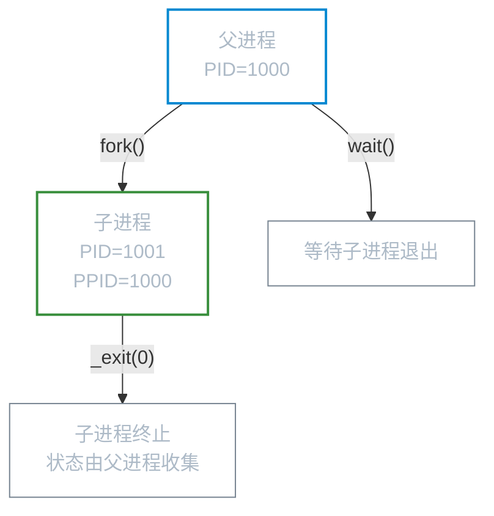
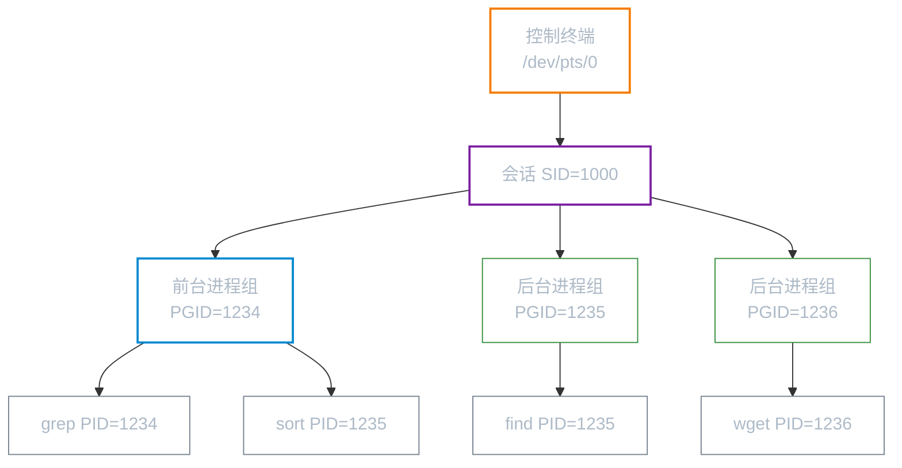

# 进程生命周期

**本文你会学到**：

- `fork()` 的写时复制机制与"零开销"原理
- fork 之后父子进程的继承关系
- `exec` 族函数的各种变体与用途
- `exit()` 与 `_exit()` 的区别
- 父进程对子进程的等待与回收（`wait`、`waitpid`、`waitid`）
- 孤儿进程的自动收养机制
- 僵尸进程产生的原因与消灭方法
- 进程凭证（RUID、EUID、RGID、EGID）的设置与转换
- 守护进程（daemon）的正确创建步骤
- 进程资源限制（ulimit、`setrlimit`）的应用

## fork() — 复制一个新进程

### 写时复制：为什么 fork() 几乎是"零开销"？

当你调用 `fork()` 时，直觉上以为内核要把整个父进程的内存都复制一遍。如果真是这样，对于一个占用几百 MB 内存的进程来说，`fork()` 会是极其昂贵的操作。

实际上，现代 Linux 使用**写时复制（Copy-on-Write，CoW）**技术来避免这个开销：

- **代码段**（text segment）：内核将其标记为只读，父子进程直接共享同一份物理内存页。
- **数据段、堆、栈**：父子进程的页表项都指向**同一批物理内存页**，但每一页都被标记为只读。只有当某一方试图**写入**某一页时，内核才为该进程复制一份独立的副本，然后让该进程写自己的副本。

这意味着：如果 `fork()` 之后立即 `exec()`（新程序完全替换内存），那些从未被修改过的页面就无需复制，节省了大量时间和内存。

```
fork() 调用后，父子进程读同一页 → 不复制
父（或子）修改某页 → 内核捕捉到写操作 → 复制该页 → 修改副本
```

### fork() 后的继承关系

`fork()` 返回后，子进程是父进程的**几乎完整副本**，但有几处关键差异：

**子进程继承（或复制）的内容：**

| 内容 | 说明 |
|------|------|
| 文件描述符 | 子进程获得父进程所有 fd 的**副本**，共享同一个打开文件描述（偏移量/标志共享） |
| 信号处理器 | 继承父进程设置的信号处理函数 |
| 内存映射 | `mmap()` 的映射（写时复制） |
| 工作目录（CWD） | 继承父进程当前目录 |
| 环境变量 | 继承父进程的 `environ` |
| 进程凭证 | 继承 RUID/EUID/RGID/EGID |
| 信号掩码 | 继承父进程的阻塞信号集 |

**子进程独有/不同的内容：**

| 内容 | 说明 |
|------|------|
| PID | 子进程拥有新的唯一 PID |
| PPID | 子进程的 PPID 是父进程的 PID |
| `fork()` 返回值 | 父进程得到子进程 PID；子进程得到 0 |
| 内存锁 | `mlock()`/`mlockall()` 不继承 |
| 定时器（timer） | 子进程不继承父进程的间隔定时器 |
| 已注册退出处理程序的状态 | 子进程继承退出处理函数，但 `exec()` 时会清除 |

``` c title="fork() 基本用法"
#include <unistd.h>
#include <stdio.h>

int main() {
    pid_t pid = fork();
    if (pid == -1) {
        perror("fork");
        return 1;
    }
    if (pid == 0) {
        /* 子进程：pid == 0 */
        printf("子进程 PID=%d, 父进程 PID=%d\n", getpid(), getppid());
        _exit(0);   /* 子进程用 _exit() 不刷 stdio 缓冲 */
    } else {
        /* 父进程：pid == 子进程的 PID */
        printf("父进程 PID=%d, 创建了子进程 PID=%d\n", getpid(), pid);
        wait(NULL); /* 回收子进程，防止僵尸 */
    }
    return 0;
}
```

**fork() 前后的进程关系：**



!!! warning "竞争条件：不要假设父子进程的调度顺序"

    `fork()` 之后，内核决定先调度父进程还是子进程（Linux 2.6.32+ 默认先调度父进程）。程序**不能依赖**特定的执行顺序——如果需要同步，应使用信号量、管道或信号。

### vfork()（已过时，了解即可）

`vfork()` 是早期 BSD 引入的"高效 fork"：子进程直接**共享**父进程的内存（不做写时复制），父进程被挂起直到子进程调用 `exec()` 或 `_exit()`。

这个设计非常危险——子进程对内存的任何修改都会影响父进程。现代 Linux 的 `fork()` 已经通过写时复制实现了相近的效率，SUSv4 已将 `vfork()` 从标准中移除。

!!! danger "新代码不要使用 vfork()"

    使用 `fork()` 代替。`vfork()` 的怪异语义容易导致隐蔽的 bug（栈破坏、父进程数据被污染）。

---

## exec() 族 — 替换进程映像

### exec() 的六个变体

`execve()` 是唯一真正的系统调用，其余都是 glibc 封装的库函数：

| 函数 | 程序定位 | 参数形式 | 环境变量来源 |
|------|----------|----------|-------------|
| `execve(path, argv[], envp[])` | 路径名 | 数组 | `envp` 参数 |
| `execle(path, arg0, ..., NULL, envp[])` | 路径名 | 列表 | `envp` 参数 |
| `execlp(file, arg0, ..., NULL)` | 文件名 + `PATH` 搜索 | 列表 | 调用者 environ |
| `execvp(file, argv[])` | 文件名 + `PATH` 搜索 | 数组 | 调用者 environ |
| `execv(path, argv[])` | 路径名 | 数组 | 调用者 environ |
| `execl(path, arg0, ..., NULL)` | 路径名 | 列表 | 调用者 environ |

**命名规律：**

- `p` — 使用 `PATH` 环境变量搜索可执行文件（`execlp`、`execvp`）
- `l` — 参数以列表（list）形式逐一传入，末尾加 `(char*)NULL`
- `v` — 参数以向量（vector，即数组）形式传入
- `e` — 显式传入环境变量数组 `envp`

### exec() 后的继承与丢弃

调用 `exec()` 成功后，进程的内存空间被新程序完全替换，但**进程本身还在**：

**exec() 后保留的内容：**

| 保留项 | 说明 |
|--------|------|
| PID / PPID | 进程 ID 不变 |
| 文件描述符 | 除非设置了 `FD_CLOEXEC`（close-on-exec 标志），否则保留 |
| 进程凭证（通常） | RUID/RGID 保留；若文件有 set-user-ID 位则 EUID 改变 |
| 当前工作目录 | 保留 |
| 信号掩码 | 保留 |
| 进程组 / 会话 | 保留 |
| 资源限制（rlimit） | 保留 |

**exec() 后丢弃的内容：**

| 丢弃项 | 说明 |
|--------|------|
| 整个内存映像 | 代码段、数据段、堆、栈全部被新程序替换 |
| 信号处理函数 | 所有自定义 handler 恢复为默认；被忽略的信号保持忽略 |
| 退出处理函数 | `atexit()` 注册的函数全部清除 |
| 共享内存映射 | 非继承的 `mmap()` 区域清除 |

### #! 脚本解释器机制

Linux 内核通过 `#!`（shebang）机制识别脚本文件。当 `execve()` 执行的文件的头两个字节为 `#!` 时，内核会解析后续的解释器路径和可选参数，转而执行解释器程序，并将原脚本路径作为参数传入：

``` bash
#!/bin/bash          # execve 执行时，内核实际执行 /bin/bash script.sh
#!/usr/bin/python3   # 内核实际执行 /usr/bin/python3 script.py
#!/usr/bin/env node  # 内核实际执行 /usr/bin/env node script.js
```

内核层面的执行流程：

1. `execve("script.sh", ...)` 读取文件头部，发现 `#!/bin/bash`
2. 内核拼接出实际执行路径：`/bin/bash script.sh`
3. 等同于调用 `execve("/bin/bash", ["/bin/bash", "script.sh", ...], ...)`

!!! tip "解释器脚本的局限"

    - `#!` 后只能跟一个可选参数（例如 `#!/usr/bin/python3 -E` 合法，但 `#!/usr/bin/python3 -E -s` 会被视为 `(-E -s)` 整体一个参数）
    - 内核只识别 `#!`，忽略空格和缩进，格式必须严格：`#!<path>[ <single-arg>]`
    - 可通过 `execve` 的 `argv[0]` 向解释器传递脚本文件名（某些解释器据此确定脚本目录）

### fork + exec：启动新程序的标准范式

Linux（UNIX）的进程创建哲学与 Windows 完全不同：

- **Windows**：`CreateProcess()` — 一步完成创建+执行
- **UNIX**：**两步走** — `fork()` 复制自身，然后子进程调用 `exec()` 加载新程序

``` c title="fork + exec 范式"
pid_t pid = fork();
if (pid == 0) {
    /* 子进程：可在此做 exec() 前的准备工作 */
    /* 例如：重定向 stdio、关闭不需要的 fd、修改信号掩码... */
    execvp("ls", (char*[]){ "ls", "-l", NULL });
    perror("execvp"); /* exec 成功则永不到达此处 */
    _exit(127);
}
/* 父进程继续运行 */
wait(NULL);
```

两步走的优势在于：`fork()` 和 `exec()` 之间有一个**"准备窗口"**，可以做 I/O 重定向、关闭文件描述符、调整信号处理——这些灵活性是一步式 `spawn()` 难以提供的。

### setuid 程序的有效 ID 变化

当执行一个设置了 set-user-ID 位（`chmod u+s`）的可执行文件时，`execve()` 会将进程的**有效用户 ID（EUID）**改为该文件的属主 ID：

```bash title="查看 setuid 程序"
ls -l /usr/bin/passwd
# -rwsr-xr-x 1 root root ... /usr/bin/passwd
#    ^ s 表示 set-user-ID 位已设置，文件属主为 root
```

普通用户执行 `passwd` 时，进程的 EUID 从用户自身的 UID 变为 0（root），这样它才能修改 `/etc/shadow`。

---

## wait/waitpid — 回收子进程

### 僵尸进程：为什么需要 wait()？

子进程调用 `exit()` 后，内核并不会立即销毁它的所有信息——它会保留一个**"残骸"（zombie 进程）**，其中只存放退出状态码，等待父进程来"收尸"。

如果父进程从不调用 `wait()`，这些僵尸进程会**一直占据内核进程表中的槽位**。进程表是有大小限制的——僵尸积累过多最终会导致无法创建新进程。

```bash title="观察僵尸进程"
# Z+ 或 Z 状态即为僵尸
ps aux | grep 'Z'
```

### wait() vs waitpid()

``` c title="wait() 基本用法"
#include <sys/wait.h>

pid_t wait(int *status);  /* 等待任意子进程，阻塞直到有子进程终止 */
```

`wait()` 的局限：

- 只能等待**任意**一个子进程（无法指定等某个特定的）
- 总是**阻塞**，不能做非阻塞轮询

`waitpid()` 解决了这些问题：

``` c title="waitpid() 用法"
#include <sys/wait.h>

/* pid > 0：等待特定子进程 */
/* pid == -1：等待任意子进程（等价 wait()） */
/* pid == 0：等待同进程组的任意子进程 */
/* pid < -1：等待进程组 ID 为 |pid| 的任意子进程 */
pid_t waitpid(pid_t pid, int *status, int options);
```

重要的 `options`：

| 选项 | 含义 |
|------|------|
| `WNOHANG` | 非阻塞：若无子进程状态变化，立即返回 0 |
| `WUNTRACED` | 同时返回因信号**停止**（不是终止）的子进程状态 |
| `WCONTINUED` | 同时返回因 `SIGCONT` 恢复执行的子进程状态 |

### 退出状态解码

`wait()`/`waitpid()` 返回的 `status` 值需要用宏来解析，不能直接读取：

``` c title="退出状态宏用法"
int status;
pid_t pid = waitpid(-1, &status, 0);

if (WIFEXITED(status)) {
    /* 子进程正常 exit() */
    int code = WEXITSTATUS(status);   /* 退出码，0~255 */
    printf("正常退出，退出码 = %d\n", code);

} else if (WIFSIGNALED(status)) {
    /* 子进程被信号杀死 */
    int sig = WTERMSIG(status);        /* 杀死它的信号编号 */
    int dumped = WCOREDUMP(status);    /* 是否产生了 core dump */
    printf("被信号 %d 杀死，core dump = %d\n", sig, dumped);

} else if (WIFSTOPPED(status)) {
    /* 子进程被信号暂停（需 WUNTRACED 选项） */
    int sig = WSTOPSIG(status);
    printf("被信号 %d 暂停\n", sig);
}
```

### SIGCHLD 异步回收模式

对于长期运行的程序（如服务器进程），用阻塞的 `wait()` 等待子进程不实际。更好的方式是：为 `SIGCHLD` 信号设置处理函数，在处理函数中循环调用 `waitpid()` 直到没有更多已退出的子进程：

``` c title="SIGCHLD 处理函数模板"
#include <signal.h>
#include <sys/wait.h>
#include <errno.h>

void sigchld_handler(int sig) {
    int saved_errno = errno;  /* 保存 errno，防止被修改 */
    int status;
    pid_t pid;

    /* 循环 waitpid，直到没有更多终止的子进程 */
    while ((pid = waitpid(-1, &status, WNOHANG)) > 0) {
        /* 处理每个已终止子进程的状态 */
    }

    errno = saved_errno;      /* 恢复 errno */
}

/* 注册时机：在创建任何子进程之前 */
signal(SIGCHLD, sigchld_handler);
```

!!! tip "为什么用循环而不是只调用一次 waitpid()？"

    当多个子进程同时终止时，多个 `SIGCHLD` 信号可能被合并（标准信号不排队）。处理函数执行时，可能同时有多个子进程等待回收，必须循环直至 `waitpid()` 返回 0 才能保证不留僵尸。

---

## 进程凭证（Process Credentials）

### 四类用户 ID

每个进程都同时携带四个与权限相关的用户 ID：

| ID 名称 | 英文 | 作用 |
|---------|------|------|
| 实际用户 ID | Real UID (RUID) | 标识进程的"真实所有者"，登录时从 `/etc/passwd` 读取 |
| 有效用户 ID | Effective UID (EUID) | 内核用它来做**权限检查**（文件访问、系统调用权限等） |
| 保存的 set-user-ID | Saved Set-user-ID (SSUID) | 允许 setuid 程序在特权/非特权间**可逆切换** |
| 文件系统用户 ID | Filesystem UID (FSUID) | Linux 特有，用于文件系统操作的权限检查（通常等于 EUID） |

正常情况下，`RUID == EUID == SSUID`，普通进程以启动者身份运行。

### setuid 程序：passwd 命令的权限魔法

为什么普通用户能用 `passwd` 修改自己的密码，却无法直接编辑 `/etc/shadow`？

```
普通用户（UID=1000）执行 /usr/bin/passwd：
  exec() 前：RUID=1000, EUID=1000
  exec() 后（passwd 文件 owner=root, 有 s 位）：
           RUID=1000, EUID=0, SSUID=0
```

`execve()` 检测到可执行文件设置了 set-user-ID 位后，将 EUID 置为文件属主（root），进程因此获得了 root 权限，可以写 `/etc/shadow`。RUID 仍是 1000，表明"谁在运行这个程序"。

### 保存的 set-user-ID：临时挂起特权

一个设计良好的 setuid 程序，不应该在整个运行期间都保持特权。**保存的 set-user-ID** 提供了"临时放权"的机制：

```
执行 root 拥有的 setuid 程序时：
  RUID=1000, EUID=0, SSUID=0

调用 seteuid(1000) — 临时放弃特权：
  RUID=1000, EUID=1000, SSUID=0  ← SSUID 记住了 0

调用 seteuid(0) — 恢复特权：
  RUID=1000, EUID=0, SSUID=0     ← 用 SSUID 恢复
```

这种"收放自如"的设计遵循**最小权限原则**：只在真正需要权限时才使用特权身份。

### 修改凭证的系统调用

| 系统调用 | 非特权进程能做什么 | 特权进程（EUID=0）能做什么 |
|----------|------------------|--------------------------|
| `setuid(u)` | 仅能将 EUID 改为 RUID 或 SSUID | 将 RUID/EUID/SSUID 全部改为 `u`（不可逆放权） |
| `seteuid(e)` | 将 EUID 改为 RUID 或 SSUID | 将 EUID 改为任意值 |
| `setreuid(r, e)` | 独立修改 RUID/EUID（限当前 RUID/EUID/SSUID 范围） | 可设为任意值 |
| `setresuid(r, e, s)` | 独立修改 RUID/EUID/SSUID（限当前三者范围） | 可设为任意值 |

`setresuid()` 是语义最清晰的选择，但可移植性较差（Linux 特有）；`seteuid()` 是可移植性最好的临时切换特权方式。

### 查看凭证：/proc/PID/status

```bash title="查看进程凭证"
# 查看当前 shell 进程的凭证
cat /proc/$$/status | grep -E '^(Uid|Gid):'

# 输出格式：实际ID  有效ID  保存set-ID  文件系统ID
# Uid:    1000    1000    1000    1000
# Gid:    1000    1000    1000    1000
```

---

## 守护进程（Daemon）

### 守护进程的特征

守护进程（daemon）是一类特殊的后台进程，具备三个显著特征：

- **长寿**：系统启动时创建，运行到关机
- **后台运行**：不与任何用户终端交互
- **无控制终端**：使用 `ps` 查看时，`TTY` 列显示 `?`

常见的守护进程：`sshd`（SSH 服务）、`nginx`（Web 服务器）、`crond`（定时任务）、`systemd`（1 号进程）。

### 经典创建步骤（double-fork 方法）

在没有 systemd 的传统环境中，创建守护进程需要以下步骤：

``` c title="创建守护进程的经典步骤"
#include <unistd.h>
#include <stdlib.h>
#include <fcntl.h>
#include <sys/stat.h>

void daemonize() {
    pid_t pid;

    /* 步骤1：第一次 fork() */
    /* 目的：让父进程退出，确保子进程不是进程组组长（才能调用 setsid） */
    pid = fork();
    if (pid < 0) exit(EXIT_FAILURE);
    if (pid > 0) exit(EXIT_SUCCESS);   /* 父进程退出 */

    /* 步骤2：创建新会话 */
    /* 子进程成为新会话的领导者，脱离原来的控制终端 */
    if (setsid() < 0) exit(EXIT_FAILURE);

    /* 步骤3：第二次 fork()（double-fork 的关键） */
    /* 目的：确保进程不是会话领导者，从而永远无法重新获取控制终端 */
    pid = fork();
    if (pid < 0) exit(EXIT_FAILURE);
    if (pid > 0) exit(EXIT_SUCCESS);   /* 第一次 fork 的子进程退出 */

    /* 现在运行的是孙进程，它是真正的守护进程 */

    /* 步骤4：设置文件创建掩码 */
    umask(0);

    /* 步骤5：切换工作目录到根目录 */
    /* 避免占用某个挂载点，导致无法 umount */
    chdir("/");

    /* 步骤6：关闭所有继承的文件描述符 */
    /* 实际中常用 for (int i = 0; i < sysconf(_SC_OPEN_MAX); i++) close(i); */
    close(STDIN_FILENO);
    close(STDOUT_FILENO);
    close(STDERR_FILENO);

    /* 步骤7：将 stdin/stdout/stderr 重定向到 /dev/null */
    int fd = open("/dev/null", O_RDWR);
    dup2(fd, STDIN_FILENO);
    dup2(fd, STDOUT_FILENO);
    dup2(fd, STDERR_FILENO);
    if (fd > 2) close(fd);

    /* 守护进程就绪，开始执行实际业务逻辑 */
}
```

**double-fork 的原因：** 调用 `setsid()` 后，进程成为新会话的领导者（session leader）。会话领导者在特定条件下可以重新获得控制终端。第二次 `fork()` 产生的子进程**不是**会话领导者，因此它永远无法获取控制终端，完全独立于任何终端。

### systemd 时代的守护进程

在使用 systemd 的系统上，不需要手动做 double-fork——systemd 负责进程的生命周期管理：

```ini title="/etc/systemd/system/myapp.service"
[Unit]
Description=My Application
After=network.target

[Service]
# Type=simple：进程启动后 ExecStart 的进程就是服务主进程（推荐默认）
# Type=forking：传统 double-fork 的守护进程（父进程退出，子进程继续）
# Type=notify：进程就绪后发 sd_notify() 通知 systemd
Type=simple

User=myapp
WorkingDirectory=/opt/myapp
ExecStart=/opt/myapp/bin/server --config /etc/myapp/config.yaml

# 崩溃自动重启
Restart=on-failure
RestartSec=5s

[Install]
WantedBy=multi-user.target
```

```bash title="systemd 服务管理"
systemctl daemon-reload          # 重新加载服务配置
systemctl enable --now myapp     # 启用并立即启动
systemctl status myapp           # 查看运行状态
journalctl -u myapp -f           # 实时跟踪日志
```

### 单实例守护进程：pidfile 机制

守护进程通常只应有一个实例在运行。传统的防多开机制是**锁文件（pidfile）**：

``` c title="锁文件防止多实例"
#include <fcntl.h>
#include <sys/file.h>

int create_pidfile(const char *path) {
    int fd = open(path, O_CREAT | O_RDWR, 0644);
    if (fd < 0) return -1;

    /* 尝试获取独占锁（非阻塞） */
    if (flock(fd, LOCK_EX | LOCK_NB) < 0) {
        /* 已有实例运行 */
        close(fd);
        return -1;
    }

    /* 写入当前 PID */
    char buf[16];
    ftruncate(fd, 0);
    snprintf(buf, sizeof(buf), "%d\n", getpid());
    write(fd, buf, strlen(buf));
    /* fd 保持打开——进程退出时锁自动释放 */
    return fd;
}
```

```bash title="查看 pidfile"
cat /var/run/nginx.pid     # nginx 的 pidfile
cat /run/sshd.pid          # sshd 的 pidfile
```

---

## 进程组与会话（Job Control 底层）

### 进程组（process group）

**进程组**是一组相关进程的集合，每个进程组有一个**进程组 ID（PGID）**。创建管道时，shell 会把管道中的所有进程放到同一个进程组：

```bash
# 以下命令创建一个包含 3 个进程的进程组
grep "error" /var/log/syslog | sort | uniq -c
```

```bash title="查看进程组"
ps -eo pid,ppid,pgid,sid,comm
```

进程组 ID 通常等于进程组中**第一个进程**（组长，process group leader）的 PID。

### 会话（session）

**会话**是一个或多个进程组的集合，关联一个**控制终端（controlling terminal）**：



同一个会话中，同一时刻只有一个**前台进程组**（terminal 输入/信号发往这里），其余为**后台进程组**。

### setsid()：创建新会话

`setsid()` 让当前进程脱离原会话，创建一个新会话并成为新会话的领导者：

``` c title="setsid() 用法"
#include <unistd.h>

pid_t sid = setsid();
/* 调用成功后：
 * - 进程成为新会话的领导者（SID == PID）
 * - 进程成为新进程组的组长（PGID == PID）
 * - 进程脱离原控制终端 */
```

!!! note "setsid() 的前提"

    调用者**不能是**当前进程组的组长（即 PID ≠ PGID），否则调用失败。这就是 daemon 创建中第一次 `fork()` 的目的——让子进程（不是组长）来调用 `setsid()`。

### 为什么 Ctrl+C 能杀死一组进程

按下 `Ctrl+C` 时，终端驱动向**当前会话的前台进程组**中的所有进程发送 `SIGINT` 信号：

```
用户按 Ctrl+C
    ↓
终端驱动捕获
    ↓
对前台进程组（PGID）中所有进程发送 SIGINT
    ↓
所有进程收到 SIGINT（默认动作：终止）
```

这就是为什么 `grep "error" log | sort | uniq -c` 这条管道命令，按一次 `Ctrl+C` 就能同时终止三个进程——它们都在同一个前台进程组里。

---

## 资源限制（ulimit / rlimit）

### 软限制与硬限制

每种资源限制都有两个层次：

- **软限制（soft limit）**：进程当前的实际约束，超过则操作失败（如打开文件数上限）
- **硬限制（hard limit）**：软限制可以调高到的上限，只有 root 才能提高硬限制

非特权进程可以：

- 将软限制降低到任意值
- 将软限制提升，但不能超过硬限制
- 不可逆地降低硬限制

### 重要限制项速查

| 常量 | ulimit 选项 | 含义 | 常见默认值 |
|------|-------------|------|------------|
| `RLIMIT_NOFILE` | `-n` | 进程最多打开的文件描述符数量 | 1024 |
| `RLIMIT_NPROC` | `-u` | 该用户最多同时运行的进程数 | 约 63000 |
| `RLIMIT_CORE` | `-c` | core dump 文件最大字节数（0=禁止） | 0 |
| `RLIMIT_STACK` | `-s` | 栈大小上限（字节） | 8192 KB |
| `RLIMIT_AS` | `-v` | 进程虚拟内存地址空间上限 | unlimited |
| `RLIMIT_CPU` | `-t` | CPU 时间上限（秒） | unlimited |
| `RLIMIT_FSIZE` | `-f` | 进程可创建文件的最大字节数 | unlimited |

### ulimit 命令

```bash title="ulimit 命令用法"
ulimit -a                  # 查看所有当前 shell 的资源限制
ulimit -n                  # 查看文件描述符软限制
ulimit -Hn                 # 查看文件描述符硬限制

ulimit -n 65535            # 临时修改软限制（仅当前 shell 有效）
ulimit -Sn 65535           # 显式修改软限制（-S 可省略）

# 临时修改仅对当前 shell 及其子进程有效，重新登录后恢复
```

### 永久修改资源限制

=== "Ubuntu / Debian"

    编辑 `/etc/security/limits.conf`，由 `pam_limits.so` 在登录时应用：

    ```bash title="/etc/security/limits.conf"
    # 格式：<domain> <type> <item> <value>
    # domain: 用户名 / @组名 / * (所有用户) / %wheel
    # type: soft / hard / -（同时设置两者）

    # 为 nginx 用户设置文件描述符限制
    nginx          soft    nofile          65535
    nginx          hard    nofile          65535

    # 为所有用户设置
    *              soft    nofile          65535
    *              hard    nofile          65535

    # 禁止普通用户创建 core dump
    *              soft    core            0
    ```

    修改后需**重新登录**生效（`pam_limits.so` 在 login/PAM 会话建立时应用）。

=== "CentOS / RHEL"

    同样编辑 `/etc/security/limits.conf`，但需确认 `/etc/pam.d/login` 和 `/etc/pam.d/sshd` 中已加载 `pam_limits.so`：

    ```bash title="确认 PAM 配置"
    grep pam_limits /etc/pam.d/sshd
    # session    required     pam_limits.so
    ```

=== "systemd 服务"

    systemd 服务的资源限制在 `.service` 文件的 `[Service]` 节中配置：

    ```ini title="service 文件中的资源限制"
    [Service]
    LimitNOFILE=65535          # RLIMIT_NOFILE
    LimitNPROC=10000           # RLIMIT_NPROC
    LimitCORE=infinity         # 允许无限大的 core dump
    LimitSTACK=8388608         # 8 MB 栈

    # 修改后需重载
    # systemctl daemon-reload && systemctl restart myservice
    ```

    !!! tip "systemd 的覆盖文件"

        不要直接编辑 `/lib/systemd/system/` 下的文件，使用 `systemctl edit` 创建覆盖文件：

        ```bash
        systemctl edit nginx
        # 在编辑器中添加：
        # [Service]
        # LimitNOFILE=65535
        ```

---

## Linux Capabilities（能力机制）

### 为什么要有 Capabilities

传统 UNIX 是二元权限模型：要么是普通用户（受限），要么是 root（全能）。一个需要绑定 80 端口的 Web 服务器，为了调用 `bind()` 到 1024 以下的端口，不得不以 root 身份启动整个进程——这是严重的安全隐患。

Linux Capabilities 把 root 的特权**拆分成约 40 个独立能力（capability）**，可以单独授予程序，遵循最小权限原则。

### 常用 capability 速查

| Capability | 允许的操作 | 典型用途 |
|------------|------------|----------|
| `CAP_NET_BIND_SERVICE` | 绑定 1024 以下端口 | 让 nginx/httpd 不以 root 绑定 80/443 |
| `CAP_NET_ADMIN` | 网络接口配置、路由表修改 | 网络管理工具 |
| `CAP_SYS_ADMIN` | 大量系统管理操作（挂载、hostname...） | 容器运行时 |
| `CAP_KILL` | 向任意进程发送信号 | 进程管理工具 |
| `CAP_CHOWN` | 修改任意文件的属主 | 文件同步工具 |
| `CAP_DAC_OVERRIDE` | 绕过文件读写执行权限检查 | 备份工具 |
| `CAP_SYS_PTRACE` | 追踪任意进程（`ptrace()`） | 调试器 |
| `CAP_NET_RAW` | 创建原始套接字 | `ping`、`tcpdump` |

每个进程都有三个 capability 集合：

- **Permitted（许可集）**：进程可以拥有的 capabilities 上限
- **Effective（有效集）**：当前实际生效的 capabilities
- **Inheritable（可继承集）**：`exec()` 时可以传递给新程序的 capabilities

### 查看与设置

```bash title="查看文件的 capabilities"
getcap /usr/bin/ping
# /usr/bin/ping cap_net_raw=ep
#   e = effective（有效集），p = permitted（许可集）

# 查看当前进程的所有 capabilities
cat /proc/$$/status | grep -i cap

# 查看某个进程的 capabilities（十六进制，需 cap_to_text 解码）
cat /proc/1234/status | grep Cap
```

```bash title="设置文件 capabilities（代替 setuid）"
# 给 nginx 绑定低端口的能力，而不需要 root
setcap cap_net_bind_service=ep /usr/sbin/nginx

# 验证
getcap /usr/sbin/nginx
# /usr/sbin/nginx cap_net_bind_service=ep

# 清除所有 capabilities
setcap -r /usr/sbin/nginx
```

```bash title="用 capsh 调试 capabilities"
# 查看当前 shell 的 capabilities
capsh --print

# 以限制的 capabilities 启动 bash（用于测试）
capsh --caps='cap_net_bind_service=ep' -- -c 'nc -l 80'
```

!!! warning "capabilities 与 Docker/容器"

    容器运行时默认只给容器进程一个有限的 capability 子集（不含 `CAP_SYS_ADMIN` 等危险能力）。`docker run --cap-add CAP_NET_ADMIN` 可以单独添加，`--privileged` 则赋予全部能力（等同于 root，应避免）。

