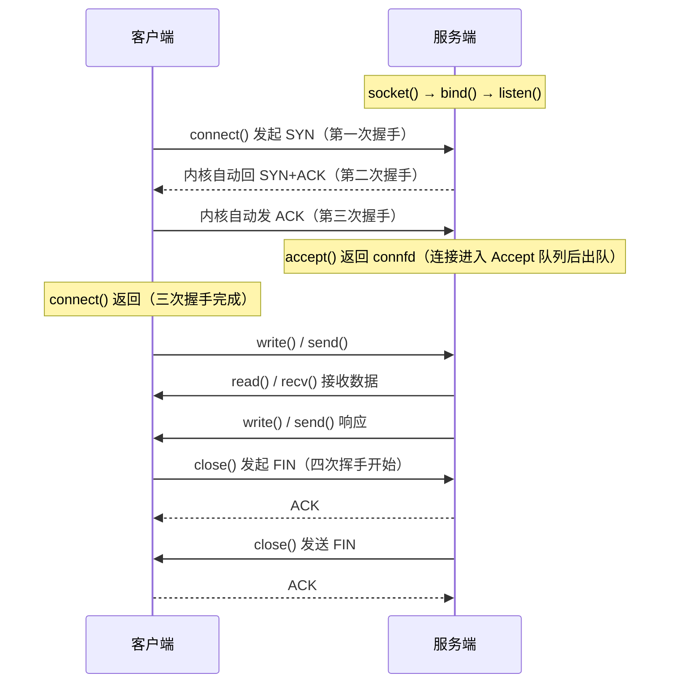
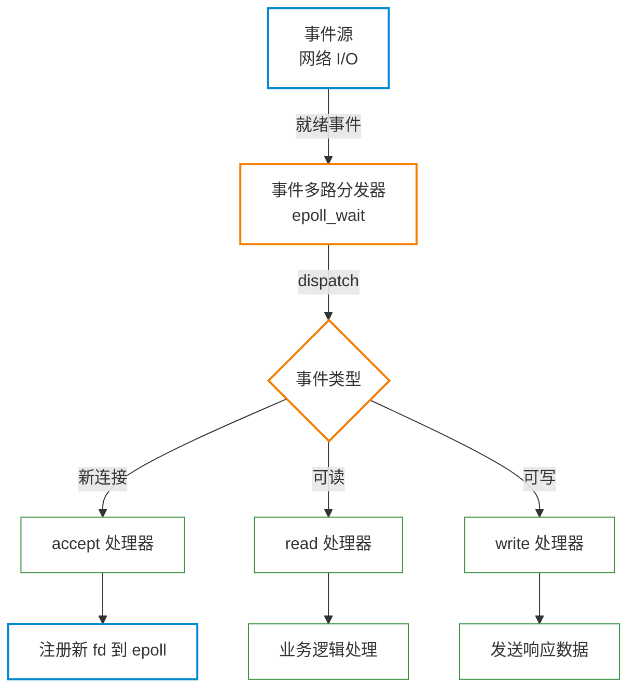
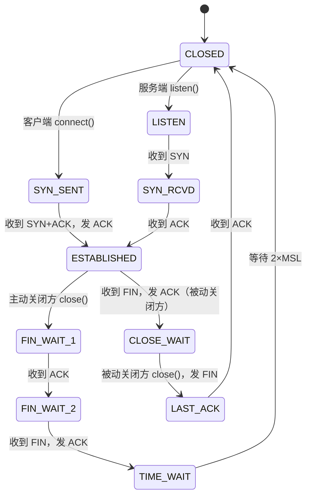
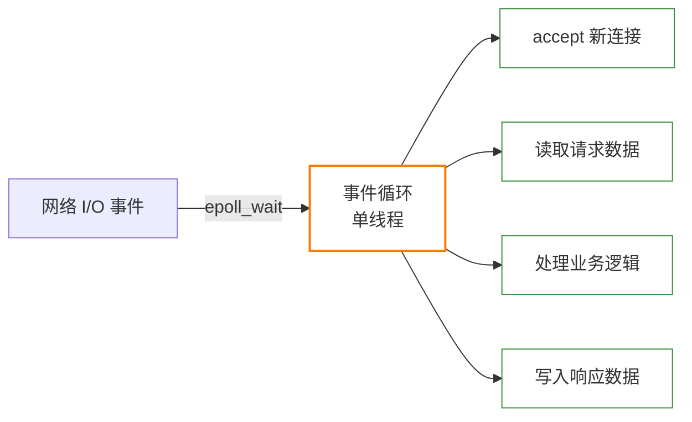

# Socket 编程基础

**本文你会学到**：

- Socket 的本质是什么，以及它与文件描述符的关系
- TCP 服务端/客户端完整通信模型及关键 API
- 生产环境必须掌握的 Socket 选项（`SO_REUSEADDR`、`TCP_NODELAY` 等）
- 非阻塞 I/O 与 epoll 事件驱动模型的核心原理
- Unix Domain Socket 的使用场景与性能优势
- TCP 状态机与连接问题排查（TIME_WAIT、CLOSE_WAIT）
- 高并发服务器模型选型

---

## Socket 是什么

### 通信的端点抽象

当两个进程要通过网络通信时，你会遇到第一个问题：**如何定位对方？** 在 TCP/IP 网络中，答案是：IP 地址 + 端口号。这个组合就是一个**通信端点（endpoint）**。

Socket 就是操作系统提供的对这个端点的抽象——它既描述了「我在哪」（本端地址），也维护着「我要和谁通信」的连接状态。

```
[客户端进程]          [服务端进程]
192.168.1.2:54321 <——> 192.168.1.1:8080
     socket                socket
```

### Socket 的本质：一切皆文件

Linux 的设计哲学是「一切皆文件」。Socket 也不例外——`socket()` 系统调用创建一个 socket 后，返回的是一个**文件描述符（file descriptor）**。

这意味着：

- 可以用 `read()` / `write()` 进行 I/O（和普通文件一样）
- 可以用 `close()` 关闭
- 可以通过 `fcntl()` 修改其属性（如设为非阻塞）
- 继承了文件描述符的所有基础语义（引用计数、fork 继承等）

``` c title="创建一个 TCP socket"
int sockfd = socket(AF_INET, SOCK_STREAM, 0);
// sockfd 就是普通的文件描述符，值为 3、4、5...
```

### Socket 类型

| 类型 | 协议 | 特点 |
|------|------|------|
| `SOCK_STREAM` | TCP | 可靠、有序、面向连接的字节流 |
| `SOCK_DGRAM` | UDP | 不可靠、无连接、面向消息 |
| `SOCK_RAW` | 裸 IP | 直接操作 IP 层，需要 root 权限 |

### 地址族（Address Family）

| 地址族 | 通信范围 | 地址格式 | 地址结构 |
|--------|----------|----------|----------|
| `AF_INET` | IPv4 网络 | 32 位 IP + 16 位端口 | `sockaddr_in` |
| `AF_INET6` | IPv6 网络 | 128 位 IP + 16 位端口 | `sockaddr_in6` |
| `AF_UNIX` | 同一主机进程间 | 文件系统路径名 | `sockaddr_un` |

!!! info "AF_ 还是 PF_？"

    代码中有时会看到 `PF_INET`（Protocol Family）而不是 `AF_INET`（Address Family）。两者在 Linux 上是完全相同的常量值。SUSv3 只规定了 `AF_` 系列，推荐统一使用 `AF_`。

---

## TCP 服务端/客户端模型

### 服务端五步骤

当你需要写一个 TCP 服务器时，必须经过以下五个步骤：

``` c title="TCP 服务端骨架代码"
// 第一步：创建监听 socket
int listenfd = socket(AF_INET, SOCK_STREAM, 0);

// 第二步：绑定地址和端口
struct sockaddr_in addr = {
    .sin_family = AF_INET,
    .sin_port   = htons(8080),
    .sin_addr   = { .s_addr = INADDR_ANY }
};
bind(listenfd, (struct sockaddr*)&addr, sizeof(addr));

// 第三步：开始监听（转为被动 socket）
listen(listenfd, 128);   // backlog=128

// 第四步：接受连接（阻塞等待客户端）
struct sockaddr_in client_addr;
socklen_t addrlen = sizeof(client_addr);
int connfd = accept(listenfd, (struct sockaddr*)&client_addr, &addrlen);
// connfd 是新建的已连接 socket，用于和这个客户端通信

// 第五步：读写数据
char buf[4096];
ssize_t n = read(connfd, buf, sizeof(buf));
write(connfd, buf, n);
close(connfd);
```

### 客户端三步骤

``` c title="TCP 客户端骨架代码"
// 第一步：创建 socket
int sockfd = socket(AF_INET, SOCK_STREAM, 0);

// 第二步：连接服务端（触发三次握手）
struct sockaddr_in server_addr = {
    .sin_family = AF_INET,
    .sin_port   = htons(8080),
};
inet_pton(AF_INET, "127.0.0.1", &server_addr.sin_addr);
connect(sockfd, (struct sockaddr*)&server_addr, sizeof(server_addr));

// 第三步：读写数据
write(sockfd, "hello", 5);
char buf[4096];
read(sockfd, buf, sizeof(buf));
close(sockfd);
```

### TCP 连接建立时序（三次握手对应 API 调用）



### SO_REUSEADDR：服务器重启后端口占用问题

当服务器崩溃或重启时，你可能遇到这个错误：

```
bind: Address already in use
```

**根因**：TCP 关闭连接后，主动关闭方会进入 `TIME_WAIT` 状态，持续 2×MSL（约 60 秒到 4 分钟）。在这期间，原来的端口仍被占用。

**解决方案**：在 `bind()` 之前设置 `SO_REUSEADDR`：

``` c title="设置 SO_REUSEADDR"
int opt = 1;
setsockopt(listenfd, SOL_SOCKET, SO_REUSEADDR, &opt, sizeof(opt));
// 之后再调用 bind()
```

`SO_REUSEADDR` 允许绑定到处于 `TIME_WAIT` 状态连接所使用的端口，服务器可以立即重启。**这个选项几乎是所有生产服务器代码的标配。**

### backlog 参数：两个连接队列

`listen(sockfd, backlog)` 中的 `backlog` 控制的不只是「等待 accept 的连接数」，实际上内核维护两个队列：

```
客户端 SYN ──→ [SYN 队列（半连接队列）] ──三次握手完成──→ [Accept 队列（全连接队列）]
                                                                       ↑
                                                               accept() 从这里取走
```

- **SYN 队列**（`tcp_max_syn_backlog`）：收到 SYN 但尚未完成三次握手的连接
- **Accept 队列**：三次握手完成，等待 `accept()` 取走的连接，大小由 `backlog` 和 `/proc/sys/net/core/somaxconn`（默认 128）的较小值决定

!!! warning "backlog 不够大的危害"

    Accept 队列满时，新连接会被**静默丢弃**（或发送 RST，取决于内核参数 `tcp_abort_on_overflow`）。高并发场景下应将 backlog 设为较大值（如 1024），同时调整内核参数：

    ```bash title="调整内核连接队列上限"
    sysctl -w net.core.somaxconn=65535
    sysctl -w net.ipv4.tcp_max_syn_backlog=65535
    ```

---

## 重要 Socket 选项（setsockopt）

Socket 选项通过 `setsockopt()` 设置，原型如下：

``` c title="setsockopt 原型"
int setsockopt(int sockfd, int level, int optname,
               const void *optval, socklen_t optlen);
// level: SOL_SOCKET（通用选项）或 IPPROTO_TCP（TCP 选项）
```

### SO_REUSEADDR / SO_REUSEPORT

`SO_REUSEADDR` 已在上一节介绍。`SO_REUSEPORT` 是更进一步的选项：

- **`SO_REUSEPORT`**：允许多个进程或线程各自 `bind()` 并 `listen()` 在同一端口。内核会对新连接进行负载均衡分发。

``` c title="多进程监听同一端口（SO_REUSEPORT）"
int opt = 1;
setsockopt(listenfd, SOL_SOCKET, SO_REUSEPORT, &opt, sizeof(opt));
```

这是 **Nginx 多 worker 进程**模型的基础——每个 worker 各自持有 listen socket，避免了「惊群问题」（多个进程被唤醒但只有一个能 accept）。

### SO_KEEPALIVE：检测「僵尸连接」

TCP 连接建立后，如果双方长时间不通信，中间的 NAT 设备可能已经把这条连接的映射表项清除，但两端进程却仍以为连接存活——这就是「僵尸连接」。

``` c title="开启 TCP 保活探测"
int opt = 1;
setsockopt(sockfd, SOL_SOCKET, SO_KEEPALIVE, &opt, sizeof(opt));

// 进一步调整保活参数（以秒为单位）
int idle     = 60;   // 连接空闲多久后开始探测
int interval = 10;   // 探测包发送间隔
int count    = 3;    // 探测几次无响应才判定断开
setsockopt(sockfd, IPPROTO_TCP, TCP_KEEPIDLE,   &idle,     sizeof(idle));
setsockopt(sockfd, IPPROTO_TCP, TCP_KEEPINTVL,  &interval, sizeof(interval));
setsockopt(sockfd, IPPROTO_TCP, TCP_KEEPCNT,    &count,    sizeof(count));
```

!!! tip "SO_KEEPALIVE 的局限"

    内核级保活默认间隔很长（通常 2 小时）。对于要求更快速感知断线的场景（如游戏、IM），通常在**应用层**实现心跳包，更加灵活可控。

### TCP_NODELAY：禁用 Nagle 算法

Nagle 算法将小数据包缓冲后合并发送，以减少网络中的小包数量，但这会带来**额外延迟**。对于低延迟敏感的场景（数据库客户端、Redis、实时游戏），应禁用它：

``` c title="禁用 Nagle 算法"
int opt = 1;
setsockopt(sockfd, IPPROTO_TCP, TCP_NODELAY, &opt, sizeof(opt));
```

典型场景：每次 `write()` 后希望数据立即发出，而不是等 200ms 凑包。

### SO_SNDBUF / SO_RCVBUF：发送/接收缓冲区

``` c title="调整 socket 缓冲区大小"
int sndbuf = 256 * 1024;  // 256KB 发送缓冲区
int rcvbuf = 256 * 1024;  // 256KB 接收缓冲区
setsockopt(sockfd, SOL_SOCKET, SO_SNDBUF, &sndbuf, sizeof(sndbuf));
setsockopt(sockfd, SOL_SOCKET, SO_RCVBUF, &rcvbuf, sizeof(rcvbuf));
```

!!! warning "内核会将设置值翻倍"

    Linux 内核实际分配的缓冲区大小是设置值的 **2 倍**（额外空间用于内核管理结构）。上限受 `/proc/sys/net/core/wmem_max` 和 `rmem_max` 约束。

### SO_LINGER：close() 的行为控制

默认的 `close()` 是非阻塞的——立即返回，内核在后台完成 FIN 四次挥手。通过 `SO_LINGER` 可以改变这个行为：

``` c title="SO_LINGER 配置"
struct linger lg;

// 场景一：等待数据发送完毕后再 close（阻塞 close）
lg.l_onoff  = 1;
lg.l_linger = 5;  // 最多等待 5 秒
setsockopt(sockfd, SOL_SOCKET, SO_LINGER, &lg, sizeof(lg));

// 场景二：立即发送 RST，丢弃缓冲区中的数据（暴力关闭）
lg.l_onoff  = 1;
lg.l_linger = 0;  // linger=0 时发 RST 而非 FIN
setsockopt(sockfd, SOL_SOCKET, SO_LINGER, &lg, sizeof(lg));
```

发送 RST 的好处是**立即释放端口**，不进入 TIME_WAIT。代价是对端 `read()` 会收到 `Connection reset by peer` 错误。

### SO_RCVTIMEO / SO_SNDTIMEO：读写超时

``` c title="设置读写操作超时"
struct timeval tv = {
    .tv_sec  = 5,   // 5 秒超时
    .tv_usec = 0
};
setsockopt(sockfd, SOL_SOCKET, SO_RCVTIMEO, &tv, sizeof(tv));
setsockopt(sockfd, SOL_SOCKET, SO_SNDTIMEO, &tv, sizeof(tv));
// 超时后 read()/write() 返回 -1，errno = EAGAIN 或 EWOULDBLOCK
```

---

## 非阻塞 I/O 与 I/O 多路复用

### 阻塞 socket 的问题

默认情况下，socket 是**阻塞**的。`read()` 在没有数据时会让进程休眠，`accept()` 在没有新连接时也会阻塞。

如果用单线程处理多个连接：

```
客户端 A ──read()─→ 阻塞等待 A 发数据...
                    ← 此时客户端 B 的数据到了，但没人处理！
```

解决思路一：每个连接一个线程——代价高，连接数多时线程开销巨大。

解决思路二：**非阻塞 I/O + I/O 多路复用**——单线程同时监视多个文件描述符。

### 设置非阻塞模式

``` c title="将 socket 设为非阻塞"
#include <fcntl.h>

int flags = fcntl(sockfd, F_GETFL, 0);
fcntl(sockfd, F_SETFL, flags | O_NONBLOCK);
```

非阻塞模式下：

- `read()` 没有数据时立即返回 `-1`，`errno` 设为 `EAGAIN`（或 `EWOULDBLOCK`）
- `write()` 缓冲区满时立即返回 `-1`，`errno` 设为 `EAGAIN`
- `accept()` 没有新连接时立即返回 `-1`，`errno` 设为 `EAGAIN`

``` c title="非阻塞 read 的正确处理方式"
ssize_t n = read(sockfd, buf, sizeof(buf));
if (n < 0) {
    if (errno == EAGAIN || errno == EWOULDBLOCK) {
        // 没有数据，稍后再试
    } else {
        // 真正的错误
        perror("read");
    }
} else if (n == 0) {
    // 对端关闭连接（EOF）
}
```

### select / poll / epoll 对比

三种 I/O 多路复用 API 的核心目标相同：同时监视多个 fd，哪个就绪就处理哪个。

| 特性 | `select` | `poll` | `epoll` |
|------|----------|--------|---------|
| **fd 数量上限** | 1024（`FD_SETSIZE`） | 无限制 | 无限制 |
| **时间复杂度** | O(n)，每次全量遍历 | O(n)，每次全量遍历 | O(1)，事件驱动 |
| **内核内部实现** | 每次调用重新检查全部 fd | 每次调用重新检查全部 fd | 内核维护红黑树，只通知就绪 fd |
| **触发模式** | 水平触发 | 水平触发 | 水平触发（默认）+ 边缘触发 |
| **可移植性** | SUSv3，最广泛 | SUSv3，广泛 | Linux 专有 |
| **适用场景** | 连接数少（< 100） | 连接数中等 | 高并发（C10K+） |

**水平触发（Level Triggered）**：只要 fd 处于就绪态（缓冲区有数据），每次 `epoll_wait` 都会通知。允许分多次读取。

**边缘触发（Edge Triggered）**：只在状态发生**变化**时通知一次（新数据到达时触发）。必须一次性读完所有数据，否则可能错过通知，因此通常配合非阻塞 I/O 使用。

``` c title="epoll 基本用法"
// 1. 创建 epoll 实例
int epfd = epoll_create1(0);

// 2. 注册感兴趣的 fd 和事件
struct epoll_event ev;
ev.events  = EPOLLIN;   // 监听可读事件
ev.data.fd = listenfd;
epoll_ctl(epfd, EPOLL_CTL_ADD, listenfd, &ev);

// 3. 事件循环
struct epoll_event events[1024];
while (1) {
    int nfds = epoll_wait(epfd, events, 1024, -1);
    for (int i = 0; i < nfds; i++) {
        if (events[i].data.fd == listenfd) {
            // 新连接到来
            int connfd = accept(listenfd, NULL, NULL);
            ev.events  = EPOLLIN | EPOLLET;  // 边缘触发
            ev.data.fd = connfd;
            epoll_ctl(epfd, EPOLL_CTL_ADD, connfd, &ev);
        } else {
            // 已有连接上有数据可读
            handle_client(events[i].data.fd);
        }
    }
}
```

### Reactor 模式：事件循环 + 回调

epoll 背后的设计思想是 **Reactor 模式**：



Nginx、Node.js、Redis 都是这种模型的典型实现——单线程事件循环，无阻塞，处理数万并发连接。

---

## Unix Domain Socket

### 与 TCP Socket 的区别

当两个进程在**同一台机器**上通信时，为什么要经过 TCP/IP 协议栈？IP 封包、路由查找、校验和计算……这些开销在本机通信时完全是多余的。

Unix Domain Socket（`AF_UNIX`）直接在内核内部传递数据，**不经过网络协议栈**：

| 对比项 | TCP Socket（AF_INET） | Unix Domain Socket（AF_UNIX） |
|--------|----------------------|-------------------------------|
| 通信范围 | 跨网络主机 | 仅同一主机 |
| 地址格式 | IP:Port | 文件系统路径名 |
| 吞吐量 | 受 TCP 协议开销限制 | 更高（无 IP 层开销） |
| 延迟 | 更高 | 更低 |
| 权限控制 | 防火墙规则 | 文件权限（chmod/chown） |

### 地址结构 sockaddr_un

``` c title="Unix Domain Socket 地址结构"
#include <sys/un.h>

struct sockaddr_un {
    sa_family_t sun_family;    /* AF_UNIX */
    char        sun_path[108]; /* socket 文件路径名 */
};
```

使用示例：

``` c title="创建并绑定 Unix Domain Socket"
int sockfd = socket(AF_UNIX, SOCK_STREAM, 0);

struct sockaddr_un addr;
memset(&addr, 0, sizeof(addr));
addr.sun_family = AF_UNIX;
strncpy(addr.sun_path, "/var/run/myapp.sock",
        sizeof(addr.sun_path) - 1);

// 先删除旧的 socket 文件（如果存在）
unlink("/var/run/myapp.sock");
bind(sockfd, (struct sockaddr*)&addr, sizeof(addr));
listen(sockfd, 128);
```

!!! warning "socket 文件不会自动清理"

    进程退出后，socket 文件仍残留在文件系统中。下次启动时 `bind()` 会因 `EADDRINUSE` 失败。**最佳实践**：在 `bind()` 前调用 `unlink()` 删除旧文件，并在进程退出时清理。

### 常见使用场景

- **Nginx ↔ PHP-FPM**：`fastcgi_pass unix:/var/run/php-fpm.sock`，比 `127.0.0.1:9000` 性能更好
- **Docker 守护进程**：`/var/run/docker.sock`，Docker CLI 通过它与 daemon 通信
- **systemd socket activation**：systemd 持有监听 socket，服务启动时传递给进程（零停机重启）
- **MySQL / PostgreSQL 本地连接**：`mysql -h 127.0.0.1` 走 TCP，`mysql` 不带 `-h` 则走 Unix socket

### 查看 Unix Domain Socket

```bash title="查看本机 Unix socket"
# 列出所有 Unix domain socket
ss -x
ss -xl   # 只看监听状态的

# 查看 socket 文件
ls -la /var/run/*.sock
ls -la /tmp/*.sock

# 查看谁在使用某个 socket 文件
lsof /var/run/docker.sock
```

---

## UDP Socket

### 无连接的本质：sendto / recvfrom

UDP 不需要建立连接，每次发送都要显式指定目标地址：

``` c title="UDP 服务端"
int sockfd = socket(AF_INET, SOCK_DGRAM, 0);

struct sockaddr_in addr = {
    .sin_family = AF_INET,
    .sin_port   = htons(53),
    .sin_addr   = { .s_addr = INADDR_ANY }
};
bind(sockfd, (struct sockaddr*)&addr, sizeof(addr));

// 接收数据报，同时获取发送方地址
char buf[512];
struct sockaddr_in client_addr;
socklen_t addrlen = sizeof(client_addr);
ssize_t n = recvfrom(sockfd, buf, sizeof(buf), 0,
                     (struct sockaddr*)&client_addr, &addrlen);

// 回复
sendto(sockfd, buf, n, 0,
       (struct sockaddr*)&client_addr, addrlen);
```

### 为什么用 UDP

UDP 牺牲可靠性换取**低延迟**。适合的场景：

- **DNS 查询**：请求小（< 512 字节），查询/应答一来一回，TCP 握手开销不划算
- **视频流 / 直播**：一帧丢了就丢了，重传反而造成卡顿
- **实时游戏**：位置更新是最新状态，历史帧过时了没必要重传
- **DHCP**：客户端还没有 IP，无法建立 TCP 连接

### UDP "连接"的真正含义

UDP socket 也可以调用 `connect()`，但**这不是真正的连接建立**：

``` c title="UDP connect 的含义"
// connect() 只是在内核记录「默认目标地址」
connect(sockfd, (struct sockaddr*)&server_addr, sizeof(server_addr));

// 之后可以用 write()/send() 代替 sendto()
write(sockfd, buf, len);   // 自动发往 server_addr

// 同时，只接收来自 server_addr 的数据报（过滤其他来源）
```

实际上没有任何握手发生，对端对此一无所知。好处是简化代码，并且在 Linux 上有少许性能提升（少了每次 `sendto()` 时的地址解析）。

### UDP 可靠性：QUIC 的思路

QUIC 协议（HTTP/3 的底层）在 UDP 之上实现了：

- 流量控制 + 拥塞控制（类似 TCP）
- 多路复用（一个连接内多条独立数据流，互不阻塞）
- 0-RTT / 1-RTT 连接建立（比 TCP+TLS 更快）
- 连接迁移（IP 变了连接不断，适合移动网络）

这说明 UDP 并不等于「不可靠」，而是「可靠性由应用层控制」，灵活性更高。

---

## TCP 状态机与连接排查

### 重要状态



**关键状态说明**：

- `LISTEN`：服务端监听中，等待客户端连接
- `SYN_SENT`：客户端已发 SYN，等待服务端响应
- `ESTABLISHED`：连接已建立，正常传输数据
- `TIME_WAIT`：四次挥手完成，主动关闭方等待 2×MSL（防止最后一个 ACK 丢失后对端重发 FIN）
- `CLOSE_WAIT`：收到对端 FIN，本端尚未调用 `close()`

### TIME_WAIT 过多：原因与解决

**现象**：`ss -tna | grep TIME_WAIT | wc -l` 显示数万个连接。

**原因**：服务器作为「主动关闭方」（如短连接 HTTP 服务），每次请求后由服务端先 `close()`，导致大量 `TIME_WAIT`。

**影响**：大量 TIME_WAIT 消耗内存，并可能耗尽本地端口（`EADDRNOTAVAIL`）。

**解决方案**：

```bash title="解决 TIME_WAIT 过多"
# 方案一：复用 TIME_WAIT 连接（推荐，对外连接场景）
sysctl -w net.ipv4.tcp_tw_reuse=1

# 方案二：socket 级别设置（发送 RST，立即回收，慎用）
# 在 setsockopt 中设置 SO_LINGER l_linger=0

# 方案三：使用长连接，减少连接创建/销毁频率（从根本上解决）
# HTTP/1.1 Keep-Alive 或 HTTP/2
```

!!! warning "`tcp_tw_recycle` 已废弃"

    Linux 4.12 起 `tcp_tw_recycle` 已被删除（它在 NAT 环境下有 bug，会导致连接被错误拒绝）。请勿使用。

### CLOSE_WAIT 过多：服务端 Bug 信号

**现象**：`ss -tna | grep CLOSE_WAIT | wc -l` 持续增长。

**根因**：服务端收到了对端的 FIN（对端已调用 `close()`），但服务端**没有调用 `close()`**。通常是代码 Bug：

- 连接处理逻辑中有异常导致 `close(fd)` 未执行
- 文件描述符泄漏（每次连接都没有关闭）

**排查步骤**：

```bash title="排查 CLOSE_WAIT"
# 查看处于 CLOSE_WAIT 的连接
ss -tnap | grep CLOSE_WAIT

# 找到对应进程
lsof -p <PID> | grep -E "sock|pipe"

# 检查 fd 泄漏（打开的 fd 数量是否持续增长）
ls /proc/<PID>/fd | wc -l
```

### 查看连接状态的常用命令

```bash title="查看 TCP 连接状态"
# 查看所有 TCP 连接（包含端口和进程）
ss -tnap

# 过滤特定状态
ss -tna state established
ss -tna state time-wait
ss -tna state close-wait

# 连接统计摘要（最快速的概览）
ss -s

# 按目标端口过滤
ss -tnap dport = :8080

# 老式工具（功能相同，ss 更推荐）
netstat -tna
netstat -tnap   # 需要 root 才能看进程
```

```bash title="ss -s 输出示例"
Total: 342
TCP:   1234 (estab 800, closed 300, orphaned 50, timewait 84)
```

---

## 高并发 Socket 服务器模式

### 每连接一线程（Thread-per-connection）

最简单直接的模型：来一个连接，起一个线程处理。

**优点**：代码简单，阻塞 I/O 直接用，调试容易。

**缺点**：线程本身有内存开销（默认栈 8MB），1 万个连接 = 80GB 内存光用在栈上；线程切换开销大。

**适用场景**：并发连接数 < 数百，连接持续时间长（如数据库连接池客户端）。

### 线程池 + 阻塞 I/O

预先创建固定数量的工作线程，新连接投递到任务队列。

**适用场景**：突发流量，连接数有上限（如内部 RPC 服务）。限制是线程数即并发上限。

### 单线程 + epoll 事件循环（C10K 解决方案）



**核心约束**：事件回调中**禁止任何阻塞操作**（包括 DNS 解析、同步数据库查询）。一旦阻塞，整个服务器都卡住。

**代表实现**：Nginx（C）、Node.js（JavaScript/V8）、Redis。

**适用场景**：I/O 密集型，连接数极多，业务逻辑简单或异步化。

### 多进程 + epoll（SO_REUSEPORT）：多核利用

单线程 epoll 只能用一个 CPU 核心。要利用多核，启动多个 worker 进程，每个进程各自持有 epoll 实例：

```bash title="Nginx 多 worker 进程配置"
# nginx.conf
worker_processes auto;   # 自动等于 CPU 核心数
# 每个 worker 使用 SO_REUSEPORT 监听同一端口
```

内核对新连接在多个进程间进行负载均衡，每个进程独立运行，崩溃不影响其他进程。这是 Nginx 的实际架构。

| 模式 | 适合场景 | 代表框架 |
|------|----------|----------|
| 每连接一线程 | 低并发 + 阻塞 I/O | Java 早期 Servlet |
| 线程池 | 有限并发 RPC 服务 | Java BIO 线程池 |
| 单线程 epoll | 高并发 I/O 密集型 | Nginx、Redis |
| 多进程 epoll + SO_REUSEPORT | 高并发 + 多核 | Nginx 多 worker |
| 多线程 epoll | 高并发 + 复杂业务 | Netty、libuv |

---

## 实用调试工具

### ss / netstat：查看连接状态

```bash title="ss 常用命令速查"
ss -tnap              # 所有 TCP 连接（含进程信息）
ss -s                 # 连接统计摘要
ss -tnlp              # 所有监听端口（l = listening）
ss -x                 # Unix domain socket
ss -tna state time-wait   # 只看 TIME_WAIT
ss 'dport = :80'      # 目标端口是 80 的连接
ss 'sport = :8080'    # 源端口是 8080 的连接
```

### tcpdump：抓包分析

```bash title="tcpdump 基本用法"
# 抓取 8080 端口的 TCP 流量
tcpdump -i eth0 tcp port 8080

# 抓包并保存（用 Wireshark 分析）
tcpdump -i eth0 tcp port 8080 -w /tmp/capture.pcap

# 打印详细内容（含 payload）
tcpdump -i eth0 -A tcp port 8080

# 过滤特定 IP
tcpdump -i eth0 host 192.168.1.100 and tcp port 8080

# 抓取 DNS 查询（UDP 53）
tcpdump -i eth0 udp port 53
```

### lsof -i：查看进程的网络连接

```bash title="lsof 网络排查"
# 查看所有网络连接
lsof -i

# 查看某个端口被哪个进程占用
lsof -i :8080

# 查看某个进程打开的所有 socket
lsof -p 1234 -i

# 查看 TCP 连接（不含 UDP）
lsof -i tcp
```

### /proc/net/tcp：内核 TCP 连接表

```bash title="读取内核 TCP 连接表"
# 查看内核维护的 TCP 连接（十六进制格式）
cat /proc/net/tcp

# 解析本地地址（小端序十六进制）
# 0100007F:1F90 -> 127.0.0.1:8080
python3 -c "
import socket, struct
hex_addr = '0100007F'
port = int('1F90', 16)
addr = socket.inet_ntoa(struct.pack('<I', int(hex_addr, 16)))
print(f'{addr}:{port}')
"
```

### strace：追踪 socket 系统调用

当你不确定程序在哪个 socket 调用上卡住时，`strace` 可以实时展示所有系统调用：

```bash title="strace 追踪 socket 调用"
# 只追踪网络相关系统调用
strace -e trace=network -p <PID>

# 追踪新启动的进程
strace -e trace=network ./my_server

# 查看 connect、bind、accept、send、recv
strace -e trace=connect,bind,accept,send,recv,socket -p <PID>

# 包含时间戳（排查延迟问题）
strace -T -e trace=network -p <PID>
```

典型输出：

```
socket(AF_INET, SOCK_STREAM, IPPROTO_TCP) = 3
bind(3, {sa_family=AF_INET, sin_port=htons(8080), ...}, 16) = 0
listen(3, 128)                          = 0
accept(3, {sa_family=AF_INET, ...}, [16]) = 4   <0.123456>
read(4, "GET / HTTP/1.1\r\n...", 4096)  = 87    <0.000234>
```

!!! tip "排查思路总结"

    遇到 socket 问题时，按以下顺序排查：

    1. `ss -s` 快速看连接统计，确认是否有大量 TIME_WAIT 或 CLOSE_WAIT
    2. `ss -tnap` 找到具体连接和对应进程
    3. `lsof -p <PID>` 检查进程是否有 fd 泄漏
    4. `tcpdump` 抓包，确认数据包是否到达、是否被 RST
    5. `strace` 定位具体阻塞在哪个系统调用

