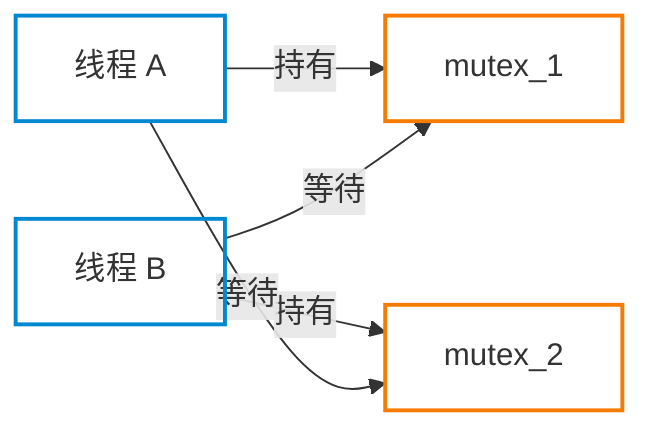
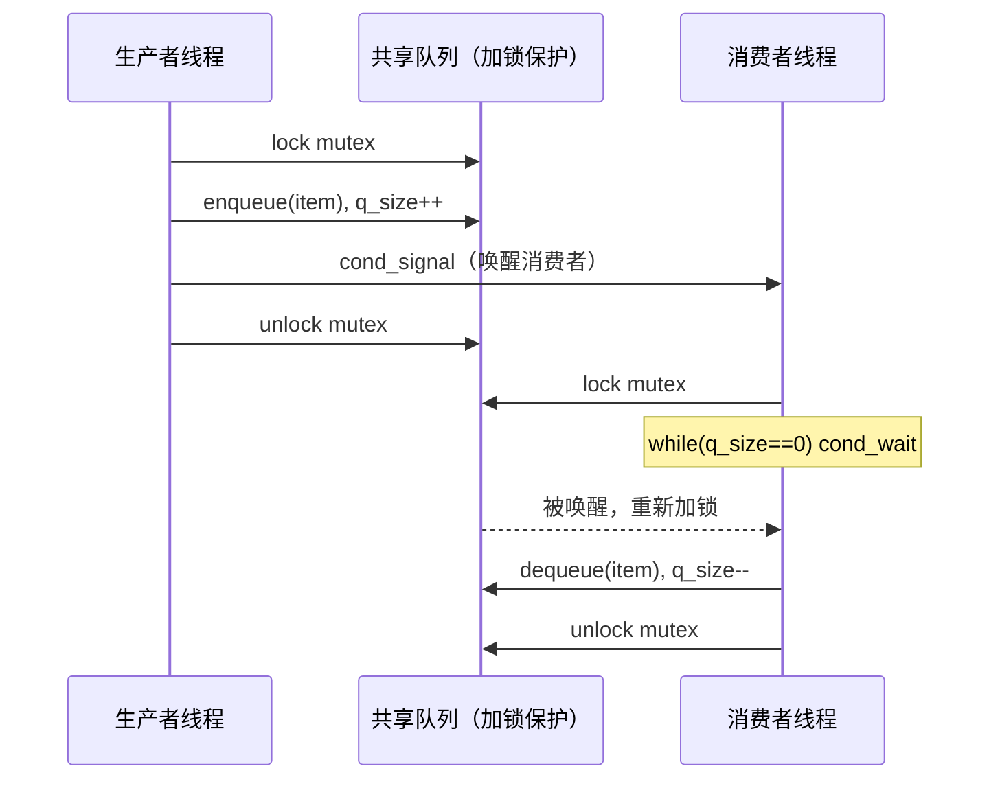

# POSIX 线程

你的程序有时需要同时做多件事：一边接受网络请求，一边处理数据，还要更新日志。用多进程虽然可行，但进程间通信繁琐、`fork()` 开销大。**线程（thread）** 给了你一种更轻量的并发方式——在同一进程内并行运行多条执行路径，共享内存，无需复制地址空间。

本文你会学到：

- 线程与进程的本质区别，以及 Linux 如何实现线程
- 如何创建、等待、分离线程
- 用互斥锁、条件变量、读写锁保护共享数据
- 线程局部存储、线程取消、线程安全的概念
- 如何在线上排查死锁和锁竞争

## 线程与进程的本质区别

### 线程是同一地址空间内的执行单元

进程是操作系统资源分配的基本单位，拥有独立的虚拟地址空间。线程则是调度的基本单位——同一进程的多个线程**共享**这个地址空间，就像多个工人在同一间工厂里工作，工厂里的物料（内存）大家都能拿到。

创建一个新线程比 `fork()` 一个新进程快约 **10 倍**，因为不需要复制内存页表、文件描述符表等大量进程属性。

### 线程共享什么

同一进程内的所有线程共享以下资源：

| 类别 | 具体内容 |
|------|---------|
| 内存 | 堆（heap）、全局变量（.data/.bss 段）、代码段（.text） |
| 文件 | 打开的文件描述符、文件偏移量（通过同一 `fd`） |
| 信号处理 | 信号处置（`sigaction` 设置的处理函数） |
| 进程身份 | PID、PPID、进程组 ID、会话 ID、用户/组 ID |
| 其他 | 当前工作目录、`umask`、资源限制（`ulimit`） |

### 线程私有什么

尽管共享地址空间，每个线程仍有自己的：

| 私有属性 | 说明 |
|---------|------|
| **栈（stack）** | 局部变量、函数调用链都在这里，相互隔离 |
| **errno** | 每个线程有独立的 `errno`，不会互相污染 |
| **线程 ID（TID）** | `pthread_t` 类型，进程内唯一标识 |
| **信号掩码** | `sigprocmask()` 作用于调用线程 |
| **调度属性** | 实时优先级、调度策略可以单独设置 |
| **线程特有数据（TSD）** | 见后文 |

!!! warning "栈共处同一虚拟空间"

    所有线程的栈都位于同一虚拟地址空间，只是地址不重叠。这意味着一个线程拿到另一个线程的局部变量指针后，可以读写它——这是 bug 的温床，务必避免将栈上地址传递给其他线程（特别是在函数返回后）。

### Linux 线程实现：NPTL

Linux 线程通过 **NPTL（Native POSIX Thread Library）** 实现，底层使用 `clone()` 系统调用。`clone()` 比 `fork()` 更灵活，可以精确控制哪些资源与父进程共享（地址空间、文件描述符、信号处理等），线程本质上就是"共享了一切"的 `clone()`。

内核给每个线程分配一个内核线程 ID（通过 `gettid()` 获取），与 POSIX 的 `pthread_t` 不同，后者由线程库维护。

### 查看系统中的线程

``` bash title="查看线程的常用命令"
# 显示所有进程的线程（LWP 列是内核线程 ID）
ps -eLf

# top 以线程粒度显示（按 H 切换）
top -H -p <PID>

# 查看某进程的所有线程（每个目录对应一个线程）
ls /proc/<PID>/task/

# 查看某个线程的状态
cat /proc/<PID>/task/<TID>/status
```

``` bash title="示例：查看 nginx worker 的线程"
ps -eLf | grep nginx
# UID   PID   PPID   LWP  ...
# www   1234  1233  1234  nginx: worker process
```

## 线程创建与生命周期

### 创建线程：pthread_create

``` c title="pthread_create 函数签名"
#include <pthread.h>

int pthread_create(
    pthread_t       *thread,    /* 输出：新线程的 ID */
    pthread_attr_t  *attr,      /* 线程属性，NULL 使用默认值 */
    void *(*start)(void *),     /* 线程入口函数 */
    void            *arg        /* 传给入口函数的参数 */
);
/* 成功返回 0，失败返回正值错误码（不是 -1） */
```

`arg` 是 `void *` 类型，可以传任意指针。需要传多个参数时，把它们打包进一个结构体：

``` c title="传递多参数给线程"
typedef struct {
    int   conn_fd;
    char *client_ip;
} ThreadArgs;

void *handle_client(void *arg) {
    ThreadArgs *targs = (ThreadArgs *)arg;
    /* 使用 targs->conn_fd 和 targs->client_ip */
    free(targs);   /* 堆上分配的参数由线程自己释放 */
    return NULL;
}

/* 调用方 */
ThreadArgs *targs = malloc(sizeof(ThreadArgs));
targs->conn_fd   = accept_fd;
targs->client_ip = strdup(ip_str);
pthread_create(&tid, NULL, handle_client, targs);
```

!!! danger "常见陷阱：传栈变量地址"

    不要把栈上的局部变量地址传给新线程。调用 `pthread_create` 的函数可能在新线程使用它之前就已返回，导致悬空指针。参数应通过堆分配或全局变量传递。

### 线程的四种终止方式

线程可以通过以下方式结束：

- **`return`**：从入口函数返回，返回值就是线程的退出值
- **`pthread_exit(retval)`**：在入口函数调用的任意深层函数中主动退出
- **`pthread_cancel(tid)`**：另一个线程请求取消该线程（见后文）
- **进程退出**：任意线程调用 `exit()` 或主线程从 `main()` 中 `return`，所有线程立即终止

``` c title="主动退出线程"
#include <pthread.h>

void *worker(void *arg) {
    /* ... 处理工作 ... */
    pthread_exit((void *)42);   /* 等价于 return (void *)42 */
}
```

!!! warning "主线程 return 等于 exit()"

    主线程（运行 `main()` 的线程）如果执行 `return`，相当于调用 `exit()`，会终止整个进程及其所有线程。如果主线程想在其他线程运行时先退出主逻辑，应调用 `pthread_exit()` 而非 `return`。

### pthread_join：等待线程完成

``` c title="等待线程并回收资源"
int pthread_join(pthread_t thread, void **retval);
```

`pthread_join` 会阻塞调用者，直到目标线程终止。`retval` 用于获取线程的返回值（可传 `NULL` 忽略）。

它的作用类似进程的 `waitpid()`，但有一个重要区别：线程之间是**对等（peer）**关系，任何线程都可以 join 任何其他线程，而不限于父子关系。

!!! note "僵尸线程"

    与僵尸进程类似，如果一个线程终止后没有被 join（也没有被 detach），它的资源就不会被释放，成为"僵尸线程"。积累过多会导致无法再创建新线程。因此，对每一个 joinable 线程，要么 join 它，要么 detach 它。

### pthread_detach：设为分离状态

当你不关心线程的退出状态时，可以将它设为分离状态，线程终止后资源会自动释放：

``` c title="分离线程的两种方式"
/* 方式一：创建后分离 */
pthread_t tid;
pthread_create(&tid, NULL, worker, NULL);
pthread_detach(tid);

/* 方式二：线程自行分离（在入口函数内） */
void *worker(void *arg) {
    pthread_detach(pthread_self());
    /* ... */
    return NULL;
}

/* 方式三：创建时通过属性指定分离状态 */
pthread_attr_t attr;
pthread_attr_init(&attr);
pthread_attr_setdetachstate(&attr, PTHREAD_CREATE_DETACHED);
pthread_create(&tid, &attr, worker, NULL);
pthread_attr_destroy(&attr);
```

分离后不能再 join，也不能从分离状态恢复为可 join 状态。

## 互斥锁（Mutex）

### 为什么需要互斥锁：竞争条件

假设两个线程同时对全局计数器递增：

``` c title="没有保护的计数器（危险）"
int counter = 0;  /* 全局变量 */

void *increment(void *arg) {
    for (int i = 0; i < 1000000; i++) {
        counter++;   /* 实际上是三条指令：读 → 加 → 写 */
    }
    return NULL;
}
```

`counter++` 在汇编层面分解为"读 → 加 → 写"三步。线程 A 读到 2000 还没写回时，线程 B 也读到 2000，两者各自加 1 写回 2001——本应变成 2002 的值丢失了 1。这就是**竞争条件（race condition）**。

这类 bug 的可怕之处在于：在负载轻时几乎不复现，压测时偶发，生产环境里神出鬼没。

### 基本用法

``` c title="用互斥锁保护共享数据"
#include <pthread.h>

pthread_mutex_t counter_mutex = PTHREAD_MUTEX_INITIALIZER;
int counter = 0;

void *safe_increment(void *arg) {
    for (int i = 0; i < 1000000; i++) {
        pthread_mutex_lock(&counter_mutex);   /* 加锁：其他线程在此阻塞 */
        counter++;                             /* 临界区 */
        pthread_mutex_unlock(&counter_mutex); /* 解锁：释放给等待的线程 */
    }
    return NULL;
}
```

互斥锁（mutex = mutual exclusion）保证同一时刻只有一个线程能持有它。持有锁期间，其他调用 `pthread_mutex_lock` 的线程会被阻塞，直到锁被释放。

### 初始化与销毁

``` c title="静态初始化（全局/静态变量）"
pthread_mutex_t m = PTHREAD_MUTEX_INITIALIZER;
```

``` c title="动态初始化（堆上分配或函数内）"
pthread_mutex_t *m = malloc(sizeof(pthread_mutex_t));
pthread_mutex_init(m, NULL);   /* NULL 表示使用默认属性 */

/* 使用完后必须销毁 */
pthread_mutex_destroy(m);
free(m);
```

!!! tip "什么时候用动态初始化"

    全局或静态的互斥锁用 `PTHREAD_MUTEX_INITIALIZER` 即可，无需调用 `destroy`。堆上分配的互斥锁、或函数内自动变量中的互斥锁，必须用 `pthread_mutex_init` 初始化，并在释放/返回前调用 `pthread_mutex_destroy`。

### 非阻塞尝试加锁：trylock

``` c title="trylock 非阻塞加锁"
int ret = pthread_mutex_trylock(&m);
if (ret == 0) {
    /* 成功获取锁，执行临界区 */
    pthread_mutex_unlock(&m);
} else if (ret == EBUSY) {
    /* 锁已被占用，执行备用逻辑 */
}
```

`trylock` 不会阻塞——如果锁已被占用立即返回 `EBUSY`。适合"不得不等"的场景很少，更多用于**死锁检测与恢复**策略（先 lock 第一个锁，trylock 第二个，失败则全部释放重试）。

### 死锁：四个必要条件

**死锁（deadlock）** 是两个（或多个）线程各自持有对方需要的锁，永久等待：



死锁的四个必要条件：**互斥（锁只能被一个线程持有）**、**占有并等待（持锁同时等待其他锁）**、**不可抢占（锁不能被强夺）**、**循环等待（等待链形成环路）**。破坏其中任意一个即可预防死锁。

实践中最有效的策略是**固定加锁顺序**：所有代码路径中，对多把锁的加锁顺序保持一致（例如总是先 lock `mutex_1` 再 lock `mutex_2`），就不会形成循环等待。

### 递归锁

标准互斥锁不允许同一个线程重复加锁（会导致自我死锁）。某些场景下（如递归函数）需要**递归锁（recursive mutex）**：

``` c title="创建递归锁"
pthread_mutex_t rec_mutex;
pthread_mutexattr_t attr;

pthread_mutexattr_init(&attr);
pthread_mutexattr_settype(&attr, PTHREAD_MUTEX_RECURSIVE);
pthread_mutex_init(&rec_mutex, &attr);
pthread_mutexattr_destroy(&attr);
```

同一个线程对递归锁可以多次加锁，但必须对应相同次数的解锁，锁才真正释放。

## 条件变量（Condition Variable）

### 等待某个条件成立

互斥锁解决"谁能进临界区"的问题，但无法解决"等待某个状态"的问题。

设想一个消费者线程需要等待队列非空。如果用忙轮询：

``` c title="错误：用忙轮询等待条件（浪费 CPU）"
while (queue_empty()) {
    /* 空转等待，100% 占满一个 CPU 核心 */
}
```

正确的做法是用**条件变量（condition variable）**：满足条件时通知等待者，不满足时挂起。

### 基本用法

条件变量必须和互斥锁配合使用：

``` c title="条件变量标准用法"
pthread_mutex_t q_mutex = PTHREAD_MUTEX_INITIALIZER;
pthread_cond_t  q_cond  = PTHREAD_COND_INITIALIZER;
int             q_size  = 0;

/* 消费者线程：等待队列非空 */
void *consumer(void *arg) {
    pthread_mutex_lock(&q_mutex);

    /* 必须用 while，不能用 if（防止虚假唤醒） */
    while (q_size == 0) {
        pthread_cond_wait(&q_cond, &q_mutex);
        /* wait 原子地：1.释放 mutex，2.挂起线程
           被唤醒后：3.重新加锁 mutex，4.返回       */
    }

    /* 此时持有锁，且条件成立（q_size > 0） */
    consume_item();
    q_size--;

    pthread_mutex_unlock(&q_mutex);
    return NULL;
}

/* 生产者线程：添加数据后通知消费者 */
void *producer(void *arg) {
    pthread_mutex_lock(&q_mutex);
    produce_item();
    q_size++;
    pthread_cond_signal(&q_cond);    /* 唤醒一个等待者 */
    pthread_mutex_unlock(&q_mutex);
    return NULL;
}
```

| 函数 | 作用 |
|------|------|
| `pthread_cond_wait(&cond, &mutex)` | 原子地释放锁并挂起，被唤醒后重新加锁 |
| `pthread_cond_signal(&cond)` | 唤醒至少一个等待该条件变量的线程 |
| `pthread_cond_broadcast(&cond)` | 唤醒所有等待的线程 |

### 为什么必须用 while 循环检查条件

!!! warning "虚假唤醒（spurious wakeup）"

    `pthread_cond_wait` 可能在没有任何线程调用 `signal`/`broadcast` 的情况下自行返回——这是 POSIX 允许的实现行为，称为"虚假唤醒"。如果用 `if` 检查条件，虚假唤醒后会直接消费一个不存在的元素。**始终用 `while` 循环**，确保条件真正成立后才继续执行。

### 生产者-消费者模型

这是条件变量最经典的应用场景：



多生产者多消费者的场景中，`signal` 只唤醒一个消费者；如果唤醒后发现多个消费者都可以工作，用 `broadcast` 通知所有人，让他们自行竞争锁。

## 读写锁（rwlock）

### 读多写少的场景

互斥锁是"独占"的：任何时候只有一个线程能进入，包括只是读取数据的线程。对于**读多写少**（如配置文件、缓存查询）的场景，多个读者本可以安全地并发读取，互斥锁却让他们排队等待，浪费了性能。

**读写锁（rwlock）** 区分两种操作：

- **读锁（rdlock）**：多个线程可以同时持有，互不阻塞
- **写锁（wrlock）**：独占，不能和任何锁共存

``` c title="读写锁用法"
#include <pthread.h>

pthread_rwlock_t config_lock = PTHREAD_RWLOCK_INITIALIZER;

/* 读操作：多个线程可并发 */
void read_config(void) {
    pthread_rwlock_rdlock(&config_lock);
    /* ... 读取配置，安全并发 ... */
    pthread_rwlock_unlock(&config_lock);
}

/* 写操作：独占访问 */
void update_config(void) {
    pthread_rwlock_wrlock(&config_lock);
    /* ... 修改配置，排他访问 ... */
    pthread_rwlock_unlock(&config_lock);
}
```

### 写者饥饿问题

当读请求持续不断时，写者可能永远无法获得写锁——已有读锁时新读者还能进来，写者只能无限等待。这就是**写者饥饿（writer starvation）**。

Linux 的 NPTL 实现在有写者等待时会阻止新的读者加锁，一定程度上缓解这个问题，但具体行为依实现而定。对写者饥饿敏感的场景，需要自行用条件变量实现更精细的控制。

!!! tip "rwlock 不总是比 mutex 快"

    读写锁的内部状态更复杂，加解锁开销也更高。只有在以下条件同时满足时，才值得使用：临界区执行时间较长、读操作远多于写操作（如 10:1 以上）、并发读者数较多。否则用简单的互斥锁反而更快。

## 线程特定数据（TSD）与线程本地存储

### errno 为什么是线程安全的？

在多线程出现之前，`errno` 是一个全局整型变量。如果线程 A 的系统调用失败后，线程 B 的调用改写了 `errno`，线程 A 再去读就拿到了错误的值。

解决方案是让每个线程有自己的 `errno`。在 glibc 中，`errno` 实际上是一个宏，展开为对线程局部存储位置的引用，每个线程读写的是自己那份副本，互不干扰。

这个机制就是**线程特定数据（Thread-Specific Data，TSD）**。

### pthread_key API

TSD 通过"键-值"对存储：全局创建一个键，每个线程通过这个键存取自己的私有数据。

``` c title="线程特定数据 API 用法"
#include <pthread.h>

/* 全局键，所有线程共享这个键，但通过它访问各自的数据 */
static pthread_key_t tls_key;

/* 数据析构函数：线程退出时自动调用，释放资源 */
static void cleanup(void *value) {
    free(value);
}

/* 初始化键（通常在 main 或 pthread_once 中调用一次） */
pthread_key_create(&tls_key, cleanup);

/* 在线程中存取私有数据 */
void *worker(void *arg) {
    /* 为本线程分配私有数据 */
    int *my_value = malloc(sizeof(int));
    *my_value = 42;
    pthread_setspecific(tls_key, my_value);

    /* 后续在任意函数中读取 */
    int *val = pthread_getspecific(tls_key);

    return NULL;
}

/* 程序退出前销毁键 */
pthread_key_delete(tls_key);
```

### `__thread`：更简单的线程本地存储

GCC 和现代 C11 提供了更直观的语法：

``` c title="__thread / _Thread_local 关键字"
/* 每个线程有自己的 counter 副本，初始值都是 0 */
__thread int counter = 0;         /* GCC 扩展 */
_Thread_local int counter = 0;    /* C11 标准写法 */

void *worker(void *arg) {
    counter++;   /* 修改的是本线程的副本，不影响其他线程 */
    return NULL;
}
```

`__thread` 只能用于**静态存储期**的变量（全局变量或 `static` 局部变量），不能用于动态分配的内存。但它比 TSD API 简单得多，优先选用。

## 线程取消

### 请求取消另一个线程

`pthread_cancel` 允许一个线程请求终止另一个线程：

``` c title="发送取消请求"
pthread_cancel(target_tid);   /* 请求取消，不会立即生效 */
```

"请求"二字很关键——取消不是立即发生的，目标线程只有在到达**取消点（cancellation point）**时才会响应。

### 取消点

大多数会阻塞的系统调用都是取消点，包括：

- `sleep()`、`nanosleep()`、`usleep()`
- `read()`、`write()`、`recv()`、`send()`
- `pthread_cond_wait()`、`pthread_join()`
- `open()`、`close()`

线程到达取消点时会检查是否有挂起的取消请求，如果有则终止（退出值为 `PTHREAD_CANCELED`）。

### 控制取消行为

``` c title="控制线程的取消状态和类型"
/* 禁用/启用取消 */
pthread_setcancelstate(PTHREAD_CANCEL_DISABLE, NULL);  /* 屏蔽取消请求 */
pthread_setcancelstate(PTHREAD_CANCEL_ENABLE,  NULL);  /* 恢复响应（默认）*/

/* 设置取消类型 */
pthread_setcanceltype(PTHREAD_CANCEL_DEFERRED,  NULL);  /* 延迟到取消点（默认）*/
pthread_setcanceltype(PTHREAD_CANCEL_ASYNCHRONOUS, NULL);  /* 立即取消（危险！）*/
```

!!! danger "异步取消（ASYNC）非常危险"

    设置为异步取消后，线程随时可能被取消——包括在 `malloc`、`free` 等库函数执行到一半时。这会导致内存泄漏、数据结构损坏。几乎没有实际场景需要异步取消，默认的延迟取消已经足够。

### 清理处理器

线程被取消时，可能持有锁或打开的文件。用清理处理器（cleanup handler）确保资源被释放：

``` c title="注册清理处理器"
void unlock_on_cancel(void *arg) {
    pthread_mutex_unlock((pthread_mutex_t *)arg);
}

void *worker(void *arg) {
    pthread_mutex_lock(&m);

    /* 注册清理处理器：线程被取消时自动调用 */
    pthread_cleanup_push(unlock_on_cancel, &m);

    /* ... 执行可能被取消的操作（包含取消点）... */

    /* 1 表示执行清理后 pop；0 表示只 pop 不执行 */
    pthread_cleanup_pop(1);

    return NULL;
}
```

`pthread_cleanup_push`/`pop` 必须成对出现在同一作用域内（它们可能是宏，展开为花括号）。

## 线程安全与可重入

### 线程安全函数

**线程安全（thread-safe）**：函数可以被多个线程同时调用，且结果正确。实现线程安全的常见方式：

- 函数只操作局部变量（不访问共享状态）
- 内部使用互斥锁保护共享状态
- 使用 TSD/`__thread` 将全局状态变为线程私有

**可重入（reentrant）**比线程安全更严格：即使在信号处理函数中调用也安全。可重入函数不能使用全局变量、静态局部变量，也不能调用非可重入的函数。可重入一定线程安全，但线程安全不一定可重入。

### 常见的线程不安全函数

以下标准库函数内部使用了静态缓冲区，多线程调用会互相覆盖数据：

| 不安全函数 | 线程安全替代 | 说明 |
|-----------|------------|------|
| `strtok()` | `strtok_r()` | 状态保存在静态变量中 |
| `gethostbyname()` | `getaddrinfo()` | 结果存放在静态缓冲区 |
| `rand()` | `rand_r()` | 全局随机数种子 |
| `ctime()` | `ctime_r()` | 静态字符串缓冲区 |
| `strerror()` | `strerror_r()` | 静态错误信息缓冲区 |
| `localtime()` | `localtime_r()` | 静态 tm 结构 |

`_r` 后缀版本要求调用者提供缓冲区，状态由调用者维护，因此是线程安全的。

### 编译选项

``` bash title="编译多线程程序"
# -pthread 同时启用 _REENTRANT 宏并链接 libpthread
gcc -pthread -o myapp myapp.c

# _REENTRANT 宏会启用部分函数的可重入版本声明
gcc -D_REENTRANT -lpthread -o myapp myapp.c
```

## 性能调优与问题排查

### 线程数量与 CPU 核数的关系

线程数量并非越多越好：

| 工作类型 | 推荐线程数 | 原因 |
|---------|---------|------|
| **CPU 密集型**（压缩、加密、渲染） | ≈ CPU 核数 | 超过核数后线程切换开销抵消收益 |
| **I/O 密集型**（网络请求、磁盘操作） | 可多于核数（如 2×~4×） | 线程等待 I/O 时 CPU 可调度其他线程 |
| **混合型** | 通过压测确定 | 用 `top -H` 观察 CPU 使用率 |

过多线程的代价：内存（每个线程默认 8MB 栈）、上下文切换开销、锁竞争加剧。

### 排查锁竞争

``` bash title="用 strace 观察 futex 系统调用"
# futex 是 mutex 的底层实现，频繁 futex 说明锁竞争激烈
strace -p <PID> -e trace=futex 2>&1 | head -50

# 统计 futex 调用次数和耗时
strace -p <PID> -e trace=futex -c
```

``` bash title="用 perf 分析锁竞争"
# 记录 lock 相关事件（需要内核支持）
perf lock record -p <PID> -- sleep 5
perf lock report
```

``` bash title="查看线程的系统调用状态"
# 查看所有线程正在执行什么系统调用（R=运行，S=睡眠，D=不可中断）
cat /proc/<PID>/task/*/status | grep -E "^(Name|State|Pid)"
```

### 检测死锁

``` bash title="用 GDB 查看所有线程的调用栈"
gdb -p <PID>
(gdb) thread apply all bt   # 所有线程的调用栈
(gdb) info threads          # 线程列表
```

在开发阶段，可以启用错误检查互斥锁：

``` c title="使用 ERRORCHECK 互斥锁检测死锁"
pthread_mutexattr_t attr;
pthread_mutexattr_init(&attr);
pthread_mutexattr_settype(&attr, PTHREAD_MUTEX_ERRORCHECK);
pthread_mutex_init(&m, &attr);
/* 同一线程重复加锁会返回 EDEADLK 而非死锁 */
```

也可以使用 **Valgrind Helgrind** 工具：

``` bash title="Helgrind：检测数据竞争和死锁"
valgrind --tool=helgrind ./myapp
# Helgrind 会报告：
# - 数据竞争（未加锁的共享访问）
# - 互斥锁使用错误
# - 可能的死锁（加锁顺序不一致）
```

### 常见问题速查

| 现象 | 可能原因 | 排查方法 |
|------|---------|---------|
| 程序挂起不退出 | 死锁 | `gdb thread apply all bt` 查调用栈 |
| 结果偶发不正确 | 数据竞争 | Helgrind / ThreadSanitizer (`-fsanitize=thread`) |
| `pthread_create` 返回 `EAGAIN` | 线程数超出限制 | `cat /proc/sys/kernel/threads-max` |
| 内存持续增长 | 僵尸线程（未 join 也未 detach） | `ls /proc/<PID>/task/` 监控线程数 |
| CPU 占用高但吞吐低 | 锁竞争或上下文切换过多 | `perf lock report` / 减少线程数 |

``` bash title="ThreadSanitizer：编译时数据竞争检测"
# 比 Helgrind 更快，建议在 CI 中使用
gcc -fsanitize=thread -g -o myapp myapp.c
./myapp   # 运行时自动报告竞争
```

