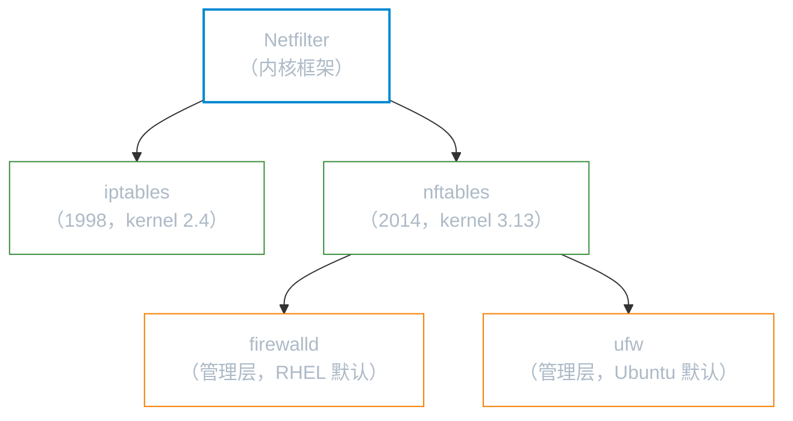
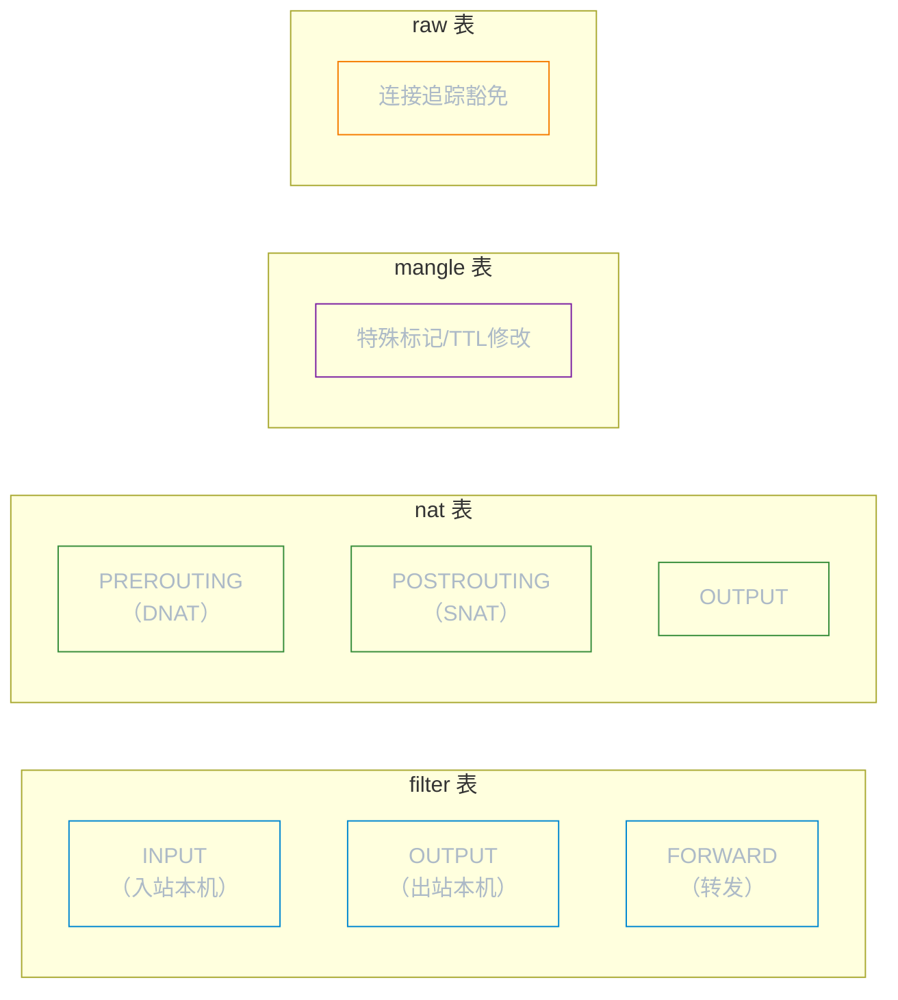
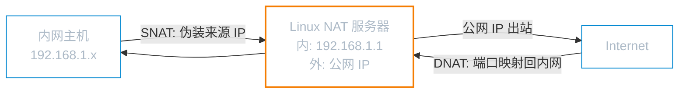

# 防火墙与 NAT

防火墙是网络封包进入主机前的第一道关卡。Linux 通过内核的 `Netfilter` 框架实现封包过滤，历经 `iptables` → `nftables` 的演进，现代发行版还提供 `firewalld`（RHEL 系）和 `ufw`（Ubuntu）两个管理层。

**本文你会学到**：

- Linux 防火墙技术栈的演进脉络
- `nftables` 现代防火墙的详细用法（重点）
- `firewalld` 与 `ufw` 的实用命令
- `iptables` 历史背景与四表五链
- NAT 的 SNAT、DNAT、MASQUERADE 实战配置
- 连接追踪（conntrack）与调试技巧

## 技术栈演进



### Netfilter：内核层框架

`Netfilter` 是 Linux 内核内置的封包处理框架，工作在 OSI 的第 2～4 层，可以分析 MAC、IP、TCP/UDP/ICMP 表头。所有上层防火墙工具（iptables、nftables）都只是它的用户态接口。

### iptables：经典用户态工具

`iptables` 自 kernel 2.4 起成为标准防火墙工具，使用「表（table）→ 链（chain）→ 规则（rule）」三层模型。每条规则按顺序依次比对，第一条匹配即执行对应动作，不再继续。

- **kernel 2.0**：`ipfwadm`
- **kernel 2.2**：`ipchains`
- **kernel 2.4 / 2.6**：`iptables`（主流时代）
- **kernel 3.13+**：`nftables`（逐步取代 iptables）

### nftables：现代替代（2014+）

`nftables` 在 2014 年引入，是 iptables 的现代替代品：

- 统一的语法，不再分 `iptables` / `ip6tables` / `arptables`
- 原生支持集合（set）和字典（map），规则更简洁
- **Debian 10+、Ubuntu 20.04+、RHEL 8+** 默认使用 nftables

### firewalld：动态管理层（RHEL 默认）

`firewalld` 是基于 zone（区域）概念的动态防火墙管理工具，底层调用 nftables（RHEL 8+）或 iptables，支持运行时修改规则无需重启服务。

### ufw：Ubuntu 友好前端

`ufw`（Uncomplicated Firewall）是 Ubuntu 默认的防火墙前端，封装了 nftables/iptables 的复杂语法，提供简单的命令行接口。

## nftables 详细用法

### 核心概念：table、chain、rule

| 概念 | 说明 |
|------|------|
| `table` | 顶层容器，指定地址族（`inet`/`ip`/`ip6`/`arp`） |
| `chain` | 挂载在 Netfilter 钩子上的规则列表（`input`/`output`/`forward`/`prerouting`/`postrouting`） |
| `rule` | 具体的匹配条件和动作（`accept`/`drop`/`reject`/`log`） |

`inet` 地址族同时处理 IPv4 和 IPv6，推荐使用。

### 查看与管理规则集

``` bash title="查看当前所有规则"
# 列出全部规则集（最常用）
nft list ruleset

# 仅列出某个 table
nft list table inet filter

# 列出某条链
nft list chain inet filter input
```

``` bash title="清空规则集"
# 删除整个 table
nft delete table inet filter

# 清空所有规则（慎用）
nft flush ruleset
```

### 添加 table 和 chain

``` bash title="创建 table 和 chain"
# 创建 inet table
nft add table inet filter

# 创建 input 链，指定钩子和默认策略
nft add chain inet filter input \
    '{ type filter hook input priority 0; policy drop; }'

# 创建 output 链（默认放行）
nft add chain inet filter output \
    '{ type filter hook output priority 0; policy accept; }'

# 创建 forward 链（默认放行）
nft add chain inet filter forward \
    '{ type filter hook forward priority 0; policy accept; }'
```

### 添加与删除规则

``` bash title="添加规则"
# 允许已建立/关联的连接（conntrack）
nft add rule inet filter input ct state established,related accept

# 允许 loopback 接口
nft add rule inet filter input iif lo accept

# 允许 SSH（port 22）
nft add rule inet filter input tcp dport 22 accept

# 允许 HTTP/HTTPS
nft add rule inet filter input tcp dport { 80, 443 } accept

# 丢弃无效封包
nft add rule inet filter input ct state invalid drop

# 允许 ICMP（ping）
nft add rule inet filter input ip protocol icmp accept
nft add rule inet filter input ip6 nexthdr icmpv6 accept
```

``` bash title="删除规则"
# 先查看规则的句柄（handle）
nft --handle list chain inet filter input

# 删除指定句柄的规则（假设 handle 为 4）
nft delete rule inet filter input handle 4
```

### 完整示例：基础服务器防火墙

以下是一个完整的服务器防火墙配置，允许已建立连接、SSH、HTTP/HTTPS，拒绝其余入站流量：

``` bash title="完整防火墙配置脚本"
#!/bin/bash

# 清空现有规则
nft flush ruleset

# 创建 table
nft add table inet filter

# input 链：默认丢弃
nft add chain inet filter input \
    '{ type filter hook input priority 0; policy drop; }'

# output 链：默认放行
nft add chain inet filter output \
    '{ type filter hook output priority 0; policy accept; }'

# forward 链：默认丢弃（非路由器环境）
nft add chain inet filter forward \
    '{ type filter hook forward priority 0; policy drop; }'

# 放行 loopback
nft add rule inet filter input iif lo accept

# 放行已建立/关联连接
nft add rule inet filter input ct state established,related accept

# 丢弃无效封包
nft add rule inet filter input ct state invalid drop

# 放行 ICMP（ping 与网络诊断）
nft add rule inet filter input ip protocol icmp accept
nft add rule inet filter input ip6 nexthdr icmpv6 accept

# 放行 SSH
nft add rule inet filter input tcp dport 22 ct state new accept

# 放行 HTTP/HTTPS
nft add rule inet filter input tcp dport { 80, 443 } ct state new accept
```

也可以使用等效的声明式语法写入配置文件：

``` text title="/etc/nftables.conf（声明式写法）"
#!/usr/sbin/nft -f

flush ruleset

table inet filter {
    chain input {
        type filter hook input priority 0; policy drop;

        # loopback
        iif lo accept

        # 已建立的连接
        ct state established,related accept

        # 无效封包
        ct state invalid drop

        # ICMP
        ip protocol icmp accept
        ip6 nexthdr icmpv6 accept

        # SSH
        tcp dport 22 ct state new accept

        # HTTP / HTTPS
        tcp dport { 80, 443 } ct state new accept
    }

    chain output {
        type filter hook output priority 0; policy accept;
    }

    chain forward {
        type filter hook forward priority 0; policy drop;
    }
}
```

### 持久化规则

``` bash title="持久化 nftables 规则"
# 将当前规则集保存到默认配置文件
nft list ruleset > /etc/nftables.conf

# 启用开机自动加载
systemctl enable nftables
systemctl start nftables

# 手动加载配置文件
nft -f /etc/nftables.conf
```

!!! tip "规则持久化"

    `/etc/nftables.conf` 是 nftables 的默认配置文件。修改后执行 `systemctl restart nftables` 即可重载规则。

## firewalld（RHEL/CentOS 默认）

### zone 概念

`firewalld` 使用「区域（zone）」对网络接口或来源 IP 分组管理，每个 zone 有不同的默认策略：

| Zone | 适用场景 |
|------|---------|
| `drop` | 所有入站封包直接丢弃，无响应（最严格） |
| `block` | 拒绝入站并返回 ICMP 拒绝消息 |
| `public` | 公共网络，仅放行选定服务（默认） |
| `dmz` | 非军事区，仅允许特定服务 |
| `trusted` | 完全信任，允许所有连接（最宽松） |
| `internal` | 内部网络，信任程度较高 |

### 常用命令

``` bash title="查看 firewalld 状态与规则"
# 查看服务状态
systemctl status firewalld

# 查看当前 zone 的所有规则
firewall-cmd --list-all

# 查看所有 zone 的规则
firewall-cmd --list-all-zones

# 查看默认 zone
firewall-cmd --get-default-zone

# 查看活跃 zone
firewall-cmd --get-active-zones
```

``` bash title="开放端口与服务"
# 临时开放端口（重启失效）
firewall-cmd --add-port=8080/tcp

# 永久开放端口
firewall-cmd --permanent --add-port=8080/tcp

# 永久开放服务（按服务名）
firewall-cmd --permanent --add-service=http
firewall-cmd --permanent --add-service=https
firewall-cmd --permanent --add-service=ssh

# 重载规则（permanent 修改后必须执行）
firewall-cmd --reload
```

``` bash title="移除规则"
# 移除端口
firewall-cmd --permanent --remove-port=8080/tcp

# 移除服务
firewall-cmd --permanent --remove-service=http

# 重载生效
firewall-cmd --reload
```

``` bash title="指定 zone 操作"
# 将接口加入指定 zone
firewall-cmd --permanent --zone=trusted --add-interface=eth1

# 在指定 zone 开放端口
firewall-cmd --permanent --zone=public --add-port=443/tcp
```

### rich rules（富规则）

`rich rules` 提供更细粒度的控制，可以指定来源 IP、端口、协议及动作：

``` bash title="rich rules 示例"
# 仅允许特定 IP 访问 SSH
firewall-cmd --permanent --add-rich-rule=\
'rule family="ipv4" source address="192.168.1.0/24" port port="22" protocol="tcp" accept'

# 拒绝某个 IP 的所有访问
firewall-cmd --permanent --add-rich-rule=\
'rule family="ipv4" source address="10.0.0.100" drop'

# 记录并丢弃来自某网段的访问
firewall-cmd --permanent --add-rich-rule=\
'rule family="ipv4" source address="203.0.113.0/24" log prefix="BLOCKED: " level="warning" drop'

firewall-cmd --reload
```

## ufw（Ubuntu 默认）

### 基本启停

``` bash title="ufw 启停与状态"
# 启用防火墙
ufw enable

# 禁用防火墙
ufw disable

# 查看状态（详细）
ufw status verbose

# 查看规则（带编号）
ufw status numbered
```

### 默认策略

``` bash title="设置默认策略"
# 默认拒绝所有入站（推荐）
ufw default deny incoming

# 默认放行所有出站
ufw default allow outgoing
```

### 按端口和服务设置规则

``` bash title="允许/拒绝端口与服务"
# 按服务名放行（/etc/services 中定义的服务）
ufw allow ssh
ufw allow http
ufw allow https

# 按端口放行
ufw allow 22/tcp
ufw allow 80/tcp
ufw allow 443/tcp

# 放行端口范围
ufw allow 6000:6007/tcp

# 拒绝端口
ufw deny 23/tcp
```

### 按 IP 段设置规则

``` bash title="按来源 IP 设置规则"
# 允许来自某 IP 的所有访问
ufw allow from 192.168.1.100

# 允许来自某网段的访问
ufw allow from 192.168.1.0/24

# 允许来自某 IP 访问特定端口
ufw allow from 192.168.1.100 to any port 22

# 拒绝来自某 IP
ufw deny from 10.0.0.100
```

### 删除规则

``` bash title="删除规则"
# 先查看规则编号
ufw status numbered

# 按编号删除
ufw delete 3

# 按规则描述删除
ufw delete allow 80/tcp
```

!!! warning "ufw 与 nftables/iptables 共存"

    Ubuntu 22.04+ 的 ufw 已切换到 nftables 后端。直接混用 `nft` 命令与 `ufw` 可能导致规则冲突，建议单一工具管理防火墙。

## iptables（历史参考）

### 四表五链

`iptables` 采用「表（table）→ 链（chain）→ 规则（rule）」模型：



| 表 | 用途 | 包含的链 |
|----|------|---------|
| `filter` | 默认表，过滤封包 | INPUT / OUTPUT / FORWARD |
| `nat` | 地址转换 | PREROUTING / POSTROUTING / OUTPUT |
| `mangle` | 修改封包标记/TTL | 五条链均有 |
| `raw` | 连接追踪豁免 | PREROUTING / OUTPUT |

封包流向路径：

- **入站（路径 A）**：`PREROUTING` → 路由判断 → `INPUT` → 本机进程
- **转发（路径 B）**：`PREROUTING` → 路由判断 → `FORWARD` → `POSTROUTING` → 外出
- **出站（路径 C）**：本机进程 → 路由判断 → `OUTPUT` → `POSTROUTING` → 外出

### 常用规则示例

``` bash title="查看与清除规则"
# 查看 filter 表规则（详细格式）
iptables-save

# 查看 nat 表
iptables -t nat -L -n -v

# 清除所有规则
iptables -F
iptables -X
iptables -Z
```

``` bash title="设置默认策略"
iptables -P INPUT DROP
iptables -P OUTPUT ACCEPT
iptables -P FORWARD ACCEPT
```

``` bash title="常用防火墙规则"
# 放行 loopback
iptables -A INPUT -i lo -j ACCEPT

# 放行已建立/关联连接
iptables -A INPUT -m state --state ESTABLISHED,RELATED -j ACCEPT

# 丢弃无效封包
iptables -A INPUT -m state --state INVALID -j DROP

# 放行 SSH
iptables -A INPUT -p tcp --dport 22 -m state --state NEW -j ACCEPT

# 放行 HTTP/HTTPS
iptables -A INPUT -p tcp --dport 80 -j ACCEPT
iptables -A INPUT -p tcp --dport 443 -j ACCEPT

# 仅允许特定 IP 访问 SSH
iptables -A INPUT -p tcp -s 192.168.1.0/24 --dport 22 -j ACCEPT

# 拒绝特定 IP
iptables -A INPUT -s 10.0.0.100 -j DROP

# 记录封包（LOG 不影响后续规则比对）
iptables -A INPUT -s 192.168.2.200 -j LOG --log-prefix "SUSPICIOUS: "
```

### 持久化

``` bash title="iptables 规则持久化"
# 安装持久化工具（Debian/Ubuntu）
apt install iptables-persistent

# 保存规则
iptables-save > /etc/iptables/rules.v4
ip6tables-save > /etc/iptables/rules.v6

# 恢复规则
iptables-restore < /etc/iptables/rules.v4

# RHEL/CentOS（旧版）
/etc/init.d/iptables save
```

!!! tip "现代系统建议"

    RHEL 8+、Debian 10+、Ubuntu 20.04+ 默认使用 nftables。`iptables` 命令通常被重定向到 `iptables-nft`（底层仍是 nftables）。新项目推荐直接使用 `nft` 命令或 `firewalld`/`ufw`。

## NAT（网络地址转换）

`NAT`（Network Address Translation）通过修改封包的来源或目标 IP/port，实现内网主机共享公网 IP 上网（SNAT）或将公网端口映射到内网服务器（DNAT）。



### SNAT：源地址转换（局域网共享上网）

`SNAT` 修改封包的来源 IP，让内网主机通过 NAT 服务器的公网 IP 访问 Internet。

工作流程：

1. 内网主机（`192.168.1.100`）发出封包，目标为公网地址
2. NAT 服务器将来源 IP 改写为自身公网 IP，并记录映射关系
3. 公网服务器响应时，封包返回 NAT 服务器的公网 IP
4. NAT 服务器查表，将目标 IP 还原为内网主机 IP，转发回去

=== "nftables（通用）"

    ``` text title="/etc/nftables.conf（SNAT 配置）"
    #!/usr/sbin/nft -f

    flush ruleset

    # 开启 IP 转发（必须）
    # echo 1 > /proc/sys/net/ipv4/ip_forward

    table inet nat {
        chain postrouting {
            type nat hook postrouting priority srcnat; policy accept;

            # MASQUERADE：动态获取出口 IP（推荐用于动态公网 IP）
            oifname "eth0" masquerade

            # SNAT：指定固定来源 IP（适用于静态公网 IP）
            # oifname "eth0" snat to 203.0.113.1
        }
    }

    table inet filter {
        chain forward {
            type filter hook forward priority 0; policy drop;

            # 允许从内网到外网的转发
            iifname "eth1" oifname "eth0" accept

            # 允许已建立连接的回程封包
            ct state established,related accept
        }
    }
    ```

    ``` bash title="开启内核 IP 转发（必须）"
    # 临时开启
    echo 1 > /proc/sys/net/ipv4/ip_forward

    # 永久开启（写入 sysctl.conf）
    echo "net.ipv4.ip_forward = 1" >> /etc/sysctl.conf
    sysctl -p
    ```

=== "firewalld（RHEL）"

    ``` bash title="firewalld 配置 SNAT/MASQUERADE"
    # 启用 masquerade（在 external zone 上）
    firewall-cmd --permanent --zone=external --add-masquerade

    # 设置内网接口为 internal zone
    firewall-cmd --permanent --zone=internal --add-interface=eth1

    # 设置外网接口为 external zone
    firewall-cmd --permanent --zone=external --add-interface=eth0

    # 开启内核转发并重载
    firewall-cmd --reload
    ```

=== "ufw（Ubuntu）"

    ``` bash title="ufw 配置 MASQUERADE"
    # 1. 开启 IP 转发
    # 在 /etc/ufw/sysctl.conf 中取消注释：
    # net/ipv4/ip_forward=1

    # 2. 在 /etc/ufw/before.rules 顶部添加 NAT 规则：
    # *nat
    # :POSTROUTING ACCEPT [0:0]
    # -A POSTROUTING -s 192.168.1.0/24 -o eth0 -j MASQUERADE
    # COMMIT

    # 3. 修改 /etc/default/ufw，设置：
    # DEFAULT_FORWARD_POLICY="ACCEPT"

    # 4. 重启 ufw
    ufw disable && ufw enable
    ```

### DNAT：目标地址转换（端口转发 / 内网服务对外暴露）

`DNAT` 修改封包的目标 IP 和端口，将公网请求转发到内网服务器。常用于在防火墙后端架设 Web、数据库等服务。

工作流程：

1. 外部主机向 NAT 服务器的公网 IP:Port 发出请求
2. NAT 服务器的 `PREROUTING` 链将目标 IP/Port 改写为内网服务器地址
3. 封包经路由后转发到内网服务器
4. 内网服务器响应，经 `POSTROUTING` 将来源 IP 改写后返回外部主机

=== "nftables（通用）"

    ``` text title="/etc/nftables.conf（DNAT 配置）"
    table inet nat {
        chain prerouting {
            type nat hook prerouting priority dstnat; policy accept;

            # 将外网 80 端口转发到内网 Web 服务器
            iifname "eth0" tcp dport 80 \
                dnat to 192.168.1.210:80

            # 将外网 443 端口转发到内网服务器
            iifname "eth0" tcp dport 443 \
                dnat to 192.168.1.210:443

            # 将外网 2222 端口映射到内网 SSH（22）
            iifname "eth0" tcp dport 2222 \
                dnat to 192.168.1.100:22
        }

        chain postrouting {
            type nat hook postrouting priority srcnat; policy accept;
            oifname "eth0" masquerade
        }
    }
    ```

=== "firewalld（RHEL）"

    ``` bash title="firewalld 配置端口转发（DNAT）"
    # 将外网 80 端口转发到内网 192.168.1.210:80
    firewall-cmd --permanent --zone=external \
        --add-forward-port=port=80:proto=tcp:toaddr=192.168.1.210:toport=80

    # 将外网 2222 转发到内网主机 SSH（22）
    firewall-cmd --permanent --zone=external \
        --add-forward-port=port=2222:proto=tcp:toaddr=192.168.1.100:toport=22

    firewall-cmd --reload
    ```

=== "ufw（Ubuntu）"

    ``` bash title="ufw 配置端口转发（DNAT）"
    # 在 /etc/ufw/before.rules 顶部的 *nat 段中添加：
    # *nat
    # :PREROUTING ACCEPT [0:0]
    # -A PREROUTING -i eth0 -p tcp --dport 80 -j DNAT --to-destination 192.168.1.210:80
    # -A POSTROUTING -j MASQUERADE
    # COMMIT

    # 重启 ufw 生效
    ufw disable && ufw enable
    ```

### MASQUERADE：动态 IP 的 SNAT

`MASQUERADE` 是 `SNAT` 的特殊形式，自动使用出口网卡的当前 IP 作为来源地址，适合动态公网 IP（如 ADSL、DHCP 拨号环境）。

``` bash title="MASQUERADE vs SNAT 对比"
# MASQUERADE：自动获取出口 IP（动态 IP 推荐）
# nftables:
nft add rule inet nat postrouting oifname "eth0" masquerade

# iptables 等效：
iptables -t nat -A POSTROUTING -o eth0 -j MASQUERADE

# SNAT：指定固定来源 IP（静态 IP 推荐，性能略好）
# nftables:
nft add rule inet nat postrouting oifname "eth0" snat to 203.0.113.1

# iptables 等效：
iptables -t nat -A POSTROUTING -o eth0 -j SNAT --to-source 203.0.113.1

# SNAT 多 IP 轮流使用：
iptables -t nat -A POSTROUTING -o eth0 -j SNAT \
    --to-source 203.0.113.1-203.0.113.10
```

## 连接追踪（conntrack）

`conntrack`（连接追踪）是 Netfilter 的核心模块，记录每条网络连接的状态，让防火墙能够区分「新建连接」和「已建立连接的响应封包」。

### 连接状态说明

| 状态 | 说明 |
|------|------|
| `NEW` | 新建连接的第一个封包（如 TCP SYN） |
| `ESTABLISHED` | 已完成握手的连接（双向通信中） |
| `RELATED` | 与已建立连接相关的新连接（如 FTP 数据通道） |
| `INVALID` | 无法识别或不合法的封包（建议直接丢弃） |

典型用法：只放行 `ESTABLISHED,RELATED`，所有 `NEW` 连接按端口控制，`INVALID` 直接丢弃。这样内网主机主动发出的请求响应可以自动回来，无需为每个目标端口单独写规则。

### 查看连接表

``` bash title="conntrack 命令"
# 安装 conntrack 工具
apt install conntrack           # Debian/Ubuntu
dnf install conntrack-tools     # RHEL/Fedora

# 查看当前所有追踪连接
conntrack -L

# 实时监控连接变化
conntrack -E

# 统计连接数（按协议）
conntrack -L | awk '{print $1}' | sort | uniq -c

# 查看 TCP 状态
conntrack -L -p tcp

# 删除特定连接
conntrack -D -p tcp --src 10.0.0.100
```

``` text title="conntrack -L 输出示例"
tcp      6 86395 ESTABLISHED src=192.168.1.100 dst=93.184.216.34 sport=54321 dport=443 ...
tcp      6 20 TIME_WAIT src=192.168.1.101 dst=8.8.8.8 sport=45678 dport=53 ...
udp      17 25 src=192.168.1.100 dst=8.8.8.8 sport=12345 dport=53 ...
```

``` bash title="查看连接追踪表大小"
# 当前追踪连接数
cat /proc/sys/net/netfilter/nf_conntrack_count

# 最大追踪连接数（高并发时可能需要调大）
cat /proc/sys/net/netfilter/nf_conntrack_max

# 调大追踪表（高流量服务器）
echo 131072 > /proc/sys/net/netfilter/nf_conntrack_max
# 永久生效：
echo "net.netfilter.nf_conntrack_max = 131072" >> /etc/sysctl.conf
sysctl -p
```

## 防火墙规则调试

### nftables 日志记录

``` bash title="添加 log target 记录封包"
# 记录被丢弃的封包（在 drop 规则前添加 log）
nft add rule inet filter input \
    ct state new tcp dport 22 log prefix "SSH_NEW: " level info accept

# 记录所有被 drop 的封包
nft add rule inet filter input log prefix "DROP: " flags all drop
```

``` text title="/etc/nftables.conf（带日志的规则）"
table inet filter {
    chain input {
        type filter hook input priority 0; policy drop;

        iif lo accept
        ct state established,related accept
        ct state invalid drop

        # SSH：记录新连接
        tcp dport 22 ct state new log prefix "SSH_ACCESS: " level info accept

        # HTTP/HTTPS
        tcp dport { 80, 443 } ct state new accept

        # 记录所有被丢弃的入站封包
        limit rate 5/minute log prefix "INPUT_DROP: " level warn
    }
}
```

``` bash title="查看 nftables 日志"
# 日志写入 kernel ring buffer，通过 journalctl 或 dmesg 查看
journalctl -k | grep "SSH_ACCESS"
dmesg | grep "INPUT_DROP"

# 实时跟踪
journalctl -kf | grep "DROP"
```

### nft monitor：实时监控规则变化

``` bash title="nft monitor 使用"
# 监控规则集的所有变化（添加/删除规则时实时显示）
nft monitor

# 仅监控规则变化
nft monitor rules

# 监控新建连接（需开启 conntrack）
nft monitor trace
```

### 开启封包追踪（trace）

`nftables` 的 `meta nftrace` 可以追踪特定封包经过的每一条规则：

``` text title="开启 trace 追踪特定封包"
table inet filter {
    chain input {
        type filter hook input priority -300;

        # 追踪来自特定 IP 的 SSH 封包
        ip saddr 192.168.1.100 tcp dport 22 meta nftrace set 1
    }
}
```

``` bash title="查看 trace 输出"
# 在另一个终端运行 monitor trace
nft monitor trace
```

### 常见误配排查

``` bash title="常见问题排查步骤"
# 1. 确认防火墙服务状态
systemctl status nftables
systemctl status firewalld
ufw status

# 2. 查看当前生效的完整规则集
nft list ruleset          # nftables
iptables-save             # iptables
firewall-cmd --list-all   # firewalld

# 3. 检查 IP 转发是否开启（NAT/路由器必须）
cat /proc/sys/net/ipv4/ip_forward
sysctl net.ipv4.ip_forward

# 4. 检查连接追踪表是否满载
cat /proc/sys/net/netfilter/nf_conntrack_count
cat /proc/sys/net/netfilter/nf_conntrack_max

# 5. 使用 ncat/nc 测试端口连通性
nc -zv 192.168.1.10 22     # 测试 SSH 端口
nc -zv 192.168.1.10 80     # 测试 HTTP 端口

# 6. tcpdump 抓包确认封包是否到达
tcpdump -i eth0 tcp port 22 -n
```

!!! warning "远程登录时修改防火墙规则"

    通过 SSH 远程修改防火墙规则时，**务必先确保当前 SSH 连接规则不会被误删**。建议先用 `nft list ruleset` 确认规则，或在本地 console 操作。错误的规则可能导致自己被锁在门外。

常见误配场景及解决方法：

| 问题 | 可能原因 | 排查命令 |
|------|---------|---------|
| SSH 连接被拒 | INPUT 默认 DROP 且未放行 22 端口 | `nft list chain inet filter input` |
| 内网无法上网 | IP 转发未开启，或 MASQUERADE 规则缺失 | `sysctl net.ipv4.ip_forward` |
| DNAT 不生效 | FORWARD 链未放行转发封包 | `nft list chain inet filter forward` |
| 连接超时（非拒绝） | policy 为 `drop` 而非 `reject` | 改为 `reject` 可得到即时反馈 |
| 服务重启后规则丢失 | 未持久化规则 | `systemctl enable nftables` |
