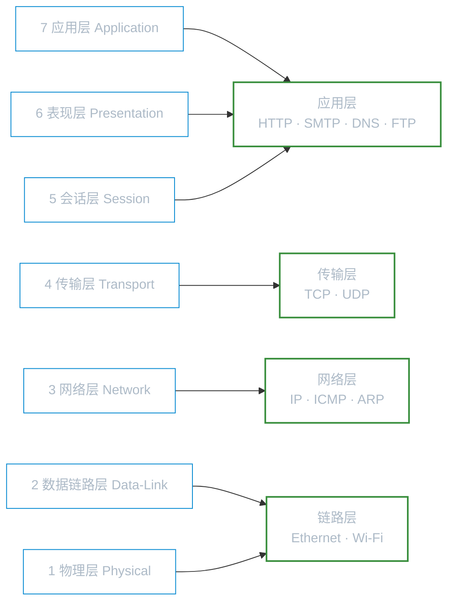
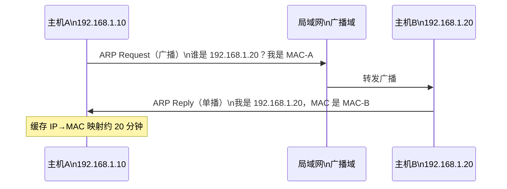
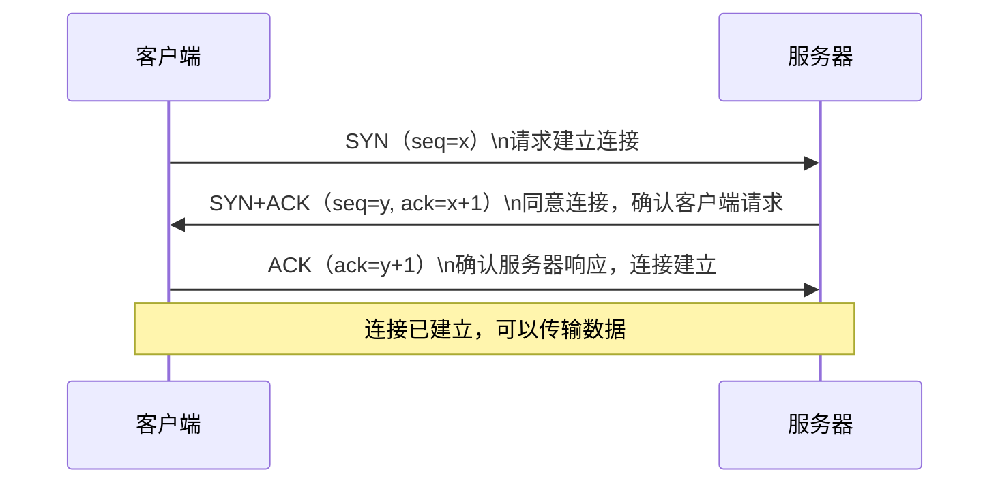
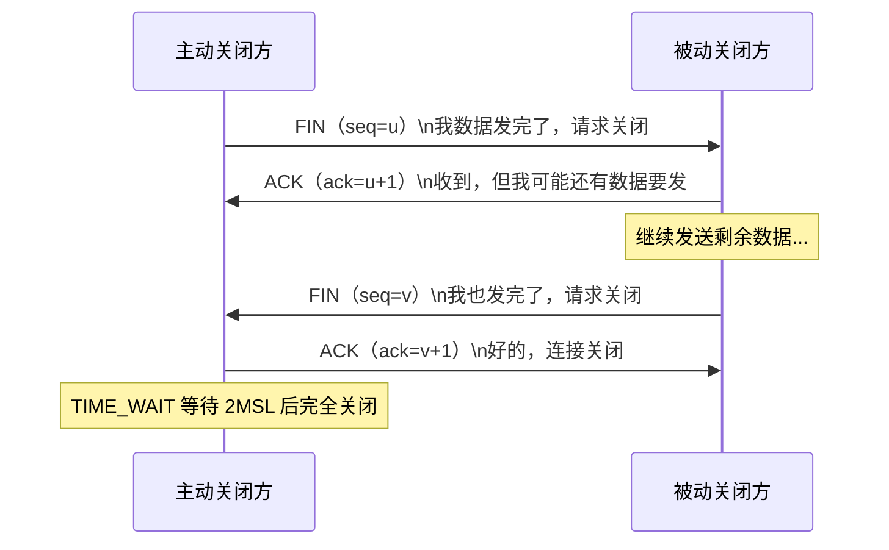
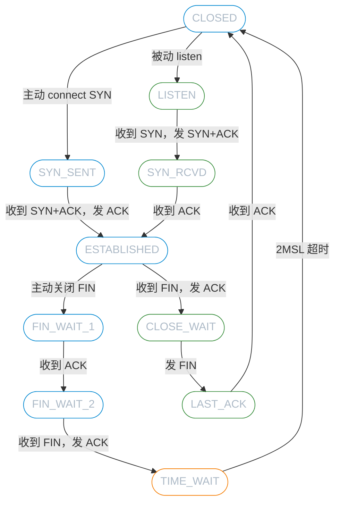

# TCP/IP 网络基础

**本文你会学到**：

- OSI 七层模型与 TCP/IP 四层模型的对应关系
- IPv4 地址结构、分类、私有地址范围及特殊地址
- 子网掩码与 CIDR 的计算与应用
- 为什么需要子网划分及如何规划网络地址
- MTU、IP 分段与重组的原理
- 以太网、MAC 地址与 CSMA/CD 协议
- ARP 协议如何实现 IP 到 MAC 的地址解析
- TCP 三次握手、四次挥手与连接状态机
- TCP 与 UDP 的对比及各自的应用场景
- 常见协议端口与服务的对应关系
- 静态路由与动态路由协议的基础概念
- IPv6 地址格式、地址类型及与 IPv4 的核心差异

## 协议模型对比：OSI 七层与 TCP/IP 四层

OSI 七层模型是网络教学的参考框架；TCP/IP 四层模型是 Internet 的实际实现。二者的对应关系如下：



各层职责速查：

| 层级 | 关键协议 / 概念 | 典型数据单位 |
|------|----------------|-------------|
| 应用层 | HTTP、HTTPS、SSH、FTP、SMTP、DNS | 报文（Message）|
| 传输层 | TCP、UDP | 段（Segment）/ 数据报（Datagram）|
| 网络层 | IP、ICMP、OSPF、BGP | 分组（Packet）|
| 链路层 | Ethernet、MAC、ARP | 帧（Frame）|

!!! tip "为什么要学 OSI？"

    实际代码跑的是 TCP/IP，但排查网络故障时，OSI 模型帮你精确定位问题在哪一层：链路层丢帧？网络层路由错误？传输层端口被拒？

## IP 地址体系

### IP 地址的结构与分类

IPv4 地址是 32 位二进制，点分十进制表示，范围 `0.0.0.0` 到 `255.255.255.255`。每个地址由 `Net_ID`（网络号）和 `Host_ID`（主机号）两部分组成。

按首字节范围划分五类：

| 类别 | 首字节范围 | 默认掩码 | 可用主机数 | 用途 |
|------|-----------|---------|-----------|------|
| Class A | 1 – 126 | /8（255.0.0.0）| ~1677万 | 大型网络 |
| Class B | 128 – 191 | /16（255.255.0.0）| ~6.5万 | 中型网络 |
| Class C | 192 – 223 | /24（255.255.255.0）| 254 | 小型网络 |
| Class D | 224 – 239 | — | — | 组播（Multicast）|
| Class E | 240 – 255 | — | — | 保留未用 |

!!! tip "特殊地址"

    - `127.0.0.1`（`lo` 接口）：回环地址，用于本机内部测试，无需网卡即可使用
    - `0.0.0.0`：表示本机所有接口或默认路由
    - `255.255.255.255`：受限广播地址

### 私有地址范围

私有地址不会在 Internet 上路由，专用于局域网内部：

| 类别 | 私有地址范围 | 地址数量 |
|------|------------|---------|
| Class A 私有 | `10.0.0.0` – `10.255.255.255` | 约 1677 万 |
| Class B 私有 | `172.16.0.0` – `172.31.255.255` | 约 104 万 |
| Class C 私有 | `192.168.0.0` – `192.168.255.255` | 约 6.5 万 |

局域网主机通过 NAT（网络地址转换）共享一个公网 IP 访问 Internet。

## 子网掩码与 CIDR

### 为什么需要子网划分？

一个 Class A 网络可容纳 1600 万台主机，但广播域太大会导致网络效率极低。通过"借用" Host_ID 的高位作为 Net_ID，可以把一个大网段切分为多个子网。

### 子网掩码计算（以 192.168.1.0/24 为例）

```
IP 地址：  192.168.1.0
子网掩码：  255.255.255.0  （/24，即前 24 位为网络号）

Network：  192.168.1.0    （Host_ID 全为 0）
Broadcast：192.168.1.255  （Host_ID 全为 1）
可用 IP：  192.168.1.1 ~ 192.168.1.254（共 254 个）
```

将 `/24` 再切成 4 个子网（借 2 位，`/26`）：

| 子网 | 网络地址 | 广播地址 | 可用 IP | 可用数 |
|------|---------|---------|---------|-------|
| 子网 1 | 192.168.1.0 | 192.168.1.63 | .1 ~ .62 | 62 |
| 子网 2 | 192.168.1.64 | 192.168.1.127 | .65 ~ .126 | 62 |
| 子网 3 | 192.168.1.128 | 192.168.1.191 | .129 ~ .190 | 62 |
| 子网 4 | 192.168.1.192 | 192.168.1.255 | .193 ~ .254 | 62 |

### CIDR 无类域间路由

`192.168.0.0/16` 这种写法就是 CIDR 表示法——用斜线加前缀长度替代冗长的掩码写法。CIDR 打破了 Class 边界：

- 聚合路由：把 256 个 Class C（`192.168.0.0` ~ `192.168.255.255`）写成 `192.168.0.0/16`，减少路由表条目
- 划分子网：把 Class C 切成更小的 `/26`、`/28` 等

!!! tip "快速心算"

    `/24` → 254 台；`/25` → 126 台；`/26` → 62 台；`/27` → 30 台；`/28` → 14 台；`/29` → 6 台；`/30` → 2 台（点对点链路常用）

## IP 分段与 MTU

### MTU 是什么？

每种链路媒介对单次传输的数据量有上限，即 `MTU`（Maximum Transmission Unit，最大传输单元）。

- 标准以太网 MTU：**1500 字节**
- IPv4 封包最大：65535 字节（远大于 `MTU`）
- 因此 IP 层必须对大包进行**分段（Fragmentation）**，在目的端重组

IPv4 表头中负责分段的字段：

| 字段 | 作用 |
|------|------|
| Identification | 标识属于同一原始包的所有分段 |
| Flags（DF/MF）| DF=1 不允许分段；MF=1 后续还有分段 |
| Fragment Offset | 该分段在原包中的偏移量（重组时排序用）|
| TTL | 每经过一个路由器减 1，为 0 则丢弃（防环）|

### IPv4 vs IPv6 MTU 对比

| 特性 | IPv4 | IPv6 |
|------|------|------|
| 最小 MTU | 68 字节 | **1280 字节** |
| 标准以太网 MTU | 1500 字节 | 1500 字节 |
| 路由器分段 | 允许 | **不允许**（仅源主机可分段）|
| 分段机制 | IP 表头字段 | 扩展头（Fragment Header）|
| Path MTU 发现 | 可选 | **强制**（必须支持）|

IPv6 要求源主机先通过 Path MTU Discovery 探测路径最小 MTU，再按此发包，路由器不做分段。

## 以太网与局域网技术

### 以太网与 CSMA/CD

以太网是目前最主流的局域网技术（IEEE 802.3）。传统以太网通过 `CSMA/CD` 协调共享媒介：

1. `CS`（Carrier Sense）：发送前先监听线路是否空闲
2. `MA`（Multiple Access）：Hub 环境中所有主机共享带宽
3. `CD`（Collision Detection）：检测到碰撞后随机退避重发

!!! tip "Hub vs Switch"

    - `Hub`（集线器）：共享媒介，广播到所有端口，带宽共享，有碰撞
    - `Switch`（交换机）：记录 `MAC` 地址表，按目的 `MAC` 定向转发，每端口独享带宽，无碰撞

以太网常见标准：

| 标准 | 速率 | 线材要求 |
|------|------|---------|
| Ethernet（10BASE-T）| 10 Mbps | CAT3 |
| Fast Ethernet（100BASE-TX）| 100 Mbps | CAT5 |
| Gigabit Ethernet（1000BASE-T）| 1000 Mbps | CAT5e / CAT6 |
| 10GbE | 10 Gbps | CAT6a / 光纤 |

### MAC 地址

每张网卡出厂时烧入唯一的 `MAC` 地址（48 位，16 进制表示如 `00:1A:2B:3C:4D:5E`）：

- 前 24 位（OUI）：厂商标识
- 后 24 位：设备序号

`MAC` 地址只在**同一广播域（局域网）内**有效，跨路由器传输时会被替换为下一跳的 `MAC`。

查看 MAC 地址：

=== "Debian/Ubuntu"

    ``` bash title="查看网卡信息"
    ip link show eth0
    # 或
    ip addr show
    ```

=== "Red Hat/RHEL"

    ``` bash title="查看网卡信息"
    ip link show ens33
    # nmcli device show
    ```

### ARP 协议：IP 到 MAC 的翻译

当主机知道目标 IP 但不知道其 MAC 时，通过 `ARP`（Address Resolution Protocol）广播查询：



``` bash title="查看 ARP 缓存表"
arp -n
# 或
ip neigh show
```

**RARP**（Reverse ARP）方向相反——已知 `MAC`，查询 `IP`，现已被 `DHCP` 取代。

## TCP 与 UDP 传输层协议

### TCP 三次握手：建立可靠连接

TCP 是**面向连接、可靠传输**的协议，建立连接需要三次握手：



!!! tip "为什么需要三次，不是两次？"

    两次握手只能让服务器确认客户端能发，却无法让客户端确认服务器能收发。三次握手保证双方都确认了**发送和接收能力**。

### TCP 四次挥手：关闭连接

TCP 是全双工的，两个方向的连接需要各自独立关闭：



`TIME_WAIT` 状态（等待 2×MSL，约 60 秒）的目的：确保最后一个 ACK 能被对方收到，避免旧连接的延迟包干扰新连接。

### TCP 关键控制标志

| 标志 | 含义 |
|------|------|
| `SYN` | 同步，发起连接请求 |
| `ACK` | 确认，收到数据的回应 |
| `FIN` | 完成，请求关闭连接 |
| `RST` | 重置，强制关闭异常连接 |
| `PSH` | 推送，立即交给应用层处理 |
| `URG` | 紧急，优先处理 |

### TCP 连接状态机

主要状态（简化版）：



### UDP：轻量不可靠传输

`UDP`（User Datagram Protocol）无连接、无确认机制，表头仅 8 字节（源端口、目的端口、长度、校验和）。

| 对比维度 | TCP | UDP |
|---------|-----|-----|
| 连接 | 面向连接（三次握手）| 无连接 |
| 可靠性 | 可靠（ACK + 重传）| 不可靠（发完不管）|
| 顺序 | 保证顺序 | 不保证 |
| 速度 | 较慢（有开销）| 快 |
| 头部大小 | 20 字节（最小）| 8 字节 |
| 适用场景 | HTTP、SSH、FTP、邮件 | DNS 查询、视频流、实时通信、游戏 |

!!! tip "DNS 同时用 UDP 和 TCP"

    普通 DNS 查询用 UDP（快速），但响应超过 512 字节（如区传送）时自动切换为 TCP。

## 常见协议端口

小于 1024 的端口称为**特权端口（Well-known Ports）**，只有 root 进程才能绑定。完整映射记录在 `/etc/services`。

| 端口 | 协议 | 服务 | 说明 |
|------|------|------|------|
| 20 | TCP | FTP-Data | 文件传输数据通道（主动模式）|
| 21 | TCP | FTP | 文件传输控制通道 |
| 22 | TCP | SSH | 加密远程登录 |
| 23 | TCP | Telnet | 明文远程登录（不推荐）|
| 25 | TCP | SMTP | 邮件发送 |
| 53 | TCP/UDP | DNS | 域名解析 |
| 67/68 | UDP | DHCP | 动态 IP 分配（服务器/客户端）|
| 80 | TCP | HTTP | 网页服务 |
| 110 | TCP | POP3 | 邮件接收 |
| 143 | TCP | IMAP | 邮件访问 |
| 161/162 | UDP | SNMP | 网络管理 |
| 389 | TCP | LDAP | 目录服务 |
| 443 | TCP | HTTPS | 加密网页服务 |
| 445 | TCP | SMB | Windows 文件共享 |
| 465 | TCP | SMTPS | 加密邮件发送 |
| 587 | TCP | SMTP Submission | 邮件提交（推荐替代 25）|
| 993 | TCP | IMAPS | 加密 IMAP |
| 995 | TCP | POP3S | 加密 POP3 |
| 3306 | TCP | MySQL | 数据库 |
| 5432 | TCP | PostgreSQL | 数据库 |
| 6379 | TCP | Redis | 缓存数据库 |
| 8080 | TCP | HTTP Alt | 常见开发/代理端口 |

查看本机监听端口：

``` bash title="查看监听端口"
# 推荐：ss 命令（iproute2）
ss -tlnp

# 传统：netstat
netstat -tlnp
```

## 路由基础

### 路由表与封包转发逻辑

每台主机都有路由表。当发出 IP 包时，内核按以下顺序查找路由：

1. 匹配最长前缀（精确子网 → 更大子网 → 默认路由 `0.0.0.0/0`）
2. 找到匹配项后，通过对应网口发出（同网段直连）或转发给网关（跨网段）
3. 找不到任何匹配 → 发送 ICMP Destination Unreachable

``` bash title="查看路由表"
# 推荐
ip route show

# 传统
route -n
```

示例路由表输出（`ip route`）：

```
192.168.1.0/24 dev eth0 proto kernel scope link src 192.168.1.100
default via 192.168.1.254 dev eth0
```

### 三类路由

**直连路由（Connected）**

当网卡启用并配置 IP 时，内核自动生成——该网卡所在网段直接可达，无需网关。

**静态路由（Static）**

手动配置的固定路由条目，适合规模小、拓扑稳定的网络：

``` bash title="添加静态路由（临时）"
# 到 192.168.100.0/24 经由网关 192.168.1.100
ip route add 192.168.100.0/24 via 192.168.1.100 dev eth0
```

=== "Debian/Ubuntu"

    ``` bash title="永久静态路由（Netplan）"
    # /etc/netplan/01-netcfg.yaml
    network:
      ethernets:
        eth0:
          routes:
            - to: 192.168.100.0/24
              via: 192.168.1.100
    ```

=== "Red Hat/RHEL"

    ``` bash title="永久静态路由（NetworkManager）"
    # /etc/sysconfig/network-scripts/route-eth0
    192.168.100.0/24 via 192.168.1.100 dev eth0
    ```

**动态路由（Dynamic）**

路由器之间通过路由协议自动交换路由信息，适合大型网络：

| 协议 | 类型 | 适用场景 | 算法 |
|------|------|---------|------|
| `RIP` v1/v2 | IGP（内部）| 小型网络（≤15 跳）| 距离向量 |
| `OSPF` | IGP（内部）| 中大型企业内网 | 链路状态（Dijkstra）|
| `IS-IS` | IGP（内部）| ISP 骨干网 | 链路状态 |
| `BGP` | EGP（外部）| 互联网自治域间路由 | 路径向量 |

!!! tip "Linux 动态路由软件"

    现代 Linux 常用 **FRRouting**（`frr`，原 Quagga 继任者）实现 RIP/OSPF/BGP 等协议。

启用 IP 转发（让 Linux 充当路由器）：

``` bash title="启用 IP 转发"
# 临时
echo 1 > /proc/sys/net/ipv4/ip_forward

# 永久（/etc/sysctl.conf 或 /etc/sysctl.d/*.conf）
net.ipv4.ip_forward = 1
sysctl -p
```

## IPv6 基础

### 为什么需要 IPv6？

IPv4 地址空间仅 2³² ≈ 43 亿个，实际可用更少（NAT 虽延缓了枯竭，但不是长久之计）。IPv6 提供 2¹²⁸ 个地址，相当于地球上每粒沙子可分到数亿个 IP。

### IPv6 地址格式

IPv6 地址为 128 位，用 8 组 16 位十六进制数（`:`分隔）表示：

```
完整表示：2001:0db8:85a3:0000:0000:8a2e:0370:7334
简化规则：
  1. 每组前导零可省略：0db8 → db8
  2. 连续全零组可用 :: 替代（只能用一次）：
     2001:db8:85a3::8a2e:370:7334
```

常见 IPv6 地址类型：

| 前缀 | 类型 | 说明 |
|------|------|------|
| `::1/128` | 回环地址 | 等同 IPv4 的 `127.0.0.1` |
| `fe80::/10` | 链路本地地址 | 自动配置，仅在本链路有效，不可路由 |
| `fc00::/7` | 唯一本地地址（ULA）| 类似 IPv4 私有地址，用于内网 |
| `2000::/3` | 全局单播地址 | 可在 Internet 路由的公网地址 |
| `ff00::/8` | 组播地址 | 替代 IPv4 广播 |

### IPv4 与 IPv6 核心对比

| 特性 | IPv4 | IPv6 |
|------|------|------|
| 地址长度 | 32 位 | 128 位 |
| 地址表示 | 点分十进制 | 冒号分十六进制 |
| 表头大小 | 20 字节（最小）| **40 字节**（固定）|
| 子网掩码 | 需要（`255.255.x.x`）| 统一用前缀长度（`/64`）|
| 广播 | 有 | **无**（用组播替代）|
| 地址自动配置 | DHCP | SLAAC（无状态）或 DHCPv6 |
| IPSec | 可选 | 原生支持 |
| NAT | 广泛使用 | 通常不需要 |
| 路由器分段 | 允许 | 不允许 |

**链路本地地址（`fe80::/10`）** 在接口启用时自动生成，由 EUI-64 算法从 MAC 地址派生。这意味着同一链路上的主机无需手动配置即可互相通信。

``` bash title="查看 IPv6 地址"
ip -6 addr show
# fe80::xxx/64 即为链路本地地址
```

## 网络连通必要参数

一台主机要能上网，必须具备以下四个参数：

| 参数 | 作用 | 示例 |
|------|------|------|
| IP 地址 | 主机在网络中的唯一标识 | `192.168.1.100` |
| 子网掩码 | 定义网络范围 | `255.255.255.0`（`/24`）|
| 默认网关 | 跨网段转发的出口路由器 | `192.168.1.254` |
| DNS 服务器 | 域名解析，将主机名转换为 IP | `114.114.114.114` |

!!! tip "Network、Broadcast 不用手动配置"

    这两个值可由 IP 和掩码计算得出，操作系统自动处理，无需填写。
