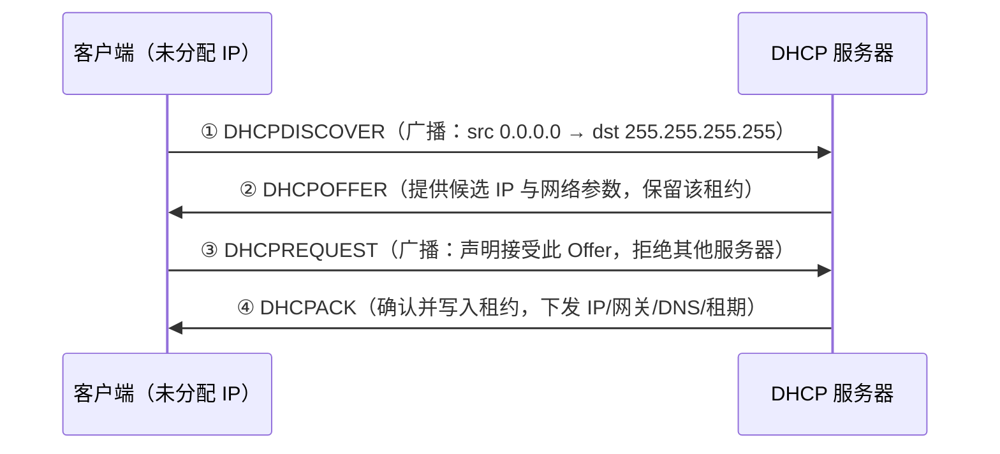
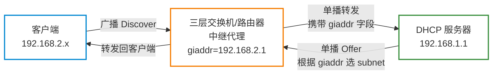

# DHCP 服务器

**本文你会学到**：

- DORA 四步握手流程与租约机制
- `isc-dhcp-server` 完整配置（动态 IP、固定 IP 绑定、监听接口）
- Kea DHCP——2022 年后官方推荐的现代替代方案
- 租约查看、客户端配置与 DDNS 简介
- 常见故障排查与 `tcpdump` 抓包定位

## DHCP 工作原理

`DHCP`（Dynamic Host Configuration Protocol，动态主机配置协议）是局域网中自动分配 IP 地址及网络参数的协议。服务端监听 UDP `67` 端口，客户端使用 UDP `68` 端口发送请求。

### DORA 四步握手

客户端获取 IP 的完整流程称为 **DORA**（Discover → Offer → Request → Acknowledge）：



- **Discover**：客户端开机或网卡启动时，广播寻找所有 DHCP 服务器
- **Offer**：服务器根据客户端 MAC 判断是否有固定绑定，否则从地址池分配候选 IP 并保留
- **Request**：同一网段可能有多台 DHCP 服务器，客户端广播声明选择哪台，让其余服务器回收候选 IP
- **Acknowledge**：服务器写入 `dhcpd.leases`，租约正式生效

### 租约机制

租约（`lease`）控制 IP 的使用期限，避免地址被长期空占：

- 设租约时长为 `T`，客户端在 `0.5T` 时主动续约（`DHCPREQUEST`）
- 续约失败则在 `0.875T` 再次尝试；到期前仍失败则释放 IP，重新广播 Discover
- 客户端主动脱机（`ifdown`/关机）会发 `DHCPRELEASE`，服务端立即回收

租约时长建议：

- 固定终端（台式机、服务器）：`86400` 秒（24 小时）或更长
- 移动设备密集场景（会议室、访客网络）：`3600` 秒（1 小时）

### DHCP 中继代理

DHCP 依赖广播，默认无法跨越路由器到达其他网段。当服务器与客户端不在同一物理网段时，需要在三层交换机或路由器上启用 **DHCP 中继代理**（`Relay Agent`）：



中继代理的本质是把广播包转成单播并添加 `giaddr`（`giaddr` = 代理接口 IP），服务器根据 `giaddr` 选择对应 `subnet` 块分配 IP。

``` bash title="Debian 上安装并配置 isc-dhcp-relay"
apt install isc-dhcp-relay -y

# /etc/default/isc-dhcp-relay
SERVERS="192.168.1.1"       # DHCP 服务器地址
INTERFACES="eth1 eth2"      # 中继监听的接口
OPTIONS=""

systemctl restart isc-dhcp-relay
```

## isc-dhcp-server 安装与配置

### 安装

=== "Debian/Ubuntu"

    ``` bash title="安装 isc-dhcp-server"
    apt update && apt install isc-dhcp-server -y
    ```

    关键文件：

    - 主配置：`/etc/dhcp/dhcpd.conf`
    - 监听接口：`/etc/default/isc-dhcp-server`
    - 租约文件：`/var/lib/dhcp/dhcpd.leases`

=== "Red Hat/RHEL"

    ``` bash title="安装 dhcp-server"
    dnf install dhcp-server -y
    ```

    关键文件：

    - 主配置：`/etc/dhcp/dhcpd.conf`
    - 监听接口：`/etc/sysconfig/dhcpd`
    - 租约文件：`/var/lib/dhcpd/dhcpd.leases`

### 核心配置文件

`/etc/dhcp/dhcpd.conf` 分全局参数和子网块（`subnet`）两部分：

``` text title="/etc/dhcp/dhcpd.conf 完整示例"
# 全局参数
ddns-update-style none;           # 暂不启用 DDNS 动态更新
ignore client-updates;
default-lease-time 86400;         # 默认租约 24 小时（秒）
max-lease-time 172800;            # 最大租约 48 小时

option routers 192.168.100.254;                   # 下发给客户端的默认网关
option domain-name "example.local";               # 搜索域
option domain-name-servers 8.8.8.8, 8.8.4.4;     # DNS 服务器

# 子网定义（网段 + 子网掩码）
subnet 192.168.100.0 netmask 255.255.255.0 {
    range 192.168.100.100 192.168.100.200;        # 动态地址池

    # MAC 绑定固定 IP（放在 subnet 内或全局均可）
    host server01 {
        hardware ethernet 08:00:27:11:EB:C2;
        fixed-address 192.168.100.10;
    }
}
```

!!! warning "语法陷阱"

    - 每行结尾必须有 `;`，否则启动报错并指出行号
    - `option domain-name-servers`（有 `s`）、`option routers`（有 `s`）是高频拼错点
    - `subnet` 块的网段必须与服务器监听接口的 IP 所在网段一致，否则 `dhcpd` 拒绝启动

关键参数速查：

| 参数 | 含义 |
|------|------|
| `default-lease-time` | 客户端未请求特定时长时的默认租约（秒） |
| `max-lease-time` | 客户端可请求的最大租约时长 |
| `option routers` | 默认网关（注意有 `s`） |
| `option domain-name-servers` | DNS 地址（注意有 `s`） |
| `option broadcast-address` | 广播地址（多数情况自动推算，无需手动设置） |
| `range` | 动态 IP 范围（起始 IP 到结束 IP） |

### 固定 IP 绑定

通过 `host` 块把 MAC 地址与固定 IP 绑定，适用于服务器、打印机等需要稳定地址的设备：

``` text title="固定 IP 绑定示例"
host printer01 {
    hardware ethernet AA:BB:CC:DD:EE:FF;
    fixed-address 192.168.100.20;
    # 可在 host 块内覆盖全局参数
    default-lease-time 604800;        # 该设备租约 7 天
}
```

``` bash title="查看网卡 MAC 地址"
# 方式一
ip link show eth0 | grep link/ether

# 方式二（查询已连接主机的 MAC）
ping -c 1 192.168.100.50 && arp -n | grep 192.168.100.50
```

### 监听接口配置

服务器有多块网卡时，必须明确指定 DHCP 监听哪块接口，防止向错误网段发放 IP：

=== "Debian/Ubuntu"

    ``` bash title="/etc/default/isc-dhcp-server"
    # 多接口用空格分隔
    INTERFACESv4="eth1"
    ```

=== "Red Hat/RHEL"

    ``` bash title="/etc/sysconfig/dhcpd"
    DHCPDARGS="eth1"
    ```

### 启动与验证

``` bash title="启动并验证 isc-dhcp-server"
# 检查配置文件语法（启动前必做）
dhcpd -t -cf /etc/dhcp/dhcpd.conf

# Debian 启动
systemctl start isc-dhcp-server
systemctl enable isc-dhcp-server

# RHEL 启动
systemctl start dhcpd
systemctl enable dhcpd

# 验证监听 UDP 67 端口
ss -ulnp | grep 67
```

## Kea DHCP

### 为什么出现 Kea

`isc-dhcp-server` 于 **2022 年 10 月**宣布停止维护（EOL），ISC 官方推荐所有用户迁移到 **Kea DHCP**。

| 特性 | isc-dhcp-server | Kea |
|------|-----------------|-----|
| 维护状态 | ⚠️ 已停止，无安全补丁 | ✅ 积极维护 |
| 配置格式 | 自定义 DSL | JSON（支持注释） |
| REST API | ❌ | ✅ 原生支持 |
| 高可用（HA） | 有限 | ✅ 原生支持 |
| 热重载配置 | 需重启服务 | ✅ 支持 |
| 租约存储 | 文件 | 文件 / MySQL / PostgreSQL |

### 安装 Kea

=== "Debian/Ubuntu"

    ``` bash title="安装 kea-dhcp4-server"
    apt install kea-dhcp4-server -y
    ```

=== "Red Hat/RHEL"

    ``` bash title="安装 kea"
    dnf install kea -y
    ```

配置文件统一位于 `/etc/kea/kea-dhcp4.conf`。

### 基本配置结构

Kea 使用 JSON 格式，`reservations`（预留）对应 `isc-dhcp-server` 的 `host` 块：

``` json title="/etc/kea/kea-dhcp4.conf 基础示例"
{
    "Dhcp4": {
        "interfaces-config": {
            "interfaces": ["eth1"]
        },
        "lease-database": {
            "type": "memfile",
            "persist": true,
            "name": "/var/lib/kea/kea-leases4.csv"
        },
        "valid-lifetime": 86400,
        "max-valid-lifetime": 172800,

        "subnet4": [
            {
                "subnet": "192.168.100.0/24",
                "pools": [
                    { "pool": "192.168.100.100 - 192.168.100.200" }
                ],
                "option-data": [
                    { "name": "routers",             "data": "192.168.100.254" },
                    { "name": "domain-name-servers",  "data": "8.8.8.8, 8.8.4.4" }
                ],
                "reservations": [
                    {
                        "hw-address": "08:00:27:11:eb:c2",
                        "ip-address": "192.168.100.10",
                        "hostname": "server01"
                    }
                ]
            }
        ]
    }
}
```

``` bash title="启动 Kea"
# 验证配置语法
kea-dhcp4 -t /etc/kea/kea-dhcp4.conf

systemctl start kea-dhcp4-server
systemctl enable kea-dhcp4-server
```

### 选型建议

**选 Kea**：

- 新部署项目，无历史包袱
- 需要 REST API 动态管理租约/子网
- 需要数据库存储租约（审计、多节点共享）
- RHEL 9+ / Ubuntu 22.04+ 及以上

**继续用 isc-dhcp-server**（短期）：

- 现有稳定环境，短期内无迁移计划
- 运行在旧发行版（Debian 10 / CentOS 7）

!!! warning "安全提示"

    `isc-dhcp-server` 不再接受安全补丁。若服务器暴露在不受信任的网络环境中，应尽快迁移到 Kea。

## DHCP 租约管理

### 查看服务端租约

``` bash title="查看 isc-dhcp-server 租约"
# Debian
cat /var/lib/dhcp/dhcpd.leases

# RHEL
cat /var/lib/dhcpd/dhcpd.leases

# 查看当前活跃租约数量
grep -c "binding state active" /var/lib/dhcp/dhcpd.leases
```

租约文件格式示例：

``` text title="dhcpd.leases 格式"
lease 192.168.100.101 {
    starts 2 2024/01/16 08:00:00;       # 租约开始时间（UTC）
    ends   3 2024/01/17 08:00:00;       # 租约结束时间
    binding state active;
    next binding state free;
    hardware ethernet 08:00:27:34:4e:44;
    client-hostname "laptop01";
}
```

``` bash title="查看 Kea 租约"
cat /var/lib/kea/kea-leases4.csv
```

### 客户端释放与续约

``` bash title="dhclient 操作（Debian/Ubuntu）"
# 释放当前 IP
dhclient -r eth0

# 重新申请
dhclient eth0

# 一步完成释放+重新申请
dhclient -r eth0 && dhclient eth0
```

``` bash title="nmcli 操作（RHEL/CentOS）"
# 重启连接（触发 DHCP 续约）
nmcli connection down "ens33" && nmcli connection up "ens33"
```

## DHCP 客户端配置

### Debian/Ubuntu 客户端

=== "interfaces 方式"

    ``` bash title="/etc/network/interfaces"
    auto eth0
    iface eth0 inet dhcp
    ```

    ``` bash title="应用配置"
    ifdown eth0 && ifup eth0
    ```

=== "Netplan 方式（Ubuntu 18.04+）"

    ``` yaml title="/etc/netplan/01-netcfg.yaml"
    network:
      version: 2
      ethernets:
        eth0:
          dhcp4: true
    ```

    ``` bash title="应用 Netplan"
    netplan apply
    ```

### RHEL/CentOS 客户端

=== "nmcli 命令行"

    ``` bash title="nmcli 设置 DHCP"
    # 查看当前连接名称
    nmcli connection show

    # 改为 DHCP 自动获取
    nmcli connection modify "ens33" ipv4.method auto ipv4.addresses "" ipv4.gateway ""

    # 重启连接生效
    nmcli connection up "ens33"
    ```

=== "nmtui 交互界面"

    ``` bash title="启动 nmtui"
    nmtui
    # 选择 "Edit a connection" → 选中网卡 → 将 IPv4 Configuration 改为 "Automatic"
    ```

## DHCP 与 DNS 动态更新

**DDNS**（Dynamic DNS）允许 DHCP 服务器在分配 IP 时，自动向 DNS 服务器注册 A 记录和 PTR 记录，解决"动态 IP 无法被域名解析"的问题。典型使用场景是企业内网 + Active Directory 域环境。

启用 DDNS 的关键配置（`isc-dhcp-server` + BIND 组合）：

``` text title="dhcpd.conf 中 DDNS 配置片段"
ddns-update-style interim;
ddns-domainname "example.local.";
ddns-rev-domainname "in-addr.arpa.";

key DHCP_UPDATER {
    algorithm hmac-md5;
    secret "your-base64-encoded-secret-here";
}

zone example.local. {
    primary 127.0.0.1;
    key DHCP_UPDATER;
}

zone 100.168.192.in-addr.arpa. {
    primary 127.0.0.1;
    key DHCP_UPDATER;
}
```

!!! tip "小规模内网不必配置 DDNS"

    维护一份静态私有 DNS Zone 或 `/etc/hosts` 通常比配置 DDNS 更简单可靠。DDNS 主要用于大规模动态环境。Kea 与 BIND 9 的 DDNS 集成通过独立的 `kea-dhcp-ddns` 进程完成，配置参考官方文档。

## 故障排查

### 常见问题定位

**客户端无法获取 IP**：

- 检查服务运行状态：`systemctl status isc-dhcp-server`
- 检查监听接口配置（`/etc/default/isc-dhcp-server`）
- 检查 `subnet` 网段是否与服务器接口网段匹配
- 检查地址池是否耗尽：`grep -c "binding state active" /var/lib/dhcp/dhcpd.leases`
- 检查防火墙是否放行 UDP `67`/`68`：`iptables -L -n | grep -E "67|68"`

**地址池耗尽**：

- 缩短租约时间使 IP 更快回收：减小 `default-lease-time`
- 扩大 `range` 范围（注意不要与固定绑定的 IP 冲突）
- 手动清除过期条目（重启服务会重新加载租约文件）

### 日志查看

``` bash title="查看 DHCP 服务日志"
# 实时跟踪日志
journalctl -u isc-dhcp-server -f

# RHEL 的 dhcpd
journalctl -u dhcpd -f

# 查看最近 50 条
journalctl -u isc-dhcp-server -n 50 --no-pager

# 查看 Kea 日志
journalctl -u kea-dhcp4-server -f
```

### tcpdump 抓取 DHCP 报文

`DHCP` 使用 UDP `67`（服务端）和 `68`（客户端），可用 `tcpdump` 实时抓包：

``` bash title="抓取 DHCP 报文"
# 在服务端监听接口上抓包
tcpdump -i eth1 -n port 67 or port 68

# 显示详细报文内容（包含 DHCP 消息类型）
tcpdump -i eth1 -n -v port 67 or port 68

# 保存为 pcap 文件（可用 Wireshark 分析）
tcpdump -i eth1 -w dhcp-debug.pcap port 67 or port 68
```

DHCP 报文类型速查：

| 抓包中显示 | 消息类型值 | 方向 |
|------------|-----------|------|
| `DHCP Discover` | `type=1` | 客户端 → 广播 |
| `DHCP Offer` | `type=2` | 服务器 → 客户端 |
| `DHCP Request` | `type=3` | 客户端 → 广播 |
| `DHCP ACK` | `type=5` | 服务器 → 客户端 |
| `DHCP NAK` | `type=6` | 服务器拒绝（地址冲突等） |
| `DHCP Release` | `type=7` | 客户端主动释放 |

!!! tip "服务端抓到 Discover 但客户端收不到 Offer"

    说明响应包被防火墙拦截。检查 `firewalld`/`iptables` 是否放行 UDP `67` 出方向流量，或检查服务器默认路由是否指向正确接口。
