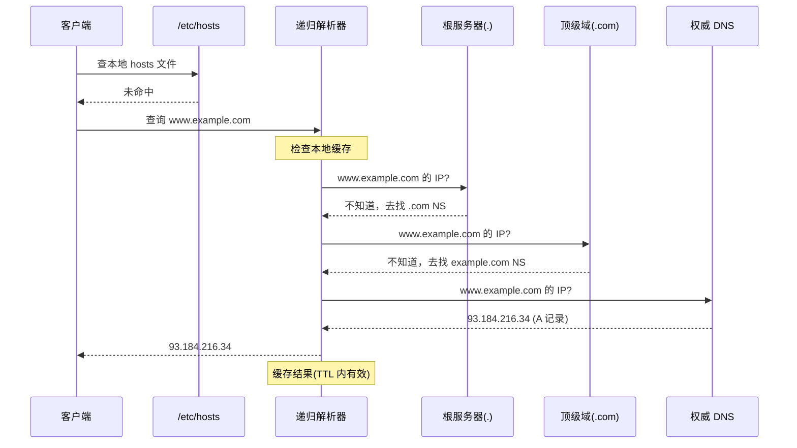

# DNS 服务器

**本文你会学到**：

- DNS 查询流程：本地缓存 → /etc/hosts → 递归解析器 → 迭代查询链
- 根服务器、顶级域服务器、权威 DNS 的角色
- DNS 记录类型（A、AAAA、CNAME、MX、NS、TXT 等）
- 递归查询与迭代查询的区别
- 在 Linux 上配置 DNS 客户端（/etc/resolv.conf）
- `nslookup` 和 `dig` 命令的使用与调试技巧
- DNS 缓存的 TTL（生存时间）机制
- 在 BIND/dnsmasq 上部署 DNS 服务器的基础
- DNS 的安全问题与 DNSSEC 的简介

## DNS 工作原理

### 域名解析流程

当你在浏览器输入 `www.example.com` 时，系统会按照以下优先级依次查找：

1. **本地缓存**：操作系统 DNS 缓存（TTL 未过期时直接命中）
2. **`/etc/hosts`**：静态映射文件，优先级高于 DNS
3. **递归查询**：向 `/etc/resolv.conf` 中配置的递归解析器发起查询
4. **迭代查询链**：递归解析器依次询问根服务器（`.`）→ 顶级域服务器（`.com`）→ 权威 DNS，最终拿到 A 记录



```mermaid
graph LR
    classDef step fill:transparent,stroke:#0288d1,color:#adbac7,stroke-width:1px
    classDef cache fill:transparent,stroke:#388e3c,color:#adbac7,stroke-width:1px
    classDef auth fill:transparent,stroke:#f57c00,color:#adbac7,stroke-width:2px

    A[本地缓存]:::cache --> B[/etc/hosts]:::step
    B --> C[递归解析器]:::step
    C --> D[根服务器 .]:::auth
    D --> E[TLD 服务器]:::auth
    E --> F[权威 DNS]:::auth
    F --> G[返回 IP]:::cache
```

!!! tip "TTL 决定缓存时长"

    每条 DNS 记录都有 TTL（Time to Live）字段，单位为秒。TTL 越大，缓存越持久，解析越快；TTL 越小，更改生效越快，但查询压力增大。修改 DNS 记录后，需等待旧 TTL 耗尽，全网才能完全生效。

### DNS 记录类型

| 类型 | 全称 | 用途 |
|------|------|------|
| `A` | Address | 域名 → IPv4 地址 |
| `AAAA` | IPv6 Address | 域名 → IPv6 地址 |
| `CNAME` | Canonical Name | 域名别名（指向另一个域名） |
| `MX` | Mail eXchanger | 邮件交换服务器（带优先级） |
| `NS` | Name Server | 该区域由哪台 DNS 服务器管理 |
| `PTR` | Pointer | IP → 域名（反向解析） |
| `TXT` | Text | 任意文本，常用于 SPF/DKIM/域名验证 |
| `SOA` | Start of Authority | 区域权威信息（序列号、刷新时间等） |

`CNAME` 不能与其他记录共存于同名节点，根域（`@`）不能设 `CNAME`，这是常见的配置陷阱。

## DNS 服务器分类

### 权威 DNS（Authoritative）

存储某个区域（Zone）完整数据库的服务器，能直接回答该区域内所有主机名的查询。例如 `example.com` 的 NS 记录指向的服务器就是其权威 DNS。

权威 DNS 又分为 **主服务器（Master/Primary）** 和 **从服务器（Slave/Secondary）**：

- `Master`：管理员手动编辑区域文件，是数据的权威来源
- `Slave`：从 Master 自动同步（Zone Transfer），提供冗余

### 递归解析器（Recursive Resolver）

接收客户端查询，代替客户端完成整个迭代查询链（根→TLD→权威），把最终结果缓存并返回。家用路由器的 DNS、`8.8.8.8`（Google）、`1.1.1.1`（Cloudflare）都是递归解析器。

### 转发器（Forwarder）

自身不进行完整递归查询，而是把所有请求转发给上游解析器处理。常用于公司内网：内网 DNS 负责解析内部域名，其余请求转发到互联网 DNS。

### 缓存 DNS（Caching-only）

不管理任何区域，只做递归查询和结果缓存。无需维护区域文件，适合用作本地 DNS 加速器（如 Unbound）。

## BIND9 安装与基本配置

BIND（Berkeley Internet Name Domain）是使用最广泛的 DNS 服务器软件，支持权威和递归两种模式。

### 安装

=== "Debian/Ubuntu"

    ``` bash title="安装 BIND9"
    apt update
    apt install -y bind9 bind9utils bind9-doc
    ```

    主配置文件位于 `/etc/bind/named.conf`，区域文件默认放在 `/var/lib/bind/`。

=== "Red Hat/RHEL"

    ``` bash title="安装 BIND9"
    dnf install -y bind bind-utils
    ```

    主配置文件位于 `/etc/named.conf`，区域文件默认放在 `/var/named/`。

### 主配置文件结构

BIND9 的主配置文件由若干配置块组成，注释使用 `//` 或 `/* */`，每个语句以 `;` 结尾。

=== "Debian/Ubuntu"

    ``` text title="/etc/bind/named.conf"
    // 引入默认选项和区域定义
    include "/etc/bind/named.conf.options";
    include "/etc/bind/named.conf.local";
    include "/etc/bind/named.conf.default-zones";
    ```

    实际选项写在 `named.conf.options`，自定义区域写在 `named.conf.local`。

=== "Red Hat/RHEL"

    ``` text title="/etc/named.conf（精简版）"
    options {
        listen-on port 53 { any; };
        listen-on-v6 port 53 { any; };
        directory       "/var/named";
        allow-query     { any; };
        recursion yes;
        dnssec-validation auto;
    };

    zone "." IN {
        type hint;
        file "named.ca";
    };

    include "/etc/named.rfc1912.zones";
    ```

### options 块关键参数

``` text title="named.conf options 常用配置"
options {
    // 监听所有接口的 53 端口
    listen-on port 53 { any; };
    listen-on-v6 port 53 { any; };

    // 区域文件所在目录
    directory "/var/named";          // RHEL
    // directory "/var/lib/bind";   // Debian

    // 允许哪些客户端查询
    allow-query { any; };

    // 开启递归（作为递归解析器时需要）
    recursion yes;

    // 转发设置（可选，配置上游 DNS）
    // forwarders { 8.8.8.8; 1.1.1.1; };
    // forward only;

    // 不允许区域传输（除非有 Slave 服务器）
    allow-transfer { none; };

    // DNSSEC 验证
    dnssec-validation auto;
};
```

### 正向解析区域文件

以下以 `example.com` 为例，配置一个完整的正向解析区域。

**第一步：在主配置文件中声明区域**

=== "Debian/Ubuntu"

    ``` text title="/etc/bind/named.conf.local"
    zone "example.com" IN {
        type master;
        file "/etc/bind/zones/example.com.zone";
        allow-transfer { none; };
    };
    ```

=== "Red Hat/RHEL"

    ``` text title="/etc/named.conf（追加）"
    zone "example.com" IN {
        type master;
        file "example.com.zone";
        allow-transfer { none; };
    };
    ```

**第二步：编写区域文件**

=== "Debian/Ubuntu"

    ``` bash title="创建区域文件目录"
    mkdir -p /etc/bind/zones
    ```

    ``` text title="/etc/bind/zones/example.com.zone"
    $TTL 86400      ; 默认 TTL：1 天
    $ORIGIN example.com.

    ; SOA 记录：序列号格式 YYYYMMDDNN
    @   IN  SOA ns1.example.com.  admin.example.com. (
                2024010101  ; Serial（每次修改必须递增）
                3600        ; Refresh：Slave 每 1 小时同步一次
                900         ; Retry：同步失败后 15 分钟重试
                604800      ; Expire：7 天后 Slave 停止响应
                86400       ; Minimum TTL：否定缓存 1 天
                )

    ; NS 记录：本区域的权威 DNS
    @       IN  NS  ns1.example.com.
    @       IN  NS  ns2.example.com.

    ; MX 记录：邮件服务器（数字越小优先级越高）
    @       IN  MX  10  mail.example.com.

    ; A 记录：主机名 → IPv4
    ns1     IN  A   203.0.113.1
    ns2     IN  A   203.0.113.2
    @       IN  A   203.0.113.10
    www     IN  A   203.0.113.10
    mail    IN  A   203.0.113.20
    ftp     IN  A   203.0.113.30

    ; AAAA 记录：主机名 → IPv6
    www     IN  AAAA    2001:db8::1

    ; CNAME 记录：别名
    blog    IN  CNAME   www.example.com.
    api     IN  CNAME   www.example.com.

    ; TXT 记录：SPF 防垃圾邮件
    @       IN  TXT "v=spf1 mx ~all"
    ```

=== "Red Hat/RHEL"

    ``` text title="/var/named/example.com.zone"
    $TTL 86400
    $ORIGIN example.com.

    @   IN  SOA ns1.example.com.  admin.example.com. (
                2024010101
                3600
                900
                604800
                86400
                )

    @       IN  NS  ns1.example.com.
    @       IN  NS  ns2.example.com.
    @       IN  MX  10  mail.example.com.

    ns1     IN  A   203.0.113.1
    ns2     IN  A   203.0.113.2
    @       IN  A   203.0.113.10
    www     IN  A   203.0.113.10
    mail    IN  A   203.0.113.20
    ftp     IN  A   203.0.113.30

    www     IN  AAAA    2001:db8::1

    blog    IN  CNAME   www.example.com.
    api     IN  CNAME   www.example.com.

    @       IN  TXT "v=spf1 mx ~all"
    ```

!!! warning "区域文件格式陷阱"

    - 所有记录必须从**行首**开始，前面不能有空格（有空格代表续行）
    - FQDN 末尾必须有 **`.`**（小数点），否则系统会自动追加区域名。例如 `ns1` 等价于 `ns1.example.com.`，但 `ns1.example.com` 会变成 `ns1.example.com.example.com.`
    - 每次修改区域文件后，必须**递增 Serial**，Slave 才会同步

### 反向解析区域文件

反向解析（PTR 记录）用于 IP → 域名查询。区域名需将 IP 网络段反转并加 `.in-addr.arpa.`，例如 `203.0.113.0/24` 对应区域名为 `113.0.203.in-addr.arpa`。

=== "Debian/Ubuntu"

    ``` text title="/etc/bind/named.conf.local（追加）"
    zone "113.0.203.in-addr.arpa" IN {
        type master;
        file "/etc/bind/zones/203.0.113.rev";
        allow-transfer { none; };
    };
    ```

    ``` text title="/etc/bind/zones/203.0.113.rev"
    $TTL 86400
    $ORIGIN 113.0.203.in-addr.arpa.

    @   IN  SOA ns1.example.com.  admin.example.com. (
                2024010101  3600  900  604800  86400 )

    @   IN  NS  ns1.example.com.

    ; PTR 记录：只写最后一段 IP
    1   IN  PTR ns1.example.com.
    2   IN  PTR ns2.example.com.
    10  IN  PTR www.example.com.
    20  IN  PTR mail.example.com.
    ```

=== "Red Hat/RHEL"

    在 `/etc/named.conf` 追加区域声明，区域文件写法与 Debian 相同，路径改为 `/var/named/203.0.113.rev`。

### 启动与验证

=== "Debian/Ubuntu"

    ``` bash title="启动 BIND9 并验证"
    # 检查配置文件语法
    named-checkconf /etc/bind/named.conf

    # 检查区域文件语法
    named-checkzone example.com /etc/bind/zones/example.com.zone
    named-checkzone 113.0.203.in-addr.arpa /etc/bind/zones/203.0.113.rev

    # 启动并设为开机自启
    systemctl enable --now named

    # 查看运行状态
    systemctl status named
    ```

=== "Red Hat/RHEL"

    ``` bash title="启动 BIND9 并验证"
    named-checkconf /etc/named.conf
    named-checkzone example.com /var/named/example.com.zone

    systemctl enable --now named
    systemctl status named
    ```

``` bash title="测试本地 DNS 解析"
# 测试正向解析
dig @127.0.0.1 www.example.com

# 测试反向解析
dig @127.0.0.1 -x 203.0.113.10

# 查看区域加载日志
journalctl -u named --since "5 minutes ago"
```

## Unbound：轻量递归解析器

Unbound 是一款轻量、安全的递归解析器，专为缓存 DNS 场景设计，无法管理权威区域。它比 BIND9 配置更简单，资源占用更少，适合作为本地 DNS 缓存或家庭/办公室 DNS。

### 安装与配置

=== "Debian/Ubuntu"

    ``` bash title="安装 Unbound"
    apt install -y unbound
    ```

=== "Red Hat/RHEL"

    ``` bash title="安装 Unbound"
    dnf install -y unbound
    ```

``` text title="/etc/unbound/unbound.conf（典型本地缓存配置）"
server:
    # 监听本地回环接口
    interface: 127.0.0.1
    interface: ::1
    port: 53

    # 仅允许本机查询
    access-control: 127.0.0.0/8 allow
    access-control: ::1 allow

    # 日志级别（0=安静，1=基本，2=详细）
    verbosity: 1

    # 启用 DNSSEC 验证
    auto-trust-anchor-file: "/var/lib/unbound/root.key"

    # 预取即将过期的缓存（减少用户感知延迟）
    prefetch: yes

    # 隐藏版本信息（安全）
    hide-version: yes
    hide-identity: yes

    # 本地区域（内网主机名解析）
    local-zone: "home.arpa." static
    local-data: "router.home.arpa. IN A 192.168.1.1"

# 上游转发（注释掉则直接进行迭代查询）
# forward-zone:
#     name: "."
#     forward-addr: 8.8.8.8
#     forward-addr: 1.1.1.1
```

``` bash title="启动 Unbound"
systemctl enable --now unbound

# 验证
unbound-checkconf
dig @127.0.0.1 www.google.com
```

### BIND9 vs Unbound：如何选择

| 场景 | 推荐 |
|------|------|
| 需要管理自有域名（权威 DNS） | BIND9 |
| 需要 Master/Slave 主从同步 | BIND9 |
| 仅需本地 DNS 缓存加速 | Unbound |
| 内网递归解析器 | Unbound |
| 资源受限的嵌入式/容器环境 | Unbound |
| 需要 DNSSEC 签名（而非仅验证） | BIND9 |

!!! tip "两者组合使用"

    企业常见方案：Unbound 作为前端递归缓存接收内网查询，内部域名转发给 BIND9 权威服务器，外部域名直接迭代解析或转发到公共 DNS。

## DNS 调试工具

### dig：最强诊断工具

`dig`（Domain Information Groper）是 DNS 调试的首选工具，输出详细且结构化。

``` bash title="dig 基础用法"
# 查询 A 记录（默认）
dig www.example.com

# 指定 DNS 服务器（@ 后接服务器 IP 或域名）
dig @8.8.8.8 www.example.com

# 查询特定记录类型
dig -t MX  example.com
dig -t NS  example.com
dig -t SOA example.com
dig -t TXT example.com
dig -t AAAA www.example.com

# 反向解析（IP → 域名）
dig -x 8.8.8.8
```

``` bash title="dig +trace：追踪完整解析链"
# 从根服务器开始，逐步追踪整个解析过程
dig +trace www.example.com

# 追踪时指定上游 DNS
dig +trace @1.1.1.1 www.example.com
```

`+trace` 模式会显示从 `.`（根）→ `.com`（TLD）→ 权威 DNS 的每一跳，非常适合排查委派错误或 NS 配置问题。

``` bash title="dig 输出精简控制"
# 只显示答案部分（+short）
dig +short www.example.com

# 禁用额外信息，只看关键字段
dig +noall +answer www.example.com

# 查看 TTL 倒计时（连续查询，观察缓存剩余时间）
dig +ttlid www.example.com
```

`dig` 输出分为四个 Section：

- `QUESTION SECTION`：提出的查询
- `ANSWER SECTION`：直接回答（命中缓存时带 `Non-authoritative answer` 标记）
- `AUTHORITY SECTION`：权威 DNS 服务器信息
- `ADDITIONAL SECTION`：辅助数据（如 NS 对应的 A 记录）

### nslookup：交互式查询

`nslookup` 支持交互模式，适合临时调试：

``` bash title="nslookup 交互模式"
nslookup
> set type=MX          # 切换查询类型
> example.com          # 查询 MX 记录
> set type=any         # 查询所有记录类型
> www.example.com
> server 8.8.8.8       # 切换到指定 DNS 服务器
> example.com
> exit
```

### systemd-resolve：systemd 环境诊断

在使用 `systemd-resolved` 的现代 Linux 系统上，用以下命令诊断：

``` bash title="systemd-resolve 常用命令"
# 查看所有接口的 DNS 配置和缓存统计
resolvectl status

# 查询域名（使用系统 DNS 配置）
resolvectl query www.example.com

# 清空 DNS 缓存
resolvectl flush-caches

# 查看缓存统计信息
resolvectl statistics

# 查看指定网络接口使用的 DNS
resolvectl dns eth0
```

!!! tip "53 端口冲突排查"

    如果本机安装 BIND9 或 Unbound 后发现 53 端口被 `systemd-resolved` 占用，可通过 `ss -ulnp sport 53` 确认占用进程，然后在 `/etc/systemd/resolved.conf` 中设置 `DNSStubListener=no` 并重启 `systemd-resolved`。

## DNS 安全

### DNSSEC：数字签名验证

DNSSEC（DNS Security Extensions）通过公钥密码学为 DNS 记录添加数字签名，防止缓存投毒攻击。

工作原理：

- 区域管理员用私钥对区域中每条记录生成签名（`RRSIG`）
- 公钥发布为 `DNSKEY` 记录，并由上级 DNS 的 `DS` 记录背书
- 递归解析器验证签名链：`DS`（上级）→ `DNSKEY`（本级）→ `RRSIG`（记录签名）
- 如果验证失败，解析器拒绝返回该结果（返回 `SERVFAIL`）

``` bash title="验证 DNSSEC 是否生效"
# 带 +dnssec 标志的查询，若返回 AD 标志表示已验证
dig +dnssec www.cloudflare.com

# 检查 DS 记录（上级委派签名）
dig -t DS example.com @b.gtld-servers.net.

# 查询 DNSKEY（区域公钥）
dig -t DNSKEY example.com
```

BIND9 开启 DNSSEC 验证只需在 `options` 中设置 `dnssec-validation auto;`（现代版本默认已开启）。

### DNS over TLS（DoT）和 DNS over HTTPS（DoH）

传统 DNS 查询明文传输，中间人可以窃听或篡改。DoT 和 DoH 通过加密通道解决这个问题：

| | DoT | DoH |
|-|-----|-----|
| 端口 | `853`（TCP） | `443`（HTTPS） |
| 协议 | TLS | HTTPS（HTTP/2） |
| 隐私 | ✅ 加密 | ✅ 加密 |
| 可观测性 | ISP/防火墙可识别 | 混入 HTTPS 流量，难以过滤 |
| 标准 | RFC 7858 | RFC 8484 |

`systemd-resolved` 支持 DoT，在 `/etc/systemd/resolved.conf` 中启用：

``` text title="/etc/systemd/resolved.conf"
[Resolve]
DNS=1.1.1.1#cloudflare-dns.com 9.9.9.9#dns.quad9.net
DNSOverTLS=yes
```

Unbound 启用 DoT 上游转发：

``` text title="unbound.conf（DoT 上游）"
forward-zone:
    name: "."
    forward-tls-upstream: yes
    forward-addr: 1.1.1.1@853#cloudflare-dns.com
    forward-addr: 9.9.9.9@853#dns.quad9.net
```

### 常见攻击与防御

**DNS 劫持（DNS Hijacking）**

攻击者通过以下方式修改 DNS 解析结果：

- 控制用户路由器，篡改 DNS 设置
- 污染运营商 DNS 服务器
- 在中间人位置拦截 UDP 53 流量

防御：使用 DoT/DoH 加密传输 + DNSSEC 签名验证，双重保障。

**缓存投毒（Cache Poisoning，DNS Spoofing）**

攻击者向递归解析器发送伪造响应，使解析器缓存虚假记录，再将其他用户引导至恶意 IP。经典案例是 2008 年的 Kaminsky 漏洞。

防御措施：

- DNSSEC（记录签名验证）
- 随机化源端口（`0.0.0.0` 随机 UDP 源端口）
- 现代 BIND9/Unbound 默认已启用随机化，保持软件更新即可

!!! warning "内网 DNS 安全基线"

    - 限制递归查询范围：`allow-recursion { 192.168.0.0/16; 127.0.0.0/8; };`（避免成为开放递归服务器，可能被用于 DNS 放大攻击）
    - 限制区域传输：`allow-transfer { slave_ip; };`，不向无关主机开放
    - 定期检查 `/var/log/named/` 或 `journalctl -u named`，观察异常查询量
