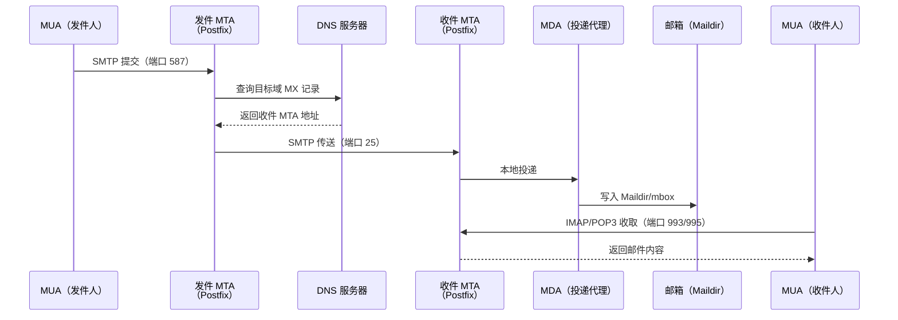

# 邮件服务器

**本文你会学到**：

- 邮件系统的完整传输链路（MUA → MTA → MDA → MUA）
- 核心协议：SMTP、IMAP、POP3、SMTPS
- DNS 记录配置（MX、SPF、DKIM、DMARC）
- Postfix MTA 的安装与关键配置
- Dovecot MRA 与邮箱格式（Maildir/mbox）
- TLS/SSL 加密与 Let's Encrypt 证书
- SASL 认证与用户管理
- 反垃圾策略与灰名单、黑名单
- 日志分析与常见故障排查
- 邮件系统的高可用与备用 MX 配置

## 邮件系统工作原理

### 传输链路：MUA→MTA→MDA→MUA

发一封邮件不是两端直连，而是经过多个代理：



### 核心组件与协议

| 组件 | 全称 | 职责 | 典型软件 |
|------|------|------|---------|
| `MUA` | Mail User Agent | 用户收发邮件的客户端 | Thunderbird、Outlook、mutt |
| `MTA` | Mail Transfer Agent | 负责 SMTP 收发与中继 | Postfix、Sendmail、Exim |
| `MDA` | Mail Delivery Agent | 将邮件投递到用户信箱 | Postfix 内置、Procmail |
| `MRA` | Mail Retrieval Agent | 提供 IMAP/POP3 收信服务 | Dovecot |

**核心协议速查**：

- `SMTP`（端口 25）：MTA 之间传输邮件；端口 587 用于 MUA 向 MTA 提交（需认证）
- `IMAP4`（端口 143 / 993 加密）：邮件保留在服务器，支持多端同步、文件夹管理
- `POP3`（端口 110 / 995 加密）：将邮件下载到本地后默认从服务器删除，不支持多端同步

!!! warning "Open Relay 危险"

    当任何人都可以通过你的 MTA 转发邮件时，就称为 `Open Relay`。后果极其严重：

    - 服务器带宽被垃圾邮件耗尽
    - IP 被各大 RBL 黑名单收录，正常邮件无法送达
    - 被 ISP 封锁端口 25
    - 主机资源耗尽导致宕机

    现代 MTA 默认关闭 Open Relay，只允许 `mynetworks` 内的受信任客户端中继发送。

## DNS 与邮件（前置配置）

邮件服务器正常工作的基础是 DNS 配置正确，否则发出的邮件大概率进入对方垃圾箱甚至被拒收。

### MX 记录

`MX`（Mail eXchanger）记录指向负责接收该域邮件的服务器，数值越小优先级越高：

``` text title="DNS Zone 示例"
example.com.        IN  MX  10  mail.example.com.
example.com.        IN  MX  20  mail2.example.com.
mail.example.org.   IN  A       203.0.113.1
```

收件方 MTA 发信时先查目标域 MX 记录，找到优先级最高的可用服务器发送；若 MX 主机全部不可用，才回退到 A 记录对应的 IP。

!!! tip "反解（PTR）同样重要"

    大型邮件提供商（Gmail、Outlook）会对发件 IP 做反向 DNS 验证。若 IP 反解为 `dynamic.xxx` 之类的动态地址，邮件极易被拒收。正式生产环境请向 ISP 申请 PTR 记录指向你的邮件主机名。

### SPF 记录

`SPF`（Sender Policy Framework）通过 DNS TXT 记录声明哪些 IP/服务器有权代表该域发送邮件，防止伪造发件人：

``` text title="SPF TXT 记录示例"
example.com.  IN  TXT  "v=spf1 mx a:mail.example.com ip4:203.0.113.0/24 -all"
```

常用机制说明：

- `mx`：允许 MX 记录指向的服务器发送
- `a`：允许 A 记录对应的 IP 发送
- `ip4:x.x.x.x/24`：显式允许该 IP 段
- `-all`：其余来源一律拒绝（`~all` 为软失败，仅标记不拒绝）

### DKIM 签名

`DKIM`（DomainKeys Identified Mail）在发出的邮件头部添加数字签名，收件方通过 DNS 查询公钥验证邮件未被篡改：

``` bash title="生成 DKIM 密钥对（以 OpenDKIM 为例）"
opendkim-genkey -t -s mail -d example.com
# 生成 mail.private（私钥）和 mail.txt（DNS 记录）
```

``` text title="DKIM DNS TXT 记录"
mail._domainkey.example.com.  IN  TXT  "v=DKIM1; k=rsa; p=MIGfMA0GCSqGSIb3..."
```

### DMARC 策略

`DMARC`（Domain-based Message Authentication, Reporting and Conformance）综合 SPF 和 DKIM 的验证结果，定义邮件处理策略并要求报告：

``` text title="DMARC TXT 记录"
_dmarc.example.com.  IN  TXT  "v=DMARC1; p=quarantine; rua=mailto:dmarc@example.com; pct=100"
```

- `p=none`：仅监控，不处理
- `p=quarantine`：验证失败进垃圾箱
- `p=reject`：验证失败直接拒收（最严格）

## Postfix 安装与基础配置

### 安装

=== "Debian/Ubuntu"

    ``` bash title="安装 Postfix"
    apt update && apt install -y postfix mailutils
    # 安装时选择"Internet Site"，输入域名
    ```

=== "Red Hat/RHEL"

    ``` bash title="安装 Postfix"
    dnf install -y postfix s-nail
    systemctl enable --now postfix
    ```

### `/etc/postfix/main.cf` 关键参数

`main.cf` 是 Postfix 的核心配置文件，所有参数均可用 `$变量名` 引用已定义的值：

``` text title="/etc/postfix/main.cf 关键配置段"
# 邮件主机的完全限定域名
myhostname = mail.example.com

# 邮件域名（默认取 myhostname 第一个点后的部分）
mydomain = example.com

# 发出邮件的 From 地址中使用的域名
myorigin = $mydomain

# 监听所有网络接口（默认只监听 127.0.0.1）
inet_interfaces = all
inet_protocols = ipv4

# 声明本机负责收信的主机名列表
mydestination = $myhostname, localhost.$mydomain, localhost, $mydomain

# 信任的客户端网段（无需认证即可中继发送）
mynetworks = 127.0.0.0/8, 192.168.1.0/24

# 允许为哪些下游域中继邮件（作为 MX 中继时使用）
relay_domains = $mydestination

# 邮件别名数据库
alias_maps = hash:/etc/aliases
alias_database = hash:/etc/aliases

# 单封邮件最大容量（字节，默认 10MB）
message_size_limit = 52428800
```

参数说明：

- `myhostname`：必须与 DNS A 记录和 PTR 记录一致
- `mydestination`：只有列在此处的主机名才会被视为"本地投递"目标，其余走中继；若 MX 记录指向本机，主机名必须写入此处
- `mynetworks`：此范围内的 IP 无需认证即可 relay，生产环境应尽量缩小范围
- `relay_domains`：仅在本机作为其他域的 MX 中继服务器时才需配置

### 配置检查与启动

``` bash title="检查配置并重启"
# 检查配置语法与文件权限
postfix check

# 重新加载配置（不中断现有连接）
postfix reload

# 或重启服务
systemctl restart postfix

# 验证端口监听
ss -tlnp | grep ':25'
```

### 发送测试邮件

``` bash title="命令行发送测试邮件"
# 使用 mail 命令
echo "Test body" | mail -s "Test Subject" user@example.com

# 使用 sendmail 兼容接口
echo -e "Subject: Test\n\nHello" | sendmail -v user@example.com

# 查看是否进入队列
mailq
```

## Postfix 邮件队列管理

邮件无法立即送达时会进入队列，系统默认重试 5 天后退信。

### 查看队列

``` bash title="查看邮件队列"
# 查看所有待发邮件
mailq
# 等同于
postqueue -p
```

输出字段说明：队列 ID、邮件大小、入队时间、发件人/收件人，以及无法送达的原因。

### 强制重发

``` bash title="强制立即重试队列中的所有邮件"
postqueue -f
# 或
postfix flush
```

### 删除队列邮件

``` bash title="删除特定或全部队列邮件"
# 删除指定队列 ID 的邮件
postsuper -d QUEUEID

# 删除所有待发邮件（谨慎！）
postsuper -d ALL

# 删除所有延迟邮件
postsuper -d ALL deferred
```

### 日志查看

=== "Debian/Ubuntu"

    ``` bash title="查看邮件日志"
    tail -f /var/log/mail.log
    grep "reject" /var/log/mail.log
    ```

=== "Red Hat/RHEL"

    ``` bash title="查看邮件日志"
    tail -f /var/log/maillog
    # 或通过 journald
    journalctl -u postfix -f
    ```

## Dovecot（IMAP/POP3 服务）

Postfix 负责发送和接收（SMTP），Dovecot 负责向用户提供收信服务（IMAP/POP3）。

### 安装

=== "Debian/Ubuntu"

    ``` bash title="安装 Dovecot"
    apt install -y dovecot-core dovecot-imapd dovecot-pop3d dovecot-lmtpd
    ```

=== "Red Hat/RHEL"

    ``` bash title="安装 Dovecot"
    dnf install -y dovecot
    ```

### 配置文件结构

Dovecot 的配置分散在 `/etc/dovecot/` 目录下：

``` text title="配置文件结构"
/etc/dovecot/
├── dovecot.conf          # 主配置（通过 !include conf.d/*.conf 引入子配置）
└── conf.d/
    ├── 10-auth.conf      # 认证设置
    ├── 10-mail.conf      # 邮件存储位置
    ├── 10-master.conf    # 服务和监听端口
    ├── 10-ssl.conf       # SSL/TLS 设置
    └── 20-imap.conf      # IMAP 协议设置
```

### 配置 IMAP/POP3 监听

``` text title="/etc/dovecot/dovecot.conf"
# 启用 IMAP 和 POP3 协议（lmtp 用于与 Postfix 整合）
protocols = imap pop3 lmtp
```

``` text title="/etc/dovecot/conf.d/10-mail.conf"
# 使用 Maildir 格式存储（推荐，每封邮件一个文件）
mail_location = maildir:~/Maildir

# 如果使用 mbox 格式（单文件，不推荐用于 IMAP）
# mail_location = mbox:~/mail:INBOX=/var/mail/%u
```

### Maildir vs mbox 格式

| 特性 | `Maildir` | `mbox` |
|------|-----------|--------|
| 存储方式 | 每封邮件一个文件 | 所有邮件一个文件 |
| 并发安全 | ✅ 安全 | ❌ 需要加锁 |
| IMAP 性能 | ✅ 更好 | ❌ 大信箱慢 |
| 磁盘占用 | 略多（inode） | 略少 |
| 推荐场景 | 所有现代场景 | 传统兼容 |

生产环境推荐 `Maildir`。

### Postfix + Dovecot 整合（LMTP）

使用 `LMTP`（Local Mail Transfer Protocol）让 Postfix 将本地邮件交给 Dovecot 投递，Dovecot 可以执行 Sieve 过滤规则等：

``` text title="/etc/postfix/main.cf（添加 LMTP 投递）"
# 使用 Dovecot LMTP 进行本地投递
mailbox_transport = lmtp:unix:private/dovecot-lmtp
```

``` text title="/etc/dovecot/conf.d/10-master.conf（启用 LMTP socket）"
service lmtp {
  unix_listener /var/spool/postfix/private/dovecot-lmtp {
    mode = 0600
    user = postfix
    group = postfix
  }
}
```

``` bash title="重启服务使配置生效"
systemctl restart dovecot postfix
# 验证端口
ss -tlnp | grep -E '143|993|110|995'
```

## TLS/SSL 加密配置

明文传输的 SMTP 和 IMAP 会暴露账号密码，生产环境必须启用 TLS。

### 申请 Let's Encrypt 证书

``` bash title="使用 Certbot 申请证书"
# 安装 certbot
apt install -y certbot  # Debian/Ubuntu
# 或
dnf install -y certbot  # RHEL

# 申请证书（需确保 80 端口可访问）
certbot certonly --standalone -d mail.example.com

# 证书位置
# /etc/letsencrypt/live/mail.example.com/fullchain.pem
# /etc/letsencrypt/live/mail.example.com/privkey.pem
```

### Postfix TLS 配置

``` text title="/etc/postfix/main.cf（TLS 配置段）"
# === 接收端 TLS（SMTPS / STARTTLS）===
smtpd_tls_cert_file = /etc/letsencrypt/live/mail.example.com/fullchain.pem
smtpd_tls_key_file  = /etc/letsencrypt/live/mail.example.com/privkey.pem
smtpd_tls_security_level = may       # 支持但不强制 TLS（改为 encrypt 可强制）
smtpd_tls_loglevel = 1

# === 发送端 TLS（向其他 MTA 发送时）===
smtp_tls_security_level = may
smtp_tls_loglevel = 1
```

在 `/etc/postfix/master.cf` 中启用 587 提交端口和 465 SMTPS 端口：

``` text title="/etc/postfix/master.cf（端口配置）"
# 587 Submission（STARTTLS 提交，推荐 MUA 使用）
submission inet n - n - - smtpd
  -o syslog_name=postfix/submission
  -o smtpd_tls_security_level=encrypt
  -o smtpd_sasl_auth_enable=yes
  -o smtpd_recipient_restrictions=permit_sasl_authenticated,reject

# 465 SMTPS（直接 TLS，传统加密提交）
smtps inet n - n - - smtpd
  -o syslog_name=postfix/smtps
  -o smtpd_tls_wrappermode=yes
  -o smtpd_sasl_auth_enable=yes
  -o smtpd_recipient_restrictions=permit_sasl_authenticated,reject
```

### Dovecot SSL 配置

``` text title="/etc/dovecot/conf.d/10-ssl.conf"
ssl = required
ssl_cert = </etc/letsencrypt/live/mail.example.com/fullchain.pem
ssl_key  = </etc/letsencrypt/live/mail.example.com/privkey.pem

# 禁止明文认证（强制走加密通道）
```

``` text title="/etc/dovecot/conf.d/10-auth.conf"
# 禁止在非加密连接上传输明文密码
disable_plaintext_auth = yes
```

## 反垃圾邮件

### Postfix 基础限制

通过 `smtpd_recipient_restrictions` 按序执行一组规则来过滤邮件：

``` text title="/etc/postfix/main.cf（收件人限制）"
smtpd_recipient_restrictions =
  permit_mynetworks,              # 信任内网无条件放行
  permit_sasl_authenticated,      # 已认证用户放行
  reject_unknown_sender_domain,   # 拒绝发件方域名无 DNS 记录
  reject_unknown_recipient_domain,# 拒绝收件方域名无 DNS 记录
  reject_unauth_destination,      # 拒绝非授权目标（防 Open Relay）
  reject_rbl_client zen.spamhaus.org,   # RBL 黑名单检查
  reject_rbl_client bl.spamcop.net,
  permit
```

!!! tip "规则顺序很重要"

    `smtpd_recipient_restrictions` 中的规则按顺序执行，第一个匹配的规则生效。`permit_mynetworks` 必须在黑名单检查之前，否则内网邮件也会被黑名单拦截。

### SpamAssassin 简介

`SpamAssassin` 是一个基于规则打分的反垃圾邮件工具，对每封邮件打分，超过阈值（默认 5 分）则标记为垃圾邮件：

``` bash title="安装 SpamAssassin"
apt install -y spamassassin spamc  # Debian/Ubuntu
# 或
dnf install -y spamassassin        # RHEL

systemctl enable --now spamassassin
```

通过 `content_filter` 或 `Amavis` 将 Postfix 邮件流接入 SpamAssassin 是更完整的方案，适合对反垃圾要求较高的场景。

### RBL 黑名单使用

实时黑名单（RBL / DNSBL）是在线维护的垃圾邮件来源 IP 数据库，Postfix 直接查询即可：

``` text title="常用 RBL 列表"
zen.spamhaus.org      # 综合型，覆盖最广，推荐首选
bl.spamcop.net        # 用户举报型
cbl.abuseat.org       # 僵尸网络来源
```

!!! warning "使用前先验证 RBL 是否可用"

    部分 RBL 已停止服务。使用前用 `dig A 2.0.0.127.zen.spamhaus.org` 验证是否返回结果，避免查询超时拖慢邮件处理。

## 邮件认证（SASL）

`SASL`（Simple Authentication and Security Layer）允许 MUA 在提交邮件时先完成身份认证，再执行 relay，从而支持非固定 IP 的用户发信。

### Postfix + Dovecot SASL 整合

推荐让 Postfix 直接使用 Dovecot 的 SASL 服务（复用 Dovecot 的认证机制，无需额外安装 Cyrus SASL）：

``` text title="/etc/dovecot/conf.d/10-master.conf（暴露 SASL 接口）"
service auth {
  # 供 Postfix 使用的 SASL 接口
  unix_listener /var/spool/postfix/private/auth {
    mode = 0660
    user = postfix
    group = postfix
  }
}
```

``` text title="/etc/postfix/main.cf（启用 SASL）"
# 启用 SASL 认证
smtpd_sasl_auth_enable = yes
smtpd_sasl_type = dovecot
smtpd_sasl_path = private/auth
smtpd_sasl_security_options = noanonymous

# 兼容早期 Outlook Express 等非标准客户端（可选）
broken_sasl_auth_clients = yes
```

验证 SASL 是否生效：

``` bash title="Telnet 验证 SASL 握手"
telnet localhost 25
# 输入：ehlo localhost
# 应看到：250-AUTH LOGIN PLAIN
```

## 防火墙端口

| 端口 | 协议 | 用途 |
|------|------|------|
| `25` | TCP | SMTP：MTA 之间传输邮件（需对外开放） |
| `587` | TCP | Submission：MUA 提交邮件（需 STARTTLS + SASL） |
| `465` | TCP | SMTPS：加密提交（传统，465 已被 IANA 重新分配给 SMTPS） |
| `143` | TCP | IMAP：明文（建议关闭，改用 993） |
| `993` | TCP | IMAPS：加密 IMAP |
| `110` | TCP | POP3：明文（建议关闭，改用 995） |
| `995` | TCP | POP3S：加密 POP3 |

``` bash title="firewalld 开放端口示例（RHEL）"
firewall-cmd --permanent --add-service=smtp
firewall-cmd --permanent --add-service=smtps
firewall-cmd --permanent --add-service=smtp-submission
firewall-cmd --permanent --add-service=imaps
firewall-cmd --permanent --add-service=pop3s
firewall-cmd --reload
```

``` bash title="ufw 开放端口示例（Debian/Ubuntu）"
ufw allow 25/tcp
ufw allow 587/tcp
ufw allow 465/tcp
ufw allow 993/tcp
ufw allow 995/tcp
```

!!! warning "端口 25 的特殊性"

    许多 ISP 和云服务商（AWS、阿里云等）默认封锁出方向的端口 25，即使开放了入站 25 也可能无法向外发信。若遇到此问题，需向服务商申请解封或使用 relayhost 通过授权的 SMTP 服务转发。

## 常见问题排查

### Relay access denied

``` text title="典型错误日志"
NOQUEUE: reject: RCPT from unknown[1.2.3.4]: 554 5.7.1 <user@example.com>:
Relay access denied
```

**原因**：发件方 IP 不在 `mynetworks` 中，且未通过 SASL 认证。

**排查步骤**：

- 确认 `mynetworks` 是否包含客户端 IP
- 检查 MUA 是否配置了 SMTP 认证（账号/密码）
- 确认使用的端口是 587（Submission）而非 25

### SPF/DKIM 验证失败导致进垃圾箱

``` bash title="检查 SPF 和 DKIM 记录"
# 查询 SPF 记录
dig TXT example.com | grep spf

# 查询 DKIM 记录
dig TXT mail._domainkey.example.com

# 查询 DMARC 记录
dig TXT _dmarc.example.com
```

- SPF 失败：检查发件 IP 是否在 TXT 记录声明的范围内
- DKIM 失败：检查私钥路径、DNS 公钥记录与签名选择器（selector）是否匹配
- 发送测试邮件到 `check-auth@verifier.port25.com` 获取详细验证报告

### `postmap` 的使用

Postfix 需要将文本格式的访问控制表、哈希表等转换为数据库格式后才能读取：

``` bash title="postmap 更新数据库"
# 编辑访问控制规则
vim /etc/postfix/access

# 转换为数据库格式（生成 access.db）
postmap hash:/etc/postfix/access

# 同理，aliases 文件使用 postalias 或 newaliases
newaliases
```

每次修改 `access`、`virtual` 等映射文件后，必须重新执行 `postmap` 使改动生效，**无需重启 Postfix**。

``` bash title="查看 Postfix 当前生效配置"
# 查看所有非默认配置项
postconf -n

# 查看特定参数
postconf myhostname
postconf mynetworks
```
