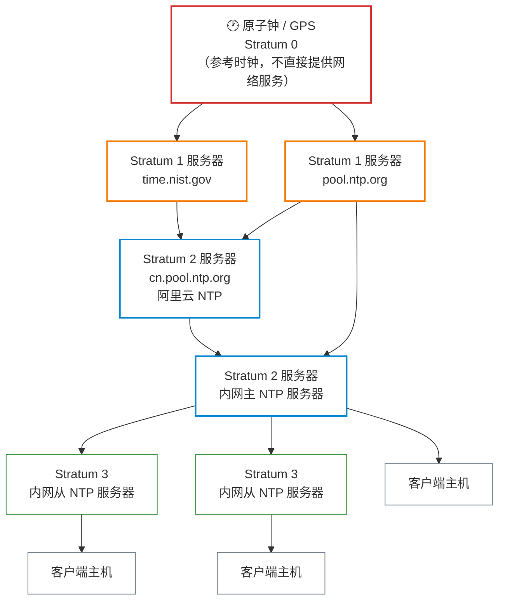
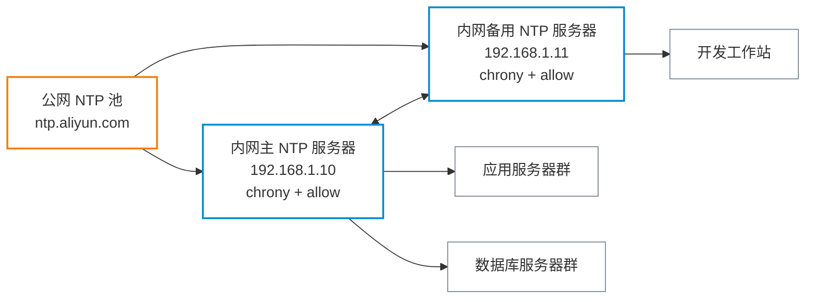

# 时间同步与 NTP

**本文你会学到**：

- 系统时间偏差的危害与应用场景
- NTP 的层级结构（Stratum）与工作原理
- 常见公网 NTP 服务器的选择（pool.ntp.org、国内源等）
- 用 `timedatectl` 或 `ntpd` 配置客户端
- 搭建内网主 NTP 服务器的配置步骤
- 时间精度监控与故障排查（`ntpq` 命令）
- Chrony——现代替代 ntpd 的优势与配置
- 与 Kerberos 等时钟敏感系统的集成

## 为什么时间同步至关重要

计算机内部的时钟由 BIOS（CMOS）芯片维护，芯片震荡频率的微小差异会导致时间每天偏差数秒，一年累计可达数十分钟。在分布式环境中，这种偏差会引发一系列严重问题：

- **日志时序混乱**：多台服务器的日志无法按时间顺序关联，定位问题极其困难
- **SSL/TLS 证书验证失败**：证书有效期校验依赖准确的系统时间，偏差过大导致握手拒绝
- **Kerberos 认证中断**：Kerberos 协议默认允许的时钟偏差不超过 5 分钟，超出则拒绝认证票据
- **分布式事务一致性**：分布式数据库（如 CockroachDB、Spanner）依赖时钟偏差控制在毫秒级来保证因果一致性
- **定时任务错乱**：集群调度系统（如 Kubernetes CronJob）需要节点时间一致，否则任务会重复触发或漏触发

NTP（Network Time Protocol）就是解决这个问题的协议——它让所有主机通过网络对齐时间，将偏差控制在毫秒级甚至更低。

## NTP 工作原理

### 层级结构（Stratum）

NTP 采用层级化架构来分散负载，每一层称为一个 Stratum（阶层）：



- **Stratum 0**：原子钟、GPS 时钟等高精度参考时钟，不直接服务网络请求
- **Stratum 1**：直接连接 Stratum 0 的主 NTP 服务器，精度极高
- **Stratum 2**：从 Stratum 1 同步，供大多数公共和企业使用
- **Stratum 3+**：从上层服务器同步，每经过一层精度略有下降，最多 15 层

!!! tip "内网架构建议"

    企业内网不应让所有客户端直连公网 NTP，而应设置 1-2 台内网 NTP 服务器同步公网时间，再向内网提供服务。这样既减少公网带宽消耗，又提升内部同步速度。

### NTP 时钟偏差测量算法

NTP 通过四次时间戳来消除网络延迟的影响：

1. 客户端记录发送时刻 `T1`，向服务器发送请求
2. 服务器记录收到时刻 `T2`，处理后记录发送时刻 `T3` 并响应
3. 客户端记录收到时刻 `T4`

由此计算：

- **往返延迟**：`delay = (T4 - T1) - (T3 - T2)`
- **时钟偏差**：`offset = ((T2 - T1) + (T3 - T4)) / 2`

当偏差较小（通常 < 128ms）时，NTP 采用**平滑调整（slew）**——以极慢的速度（每天最多 500ms）逐渐修正，避免时间突变影响正在运行的程序。当偏差过大时，则触发**步进调整（step）**——立即跳变到正确时间。

### 轮询间隔

NTP 的轮询间隔（poll interval）会动态调整，稳定后通常为 64~1024 秒。网络条件越稳定，间隔越长，减少网络流量的同时仍保持足够精度。

## chrony：现代推荐方案

`chrony` 是目前 Linux 主流发行版（RHEL 7+、Ubuntu 16.04+、Debian 9+）的默认 NTP 实现，相较传统 `ntpd` 有显著优势：

- 启动时能快速同步（即使时钟偏差较大）
- 在网络不稳定或机器休眠后重新联机时表现更好
- 系统资源消耗更低

### 安装

=== "Debian/Ubuntu"

    ``` bash title="安装 chrony"
    sudo apt install chrony
    sudo systemctl enable --now chrony
    ```

=== "Red Hat/RHEL"

    ``` bash title="安装 chrony"
    sudo dnf install chrony      # RHEL 8+ / CentOS Stream
    # 或
    sudo yum install chrony      # RHEL 7 / CentOS 7
    sudo systemctl enable --now chronyd
    ```

### 核心配置文件

``` text title="/etc/chrony.conf"
# 上游 NTP 服务器（推荐使用 pool 指令，自动选择多台）
pool ntp.aliyun.com iburst
pool cn.pool.ntp.org iburst

# iburst：启动时快速发送 8 个数据包，加快初始同步

# 启动时若偏差超过 1 秒则允许步进调整（前 3 次同步），后续改为平滑调整
makestep 1.0 3

# 将系统时间同步到硬件时钟（RTC）
rtcsync

# 记录时钟漂移率（每天调整量，单位 ppm）
driftfile /var/lib/chrony/drift

# 日志目录
logdir /var/log/chrony
```

常用配置指令说明：

| 指令 | 说明 |
|------|------|
| `pool` | 指定 NTP 服务器池，自动解析多条 A 记录 |
| `server` | 指定单台 NTP 服务器 |
| `iburst` | 初始连接时快速发送多个数据包，加速首次同步 |
| `makestep` | 允许步进调整的偏差阈值和次数 |
| `rtcsync` | 定期将系统时间写入硬件时钟 |
| `allow` | 允许指定网段的客户端向本机同步时间 |

### 查看同步状态

``` bash title="查看时间源列表"
chronyc sources -v
```

输出示例：

``` text title="chronyc sources 输出"
  .-- Source mode  '^' = server, '=' = peer, '#' = local clock.
 / .- Source state '*' = current best, '+' = combined, '-' = not combined.
| / .- Stratum ('?' = unknown)
| | / .- Poll interval (log2 seconds, e.g. 6 means 64 seconds)
| | | / .- Reach (octal, 377 = last 8 reachable)
| | | |  .-  Last sample ('+' = ahead, '-' = behind)
| | | | /
v v v v v
^* ntp.aliyun.com            2   6   377   +0.5ms[+0.8ms] +/-   15ms
^+ 203.107.6.88              2   6   377   -1.2ms[-0.9ms] +/-   18ms
```

- `*`：当前正在使用的时间源
- `+`：已合并计算，作为备用候选
- `-`：连接上但未使用

``` bash title="查看同步详情"
chronyc tracking
```

输出示例：

``` text title="chronyc tracking 输出"
Reference ID    : 0A5E4A01 (ntp.aliyun.com)
Stratum         : 3
Ref time (UTC)  : Mon Jan 01 12:00:00 2024
System time     : 0.000123456 seconds fast of NTP time
Last offset     : +0.000050000 seconds
RMS offset      : 0.000080000 seconds
Frequency       : 12.345 ppm fast
Residual freq   : +0.001 ppm
Skew            : 0.123 ppm
Root delay      : 0.015000000 seconds
Root dispersion : 0.001000000 seconds
```

- `System time`：当前系统时间与 NTP 时间的偏差
- `Frequency`：时钟漂移率（ppm = 百万分之一秒/秒）
- `Root delay`：到参考时钟的网络往返延迟

### 作为内网 NTP 服务器

在 `/etc/chrony.conf` 中添加 `allow` 指令，使本机成为内网 NTP 服务器：

``` text title="/etc/chrony.conf（服务器模式追加）"
# 允许 192.168.0.0/16 网段的客户端向本机同步时间
allow 192.168.0.0/16

# 若本机与公网断开，仍以本地时钟为源（精度较低，stratum 设为 10）
local stratum 10
```

同时需放行防火墙端口：

``` bash title="放行 NTP 端口（UDP 123）"
# firewalld（RHEL/CentOS）
sudo firewall-cmd --permanent --add-service=ntp
sudo firewall-cmd --reload

# ufw（Debian/Ubuntu）
sudo ufw allow 123/udp
```

## systemd-timesyncd：轻量级客户端

`systemd-timesyncd` 是 systemd 内置的 SNTP 客户端，无需额外安装，适合只需时间同步（不需要提供 NTP 服务）的场景。

### 配置

``` text title="/etc/systemd/timesyncd.conf"
[Time]
# 主 NTP 服务器（空格分隔多个）
NTP=ntp.aliyun.com ntp1.aliyun.com

# 备用服务器（主服务器不可用时使用）
FallbackNTP=cn.pool.ntp.org

# 可选：最大允许的时钟调整偏差（超出则拒绝同步）
# RootDistanceMaxSec=5
# PollIntervalMinSec=32
# PollIntervalMaxSec=2048
```

修改配置后重启服务：

``` bash title="重启 timesyncd"
sudo systemctl restart systemd-timesyncd
```

### timedatectl 常用命令

``` bash title="查看时间同步状态"
timedatectl status
```

``` text title="timedatectl status 输出示例"
               Local time: Mon 2024-01-01 20:00:00 CST
           Universal time: Mon 2024-01-01 12:00:00 UTC
                 RTC time: Mon 2024-01-01 12:00:00
                Time zone: Asia/Shanghai (CST, +0800)
System clock synchronized: yes
              NTP service: active
          RTC in local TZ: no
```

``` bash title="设置时区"
# 查看可用时区
timedatectl list-timezones | grep Asia

# 设置为上海时区（中国标准时间）
sudo timedatectl set-timezone Asia/Shanghai
```

``` bash title="手动启用/禁用 NTP 同步"
# 启用 NTP 同步
sudo timedatectl set-ntp true

# 禁用（手动设置时间前需先禁用）
sudo timedatectl set-ntp false

# 手动设置时间（仅在禁用 NTP 后有效）
sudo timedatectl set-time "2024-01-01 20:00:00"
```

### timesyncd vs chrony 选型指南

| 场景 | 推荐方案 |
|------|---------|
| 普通桌面 / 轻量级服务器，只需同步时间 | `systemd-timesyncd` |
| 需要向内网其他主机提供 NTP 服务 | `chrony` |
| 网络环境不稳定（VPN、经常休眠的笔记本） | `chrony` |
| 需要毫秒级以下精度（金融、电信） | `chrony` + 硬件时间戳网卡 |
| 已有 systemd 环境且不需额外功能 | `systemd-timesyncd`（默认已有） |

!!! warning "两者不能同时运行"

    `timesyncd` 和 `chrony`（或 `ntpd`）监听同一端口，同时启用会冲突。安装 chrony 后，`timesyncd` 通常会自动停用。可用 `systemctl status systemd-timesyncd` 确认状态。

## ntpd：传统方案（了解即可）

`ntpd` 是 NTP 的原始参考实现，现已被 `chrony` 取代，但在老旧系统上仍可能遇到。

### 基本配置

``` text title="/etc/ntp.conf（基本配置）"
# 权限控制：默认拒绝所有，再逐一放行
restrict default nomodify notrap nopeer noquery
restrict 127.0.0.1
restrict ::1

# 上层 NTP 服务器
server ntp.aliyun.com prefer
server cn.pool.ntp.org

# 允许内网客户端同步（如需提供服务）
restrict 192.168.1.0 mask 255.255.255.0 nomodify

# 记录时钟漂移
driftfile /var/lib/ntp/drift
```

### 查看状态

``` bash title="查看 NTP 对端状态"
ntpq -p
```

``` text title="ntpq -p 输出示例"
     remote           refid      st t when poll reach   delay   offset  jitter
==============================================================================
*ntp.aliyun.com  .INIT.           2 u   45   64  377    8.123   -0.953   0.942
+203.107.6.88    130.133.1.10     2 u   51   64  377   10.456    2.341   1.123
```

字段说明：

- `*`：当前使用的时间源；`+`：候选源
- `st`：Stratum 层级
- `delay`：网络往返延迟（ms）
- `offset`：时间偏差（ms）
- `jitter`：偏差的波动值（ms）

## 时区配置

### timedatectl 方式（推荐）

``` bash title="设置时区"
# 设置中国标准时间
sudo timedatectl set-timezone Asia/Shanghai

# 验证
date
# 输出示例：Mon Jan  1 20:00:00 CST 2024
```

### 手动配置 /etc/localtime

`/etc/localtime` 是系统当前使用的时区文件，通常是指向 `/usr/share/zoneinfo/` 下某个文件的软链接：

``` bash title="手动设置时区（软链接方式）"
# 查看当前链接目标
ls -la /etc/localtime

# 更改为上海时区
sudo ln -sf /usr/share/zoneinfo/Asia/Shanghai /etc/localtime
```

`/usr/share/zoneinfo/` 目录包含全球所有时区的二进制格式定义文件，例如：

- `Asia/Shanghai`：中国标准时间（UTC+8）
- `Asia/Tokyo`：日本标准时间（UTC+9）
- `America/New_York`：美国东部时间
- `UTC`：协调世界时

### TZ 环境变量

`TZ` 环境变量可以为单个进程或会话临时覆盖时区，不影响系统全局配置：

``` bash title="临时覆盖时区"
# 当前 shell 会话使用纽约时区
export TZ="America/New_York"
date

# 仅对单条命令生效
TZ="Europe/London" date
```

这在调试跨时区问题或运行需要特定时区的程序时非常有用。

## NTP 服务器选择

### pool.ntp.org 公共池

[pool.ntp.org](https://www.ntppool.org/) 是全球最大的 NTP 服务器集群，通过 DNS 轮询将请求分发到数千台志愿者服务器：

``` text title="pool.ntp.org 地区池"
# 全球池
pool.ntp.org

# 亚洲池
asia.pool.ntp.org

# 中国池（服务器数量有限，建议用国内商业 NTP）
cn.pool.ntp.org
```

### 国内推荐（低延迟）

| 服务商 | 地址 |
|--------|------|
| 阿里云 NTP | `ntp.aliyun.com`、`ntp1~7.aliyun.com` |
| 腾讯云 NTP | `ntp.tencent.com`、`ntp1~5.tencent.com` |
| 中国国家授时中心 | `ntp.ntsc.ac.cn` |

### 内网 NTP 服务器架构

典型的企业内网时间同步架构：



内网客户端的 chrony 配置只需将 `pool` 改为指向内网服务器：

``` text title="/etc/chrony.conf（内网客户端）"
server 192.168.1.10 iburst
server 192.168.1.11 iburst
makestep 1.0 3
rtcsync
driftfile /var/lib/chrony/drift
```

## 故障排查

### 时间偏差过大导致无法同步

NTP 协议规定：若客户端与服务器时间偏差超过 **1000 秒**（约 16 分钟），NTP 会拒绝同步以防止异常跳变。

``` bash title="手动强制同步（偏差过大时）"
# 先停止 chrony
sudo systemctl stop chronyd

# 强制单次同步（忽略偏差限制）
sudo chronyd -q 'pool ntp.aliyun.com iburst'

# 或使用 ntpdate（需提前安装）
sudo ntpdate ntp.aliyun.com

# 重启 chrony
sudo systemctl start chronyd
```

### 防火墙放行 UDP 123 端口

NTP 使用 **UDP 协议**的 **123 端口**，防火墙必须放行：

``` bash title="检查端口连通性"
# 测试能否到达 NTP 服务器
nc -zu ntp.aliyun.com 123 && echo "OK" || echo "BLOCKED"

# 或用 ntpdate 的调试模式测试
ntpdate -d ntp.aliyun.com 2>&1 | head -20
```

``` bash title="放行防火墙规则"
# firewalld
sudo firewall-cmd --permanent --add-service=ntp
sudo firewall-cmd --reload

# iptables（手动添加）
sudo iptables -A INPUT -p udp --dport 123 -j ACCEPT
sudo iptables -A OUTPUT -p udp --sport 123 -j ACCEPT
```

### 常见诊断命令速查

``` bash title="综合诊断"
# chrony 服务状态
systemctl status chronyd

# 查看时间源和偏差
chronyc sources -v
chronyc tracking

# 强制立即同步一次
sudo chronyc makestep

# 查看 timesyncd 同步日志
journalctl -u systemd-timesyncd --no-pager -n 50

# 查看系统时间与硬件时钟的差异
sudo hwclock --show
date
```

!!! tip "同步后记得写入硬件时钟"

    系统时间修正后，建议执行 `sudo hwclock -w` 将时间同步写入 BIOS 硬件时钟。chrony 的 `rtcsync` 指令会周期性自动完成此操作，手动调整时需显式执行。
