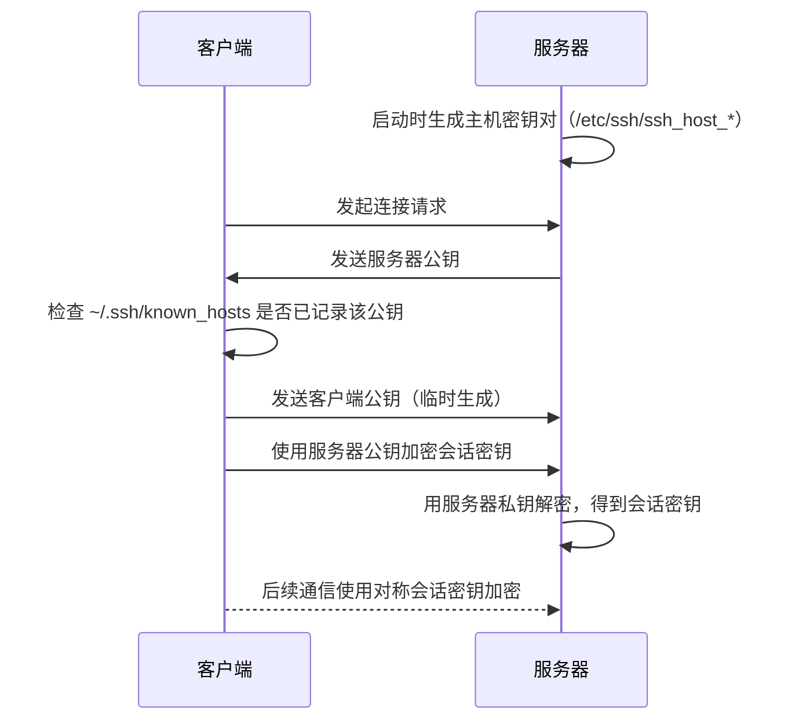

# SSH 远程连接

**本文你会学到**：

- SSH 的加密原理与非对称加密、会话密钥的作用
- 公钥与私钥的生成、存储、权限管理
- SSH 握手流程与 known_hosts 文件的作用
- 基本连接命令与常用选项（-p、-l、-i、-f）
- 密钥认证的优势与配置步骤
- `~/.ssh/config` 文件的各种用法与快捷符号
- SSH 隧道与端口转发（本地转发、远程转发、动态转发）
- `scp` 和 `sftp` 的文件传输操作
- 服务端配置加固（/etc/ssh/sshd_config）与常见安全选项
- SSH 密钥的多用途：Git 认证、免密登录、自动化脚本

## SSH 原理与加密机制

### 为什么需要 SSH？

早期 `telnet`、`rsh` 等远程工具以**明文**传输所有数据，包括账号密码。任何人在同一网络抓包就能看到完整内容。SSH 通过加密信道解决了这个问题：即使数据被截获，攻击者也无法解读。

### 非对称加密与密钥对

SSH 的核心是**非对称加密**（公私钥系统）：

- **公钥**（Public Key）：可以公开分发，用于加密数据
- **私钥**（Private Key）：严格保密，只有持有者用于解密

两把密钥成对生成，公钥加密的数据只有对应私钥才能解密。

### 握手与会话密钥协商

完整的 SSH 连接流程如下：



!!! tip "非对称加密 vs 会话密钥"

    非对称加密计算量大，不适合持续传输大量数据。因此 SSH 只用非对称加密来**协商**一个临时的对称会话密钥（如 AES），后续通信全部使用这个会话密钥加密，兼顾安全与性能。

### SSH 协议版本

SSH v1 存在安全漏洞，现代系统全部使用 **SSH v2**。现代 OpenSSH（8.x/9.x）已完全弃用 v1，无需特别配置。

## SSH 客户端基本用法

### 基本连接

``` bash title="SSH 基本连接命令"
# 以当前本地用户名连接远程主机
ssh 192.168.1.100

# 指定用户名（推荐写法）
ssh alice@192.168.1.100

# 使用 -l 参数指定用户名（等同于上面）
ssh -l alice 192.168.1.100

# 指定非标准端口（默认 22）
ssh -p 2222 alice@192.168.1.100

# 连接后立即执行命令（不进入交互式 shell）
ssh alice@192.168.1.100 "ls -la /var/log"

# 后台执行远程命令，立即返回本地
ssh -f alice@192.168.1.100 "nohup ./long_script.sh &"
```

### 首次连接与 known_hosts

第一次连接新主机时，SSH 会显示警告：

``` text
The authenticity of host '192.168.1.100 (192.168.1.100)' can't be established.
ED25519 key fingerprint is SHA256:abc123...xyz.
Are you sure you want to continue connecting (yes/no/[fingerprint])?
```

输入 `yes` 后，该主机的公钥指纹会被写入 `~/.ssh/known_hosts`，后续连接不再提示。

!!! warning "known_hosts 的安全作用"

    `~/.ssh/known_hosts` 记录已知主机的公钥指纹。如果某次连接时服务器公钥与记录不符，SSH 会拒绝连接并告警：

    ```
    @@@@@@@@@@@@@@@@@@@@@@@@@@@@@@@@@@@@@@@@@@@@@@@
    @ WARNING: REMOTE HOST IDENTIFICATION HAS CHANGED! @
    @@@@@@@@@@@@@@@@@@@@@@@@@@@@@@@@@@@@@@@@@@@@@@@
    ```

    这是防止**中间人攻击（MITM）**的机制。如果是主机重装导致公钥变更，可以手动删除对应行：

    ``` bash title="删除失效的主机记录"
    # 删除某个主机的记录（按主机名或 IP）
    ssh-keygen -R 192.168.1.100

    # 或手动编辑文件删除对应行
    vim ~/.ssh/known_hosts
    ```

### 常用连接选项

``` bash title="常用连接选项"
# 禁用严格主机检查（适用于测试脚本，不推荐生产环境）
ssh -o StrictHostKeyChecking=no alice@192.168.1.100

# 设置连接超时（秒）
ssh -o ConnectTimeout=10 alice@192.168.1.100

# 指定私钥文件
ssh -i ~/.ssh/my_key alice@192.168.1.100
```

## 密钥认证

密码登录每次都要手动输入，且容易遭受暴力破解。**密钥认证**让你用一对密钥代替密码——私钥留在本地，公钥放到服务器，登录时自动完成验证，既方便又安全。

### 生成密钥对

``` bash title="生成 SSH 密钥对"
# 推荐：生成 Ed25519 密钥（更现代、更安全、密钥更短）
ssh-keygen -t ed25519 -C "alice@mycomputer"

# 也可生成 RSA 密钥（兼容性更好，建议 4096 位）
ssh-keygen -t rsa -b 4096 -C "alice@mycomputer"
```

执行后按提示操作：

- **密钥保存路径**：直接回车使用默认路径（`~/.ssh/id_ed25519`）
- **密钥密码（passphrase）**：可留空（免密使用），也可设置密码增加安全性

生成后会得到两个文件：

| 文件 | 说明 |
|------|------|
| `~/.ssh/id_ed25519` | **私钥**，绝不可外泄，权限必须为 `600` |
| `~/.ssh/id_ed25519.pub` | **公钥**，可安全分发到任意服务器 |

!!! tip "Ed25519 vs RSA"

    Ed25519 基于椭圆曲线密码学，256 位密钥的安全性等同于 RSA 3072 位，运算更快。OpenSSH 6.5（2014 年）起支持，现代系统全部支持，**新建密钥优先选 Ed25519**。

### 复制公钥到服务器

``` bash title="复制公钥到远程服务器"
# 最简单的方式（推荐）
ssh-copy-id alice@192.168.1.100

# 指定密钥文件
ssh-copy-id -i ~/.ssh/id_ed25519.pub alice@192.168.1.100

# 指定非标准端口
ssh-copy-id -p 2222 alice@192.168.1.100
```

`ssh-copy-id` 会自动将公钥追加到远程服务器的 `~/.ssh/authorized_keys`，并设置正确权限。

### 手动配置 authorized_keys

如果没有 `ssh-copy-id`，可以手动操作：

``` bash title="手动添加公钥到服务器"
# 在服务器上执行
mkdir -p ~/.ssh
chmod 700 ~/.ssh

# 将客户端公钥内容追加进去
echo "ssh-ed25519 AAAA... alice@mycomputer" >> ~/.ssh/authorized_keys
chmod 600 ~/.ssh/authorized_keys
```

`authorized_keys` 每行一个公钥，格式为：

``` text
ssh-ed25519 AAAA...（base64 公钥内容） 注释
```

### 使用 ssh-agent 管理密钥

如果私钥设置了 passphrase，每次使用都要输入密码。`ssh-agent` 可以在内存中缓存解密后的私钥，只需输入一次密码：

``` bash title="使用 ssh-agent"
# 启动 ssh-agent（大多数桌面环境自动启动）
eval "$(ssh-agent -s)"

# 添加私钥到 agent（会提示输入 passphrase）
ssh-add ~/.ssh/id_ed25519

# 查看已加载的密钥
ssh-add -l

# 删除所有缓存的密钥
ssh-add -D
```

!!! tip "macOS 钥匙串集成"

    macOS 上可以将 passphrase 存入系统钥匙串，实现永久免密：

    ``` bash title="macOS 密钥链存储"
    ssh-add --apple-use-keychain ~/.ssh/id_ed25519
    ```

## SSH 配置文件

### 客户端配置：~/.ssh/config

每次连接都输入完整参数很繁琐，`~/.ssh/config` 可以为不同主机定义别名和默认参数：

``` text title="~/.ssh/config 示例"
# 默认设置（应用于所有主机）
Host *
    ServerAliveInterval 60
    ServerAliveCountMax 3
    AddKeysToAgent yes

# 工作服务器
Host work-server
    HostName 192.168.1.100
    User alice
    Port 2222
    IdentityFile ~/.ssh/id_ed25519

# 个人 VPS
Host myvps
    HostName vps.example.com
    User ubuntu
    IdentityFile ~/.ssh/id_ed25519

# 通过跳板机连接的内网主机
Host internal
    HostName 10.0.0.50
    User bob
    ProxyJump jumphost

# 跳板机配置
Host jumphost
    HostName jump.example.com
    User alice
    IdentityFile ~/.ssh/id_ed25519
```

配置好后，只需执行 `ssh work-server` 就等同于 `ssh -p 2222 -i ~/.ssh/id_ed25519 alice@192.168.1.100`。

常用配置项说明：

| 配置项 | 说明 |
|--------|------|
| `HostName` | 实际主机名或 IP |
| `User` | 登录用户名 |
| `Port` | 端口号 |
| `IdentityFile` | 指定私钥文件路径 |
| `ProxyJump` | 跳板机（见后文） |
| `ServerAliveInterval` | 每隔 N 秒发送心跳，防止连接断开 |
| `ForwardAgent` | 是否转发 ssh-agent（跳板机场景用） |

### 服务端配置：/etc/ssh/sshd_config

服务端的主配置文件，修改后需要重启服务生效：

``` bash title="重新加载 sshd 配置"
# 重新加载（不断开已有连接，推荐）
sudo systemctl reload sshd

# 或重启（会断开现有连接）
sudo systemctl restart sshd
```

重要配置项：

``` text title="/etc/ssh/sshd_config 安全加固示例"
# 修改默认端口（减少自动扫描攻击）
Port 2222

# 仅监听特定接口
ListenAddress 0.0.0.0

# 禁止 root 直接登录（强烈建议）
PermitRootLogin no

# 禁用密码认证（只允许密钥登录）
PasswordAuthentication no
PubkeyAuthentication yes

# 禁止空密码
PermitEmptyPasswords no

# 只允许特定用户登录
AllowUsers alice bob

# 只允许特定用户组
AllowGroups sshusers

# 限制最大认证尝试次数
MaxAuthTries 3

# 限制同时等待认证的连接数
MaxStartups 10:30:60

# 登录超时时间
LoginGraceTime 30

# 禁用 SSH v1（现代系统默认已禁用）
Protocol 2
```

!!! warning "禁用密码认证前先测试密钥登录"

    将 `PasswordAuthentication` 改为 `no` 之前，**务必先在另一个终端验证密钥登录正常**，否则可能将自己锁在服务器外面。

## SSH 隧道与端口转发

SSH 隧道可以将其他协议的流量加密转发，是穿透防火墙、保护不安全协议的有力工具。

### 本地转发（-L）：访问远程内网服务

**场景**：你能 SSH 到服务器 A，但服务器 A 内网中的数据库 B（10.0.0.10:3306）不对外暴露。通过本地转发，可以在本地访问数据库 B。

``` bash title="本地端口转发"
# 格式：ssh -L 本地端口:目标主机:目标端口 跳板服务器
ssh -L 3307:10.0.0.10:3306 alice@server-a.example.com

# 之后在本地连接 localhost:3307 即可访问远程数据库
mysql -h 127.0.0.1 -P 3307 -u root -p

# 后台运行（-N 不打开 shell，-f 后台执行）
ssh -NfL 3307:10.0.0.10:3306 alice@server-a.example.com
```

工作原理：


### 远程转发（-R）：内网穿透

**场景**：你的本地机器在 NAT 后面（家庭宽带），公网无法直接访问。通过远程转发，让具有公网 IP 的服务器代理到本地服务。

``` bash title="远程端口转发（内网穿透）"
# 格式：ssh -R 远程端口:本地目标:本地端口 远程服务器
# 将远程服务器的 8080 端口转发到本地的 3000 端口
ssh -NfR 8080:localhost:3000 alice@vps.example.com

# 之后通过 vps.example.com:8080 即可访问你本地的 3000 端口服务
```

!!! tip "开启远程转发需要服务端允许"

    远程转发默认只监听 `127.0.0.1`，要让外网访问需要在 `sshd_config` 设置：

    ``` text
    GatewayPorts yes
    ```

### 动态转发（-D）：SOCKS5 代理

**场景**：让所有流量通过 SSH 服务器转发，相当于把服务器当 VPN/代理用。

``` bash title="动态端口转发（SOCKS5 代理）"
# 在本地 1080 端口创建 SOCKS5 代理
ssh -NfD 1080 alice@vps.example.com

# 配置浏览器或系统代理：SOCKS5 127.0.0.1:1080
```

## ProxyJump（跳板机）

### 什么是跳板机？

生产环境通常不允许直接 SSH 到内网服务器，而是先登录一台暴露在公网的**跳板机（Bastion Host）**，再从跳板机跳入内网。

### 命令行 -J 参数

``` bash title="使用 ProxyJump 连接内网主机"
# 通过 jumphost 跳转到 internal-server
ssh -J alice@jumphost.example.com bob@10.0.0.50

# 多级跳板（先跳 jump1，再跳 jump2，最终到目标）
ssh -J alice@jump1.example.com,alice@jump2.example.com bob@10.0.0.50
```

### 在 ~/.ssh/config 中配置 ProxyJump

``` text title="~/.ssh/config 跳板机配置"
Host jumphost
    HostName jump.example.com
    User alice
    IdentityFile ~/.ssh/id_ed25519

Host internal-*
    User bob
    IdentityFile ~/.ssh/id_ed25519
    ProxyJump jumphost

Host internal-db
    HostName 10.0.0.10

Host internal-web
    HostName 10.0.0.20
```

配置后直接执行 `ssh internal-db`，SSH 会自动通过跳板机完成连接，体验与直连无异。

!!! tip "ProxyJump vs ProxyCommand"

    `ProxyJump`（OpenSSH 7.3+ 引入）是 `ProxyCommand` 的现代替代方案，配置更简洁，推荐使用。旧写法 `ProxyCommand ssh -W %h:%p jumphost` 仍然有效但已不推荐。

## SCP 与 SFTP 文件传输

### scp：安全复制

`scp` 基于 SSH 协议的文件复制工具，语法类似 `cp`，支持本地↔远程、远程↔远程。

``` bash title="scp 用法示例"
# 上传：本地文件 → 远程
scp /path/to/local/file.txt alice@192.168.1.100:/remote/path/

# 上传目录（-r 递归）
scp -r /local/directory/ alice@192.168.1.100:/remote/path/

# 下载：远程文件 → 本地
scp alice@192.168.1.100:/remote/path/file.txt /local/path/

# 下载目录
scp -r alice@192.168.1.100:/remote/dir/ /local/path/

# 远程到远程
scp alice@host1:/path/file.txt bob@host2:/path/

# 指定端口
scp -P 2222 alice@192.168.1.100:/remote/file.txt .

# 限速（单位 Kbits/s，800 约等于 100KB/s）
scp -l 800 largefile.tar.gz alice@192.168.1.100:~
```

!!! tip "冒号位置决定方向"

    `scp` 命令中，**冒号 `:` 在哪边，那边就是远程主机**。冒号在右边是上传，冒号在左边是下载。

### sftp：交互式文件传输

`sftp` 提供类似 FTP 的交互式界面，适合浏览目录、批量操作：

``` bash title="sftp 交互模式"
# 连接到远程服务器
sftp alice@192.168.1.100

# 进入交互模式后的常用命令
sftp> ls                    # 列出远程目录
sftp> lls                   # 列出本地目录
sftp> pwd                   # 显示远程当前路径
sftp> lpwd                  # 显示本地当前路径
sftp> cd /remote/path       # 切换远程目录
sftp> lcd /local/path       # 切换本地目录
sftp> get remote_file.txt   # 下载文件到本地当前目录
sftp> get *.log /tmp/       # 下载多个文件
sftp> put local_file.txt    # 上传本地文件到远程当前目录
sftp> put /local/dir/ ./    # 上传目录（需加 -r 参数）
sftp> mkdir new_dir         # 在远程创建目录
sftp> rm old_file.txt       # 删除远程文件
sftp> exit                  # 退出
```

### rsync over SSH（推荐）

`rsync` 通过 SSH 传输文件，支持**增量同步**——只传输有差异的部分，适合大量文件或定期备份。

``` bash title="rsync 通过 SSH 传输"
# 基本用法（将远程目录同步到本地）
rsync -avz alice@192.168.1.100:/remote/data/ /local/backup/

# 选项说明：
#   -a 归档模式（保留权限、时间戳、软链接等）
#   -v 显示详细信息
#   -z 传输时压缩
#   -e ssh 指定使用 SSH 协议（现代版本默认就是）

# 从本地同步到远程
rsync -avz /local/data/ alice@192.168.1.100:/remote/backup/

# 指定 SSH 端口
rsync -avz -e "ssh -p 2222" /local/data/ alice@192.168.1.100:/remote/

# 删除目标中源不存在的文件（真正镜像）
rsync -avz --delete /local/data/ alice@192.168.1.100:/remote/backup/

# 排除某些文件
rsync -avz --exclude="*.log" --exclude=".git/" /local/data/ alice@192.168.1.100:/remote/

# 结合 crontab 定时备份（需先配置密钥认证）
# 每天凌晨 2 点备份
# 0 2 * * * rsync -az /data/ alice@192.168.1.100:/backup/
```

!!! tip "rsync 的增量优势"

    第一次运行 `rsync` 会完整传输所有文件；此后再运行时，只有**新增或修改**的文件才会传输，节省大量时间和带宽，非常适合定期异地备份。

## SSH 服务端配置

### 安装与启动 sshd

=== "Debian/Ubuntu"

    ``` bash title="Debian/Ubuntu 安装并启动 SSH 服务"
    # 安装 OpenSSH 服务器
    sudo apt update && sudo apt install openssh-server

    # 启动并设置开机自启
    sudo systemctl enable --now ssh

    # 查看状态
    sudo systemctl status ssh

    # 重新加载配置（不断开连接）
    sudo systemctl reload ssh
    ```

=== "Red Hat/RHEL"

    ``` bash title="RHEL/CentOS/Fedora 安装并启动 SSH 服务"
    # 安装 OpenSSH 服务器
    sudo dnf install openssh-server

    # 启动并设置开机自启
    sudo systemctl enable --now sshd

    # 查看状态
    sudo systemctl status sshd

    # 重新加载配置
    sudo systemctl reload sshd
    ```

### 防火墙放行 SSH 端口

=== "Debian/Ubuntu"

    ``` bash title="UFW 防火墙开放 SSH"
    # 如果使用默认 22 端口
    sudo ufw allow ssh

    # 或指定端口号
    sudo ufw allow 2222/tcp

    # 查看规则
    sudo ufw status
    ```

=== "Red Hat/RHEL"

    ``` bash title="firewalld 防火墙开放 SSH"
    # 如果使用默认 22 端口
    sudo firewall-cmd --permanent --add-service=ssh

    # 如果修改了端口（如 2222）
    sudo firewall-cmd --permanent --add-port=2222/tcp

    # 如果改了端口，移除旧的 ssh 服务规则
    sudo firewall-cmd --permanent --remove-service=ssh

    # 重新加载防火墙
    sudo firewall-cmd --reload
    ```

### 安全加固 Checklist

完成以下配置可以大幅提高 SSH 服务安全性：

- [ ] **禁止 root 直接登录**：`PermitRootLogin no`
- [ ] **禁用密码认证**（仅用密钥）：`PasswordAuthentication no`
- [ ] **修改默认端口**（可选，减少扫描）：`Port 2222`
- [ ] **限制允许登录的用户**：`AllowUsers alice bob`
- [ ] **限制最大认证次数**：`MaxAuthTries 3`
- [ ] **设置登录超时**：`LoginGraceTime 30`
- [ ] **防火墙限制来源 IP**（尽量只允许固定 IP 访问 22/2222 端口）
- [ ] **启用 Fail2ban 等工具**自动封禁暴力破解 IP
- [ ] **定期检查登录日志**：`/var/log/auth.log`（Debian）或 `journalctl -u sshd`

## 常见问题排查

### 权限问题

密钥认证失败的最常见原因是**权限设置错误**。SSH 对权限要求非常严格：

``` bash title="检查并修复 SSH 目录和文件权限"
# 客户端
chmod 700 ~/.ssh                      # .ssh 目录必须 700
chmod 600 ~/.ssh/id_ed25519           # 私钥必须 600
chmod 644 ~/.ssh/id_ed25519.pub       # 公钥可以 644
chmod 644 ~/.ssh/known_hosts          # known_hosts 可以 644
chmod 600 ~/.ssh/config               # config 文件推荐 600

# 服务端
chmod 700 ~/.ssh                      # .ssh 目录必须 700
chmod 600 ~/.ssh/authorized_keys      # authorized_keys 必须 600
# 同时检查家目录本身不能被组或其他人写
chmod 755 ~
```

!!! warning "StrictModes 检查"

    `sshd_config` 中 `StrictModes yes`（默认开启）会检查 `~/.ssh/` 目录及 `authorized_keys` 的权限，权限过宽会直接拒绝密钥登录，并不会给出明显提示。

### 调试模式 -vvv

遇到连接问题时，`-v` 参数可以输出详细日志，加的 `v` 越多越详细（最多三个）：

``` bash title="调试连接问题"
# 基础调试
ssh -v alice@192.168.1.100

# 详细调试（推荐）
ssh -vvv alice@192.168.1.100

# 常见调试输出含义：
# debug1: Connecting to 192.168.1.100 [192.168.1.100] port 22.  -> 正在连接
# debug1: Server host key: ...                                   -> 服务器公钥
# debug1: Trying private key: /home/alice/.ssh/id_ed25519        -> 尝试密钥
# debug1: Authentications that can continue: publickey,password  -> 支持的认证方式
# Permission denied (publickey).                                  -> 认证失败
```

### ssh-keyscan 获取主机公钥

`ssh-keyscan` 可以在不连接的情况下获取服务器的公钥，用于提前写入 `known_hosts`：

``` bash title="ssh-keyscan 用法"
# 获取主机公钥并写入 known_hosts
ssh-keyscan 192.168.1.100 >> ~/.ssh/known_hosts

# 获取指定算法的公钥
ssh-keyscan -t ed25519 192.168.1.100

# 指定端口
ssh-keyscan -p 2222 192.168.1.100

# 批量添加多台主机
ssh-keyscan host1 host2 host3 >> ~/.ssh/known_hosts
```

!!! tip "批量部署场景"

    在编写自动化脚本时，可以使用 `ssh-keyscan` 预先填充 `known_hosts`，从而避免每次连接都出现交互式确认提示。比 `StrictHostKeyChecking=no` 更安全，因为你仍然验证了主机指纹。

### 其他常见问题速查

| 现象 | 可能原因 | 解决方法 |
|------|----------|----------|
| `Connection refused` | sshd 未运行或端口不对 | `systemctl status sshd`，检查端口 |
| `Permission denied (publickey)` | 权限问题或公钥未正确添加 | 检查 `authorized_keys` 和目录权限 |
| `Too many authentication failures` | 密钥太多，超过 `MaxAuthTries` | 用 `-i` 明确指定密钥 |
| `Host key verification failed` | 服务器公钥变更 | `ssh-keygen -R <host>` 删除旧记录 |
| 连接后长时间无响应 | 网络超时或防火墙丢包 | 在 `~/.ssh/config` 设置 `ServerAliveInterval 60` |
| `Warning: Remote port forwarding failed for listen port` | 端口已被占用或权限不足 | 换端口或检查 `GatewayPorts` 设置 |
