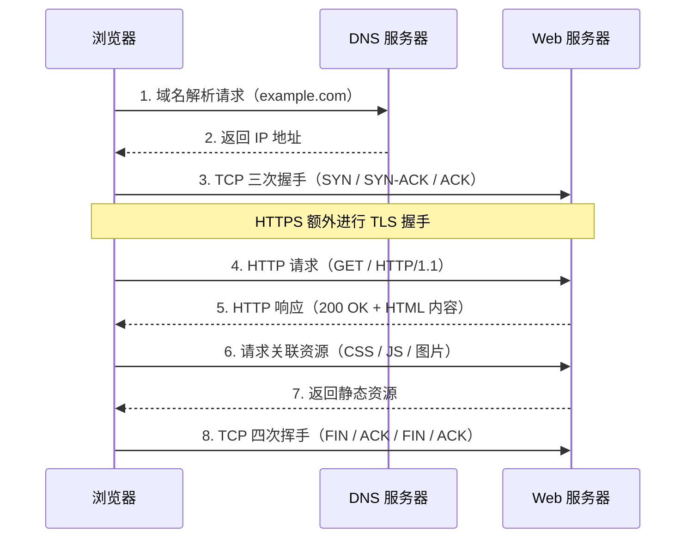
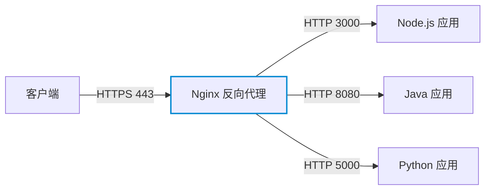

# Web 服务器

**本文你会学到**：

- HTTP/HTTPS 请求响应的完整流程
- Nginx 的安装、配置、静态服务、虚拟主机
- Nginx 反向代理与负载均衡的基本配置
- HTTPS 与 TLS 证书的配置（Let's Encrypt）
- Nginx 与 PHP-FPM 的集成
- Apache 的模块加载与 VirtualHost 配置
- 常见 Web 服务器的对比与选型
- Web 服务器的安全加固与性能调优
- 日志分析与流量统计
- 故障排查与性能监控

## Web 服务器工作原理

### HTTP/HTTPS 请求响应流程

当你在浏览器输入一个网址，底层实际发生了什么？从 DNS 解析到 TCP 握手、HTTP 报文传输，整个过程如下：



- `HTTP` 默认使用 `80` 端口，`HTTPS` 使用 `443` 端口
- 现代浏览器默认对所有请求尝试 `HTTPS`，服务器需要持有 SSL/TLS 证书
- 常见 HTTP 方法：`GET`（取数据）、`POST`（提交数据）、`HEAD`（只取响应头）、`DELETE`（删除资源）

### 常见 Web 服务器对比

| 特性 | Nginx | Apache | Caddy |
|------|-------|--------|-------|
| 架构模型 | 事件驱动、异步非阻塞 | 进程/线程模型（prefork/worker/event） | 事件驱动 |
| 静态文件性能 | ⭐⭐⭐⭐⭐ 极高 | ⭐⭐⭐ 中等 | ⭐⭐⭐⭐ 较高 |
| 动态内容 | 需配合 FastCGI/uwsgi | 内置 `mod_php`（.htaccess 支持好） | 需配合后端 |
| 配置风格 | 块状语法（nginx.conf） | 指令风格（httpd.conf + .htaccess） | Caddyfile（极简） |
| HTTPS | 需手动配置或 Certbot | 需手动配置或 Certbot | **自动申请 & 续签** |
| 内存占用 | 低 | 较高 | 低 |
| 适用场景 | 高并发、反向代理、静态服务 | 传统 LAMP、.htaccess 动态配置 | 个人项目、快速部署 |
| 市占率 | 全球第一 | 历史第一，仍广泛使用 | 新兴，增长迅速 |

## Nginx 安装与基础配置

### 安装 Nginx

=== "Debian/Ubuntu"

    ``` bash title="安装 Nginx（Debian/Ubuntu）"
    # 安装 Nginx
    sudo apt update
    sudo apt install -y nginx

    # 启动并设置开机自启
    sudo systemctl enable --now nginx

    # 验证状态
    sudo systemctl status nginx
    ```

=== "Red Hat/RHEL"

    ``` bash title="安装 Nginx（RHEL/CentOS/AlmaLinux）"
    # 安装 Nginx（RHEL 9 / AlmaLinux / Rocky）
    sudo dnf install -y nginx

    # 启动并设置开机自启
    sudo systemctl enable --now nginx

    # 放行防火墙
    sudo firewall-cmd --permanent --add-service=http
    sudo firewall-cmd --permanent --add-service=https
    sudo firewall-cmd --reload

    # 验证状态
    sudo systemctl status nginx
    ```

### 配置文件结构

Nginx 的配置采用**层级块状语法**，整体结构如下：

``` nginx title="/etc/nginx/nginx.conf 结构说明"
# 全局块：影响整个 Nginx 进程
user  nginx;
worker_processes  auto;          # 通常设为 auto，与 CPU 核数对应
error_log  /var/log/nginx/error.log  warn;
pid        /run/nginx.pid;

events {
    # events 块：配置 Nginx 与用户的网络连接
    worker_connections  1024;    # 每个 worker 最大并发连接数
}

http {
    # http 块：配置代理、缓存、日志等大多数功能
    include       /etc/nginx/mime.types;
    default_type  application/octet-stream;

    # 可通过 include 加载多个站点配置
    include /etc/nginx/conf.d/*.conf;
    include /etc/nginx/sites-enabled/*;

    server {
        # server 块：配置虚拟主机（一个 http 块可有多个 server 块）
        listen       80;
        server_name  example.com;

        location / {
            # location 块：配置具体 URL 的处理规则
            root   /var/www/html;
            index  index.html;
        }
    }
}
```

!!! tip "配置文件存放位置"

    - Debian/Ubuntu：站点配置放在 `/etc/nginx/sites-available/`，启用时软链接到 `/etc/nginx/sites-enabled/`
    - RHEL：配置直接放在 `/etc/nginx/conf.d/` 目录，文件名以 `.conf` 结尾

### 静态文件服务

最常见的用途——让 Nginx 托管一个静态网站：

``` nginx title="/etc/nginx/conf.d/mysite.conf"
server {
    listen 80;
    server_name example.com www.example.com;

    # 网站根目录
    root /var/www/mysite;

    # 默认首页文件（按顺序查找）
    index index.html index.htm;

    location / {
        # try_files：先找 $uri 文件，再找 $uri/ 目录，找不到返回 404
        try_files $uri $uri/ =404;
    }

    # 静态资源缓存（浏览器端缓存 30 天）
    location ~* \.(css|js|png|jpg|gif|ico|woff2)$ {
        expires 30d;
        add_header Cache-Control "public, immutable";
    }
}
```

``` bash title="测试配置并重载"
# 检查配置文件语法
sudo nginx -t

# 热重载（不中断已有连接）
sudo systemctl reload nginx
```

### 虚拟主机：多域名共用一台服务器

Nginx 通过 `server_name` 区分不同域名，实现一台服务器运行多个网站：

``` nginx title="/etc/nginx/conf.d/vhosts.conf"
# 第一个虚拟主机
server {
    listen 80;
    server_name site-a.com www.site-a.com;
    root /var/www/site-a;
    index index.html;
    location / { try_files $uri $uri/ =404; }
}

# 第二个虚拟主机
server {
    listen 80;
    server_name site-b.com www.site-b.com;
    root /var/www/site-b;
    index index.html;
    location / { try_files $uri $uri/ =404; }
}

# 默认 server（捕获未匹配域名的请求，返回 444 关闭连接）
server {
    listen 80 default_server;
    server_name _;
    return 444;
}
```

### 日志配置

``` nginx title="访问日志与错误日志"
http {
    # 自定义日志格式（main 为格式名）
    log_format  main  '$remote_addr - $remote_user [$time_local] "$request" '
                      '$status $body_bytes_sent "$http_referer" '
                      '"$http_user_agent" "$http_x_forwarded_for"';

    # 全局访问日志
    access_log  /var/log/nginx/access.log  main;

    server {
        listen 80;
        server_name example.com;

        # 为某个 server 单独指定日志文件
        access_log /var/log/nginx/example.access.log main;
        error_log  /var/log/nginx/example.error.log  warn;
    }
}
```

``` bash title="查看日志"
# 实时查看访问日志
sudo tail -f /var/log/nginx/access.log

# 查看错误日志
sudo tail -f /var/log/nginx/error.log
```

## Nginx HTTPS 配置

### 手动配置 SSL 证书

如果你已有 `.crt` 和 `.key` 证书文件，可以直接配置：

``` nginx title="/etc/nginx/conf.d/https.conf"
# HTTP 跳转到 HTTPS
server {
    listen 80;
    server_name example.com www.example.com;
    return 301 https://$host$request_uri;
}

# HTTPS 主配置
server {
    listen 443 ssl;
    http2  on;                              # 启用 HTTP/2
    server_name example.com www.example.com;

    # 证书文件路径
    ssl_certificate     /etc/nginx/ssl/example.com.crt;
    ssl_certificate_key /etc/nginx/ssl/example.com.key;

    # TLS 协议版本（只允许 1.2 和 1.3）
    ssl_protocols TLSv1.2 TLSv1.3;

    # 强密码套件
    ssl_ciphers ECDHE-ECDSA-AES128-GCM-SHA256:ECDHE-RSA-AES128-GCM-SHA256:ECDHE-ECDSA-AES256-GCM-SHA384:ECDHE-RSA-AES256-GCM-SHA384;
    ssl_prefer_server_ciphers off;

    # HSTS（告知浏览器此域名始终使用 HTTPS）
    add_header Strict-Transport-Security "max-age=63072000; includeSubDomains; preload" always;

    # OCSP Stapling（加速证书验证）
    ssl_stapling on;
    ssl_stapling_verify on;
    resolver 8.8.8.8 8.8.4.4 valid=300s;

    root /var/www/mysite;
    index index.html;
    location / { try_files $uri $uri/ =404; }
}
```

### Let's Encrypt + Certbot 自动申请证书

Let's Encrypt 提供**免费**的 DV 证书，通过 Certbot 可以自动申请和续签。

=== "Debian/Ubuntu"

    ``` bash title="Certbot 安装与申请证书（Debian/Ubuntu）"
    # 安装 Certbot 和 Nginx 插件
    sudo apt install -y certbot python3-certbot-nginx

    # 自动申请证书并修改 Nginx 配置
    sudo certbot --nginx -d example.com -d www.example.com

    # 测试自动续签
    sudo certbot renew --dry-run
    ```

=== "Red Hat/RHEL"

    ``` bash title="Certbot 安装与申请证书（RHEL/CentOS）"
    # 安装 EPEL 和 Certbot
    sudo dnf install -y epel-release
    sudo dnf install -y certbot python3-certbot-nginx

    # 自动申请证书并修改 Nginx 配置
    sudo certbot --nginx -d example.com -d www.example.com

    # 测试自动续签
    sudo certbot renew --dry-run
    ```

!!! tip "证书自动续签"

    Certbot 安装后会自动添加一个 `systemd timer` 或 `cron` 任务，每天检查证书到期时间。证书有效期 90 天，Certbot 会在到期前 30 天自动续签，无需手动干预。

### HTTPS 安全配置要点

| 配置项 | 说明 | 推荐值 |
|--------|------|--------|
| `ssl_protocols` | 允许的 TLS 版本 | `TLSv1.2 TLSv1.3`（禁用 1.0/1.1） |
| `ssl_ciphers` | 密码套件 | 使用 ECDHE + AES-GCM，禁用 RC4/DES |
| `ssl_prefer_server_ciphers` | 是否优先服务器密码套件 | `off`（TLS 1.3 客户端选择更安全） |
| `HSTS` | 强制浏览器使用 HTTPS | `max-age=63072000; includeSubDomains` |
| `ssl_stapling` | OCSP 装订 | `on`（加快证书链验证） |
| `ssl_session_cache` | SSL 会话缓存 | `shared:SSL:10m`（提升性能） |

## Nginx 反向代理

### 什么是反向代理？

正向代理替客户端说话（隐藏客户端），反向代理替服务器说话（隐藏后端）。Nginx 作为反向代理，接收外部请求后转发给内部的应用服务器（如 Node.js、Java、Python 应用），将响应返回给客户端。



### `proxy_pass` 基本配置

``` nginx title="/etc/nginx/conf.d/app.conf"
server {
    listen 80;
    server_name api.example.com;

    location / {
        # 将请求转发到后端应用（运行在 8080 端口）
        proxy_pass http://127.0.0.1:8080;

        # 透传关键请求头（让后端应用知道真实客户端信息）
        proxy_set_header Host              $host;
        proxy_set_header X-Real-IP         $remote_addr;
        proxy_set_header X-Forwarded-For   $proxy_add_x_forwarded_for;
        proxy_set_header X-Forwarded-Proto $scheme;

        # 超时设置
        proxy_connect_timeout 60s;
        proxy_send_timeout    60s;
        proxy_read_timeout    60s;
    }
}
```

### 负载均衡：upstream 块

当后端有多台服务器时，通过 `upstream` 块配置负载均衡：

``` nginx title="负载均衡配置示例"
http {
    upstream backend_pool {
        # round-robin（轮询，默认）：每个请求依次分配给不同服务器
        server 192.168.1.10:8080;
        server 192.168.1.11:8080;
        server 192.168.1.12:8080 weight=2;  # weight 越大，分配越多

        # least_conn（最少连接）：转发给当前连接数最少的服务器
        # least_conn;

        # ip_hash（IP 哈希）：同一 IP 始终转发给同一服务器（适合有状态应用）
        # ip_hash;

        # 被动健康检查：失败 3 次则标记为不可用，30 秒后重试
        server 192.168.1.13:8080 max_fails=3 fail_timeout=30s;

        # backup：只在其他服务器全部不可用时启用
        server 192.168.1.14:8080 backup;

        # 保持与后端的长连接数
        keepalive 32;
    }

    server {
        listen 80;
        server_name example.com;

        location / {
            proxy_pass http://backend_pool;
            proxy_set_header Host            $host;
            proxy_set_header X-Real-IP       $remote_addr;
            proxy_set_header X-Forwarded-For $proxy_add_x_forwarded_for;

            # 启用 HTTP/1.1 长连接（配合 keepalive）
            proxy_http_version 1.1;
            proxy_set_header Connection "";
        }
    }
}
```

!!! tip "负载均衡算法选择"

    - **`round-robin`（默认）**：适合无状态应用，服务器性能相近时使用
    - **`least_conn`**：适合请求处理时间差异较大的场景（如混合长短请求）
    - **`ip_hash`**：适合 Session 未迁移到 Redis 的传统应用，但会导致负载不均

## Nginx 性能调优

### Worker 进程与连接数

``` nginx title="nginx.conf 性能相关配置"
# 通常设为 CPU 核数，auto 自动检测
worker_processes auto;

# 每个 worker 可同时打开的文件描述符数量（需大于 worker_connections）
worker_rlimit_nofile 65535;

events {
    # 每个 worker 最大并发连接数
    worker_connections 4096;

    # Linux 下推荐使用 epoll（高效 I/O 多路复用）
    use epoll;

    # 允许 worker 一次性接受所有新连接（提升吞吐量）
    multi_accept on;
}
```

### 文件传输与网络优化

``` nginx title="http 块性能优化"
http {
    # sendfile：让内核直接将文件发送到网络，跳过用户态拷贝，提升静态文件性能
    sendfile        on;

    # tcp_nopush：与 sendfile 配合，批量发送响应头和文件，减少网络包数量
    tcp_nopush      on;

    # tcp_nodelay：禁用 Nagle 算法，减少小数据包的延迟（适合实时场景）
    tcp_nodelay     on;

    # 保持连接超时时间（减少频繁的 TCP 握手）
    keepalive_timeout 65;

    # 请求体最大大小（上传文件时需调大）
    client_max_body_size 10m;
}
```

### Gzip 压缩

``` nginx title="Gzip 压缩配置"
http {
    gzip on;

    # 压缩级别（1-9，值越大压缩率越高但 CPU 消耗越多，推荐 4-6）
    gzip_comp_level 5;

    # 响应体超过此大小才启用压缩
    gzip_min_length 1024;

    # 需要压缩的 MIME 类型（图片已经是压缩格式，无需再压）
    gzip_types
        text/plain
        text/css
        text/javascript
        application/javascript
        application/json
        application/xml
        image/svg+xml;

    # 添加 Vary: Accept-Encoding 响应头（告知代理缓存区分压缩/非压缩版本）
    gzip_vary on;
}
```

### 静态文件缓存（浏览器端）

``` nginx title="静态资源缓存控制"
server {
    # CSS、JS、图片等不常变动的资源：缓存 1 年
    location ~* \.(css|js|png|jpg|jpeg|gif|ico|svg|woff|woff2|ttf)$ {
        expires 1y;
        add_header Cache-Control "public, immutable";
        access_log off;   # 静态资源不记录访问日志，节省 I/O
    }

    # HTML 文件：不缓存（确保用户始终获取最新内容）
    location ~* \.html$ {
        expires -1;
        add_header Cache-Control "no-cache, no-store, must-revalidate";
    }
}
```

## Apache 基础（了解）

Apache HTTP Server 是 Web 服务器的历史开拓者，在传统 LAMP 环境中仍广泛使用，尤其是需要 `.htaccess` 动态配置的 PHP 应用。

### 安装与启动

=== "Debian/Ubuntu"

    ``` bash title="安装 Apache（Debian/Ubuntu）"
    # Debian/Ubuntu 中 Apache 包名为 apache2
    sudo apt install -y apache2
    sudo systemctl enable --now apache2

    # 网站根目录
    # /var/www/html/
    # 配置目录
    # /etc/apache2/sites-available/
    ```

=== "Red Hat/RHEL"

    ``` bash title="安装 Apache（RHEL/CentOS）"
    # RHEL 中 Apache 包名为 httpd
    sudo dnf install -y httpd
    sudo systemctl enable --now httpd

    # 放行防火墙
    sudo firewall-cmd --permanent --add-service=http
    sudo firewall-cmd --reload

    # 网站根目录
    # /var/www/html/
    # 配置文件
    # /etc/httpd/conf/httpd.conf
    ```

### 核心配置

``` apache title="/etc/apache2/sites-available/mysite.conf（VirtualHost 示例）"
<VirtualHost *:80>
    ServerName example.com
    ServerAlias www.example.com
    DocumentRoot /var/www/mysite

    <Directory /var/www/mysite>
        # AllowOverride All：允许 .htaccess 覆盖目录配置（PHP 框架常用）
        AllowOverride All
        Require all granted
    </Directory>

    ErrorLog  ${APACHE_LOG_DIR}/example-error.log
    CustomLog ${APACHE_LOG_DIR}/example-access.log combined
</VirtualHost>
```

``` bash title="Apache 站点管理命令（Debian/Ubuntu）"
# 启用站点（创建软链接到 sites-enabled）
sudo a2ensite mysite.conf

# 禁用站点
sudo a2dissite mysite.conf

# 启用模块（如 rewrite）
sudo a2enmod rewrite

# 重载配置
sudo systemctl reload apache2
```

`.htaccess` 示例（URL 重写，常用于 PHP 框架的单入口路由）：

``` apache title=".htaccess（URL 重写示例）"
Options -Indexes
RewriteEngine On

# 如果请求的文件/目录不存在，转发给 index.php
RewriteCond %{REQUEST_FILENAME} !-f
RewriteCond %{REQUEST_FILENAME} !-d
RewriteRule ^ index.php [L]
```

### Apache vs Nginx 选型建议

| 场景 | 推荐 |
|------|------|
| 高并发静态文件服务 | ✅ Nginx |
| 反向代理 / 负载均衡 | ✅ Nginx |
| 传统 PHP 应用（需 .htaccess） | Apache（或 Nginx + php-fpm） |
| 动态每目录配置（无法修改主配置） | Apache |
| 微服务网关 / API 代理 | ✅ Nginx |
| 内存资源受限的环境 | ✅ Nginx |

!!! tip "现代 PHP 应用推荐 Nginx + PHP-FPM"

    `.htaccess` 的核心作用是支持单入口路由，而 Nginx 通过 `try_files` 配合 `fastcgi_pass` 即可实现相同效果，且性能更好。

## PHP-FPM 集成（Nginx + PHP-FPM）

PHP-FPM（FastCGI Process Manager）是 PHP 的进程管理器，Nginx 通过 FastCGI 协议与其通信处理动态请求。

### 安装 PHP-FPM

=== "Debian/Ubuntu"

    ``` bash title="安装 PHP-FPM（Debian/Ubuntu）"
    sudo apt install -y php-fpm php-mysql php-mbstring php-xml

    # 查看 FPM socket 路径（后面 Nginx 配置需要）
    ls /run/php/php*.sock
    # 示例输出：/run/php/php8.2-fpm.sock

    sudo systemctl enable --now php8.2-fpm
    ```

=== "Red Hat/RHEL"

    ``` bash title="安装 PHP-FPM（RHEL/CentOS）"
    sudo dnf install -y php-fpm php-mysqlnd php-mbstring php-xml

    # RHEL 默认使用 TCP 端口而非 socket
    # /etc/php-fpm.d/www.conf 中可配置 listen = /run/php-fpm/www.sock

    sudo systemctl enable --now php-fpm
    ```

### Nginx fastcgi_pass 配置

``` nginx title="/etc/nginx/conf.d/php-site.conf"
server {
    listen 80;
    server_name php.example.com;
    root /var/www/phpapp;
    index index.php index.html;

    location / {
        # 单入口路由（Laravel / Symfony 等框架必须）
        try_files $uri $uri/ /index.php?$query_string;
    }

    # 将 .php 文件交给 PHP-FPM 处理
    location ~ \.php$ {
        # 防止 PHP 解析上传文件漏洞（Nginx 的 PATH_INFO 问题）
        try_files $uri =404;
        fastcgi_split_path_info ^(.+\.php)(/.+)$;

        # 连接 PHP-FPM（使用 Unix socket 性能更好）
        fastcgi_pass unix:/run/php/php8.2-fpm.sock;
        # 或使用 TCP：fastcgi_pass 127.0.0.1:9000;

        fastcgi_index index.php;
        include fastcgi_params;
        fastcgi_param SCRIPT_FILENAME $realpath_root$fastcgi_script_name;
    }

    # 禁止访问 .ht* 隐藏文件
    location ~ /\.ht {
        deny all;
    }
}
```

## Caddy 简介

Caddy 是用 Go 编写的现代 Web 服务器，最大亮点是**自动申请和续签 Let's Encrypt 证书**，无需任何额外配置。

### Caddyfile 语法

Caddy 的配置文件（`Caddyfile`）极其简洁：

``` caddyfile title="/etc/caddy/Caddyfile"
# 只需写域名，Caddy 自动申请 HTTPS 证书
example.com {
    root * /var/www/mysite
    file_server
}

# 反向代理
api.example.com {
    reverse_proxy localhost:8080
}

# PHP-FPM 集成
php.example.com {
    root * /var/www/phpapp
    php_fastcgi unix//run/php/php8.2-fpm.sock
    file_server
}

# 强制 HTTPS 重定向（Caddy 默认已处理，无需手动配置）
```

``` bash title="Caddy 安装与启动"
# Debian/Ubuntu
sudo apt install -y debian-keyring debian-archive-keyring apt-transport-https
curl -1sLf 'https://dl.cloudsmith.io/public/caddy/stable/gpg.key' | sudo gpg --dearmor -o /usr/share/keyrings/caddy-stable-archive-keyring.gpg
curl -1sLf 'https://dl.cloudsmith.io/public/caddy/stable/debian.deb.txt' | sudo tee /etc/apt/sources.list.d/caddy-stable.list
sudo apt update && sudo apt install caddy

# 验证
sudo systemctl status caddy
```

### 适用场景

- **个人博客 / 静态网站**：一行配置 + 自动 HTTPS，门槛极低
- **开发环境快速测试**：`caddy file-server --browse` 一条命令启动文件浏览器
- **小规模生产环境**：不需要 Nginx 复杂调优时的绝佳替代品
- **对 Nginx 复杂配置有顾虑的团队**：Caddyfile 可读性远高于 nginx.conf

!!! tip "自动 HTTPS 的前提"

    Caddy 自动 HTTPS 需要服务器能够通过 `80` 和 `443` 端口公网访问，且域名 DNS 指向服务器 IP。内网环境需要使用 DNS-01 挑战方式申请证书。

## Web 服务器安全

### 隐藏版本号

默认情况下，Nginx 和 Apache 在响应头中暴露版本号，攻击者可利用已知漏洞精准攻击。

``` nginx title="nginx.conf —— 隐藏版本号"
http {
    # 关闭版本号显示（影响 Server 响应头和错误页面）
    server_tokens off;
}
```

``` apache title="httpd.conf / apache2.conf —— Apache 隐藏版本"
# 仅显示 "Apache"，不显示版本和模块信息
ServerTokens Prod
ServerSignature Off
```

### 限速防刷（limit_req_zone）

``` nginx title="Nginx 请求限速"
http {
    # 定义限速区域：以客户端 IP 为 key，10MB 内存，每秒最多 10 个请求
    limit_req_zone $binary_remote_addr zone=req_limit:10m rate=10r/s;

    server {
        location /api/ {
            # 应用限速规则，允许突发 20 个请求（超出后排队而非立即拒绝）
            limit_req zone=req_limit burst=20 nodelay;
            limit_req_status 429;    # 超限返回 429 Too Many Requests

            proxy_pass http://127.0.0.1:8080;
        }

        # 登录接口更严格的限速
        location /api/login {
            limit_req zone=req_limit burst=5 nodelay;
            proxy_pass http://127.0.0.1:8080;
        }
    }
}
```

### 禁止访问隐藏文件

``` nginx title="禁止访问 .git、.env、.htaccess 等隐藏文件"
server {
    # 拒绝所有以点开头的文件或目录访问
    location ~ /\. {
        deny all;
        access_log off;
        log_not_found off;
    }

    # 额外保护常见敏感文件
    location ~* \.(git|env|bak|sql|log|conf)$ {
        deny all;
    }
}
```

### 防止点击劫持与 XSS

``` nginx title="安全响应头"
server {
    # 防止点击劫持（禁止在 iframe 中嵌入）
    add_header X-Frame-Options "SAMEORIGIN" always;

    # 禁止 MIME 类型嗅探
    add_header X-Content-Type-Options "nosniff" always;

    # XSS 保护（现代浏览器已内置，但旧版需要）
    add_header X-XSS-Protection "1; mode=block" always;

    # 内容安全策略（根据实际需求配置）
    # add_header Content-Security-Policy "default-src 'self'" always;
}
```

### ModSecurity WAF 简介

ModSecurity 是一个开源的 Web 应用防火墙（WAF），可作为 Nginx/Apache 模块运行，防御 OWASP Top 10 攻击（SQL 注入、XSS、CSRF 等）。

!!! info "ModSecurity + OWASP CRS"

    ModSecurity 本身只是引擎，需要配合**规则集**才能工作。OWASP 核心规则集（CRS）是最常用的开源规则集：

    - 官网：[https://coreruleset.org/](https://coreruleset.org/)
    - 防护范围：SQL 注入、XSS、路径遍历、远程代码执行、扫描器检测等
    - 运行模式：`Detection Only`（只记录，不拦截）→ 调优后切换为 `Prevention`（主动拦截）

``` bash title="安装 ModSecurity（Debian/Ubuntu）"
# 安装 ModSecurity for Nginx
sudo apt install -y libmodsecurity3 libmodsecurity-dev

# 下载 OWASP CRS 规则集
git clone https://github.com/coreruleset/coreruleset /etc/nginx/modsec/crs
cp /etc/nginx/modsec/crs/crs-setup.conf.example /etc/nginx/modsec/crs/crs-setup.conf
```

!!! warning "WAF 上线流程"

    直接将 ModSecurity 设为拦截模式可能导致正常请求被误拦截。推荐流程：
    
    1. 先以 `Detection Only` 模式运行 1-2 周，收集日志
    2. 分析误报并添加白名单规则
    3. 确认无误后切换为 `Prevention` 模式
