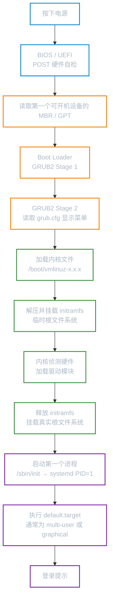
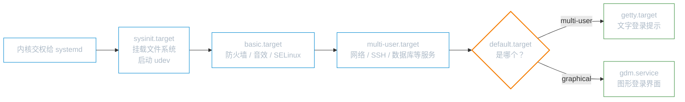

# 开机流程与 GRUB

**本文你会学到**：

- 从按下电源到登录提示的完整开机流程
- BIOS 与 UEFI 的区别与判断方法
- MBR 与 GPT 分区表的原理与兼容性
- GRUB2 的两级引导机制与配置文件
- initramfs 的作用与核心驱动加载
- Linux 内核启动参数与 GRUB 编辑入口
- systemd 与运行级别（target）的对应关系
- Root 密码遗忘时的救援启动方法
- 常见启动问题的诊断与恢复策略

## 完整开机流程



## BIOS 与 UEFI 的区别

当你的系统无法启动时，首先需要确认自己的固件类型——不同固件的排错路径完全不同。

| 特性 | 传统 BIOS | UEFI |
|------|-----------|------|
| 运行模式 | 16 位实模式 | 32/64 位保护模式 |
| 引导区 | MBR（主引导记录，446 字节） | GPT + EFI 系统分区（ESP） |
| 最大磁盘 | 2 TB（MBR 分区表限制） | 理论 > 8 ZB |
| 安全启动 | 不支持 | 支持 Secure Boot |
| 开机速度 | 较慢 | 更快（可直接加载内核） |
| Shell 环境 | 无 | 有 EFI Shell，可执行 `.efi` 文件 |
| 判断依据 | `/sys/firmware/efi` 目录**不存在** | `/sys/firmware/efi` 目录**存在** |

```bash
# 快速判断当前系统是 BIOS 还是 UEFI
ls /sys/firmware/efi 2>/dev/null && echo "UEFI 系统" || echo "传统 BIOS 系统"
```

## Boot Loader 与多重引导

Boot Loader 安装在磁盘最前面的 MBR（仅 446 字节），它做三件事：

- **提供菜单**：让你选择要启动哪个操作系统或内核版本
- **加载内核**：将内核文件读入内存并执行
- **转交控制权**：将引导交给另一个 Boot Loader（用于多重引导）

!!! tip "为什么要先装 Windows 再装 Linux？"

    Windows 的 Boot Loader 不具备控制权转交功能，如果先装 Linux 后装 Windows，Windows 会覆盖 MBR，导致 Linux 的 GRUB 被破坏。反过来，GRUB2 可以识别并转交给 Windows 的 Boot Loader，实现双系统共存。

## GRUB2 引导加载器

### 目录结构

```
/boot/grub2/         # RHEL / CentOS / AlmaLinux（命令含 grub2 前缀）
/boot/grub/          # Debian / Ubuntu（命令不含 grub2 前缀）
├── grub.cfg         # 主配置文件（由脚本自动生成，禁止手动编辑）
├── grubenv          # 存储环境变量（如上次选择的启动项）
├── fonts/           # 启动画面字体
├── themes/          # 启动主题
└── i386-pc/         # BIOS 模式所需模块（ext2.mod、xfs.mod 等）
/etc/grub.d/         # 生成 grub.cfg 所用的脚本（按数字顺序执行）
/etc/default/grub    # 用户修改此处，再重新生成 grub.cfg
```

!!! warning "不要直接修改 grub.cfg"

    `/boot/grub2/grub.cfg` 是由脚本自动生成的，直接修改会在下次执行 `grub2-mkconfig` 时被覆盖。**正确做法是修改 `/etc/default/grub`，然后重新生成。**

### `/etc/default/grub` 常用参数

``` bash title="/etc/default/grub"
# 引导菜单等待秒数（0=立即启动，-1=永久等待）
GRUB_TIMEOUT=5

# 默认启动条目（0 为第一项，或填 "saved" 记住上次选择）
GRUB_DEFAULT=0

# 配合 DEFAULT=saved，记住上次手动选择的条目
GRUB_SAVEDEFAULT=true

# 追加到所有内核启动参数（影响全部条目）
GRUB_CMDLINE_LINUX="quiet splash"

# 仅追加到默认条目（recovery 条目不受影响）
GRUB_CMDLINE_LINUX_DEFAULT="quiet"

# 隐藏恢复模式条目
GRUB_DISABLE_RECOVERY=true

# 指定输出终端（console / serial）
GRUB_TERMINAL_OUTPUT="console"
```

### 生成 grub.cfg

修改 `/etc/default/grub` 后，**必须**重新生成 `grub.cfg` 才能生效：

=== "RHEL / CentOS / AlmaLinux / Rocky"

    ``` bash
    # BIOS 系统
    grub2-mkconfig -o /boot/grub2/grub.cfg

    # UEFI 系统（路径因发行版略有不同）
    grub2-mkconfig -o /boot/efi/EFI/redhat/grub.cfg
    ```

=== "Debian / Ubuntu"

    ``` bash
    # 推荐：update-grub 是封装脚本，等同于下面那条
    update-grub

    # 等价写法
    grub-mkconfig -o /boot/grub/grub.cfg
    ```

### 安装与修复 GRUB

GRUB 损毁（常见于重装 Windows 后）时，需要从 Live CD 进入 chroot 环境后重新安装：

=== "RHEL / CentOS（BIOS）"

    ``` bash
    # /dev/sda 是磁盘设备，不是分区
    grub2-install /dev/sda
    grub2-mkconfig -o /boot/grub2/grub.cfg
    ```

=== "Debian / Ubuntu（BIOS）"

    ``` bash
    grub-install /dev/sda
    update-grub
    ```

=== "UEFI 系统修复"

    ``` bash
    # Debian / Ubuntu
    apt install --reinstall grub-efi-amd64

    # RHEL / CentOS
    dnf reinstall grub2-efi grub2-efi-modules
    grub2-mkconfig -o /boot/efi/EFI/redhat/grub.cfg
    ```

### 常用内核启动参数

在 GRUB 菜单中按 `e` 进入编辑，找到以 `linux` 开头的行，在行末追加参数：

``` bash
quiet                        # 减少启动输出
splash                       # 显示 Plymouth 启动画面
ro                           # 以只读方式挂载根文件系统（initramfs 阶段默认）
rw                           # 以读写方式挂载根文件系统
init=/bin/bash               # 跳过 init，直接进 bash（紧急恢复用）
systemd.unit=rescue.target   # 进入救援模式（挂载文件系统，最小服务集）
systemd.unit=emergency.target # 进入紧急模式（根文件系统只读）
rd.break                     # 在 initramfs 结束前中断（用于修改 root 密码）
```

## initramfs —— 内核的临时根文件系统

### 为什么需要 initramfs

这里有个先有鸡还是先有蛋的问题：

- 内核要读取 SATA 磁盘上的驱动程序，才能挂载根文件系统
- 而 SATA 驱动程序就存放在根文件系统的 `/lib/modules/` 里

为了打破这个死循环，Boot Loader 在加载内核的同时，还会加载一个**临时的内存文件系统**（initramfs）。它包含最必要的驱动模块（SATA、SCSI、RAID、LVM 等），让内核能够顺利挂载真正的根文件系统，之后再释放这块内存。

### 常用操作

``` bash
# 查看 initramfs 内容
lsinitrd /boot/initramfs-$(uname -r).img          # RHEL（lsinitrd 命令）
lsinitramfs /boot/initrd.img-$(uname -r)           # Debian/Ubuntu

# 重建 initramfs（更新驱动或内核后需要执行）
dracut -f /boot/initramfs-$(uname -r).img $(uname -r)   # RHEL
update-initramfs -u -k $(uname -r)                       # Debian/Ubuntu
```

## systemd 启动流程

内核完成硬件初始化后，启动的第一个进程是 `systemd`（PID = 1）。它读取 `/etc/systemd/system/default.target` 来决定启动目标：



`systemd` 与传统 SysV runlevel 的对应关系：

| SysV runlevel | systemd target | 说明 |
|:---:|---|---|
| 0 | `poweroff.target` | 关机 |
| 1 | `rescue.target` | 单用户救援模式 |
| 2/3/4 | `multi-user.target` | 多用户文字模式 |
| 5 | `graphical.target` | 图形界面 |
| 6 | `reboot.target` | 重启 |

## 恢复 root 密码

### RHEL 8 / 9 方法（rd.break）

1. 重启，GRUB 菜单出现时按 `e` 进入编辑
2. 找到以 `linux` 开头的行，在行末追加 `rd.break`（删除 `rhgb quiet`）
3. 按 `Ctrl+X` 启动，进入 `switch_root` 环境
4. 执行以下命令：

``` bash
# 以读写方式重新挂载真实系统
mount -o remount,rw /sysroot

# chroot 进入真实系统
chroot /sysroot

# 修改 root 密码
passwd root

# 强制 SELinux 重新标记（跳过此步会导致无法登录！）
touch /.autorelabel

# 两次 exit 退出并重启
exit
exit
```

!!! warning "SELinux 重标记不可跳过"

    如果系统启用了 SELinux，修改密码后必须执行 `touch /.autorelabel`。否则 SELinux 会因为 `/etc/shadow` 的安全上下文被破坏而拒绝登录。重标记过程会让系统重启时多花几分钟，属于正常现象。

### Debian / Ubuntu 方法（recovery mode）

1. GRUB 菜单选择 **Advanced options** → **recovery mode**
2. 在恢复菜单中选择 **root — Drop to root shell prompt**
3. 执行：

``` bash
mount -o remount,rw /
passwd root
reboot
```

## 内核模块管理

### 查看与检查

``` bash
# 列出当前已加载的所有模块
lsmod

# 查看特定模块详细信息（版本、依赖、参数等）
modinfo ext4

# 只显示模块依赖关系
modinfo -F depends ext4
```

### 加载与卸载

``` bash
# 推荐：modprobe 自动处理依赖关系
modprobe nfs            # 加载
modprobe -r nfs         # 卸载

# 不推荐：insmod/rmmod 需要完整路径且不处理依赖
insmod /lib/modules/$(uname -r)/kernel/fs/nfs/nfs.ko
rmmod nfs
```

### 持久化配置

``` bash
# 开机自动加载模块（systemd 方式，两种发行版通用）
echo "nfs" > /etc/modules-load.d/nfs.conf

# Debian/Ubuntu 旧方式（追加到 /etc/modules）
echo "nfs" >> /etc/modules

# 为模块传递参数
echo "options usb_storage delay_use=1" > /etc/modprobe.d/usb.conf

# 更新模块依赖关系数据库（安装新模块后执行）
depmod
```

### 黑名单（禁止加载）

``` bash
# 禁止加载 nouveau 开源显卡驱动（安装 NVIDIA 驱动前必须操作）
echo "blacklist nouveau" > /etc/modprobe.d/blacklist-nouveau.conf

# Debian/Ubuntu 还需要重建 initramfs
update-initramfs -u
```

## 系统救援

### 救援模式 vs 紧急模式

``` bash
# 方法一：通过 GRUB 内核参数（适合系统无法正常启动时）
systemd.unit=rescue.target    # 救援模式：挂载所有文件系统，启动最小服务集
systemd.unit=emergency.target # 紧急模式：根文件系统只读，无网络，仅 root shell

# 方法二：系统运行时切换（需要 root 权限）
systemctl rescue
systemctl emergency
```

### 使用 Live CD 修复

当系统完全无法启动时，从 Live CD 进行 chroot 修复：

``` bash
# 挂载系统根分区（根据实际分区调整设备名）
mount /dev/sda2 /mnt

# 挂载必要的虚拟文件系统
mount --bind /dev  /mnt/dev
mount --bind /proc /mnt/proc
mount --bind /sys  /mnt/sys

# 如果是 UEFI 系统，还需挂载 EFI 分区
mount /dev/sda1 /mnt/boot/efi

# 进入 chroot 环境
chroot /mnt

# 在此执行修复操作（重装 GRUB、修改密码、修复 fstab 等）
grub2-install /dev/sda
grub2-mkconfig -o /boot/grub2/grub.cfg

# 退出并重启
exit
reboot
```

## 发行版差异速查

=== "Debian / Ubuntu"

    | 项目 | 值 |
    |------|-----|
    | GRUB 命令 | `grub-install`、`update-grub`、`grub-mkconfig` |
    | 主配置文件 | `/boot/grub/grub.cfg` |
    | initramfs 工具 | `update-initramfs` |
    | BIOS 包名 | `grub-pc` |
    | UEFI 包名 | `grub-efi-amd64` |
    | UEFI 启动项路径 | `/boot/efi/EFI/debian/` |

=== "RHEL / CentOS / AlmaLinux / Rocky"

    | 项目 | 值 |
    |------|-----|
    | GRUB 命令 | `grub2-install`、`grub2-mkconfig` |
    | BIOS 配置文件 | `/boot/grub2/grub.cfg` |
    | UEFI 配置文件 | `/boot/efi/EFI/redhat/grub.cfg` |
    | initramfs 工具 | `dracut` |
    | BIOS 包名 | `grub2-pc` |
    | UEFI 包名 | `grub2-efi-x64` |
    | 备注 | RHEL 9 实验性支持 `systemd-boot`（BLS 格式） |

