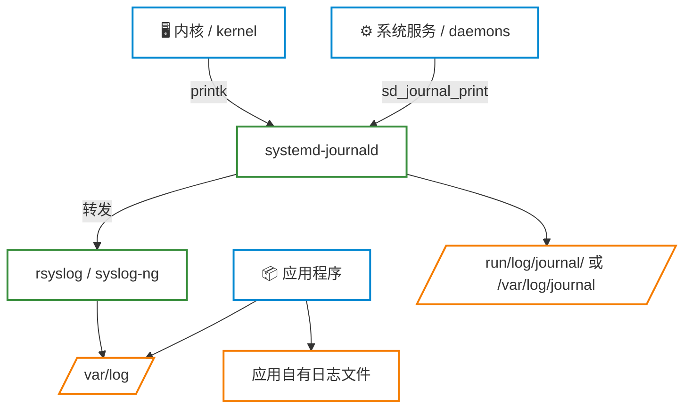

# 日志管理

**本文你会学到**：

- Linux 日志体系：journald 与 rsyslog 的协同关系
- syslog 协议的设施（facility）与优先级（priority）
- 从 `/var/log/` 中各类日志文件的含义与格式
- 用 `journalctl` 查询 systemd 日志的各种过滤方式
- 日志的持久化配置与临时存储的区别
- `rsyslog` 配置文件（/etc/rsyslog.conf）的语法
- 日志转发与集中式日志聚合的基础
- `logrotate` 的工作原理与配置
- 常见日志文件的解读与故障排查技巧

## Linux 日志体系概览

现代 Linux 同时存在两套日志体系：经典的 `rsyslog`（基于 syslog 协议）和 systemd 自带的 `journald`，两者通常协同工作。



三个核心组件：

- **`systemd-journald`**：最上游的消息收集者，以二进制格式存储，支持结构化查询
- **`rsyslog`**：接收 journald 转发的消息，写入 `/var/log/` 下的各类文本文件
- **`logrotate`**：定期切割、压缩、清理旧日志，防止磁盘被撑满

## syslog 协议：设施与优先级

rsyslog 遵循 syslog 协议，每条日志都携带两个维度的分类信息：**设施（Facility）**描述消息来自哪个子系统，**优先级（Severity）**描述消息有多严重。

### 设施（Facility）

| 编号 | 名称 | 说明 |
|------|------|------|
| 0 | `kern` | 内核消息 |
| 1 | `user` | 用户级消息（如 `logger` 命令） |
| 2 | `mail` | 邮件系统（postfix、dovecot 等） |
| 3 | `daemon` | 系统守护进程（如 systemd） |
| 4 | `auth` | 认证相关（login、ssh、su） |
| 5 | `syslog` | syslogd 内部消息 |
| 6 | `lpr` | 打印系统 |
| 7 | `news` | 新闻组服务 |
| 8 | `uucp` | UUCP 协议（早期 Unix 数据交换） |
| 9 | `cron` | 计划任务（cron/at） |
| 10 | `authpriv` | 认证私有信息（PAM 模块等） |
| 11 | `ftp` | FTP 服务 |
| 16–23 | `local0`–`local7` | 本地用途，保留给管理员自定义 |

### 优先级（Severity）

优先级数值越小，表示问题越严重：

| 数值 | 名称 | 说明 |
|------|------|------|
| 0 | `emerg` | 系统不可用，极端紧急（如内核崩溃） |
| 1 | `alert` | 必须立即处理 |
| 2 | `crit` | 严重条件，临界点（critical） |
| 3 | `err` | 错误条件，服务可能无法启动 |
| 4 | `warning` | 警告，尚未影响正常运行 |
| 5 | `notice` | 正常但值得关注的事件 |
| 6 | `info` | 一般信息 |
| 7 | `debug` | 调试信息，通常不写入生产环境日志 |

rsyslog 配置中，设施与优先级之间用连接符号区分匹配方式：

- `.`：该优先级及以上的所有消息（最常用），如 `mail.info` 表示 mail 的 info 及更严重的消息
- `.=`：仅精确匹配该优先级
- `.!`：排除该优先级，记录其他所有级别

## rsyslog

### 配置文件

rsyslog 的配置文件是 `/etc/rsyslog.conf`，RHEL 和 Debian 系都使用这个路径，额外的规则放在 `/etc/rsyslog.d/` 目录下。

配置格式为：

```
设施.优先级    目标（文件/设备/远程主机）
```

典型的 RHEL 默认配置：

``` bash title="/etc/rsyslog.conf（RHEL 默认）"
#kern.*                  /dev/console        # 内核消息到控制台（默认注释）
*.info;mail.none;authpriv.none;cron.none  /var/log/messages  # 通用消息（排除 mail/auth/cron）
authpriv.*              /var/log/secure     # 认证相关
mail.*                  -/var/log/maillog   # - 前缀表示异步写入（先缓存内存）
cron.*                  /var/log/cron       # 计划任务
*.emerg                 :omusrmsg:*         # 紧急消息广播给所有在线用户
uucp,news.crit          /var/log/spooler
local7.*                /var/log/boot.log   # 开机消息
```

!!! tip "异步写入（`-` 前缀）"

    `mail.*  -/var/log/maillog` 中的 `-` 表示先将消息缓存到内存，攒够一批再写入磁盘。邮件日志量大，异步写入能提升性能，但非正常关机时可能丢失少量记录。

### 测试与调试

``` bash
# 发送测试消息到 rsyslog
logger -p local0.notice "Test message"

# 指定 tag（日志中的程序名字段）
logger -t myapp "Application started"

# 重启服务使配置生效
systemctl restart rsyslog.service
```

### 转发日志到远程服务器

在多台机器的环境中，可以将所有主机的日志集中发送到一台日志服务器，方便统一分析。

**服务端**：在 `/etc/rsyslog.conf` 中开启监听端口：

``` bash title="/etc/rsyslog.conf（服务端）"
# 启用 TCP 监听（推荐，比 UDP 可靠）
$ModLoad imtcp
$InputTCPServerRun 514
```

**客户端**：在 `/etc/rsyslog.conf` 中添加转发规则：

``` bash title="/etc/rsyslog.conf（客户端）"
*.* @@192.168.1.100:514    # @@ 表示 TCP
#*.* @192.168.1.100:514   # @ 表示 UDP
```

## 重要日志文件速查

| 文件 | 说明 | 发行版 |
|------|------|--------|
| `/var/log/messages` | 通用系统消息（最重要） | RHEL |
| `/var/log/syslog` | 通用系统消息 | Debian/Ubuntu |
| `/var/log/secure` | 认证、sudo 记录 | RHEL |
| `/var/log/auth.log` | 认证、sudo 记录 | Debian/Ubuntu |
| `/var/log/kern.log` | 内核消息 | Debian/Ubuntu |
| `/var/log/dmesg` | 内核启动时硬件侦测消息 | 通用 |
| `/var/log/boot.log` | 系统启动日志 | 通用 |
| `/var/log/cron` | 计划任务日志 | RHEL |
| `/var/log/maillog` | 邮件服务日志 | RHEL |
| `/var/log/audit/audit.log` | SELinux 审计日志 | RHEL |
| `/var/log/dpkg.log` | 软件包安装记录 | Debian/Ubuntu |
| `/var/log/apt/` | APT 操作记录 | Debian/Ubuntu |
| `/var/log/dnf.log` | DNF 操作记录 | RHEL 8+ |
| `/var/log/wtmp` | 登录历史（二进制，`last` 读取） | 通用 |
| `/var/log/btmp` | 登录失败记录（二进制，`lastb` 读取）| 通用 |
| `/var/log/lastlog` | 每个账号最后登录时间 | 通用 |

``` bash
last       # 读取 /var/log/wtmp，显示登录历史
lastb      # 读取 /var/log/btmp，显示登录失败记录
lastlog    # 读取 /var/log/lastlog，显示各账号最后登录时间
```

!!! warning "二进制日志文件"

    `wtmp`、`btmp`、`lastlog` 是二进制格式，**不能直接用 `cat` 查看**，必须使用对应的命令（`last`、`lastb`、`lastlog`）来读取。

## journald

`systemd-journald` 是现代 Linux 的日志收集前端，将结构化元数据（服务名、PID、UID 等）与消息内容一起存储，查询能力远强于纯文本日志。

### 常用查询命令

``` bash
# 查看最新日志（等同于 tail -f /var/log/messages）
journalctl -f

# 实时监控特定服务
journalctl -u sshd -f

# 按优先级过滤（err 到 emerg 级别，即只看错误以上）
journalctl -p err..emerg

# 按时间范围
journalctl --since "2024-01-01" --until "2024-01-02"
journalctl --since today
journalctl --since "1 hour ago"

# 内核消息（等同于 dmesg）
journalctl -k
journalctl -k -b -1    # 上次启动的内核消息

# 输出格式
journalctl -o json-pretty   # JSON 格式，含完整元数据
journalctl -o short-precise # 精确到微秒的时间戳
journalctl -o cat           # 仅消息内容，无元数据
```

### 持久化配置

``` ini title="/etc/systemd/journald.conf"
[Journal]
Storage=persistent      # auto（默认）| volatile（内存）| persistent（磁盘）| none
Compress=yes            # 压缩存储
SystemMaxUse=1G         # journal 最大磁盘占用
SystemKeepFree=2G       # 保持磁盘剩余空间
MaxRetentionSec=1month  # 最长保留时间
MaxFileSec=1week        # 单个日志文件覆盖的最长时间段
```

修改配置后需重启服务：

``` bash
systemctl restart systemd-journald
```

## logrotate —— 日志轮转

日志文件如果不加管理，天长日久会把磁盘撑满。`logrotate` 解决的就是这个问题——定期将当前日志文件重命名，创建新的空文件继续记录，并按照配置保留固定份数的历史文件，超出则自动删除。

轮转的结果形如：

```
messages          ← 当前活跃日志
messages-20240120 ← 上次轮转后的文件（或 messages.1）
messages-20240113 ← 更早的文件（或 messages.2）
...
```

### 配置文件结构

- **`/etc/logrotate.conf`**：全局默认配置（每周轮转、保留 4 份等）
- **`/etc/logrotate.d/`**：各服务独立配置，会被主配置自动 `include`

每个服务的轮转规则写法如下：

``` bash title="/etc/logrotate.d/nginx 示例"
/var/log/nginx/*.log {
    daily           # 每天轮转（也可用 weekly / monthly）
    missingok       # 文件不存在时不报错
    rotate 14       # 保留 14 份历史文件
    compress        # 对旧文件进行 gzip 压缩
    delaycompress   # 本次轮转的文件下次才压缩（避免进程仍在写入时压缩）
    notifempty      # 空文件不触发轮转
    create 0640 nginx adm   # 轮转后创建新文件，指定权限和所有者
    sharedscripts   # 多个文件匹配时，脚本只执行一次（而非每个文件一次）
    postrotate
        nginx -s reopen 2>/dev/null || true   # 通知 nginx 重新打开日志文件
    endscript
}
```

常用参数说明：

| 参数 | 说明 |
|------|------|
| `daily` / `weekly` / `monthly` | 轮转频率 |
| `rotate N` | 保留 N 份历史文件 |
| `compress` | 压缩旧文件（gzip） |
| `delaycompress` | 延迟一次再压缩 |
| `missingok` | 文件不存在时静默跳过 |
| `notifempty` | 空文件不轮转 |
| `create MODE USER GROUP` | 轮转后新建文件的权限和所有者 |
| `dateext` | 用日期（如 `-20240120`）而非序号（`.1`）作后缀 |
| `minsize SIZE` | 文件超过指定大小才轮转（忽略时间条件） |
| `prerotate` / `postrotate` | 轮转前/后执行的 shell 脚本 |
| `sharedscripts` | 多文件匹配时脚本只跑一次 |

### 调试与强制执行

``` bash
# 调试模式：模拟运行，不实际修改文件
logrotate -d /etc/logrotate.d/nginx

# 强制立即执行（不管是否到了轮转时间）
logrotate -f /etc/logrotate.d/nginx

# 对全部规则执行一次
logrotate -vf /etc/logrotate.conf
```

logrotate 由 `/etc/cron.daily/logrotate` 每天自动触发（较新的发行版用 systemd timer）。

!!! tip "使用 `chattr +a` 保护日志文件时的注意事项"

    如果你用 `chattr +a /var/log/messages` 给日志加了"只追加"属性，logrotate 在轮转时无法重命名该文件。解决方法是在 `prerotate` 中先 `chattr -a` 取消属性，`postrotate` 中再恢复：

    ``` bash
    prerotate
        /usr/bin/chattr -a /var/log/messages
    endscript
    postrotate
        /usr/bin/chattr +a /var/log/messages
    endscript
    ```

## 日志分析实践

掌握基础的日志分析技巧，能帮你快速定位问题和发现安全威胁。

``` bash
# 统计 SSH 登录失败来源 IP（RHEL）
grep "Failed password" /var/log/secure \
    | awk '{print $11}' | sort | uniq -c | sort -rn | head

# 同上（Debian/Ubuntu）
grep "Failed password" /var/log/auth.log \
    | awk '{print $11}' | sort | uniq -c | sort -rn | head

# 查看 sudo 使用记录
grep sudo /var/log/secure       # RHEL
grep sudo /var/log/auth.log     # Debian/Ubuntu

# 查看今天的 sshd 认证日志（journald）
journalctl -u sshd --since today

# 只看错误及以上级别的所有服务日志
journalctl -p err..emerg --since "24 hours ago"

# 统计 Nginx 访问日志中各 HTTP 状态码数量
awk '{print $9}' /var/log/nginx/access.log | sort | uniq -c | sort -rn

# 实时跟踪某服务的错误输出
journalctl -u nginx -p err -f
```

!!! tip "日志格式速记"

    传统 syslog 文本日志的每行格式为：
    `日期时间  主机名  服务名[PID]: 消息内容`
    
    排查问题时，重点关注**第三字段**（哪个服务）和**第四字段**（具体消息），确定时间戳后再缩小搜索范围。

## 发行版差异

=== "Debian / Ubuntu"

    - rsyslog 预装，配置：`/etc/rsyslog.conf` + `/etc/rsyslog.d/`
    - 通用日志：`/var/log/syslog`
    - 认证日志：`/var/log/auth.log`
    - journald 默认 `Storage=auto`：若 `/var/log/journal/` 目录不存在则只在内存中保留
    - 启用持久化：

        ``` bash
        mkdir -p /var/log/journal
        systemctl restart systemd-journald
        ```

=== "Red Hat / RHEL / CentOS"

    - rsyslog 预装，配置：`/etc/rsyslog.conf` + `/etc/rsyslog.d/`
    - 通用日志：`/var/log/messages`
    - 认证日志：`/var/log/secure`
    - RHEL 7+ journald 默认持久化（`/var/log/journal/` 自动创建）
    - 审计日志工具：`ausearch`（按条件搜索）和 `aureport`（生成审计报告），用于分析 `/var/log/audit/audit.log`

